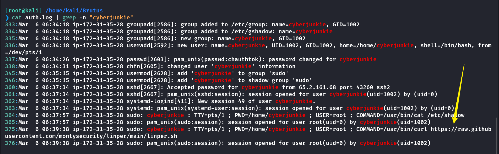

## Sherlock Scenario

在这个非常简单的 Sherlock 中，您将熟悉 Unix auth.log 和 wtmp 日志。我们将探索一个场景，其中 Confluence 服务器通过其 SSH 服务被暴力破解。获得对服务器的访问权限后，攻击者执行了其他活动，我们可以使用 auth.log 进行跟踪。尽管 auth.log 主要用于暴力分析，但我们将在调查中深入研究此工件的全部潜力，包括权限提升、持久性方面，甚至对命令执行的一些可见性。

## Task1

分析auth.log，您能否识别攻击者用于实施暴力攻击的 IP 地址？

```
[root@kali] /home/kali/Brutus  
❯ cat auth.log | grep "Invalid" 
Mar  6 06:31:31 ip-172-31-35-28 sshd[2325]: Invalid user admin from 65.2.161.68 port 46380
Mar  6 06:31:31 ip-172-31-35-28 sshd[2327]: Invalid user admin from 65.2.161.68 port 46392
Mar  6 06:31:31 ip-172-31-35-28 sshd[2332]: Invalid user admin from 65.2.161.68 port 46444
Mar  6 06:31:31 ip-172-31-35-28 sshd[2331]: Invalid user admin from 65.2.161.68 port 46436
Mar  6 06:31:31 ip-172-31-35-28 sshd[2330]: Invalid user admin from 65.2.161.68 port 46422
Mar  6 06:31:31 ip-172-31-35-28 sshd[2337]: Invalid user admin from 65.2.161.68 port 46498
Mar  6 06:31:31 ip-172-31-35-28 sshd[2328]: Invalid user admin from 65.2.161.68 port 46390
```

IP：`65.2.161.68`

## Task2

暴力破解尝试成功，攻击者获得了对服务器上帐户的访问权限。这个账户的用户名是什么？


可以发现攻击源`IP(65.2.161.68)`对本机进行了三次密码爆破之后，成功登录了`Root`用户

## Task3

您能否识别攻击者手动登录服务器以执行其目标时的时间戳？

```
[root@kali] /home/kali/Brutus  
❯ cat auth.log | grep -n "65.2.161.68" | grep  "Accepted password"
281:Mar  6 06:31:40 ip-172-31-35-28 sshd[2411]: Accepted password for root from 65.2.161.68 port 34782 ssh2
322:Mar  6 06:32:44 ip-172-31-35-28 sshd[2491]: Accepted password for root from 65.2.161.68 port 53184 ssh2
360:Mar  6 06:37:34 ip-172-31-35-28 sshd[2667]: Accepted password for cyberjunkie from 65.2.161.68 port 43260 ssh2
```

因为之前进行了爆破密码，在322行应该是手动登录的服务器

这个时间`2024-03-06 06:32:44`直接交上去不对

```
[root@kali] /home/kali/Brutus  
❯ utmpdump wtmp
```

查看wtmp文件原始内容


发现时间应该是：`2024-03-06 06:32:45`

## Task4

登录时将跟踪 SSH 登录会话并为其分配会话编号。为问题 2 中的用户帐户分配给攻击者会话的会话号是什么？

```
[root@kali] /home/kali/Brutus  
❯ cat auth.log | grep -n "root" | grep "session" 
```

因为手动登录是在322行，因此看322行之后的内容


## Task5

攻击者在服务器上添加了一个新用户作为其持久性策略的一部分，并为此新用户帐户提供了更高的权限。此帐户的名称是什么？

```
[root@kali] /home/kali/Brutus  
❯ cat auth.log | grep -n "new"                                                                                                                            
335:Mar  6 06:34:18 ip-172-31-35-28 groupadd[2586]: new group: name=cyberjunkie, GID=1002
336:Mar  6 06:34:18 ip-172-31-35-28 useradd[2592]: new user: name=cyberjunkie, UID=1002, GID=1002, home=/home/cyberjunkie, shell=/bin/bash, from=/dev/pts/1
```

发现一个新用户：`cyberjunkie`

```
[root@kali] /home/kali/Brutus  
❯ cat auth.log | grep -n "cyberjunkie"
```


`cyberjunkie`被添加到了sudo组内，具有超级权限

## Task6

用于持久性的 MITRE ATT&CK 子技术 ID 是什么？

- [Matrix - Enterprise | MITRE ATT&CK®](https://attack.mitre.org/matrices/enterprise/)


ID：`T1136.001`

## Task7

根据之前确认的身份验证时间和会话在 auth.log 内结束，攻击者的第一个 SSH 会话持续了多久（秒）

在wtmp中可以看见


```
6:32:45  --- 6:37:24
```

总共持续时间是`279`秒

## Task8

攻击者登录了他们的后门帐户，并利用更高权限下载了脚本。使用 sudo 执行的完整命令是什么？

```
[root@kali] /home/kali/Brutus  
❯ cat auth.log | grep -n "cyberjunkie"
```



发现使用`cyberjunkie`账户远程下载了`Linpeas`分析脚本
