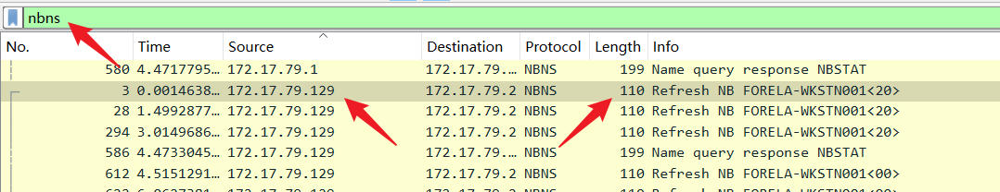
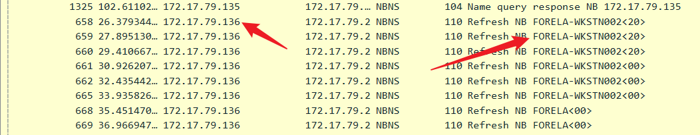
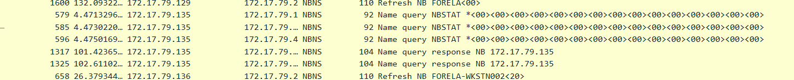
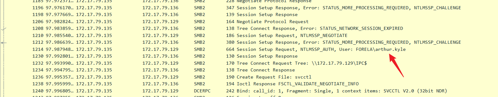
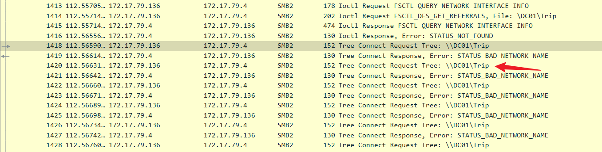
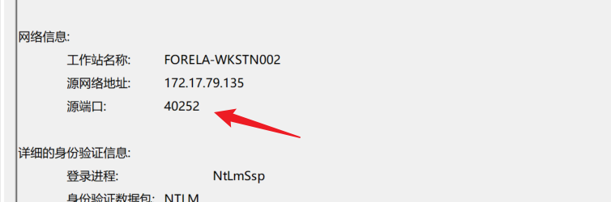
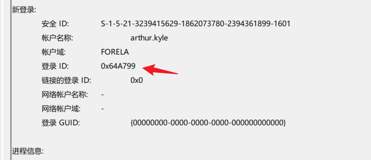
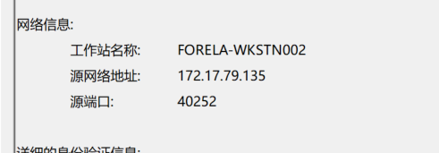
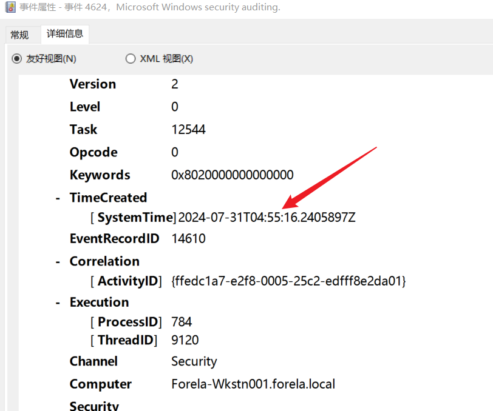
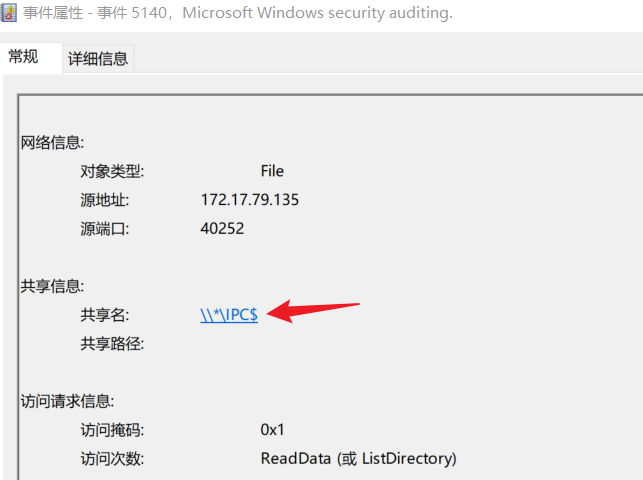

## Sherlock Scenario

我们的SIEM提醒我们注意一个需要立即查看的可疑登录事件。警报详细信息是IP地址和源工作站名称不匹配。您将收到事件时间范围内周围时间的网络捕获和事件日志。对给定的证据进行核化，并向SOC经理报告。

## NTLM Relay Attack

这是`Hackthebox`的官方链接：[NTLM 中继攻击检测 (hackthebox.com)](https://www.hackthebox.com/blog/ntlm-relay-attack-detection)

`LLMNR`（Link-Local Multicast Name Resolution）是一种用于在局域网中解析主机名的协议，类似于 `DNS`，但主要用于没有 `DNS`服务器的网络环境。`LLMNR`允许设备通过广播请求解析局域网内其他设备的名称。

**LLMNR中毒攻击**（LLMNR Poisoning Attack）是通过伪造 `LLMNR`响应来诱导目标设备接受攻击者控制的 `IP`地址的攻击手段。其具体过程如下

- **攻击者监听 LLMNR 请求**：攻击者在局域网内监听 LLMNR 请求。当目标设备发出 LLMNR 请求时，攻击者能够捕获到该请求。

- **伪造 LLMNR 响应**：攻击者伪造一个 LLMNR 响应，回应目标设备所请求的主机名，且将该主机名解析为攻击者自己的 IP 地址。

- **目标设备信任伪造响应**：如果目标设备没有进行适当的验证（如 DNSSEC 等），它可能会将攻击者的 IP 地址作为请求的目标设备，从而可能导致NTLM凭证被窃取

`LLMNR`中毒攻击常见于 `Windows`环境，因为 `Windows`默认启用了 `LLMNR`协议，这使得 `Windows`主机容易受到该类型攻击。

当攻击者使用 `LLMNR`中毒攻击拦截网络流量时，他们可以进一步尝试中继拦截的事件，以代表受害者向特定服务验证自己。

## Task 1&2

What is the IP Address for Forela-Wkstn001 and Forela-Wkstn002?

在`Wireshark`中添加`nbns`过滤器可以得到几个`IP source`







`Forela-Wkstn001`被分配给了`172.17.79.129`

`Forela-Wkstn002`被分配给了`172.17.79.136`

`172.17.79.135`似乎是一个未知设备

## Task3

What is the username of the account whose hash was stolen by attacker?

针对这个位置设备进行查看

```
ip.addr == 172.17.79.135 && smb2
```



可以发现`135`这台机器使用`NTLM`登录了用户名为：`arthur.kyle`的账户

## Task4

What is the IP Address of Unknown Device used by the attacker to intercept credentials?

从Task3中可以看到IPsource为172.17.73.135的主机

## Task5

What was the fileshare navigated by the victim user account?

在`Security.evtx`的Logon事件中可以找到

```
已成功登录帐户。

使用者:
	安全 ID:		NULL SID
	帐户名称:		-
	帐户域:		-
	登录 ID:		0x0

登录信息:
	登录类型:		3
	受限制的管理员模式:	-
	虚拟帐户:		否
	提升的令牌:		否

模拟级别:		模拟

新登录:
	安全 ID:		S-1-5-21-3239415629-1862073780-2394361899-1601
	帐户名称:		arthur.kyle
	帐户域:		FORELA
	登录 ID:		0x64A799
	链接的登录 ID:		0x0
	网络帐户名称:	-
	网络帐户域:	-
	登录 GUID:		{00000000-0000-0000-0000-000000000000}

进程信息:
	进程 ID:		0x0
	进程名称:		-

网络信息:
	工作站名称:	FORELA-WKSTN002
	源网络地址:	172.17.79.135
	源端口:		40252

详细的身份验证信息:
	登录进程:		NtLmSsp 
	身份验证数据包:	NTLM
	传递的服务:	-
	数据包名(仅限 NTLM):	NTLM V2
	密钥长度:		128
```

可以看到攻击者通过截获的`NTLM`登录了`FORELA-WKSTN002`（`172.17.79.136`）

将过滤器修改为这样👇

```
ip.addr == 172.17.79.136 && smb2
```



可以看见共享文件是：`\\DC01\Trip`

## Task6

What is the source port used to logon to target workstation using the compromised account?

在`Task5`中的事件详细中可以看到使用的登陆端口是40252



## Task7

What is the Logon ID for the malicious session?

事件详细中的登录ID



## Task8

The detection was based on the mismatch of hostname and the assigned IP Address.What is the workstation name and the source IP Address from which the malicious logon occur?

检测是基于工作站名和`IP`地址不匹配，还是根据`Logon`事件分析



`002`的`IP`地址在`nbns`协议中的IP地址是`172.17.79.136`，而在登录事件中可以看到源网络地址是`172.17.79.135`。

## Task9

At what UTC time did the the malicious logon happen?



需要进入详细信息才能查看到，外面的时间是日志导出的时间，内部`Timecreated`才是真正发生的时间

## Task10

What is the share Name accessed as part of the authentication process by the malicious tool used by the attacker?



在事件ID为5140的事件中发现共享文件名
