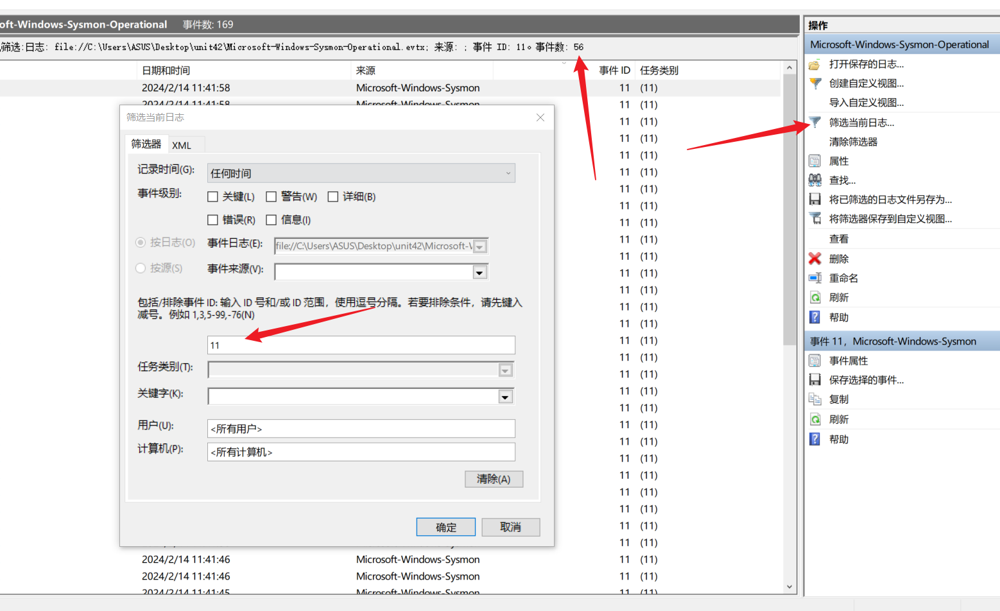
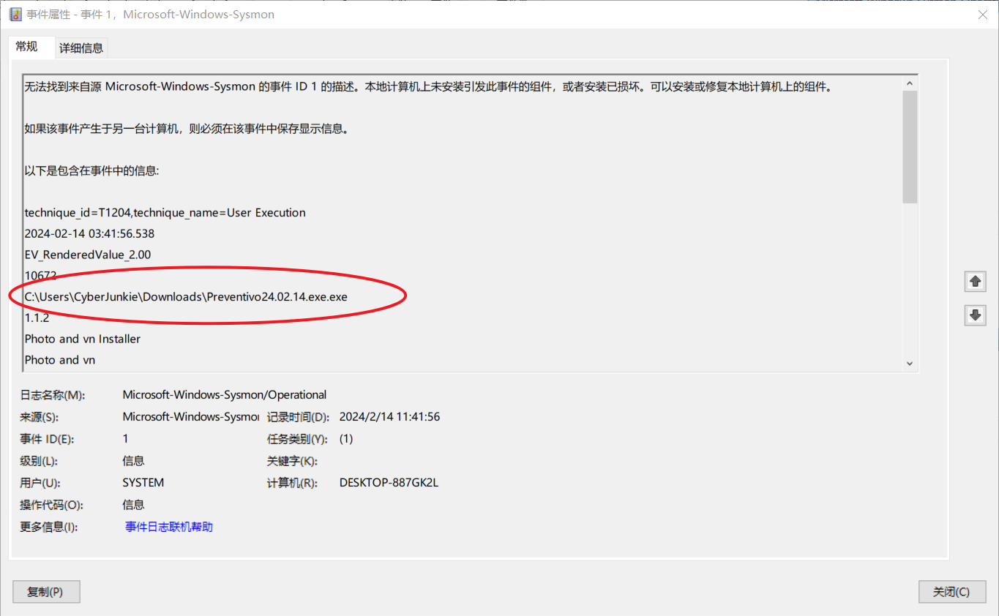
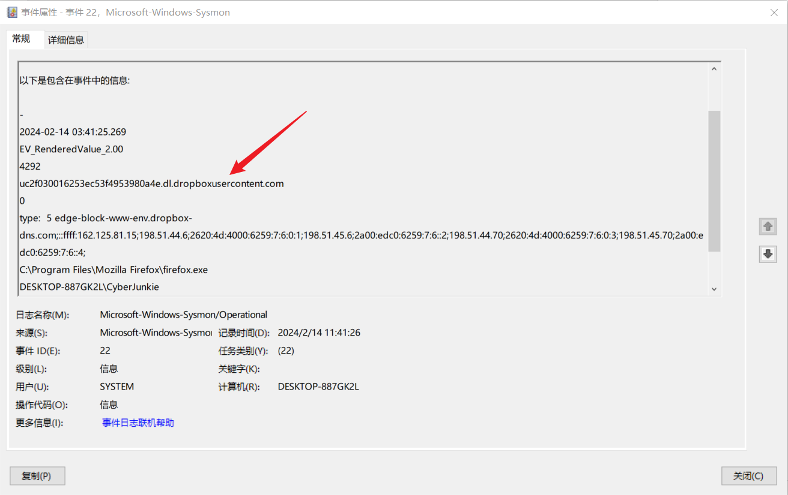
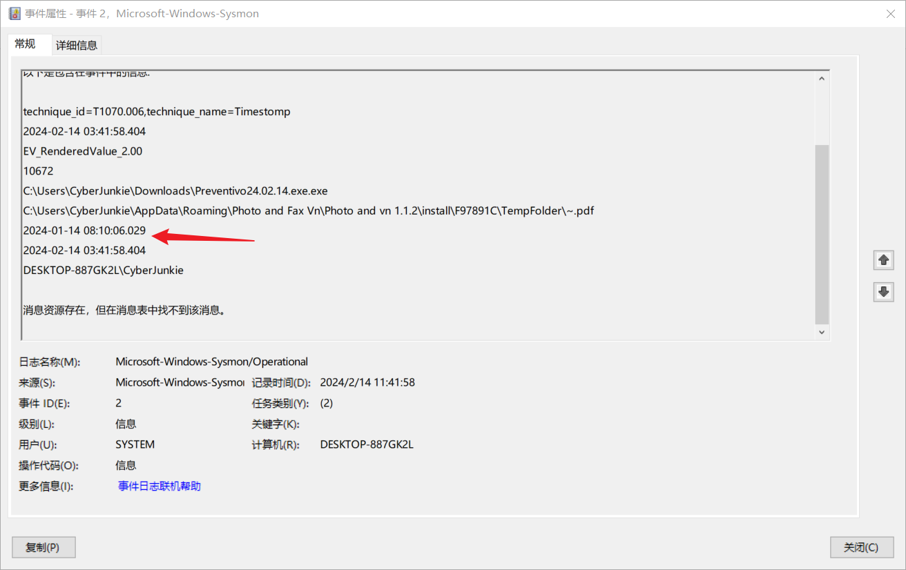
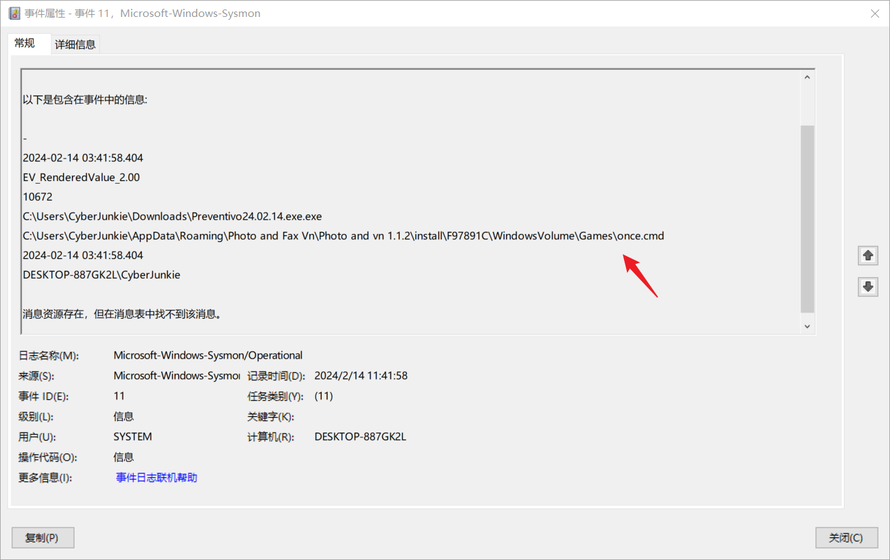
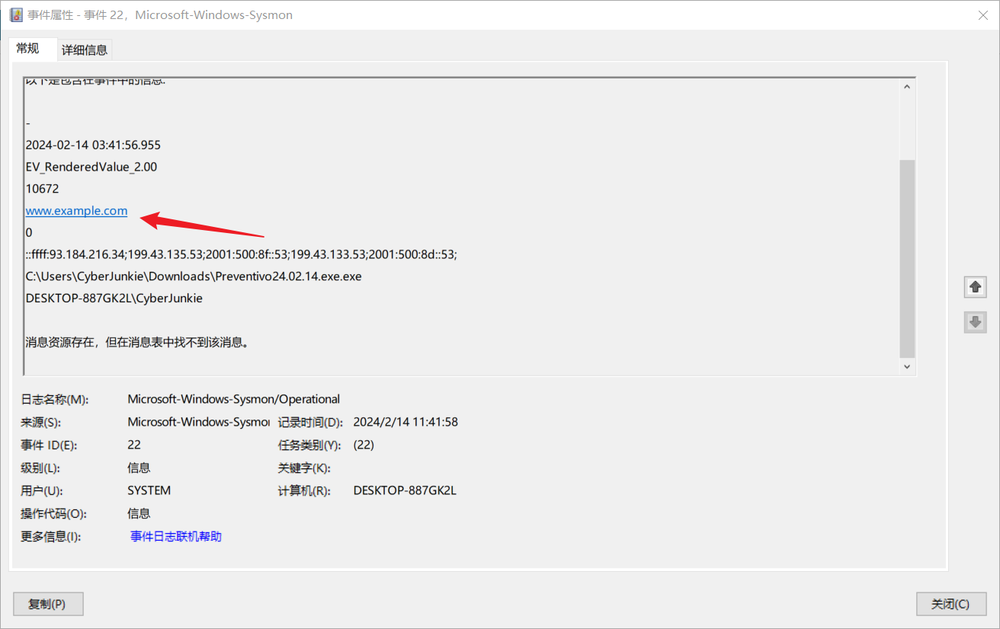
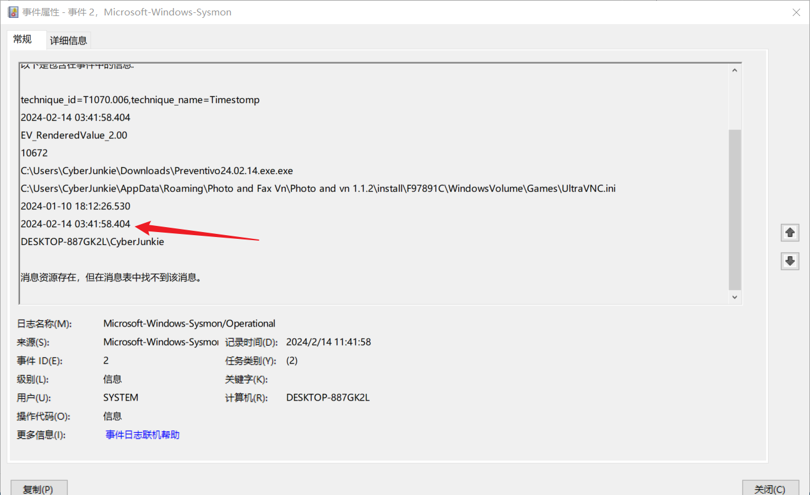

## Sherlock Scenario

在本 Sherlock 中，您将熟悉 Sysmon 日志和各种有用的 EventID，用于识别和分析 Windows 系统上的恶意活动。Palo Alto 的 Unit42 最近对 UltraVNC 活动进行了研究，其中攻击者利用 UltraVNC 的后门版本来维护对系统的访问。此实验室受该活动的启发，指导参与者完成活动的初始访问阶段。

## Task1

有多少个事件 ID 为 11 的事件日志？

筛选日志ID，得到数量是：`56`

## Task2

每当在内存中创建进程时，都会记录事件 ID 为 1 的事件，其中包含命令行、哈希、进程路径、父进程路径等详细信息。此信息对分析师非常有用，因为它使我们能够查看系统上执行的所有程序，这意味着我们可以发现正在执行的任何恶意进程。感染受害者系统的恶意进程是什么？

筛选日志ID为1的日志进行查看

恶意进程：`C:\Users\CyberJunkie\Downloads\Preventivo24.02.14.exe.exe`

## Task3

哪个云驱动器用于分发恶意软件？

查询事件ID为22，发现一个可疑的链接

搜索`dropboxusercontent`得到云驱动器是`dropbox`

## Task4

对于它写入磁盘的许多文件，最初的恶意文件使用了一种称为 Time Stomping 的防御规避技术，其中文件创建日期被更改以使其看起来更旧并与其他文件混合。PDF 文件的时间戳更改为什么？

搜索PDF，在ID为2的事件中发现事件修改

时间是：`2024-01-14 08:10:06`

## Task5

恶意文件在磁盘上放置了一些文件。“once.cmd”是在磁盘上的什么地方创建的？请回答完整路径和文件名。

搜索`once`，在ID为11的事件中找到路径

## Task6

恶意文件试图访问虚拟域，很可能检查 Internet 连接状态。它尝试连接到哪个域名？

在ID为22的日志中发现域名

## Task7

恶意进程试图联系哪个 IP 地址？

ID为3的日志记录与IP相关的东西

IP地址为：`93.184.216.34`

## Task8

恶意进程在用 UltraVNC 的后门变体感染 PC 后自行终止。进程何时自行终止？

搜索VNC得到ID为2的事件

终止时间为：`2024-02-14 03:41:58`
