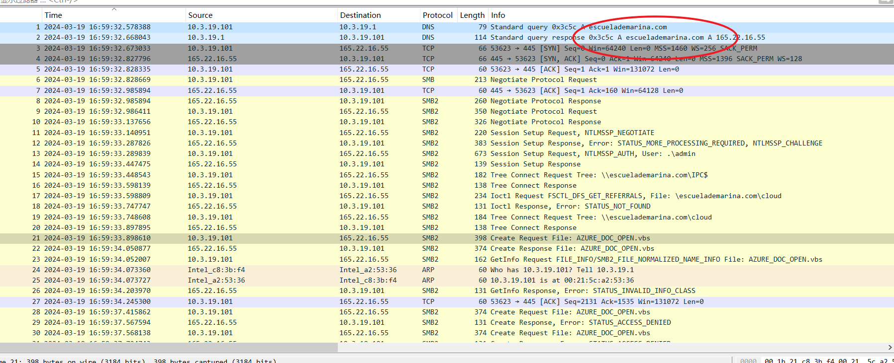
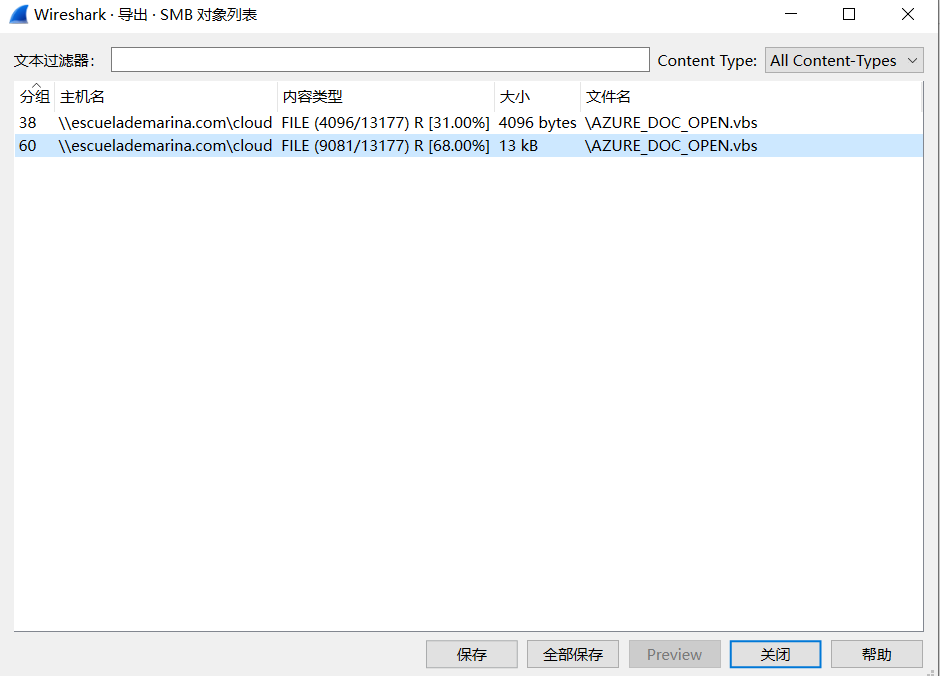
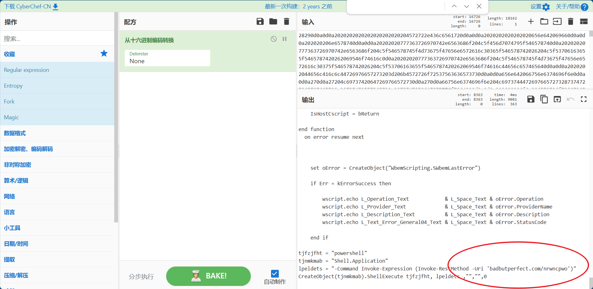
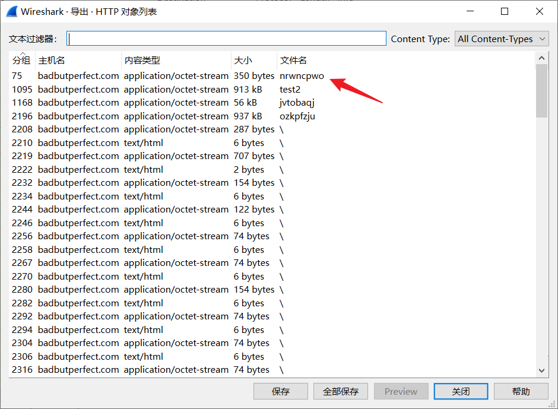
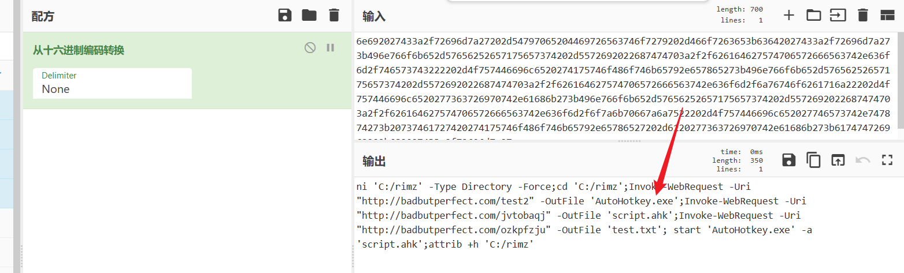
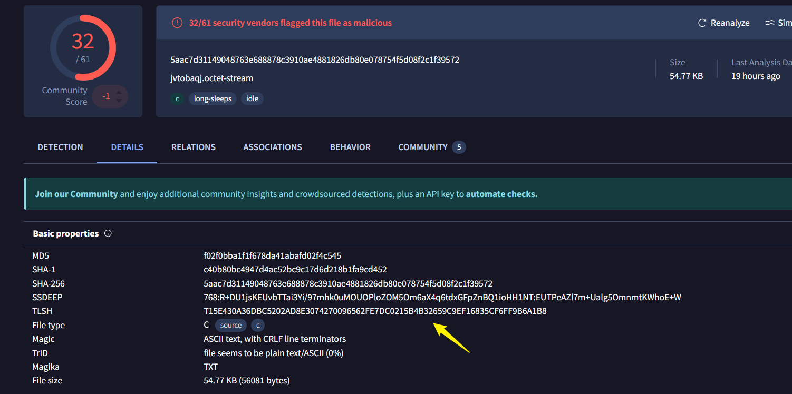
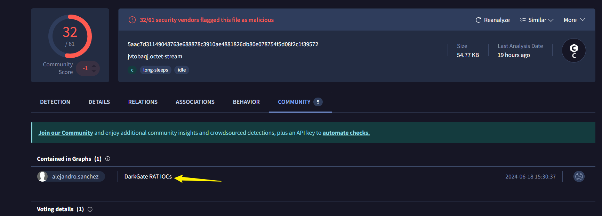
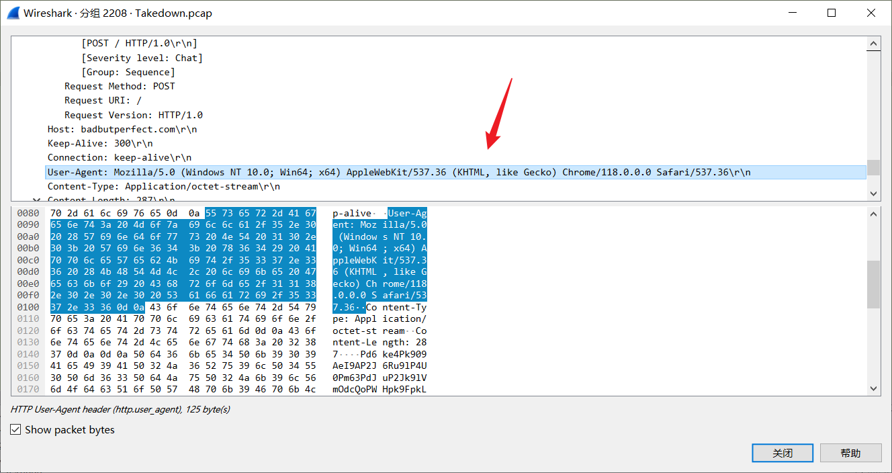
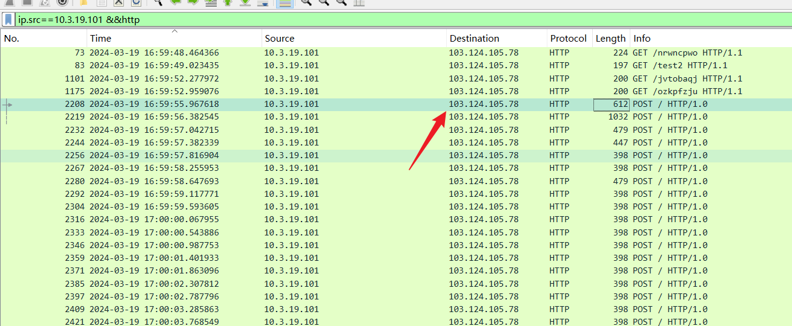

## Sherlock Scenario

我们在网络活动中发现了一个异常模式，表明可能存在安全漏洞。我们的团队怀疑我们的系统遭到未经授权的入侵，可能会泄露敏感数据。您的任务是调查此事件。

## Task1

VBS 脚本是从哪个域下载的？

在最开始的DNS包里面发现了`escuelademarina.com`，并且下面的**SMB**包里也存在一个**AZURE\_DOC\_OPEN.vbs**

## Task2

与问题 #1 中的域关联的 IP 地址用于此攻击？

从问题1中**DNS**包里可以看到**IP**是`165.22.16.55`

## Task3

用于初始访问的 VBS 脚本的文件名是什么？

问题1中的**AZURE\_DOC\_OPEN.vbs**

## Task4

用于获取 PowerShell 脚本的 URL 是什么？

尝试导出**SMB**包

将第**60**个分组的**data**字段复制下来进行**十六进制**转码

得到目标**URL**：`badbutperfect.com/nrwncpwo`

## Task5

什么可能的合法二进制文件被下载到受害者机器上？

导出**HTTP**的对象，查看第**75**个分组

得到`AutoHotKey.exe`

## Task6

与问题 #5 中的二进制文件一起使用的恶意软件是从哪个 URL 下载的？

一起使用的就是图中的`http://badbutperfect.com/jvtobaqj`

## Task7

问题 #6 中的恶意软件在磁盘上给出的文件名是什么？

图中有`script.ahk`

## Task8

恶意软件的 TLSH 是多少？

将软件导出，并且上传到：[VirusTotal - Home](https://www.virustotal.com/gui/home/upload)

**TLSH**：T15E430A36DBC5202AD8E3074270096562FE7DC0215B4B32659C9EF16835CF6FF9B6A1B8

## Task9

这个恶意软件叫什么名字？使用 McAfee、Ikarus 和 alejandro.sanchez 使用的名称。

**DarkGate**

## Task10

受感染机器的 user-agent 字符串是什么？

进入到**HTTP**包里查看

**UA**：**Mozilla/5.0 (Windows NT 10.0; Win64; x64) AppleWebKit/537.36 (KHTML, like Gecko) Chrome/118.0.0.0 Safari/537.36**

## Task11

上一个问题中的 RAT 连接到哪个 IP？

**103.124.105.78**
