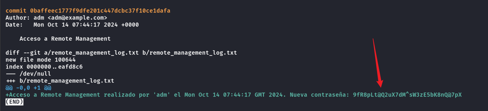

## Box Info

| OS | Linux |
| --- | --- |
| Difficulty | Medium |

## Nmap

```
[root@kali] /home/kali/Report  
❯ nmap 172.17.0.2 -sV  -A
Starting Nmap 7.94SVN ( https://nmap.org ) at 2025-02-25 18:34 CST
Nmap scan report for 172.17.0.2
Host is up (0.000076s latency).
Not shown: 997 closed tcp ports (reset)
PORT     STATE SERVICE VERSION
22/tcp   open  ssh     OpenSSH 9.6p1 Ubuntu 3ubuntu13.5 (Ubuntu Linux; protocol 2.0)
| ssh-hostkey: 
|   256 58:46:38:70:8c:d8:4a:89:93:07:b3:43:17:81:59:f1 (ECDSA)
|_  256 25:99:39:02:52:4b:80:3f:aa:a8:9a:d4:8e:9a:eb:10 (ED25519)
80/tcp   open  http    Apache httpd 2.4.58
|_http-server-header: Apache/2.4.58 (Ubuntu)
|_http-title: Did not follow redirect to http://realgob.dl/
3306/tcp open  mysql   MySQL 5.5.5-10.11.8-MariaDB-0ubuntu0.24.04.1
| mysql-info: 
|   Protocol: 10
|   Version: 5.5.5-10.11.8-MariaDB-0ubuntu0.24.04.1
|   Thread ID: 8
|   Capabilities flags: 63486
|   Some Capabilities: LongColumnFlag, DontAllowDatabaseTableColumn, Speaks41ProtocolOld, Support41Auth, IgnoreSigpipes, ConnectWithDatabase, SupportsTransactions, InteractiveClient, Speaks41ProtocolNew, FoundRows, IgnoreSpaceBeforeParenthesis, SupportsLoadDataLocal, ODBCClient, SupportsCompression, SupportsMultipleResults, SupportsAuthPlugins, SupportsMultipleStatments
|   Status: Autocommit
|   Salt: SMf;1&jb.[aWoKfBUf~i
|_  Auth Plugin Name: mysql_native_password
MAC Address: 02:42:AC:11:00:02 (Unknown)
Device type: general purpose
Running: Linux 4.X|5.X
OS CPE: cpe:/o:linux:linux_kernel:4 cpe:/o:linux:linux_kernel:5
OS details: Linux 4.15 - 5.8
Network Distance: 1 hop
Service Info: Host: 172.17.0.2; OS: Linux; CPE: cpe:/o:linux:linux_kernel

TRACEROUTE
HOP RTT     ADDRESS
1   0.08 ms 172.17.0.2

OS and Service detection performed. Please report any incorrect results at https://nmap.org/submit/ .
Nmap done: 1 IP address (1 host up) scanned in 9.89 seconds
```

将**realgob.dl**添加到**/etc/hosts**

## SQL injection

在**noticias.php**中发现存在**SQL**注入漏洞

```
[root@kali] /home/kali/Report  
❯ sqlmap -u "http://realgob.dl/noticias.php?id=1" -p id --dbs  
```


似乎并没有什么用，其中的密码也无法破解

## Dirsearch

```
[root@kali] /home/kali/Report  
❯ dirsearch -u realgob.dl -t 50 -i 200
/usr/lib/python3/dist-packages/dirsearch/dirsearch.py:23: DeprecationWarning: pkg_resources is deprecated as an API. See https://setuptools.pypa.io/en/latest/pkg_resources.html
  from pkg_resources import DistributionNotFound, VersionConflict

  _|. _ _  _  _  _ _|_    v0.4.3                                                                                                                            
 (_||| _) (/_(_|| (_| )                                                                                                                                     
                                                                                                                                                            
Extensions: php, aspx, jsp, html, js | HTTP method: GET | Threads: 50 | Wordlist size: 11460

Output File: /home/kali/Report/reports/_realgob.dl/_25-02-25_18-55-46.txt

Target: http://realgob.dl/

[18:55:46] Starting:                                                                                                                                        
[18:55:48] 200 - 2KB - /about.php                                        
[18:55:49] 200 - 467B  - /admin.php                                        
[18:55:52] 200 - 510B  - /api/                                             
[18:55:52] 200 - 510B  - /api/v1/                                          
[18:55:52] 200 - 500B  - /api/v2/                                          
[18:55:53] 200 - 475B  - /assets/                                          
[18:55:55] 200 - 0B  - /config.php                                       
[18:55:56] 200 - 521B  - /database/                                        
[18:55:59] 200 - 452B  - /images/                                          
[18:55:59] 200 - 504B  - /includes/                                        
[18:55:59] 200 - 22KB - /info.php                                         
[18:56:00] 200 - 0B  - /LICENSE                                          
[18:56:01] 200 - 1KB - /login.php                                        
[18:56:01] 200 - 475B  - /logs/                                            
[18:56:04] 200 - 0B  - /pages/                                           
[18:56:07] 200 - 0B  - /README.md                                        
[18:56:12] 200 - 484B  - /uploads/                                         
                                                                             
Task Completed                  
```

泄露了**phpinfo**


## FilterChains

来到**About**页面点击**Read More**，发现URL中出现了一个**?file=**参数


尝试设置为**/etc/passwd**，成功读取


并且可以使用**php://filter**过滤器


在**phpinfo**中发现存在**Oracle**，因此可以尝试使用**filter-chains**攻击

- [Synacktiv/php\_filter\_chain\_generator](https://github.com/synacktiv/php_filter_chain_generator)


## Git-dumper

在**linpeas**输出中发现存在**git**泄露


```
[root@kali] /home/kali/Desktop  
❯ git-dumper http://realgob.dl/desarrollo/.git/ ./realgob.git
```

在其中一个提交中得到**adm**的密码，注意**不是hash！！**




```
adm:9fR8pLt@Q2uX7dM^sW3zE5bK8nQ@7pX
```

## Root

**adm**用户并没有特殊权限的命令，也找不到其他的可利用文件。

看了题解才知道，在**adm**目录的**bashrc**里面（这谁能知道？？？


使用**Cyberchef**进行十六进制转换


得到密码是：**dockerlabs4u**


## Summary

`www-data`：从网页上来看存在**SQL注入**和**任意文件读取**，配合**filterchains**甚至可以执行命令，从而反弹**shell**。

`user`：**git**泄露，查看提交记录得到用户的密码。

`Root`：这个就纯属脑筋急转弯了😓。
